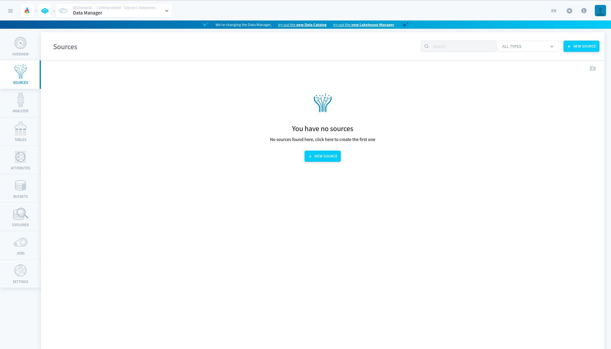
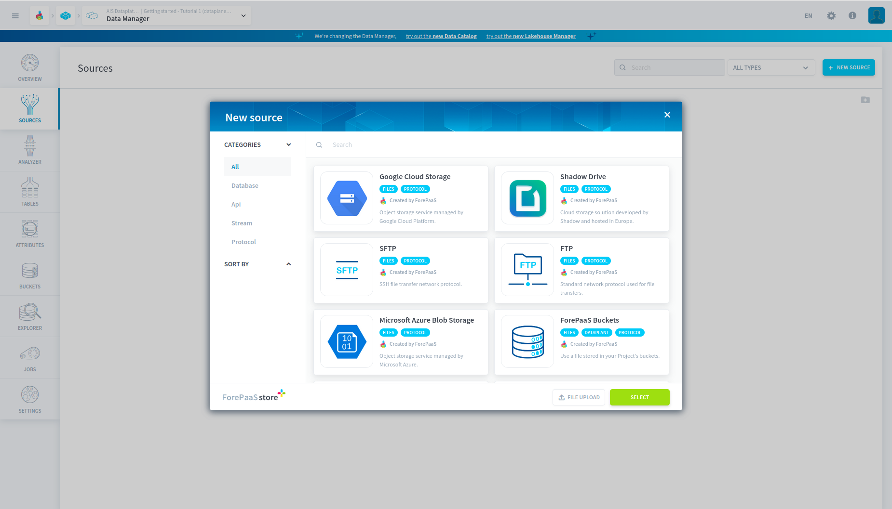
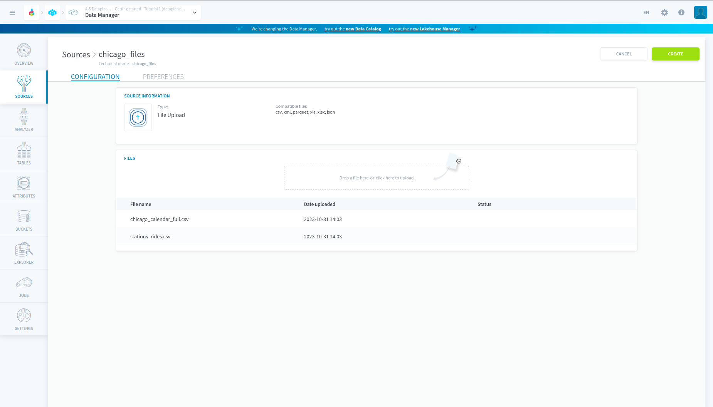
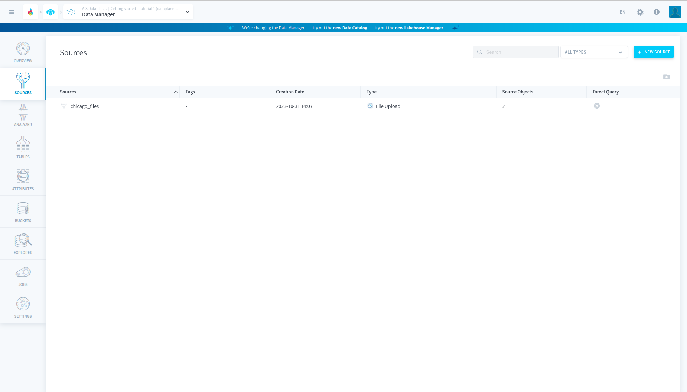
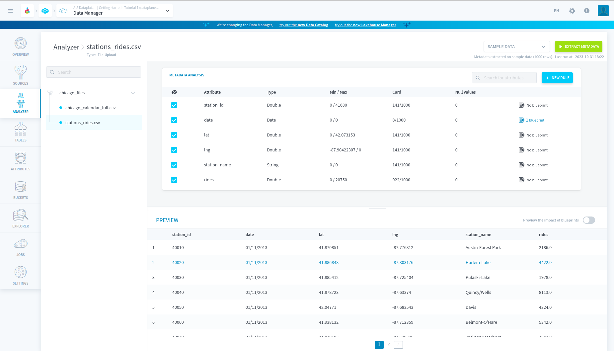

## Define, analyze and clean your data sources

In this step, you will learn how to **connect your first data source** to your Project, **analyze** and **clean** it in a consistent way so that relations between your data can be understood at a glance.

The **Data Catalog** is the first component you should use when starting out on your Project. It is the component that controls:

*   Data sources collection
*   Data analysis & cleaning

The data source consists of two CSV files containing data about Chicago weather and public transport.

### Connect your first source

Let’s go get your data!

> [!primary]
>
> To get your data, download the following files [here](https://raw.githubusercontent.com/ovh/docs/develop/pages/public_cloud/data_platform/tutorials/tuto_01_build_a_first_app_from_scratch_step1/resources/chicago_files.zip). Once unzipped, you will find 2 *.csv* files:
> 
> *   *chicago\_calendar\_full.csv* - a table with weather conditions by day where each row represents a day.
> *   *station\_rides.csv* - a table with railway usage information per station per day where each row represents a day on a given station.
>

Inside the Data Catalog, go to the menu **Sources** (1) and click on the **New Source** (2) button on the top right-hand corner to connect your very first data source.

There are many connectors supported by the Data Platform. In this tutorial, you will use a simple file upload.

Look for *File upload* in the search bar, click on the icon and then click on the green *Select* button or you can quickly click the *File Upload* button on the bottom right.

Give a name to your source: for example *chicago\_files*.

Then you can **drag & drop or upload the 2 files** provided at the beginning of the tutorial, and click on **Create**.

Your files are now loaded to a Data Platform bucket

Now, let's move on to extracting their metadata.

### Analyze your source data

You should still be inside the Data Catalog component. Click on **Analyzer** from the left-hand menu. Here you will extract metadata (i.e. information about your data) from your sources and choose which columns you want to display.

The two source files you just uploaded appear on the sidebar. Click on the respective source name (i.e. *chicago\_files*) to expand it. Then, click on each of the files to automatically launch a metadata extraction.

The metadata extraction should take around 30 seconds.

> [!primary]
>
> The Analyzer is also where you can add blueprint rules (by clicking on the blue button *New Rule*). Data Platform automatically applies a formatting transformation on dates to set them in a standard *yyyy-mm-dd* format.  
>

<ul class="prevnext">
    <li>
        <h4>Introduction</h4>
        
    </li>
    <li>
        <h4>Organize your data in the Lakehouse Manager</h4>
        
    </li>
</ul>