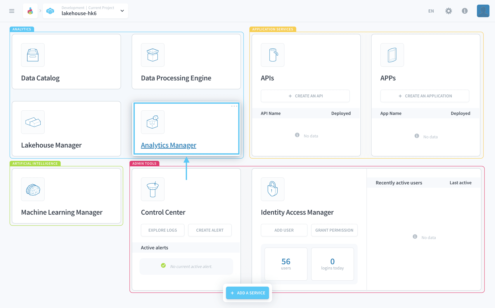
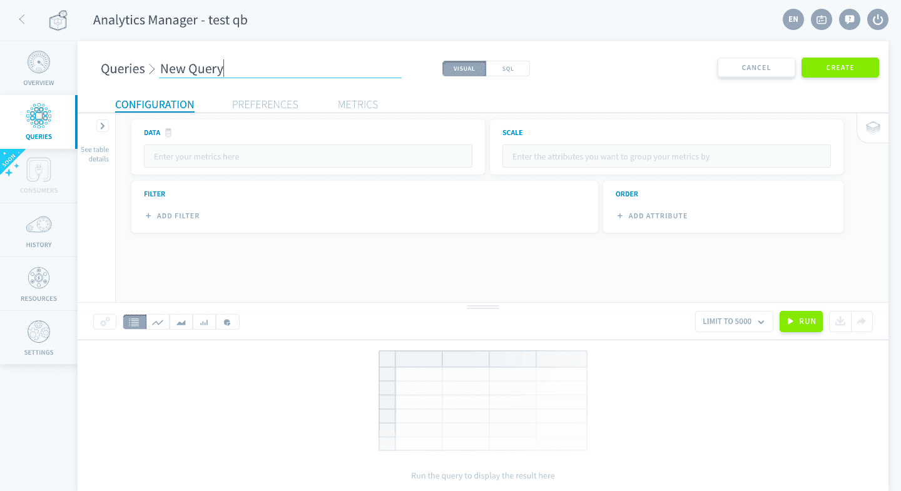
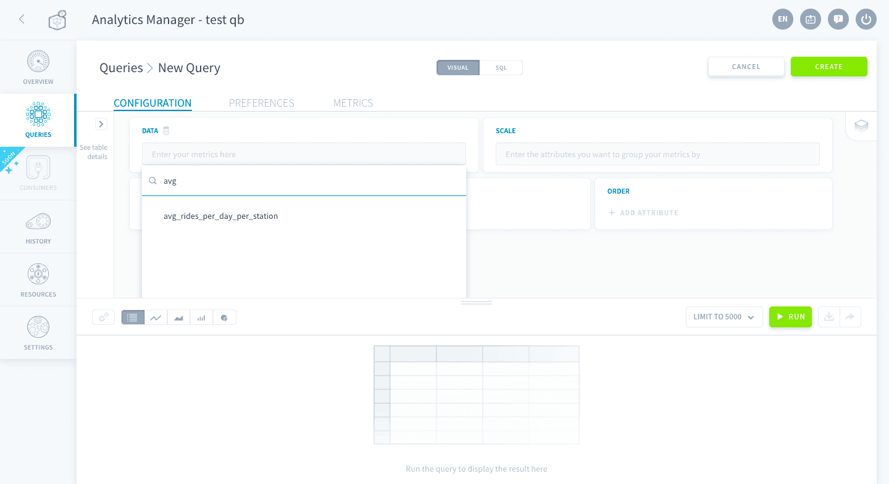
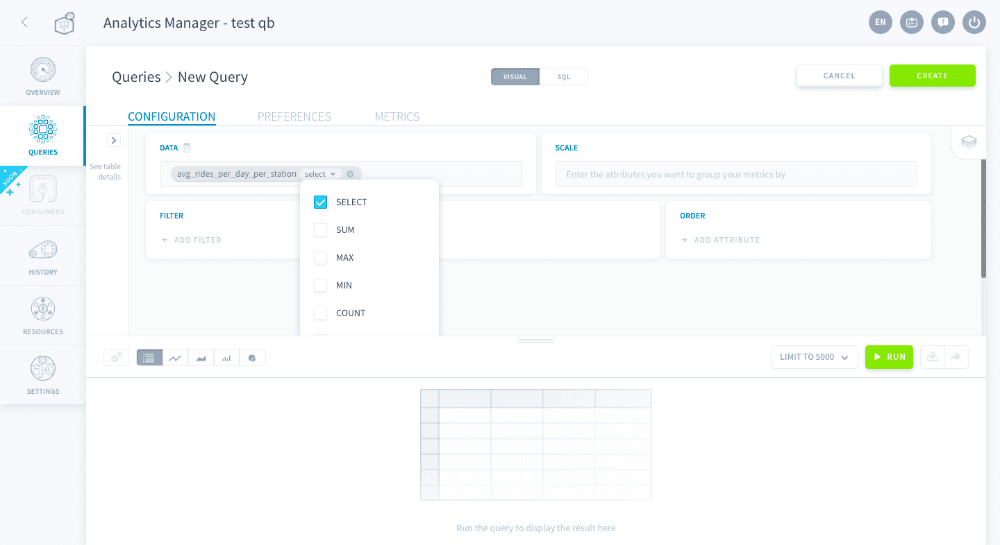
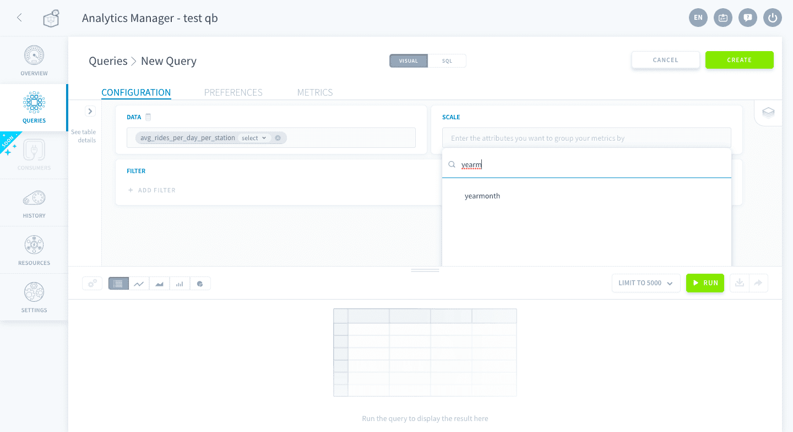
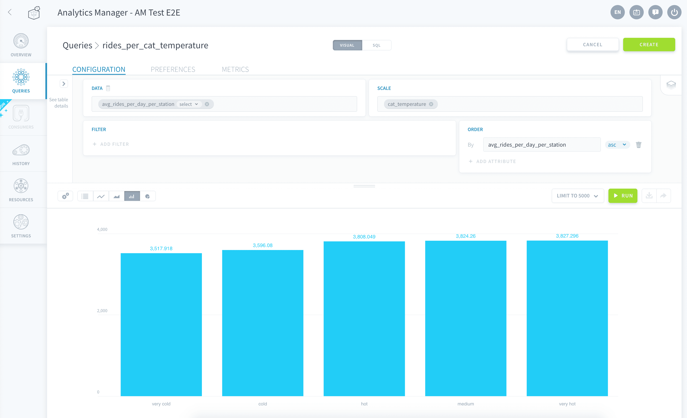

## Create queries on your data

The **Analytics Manager** allows you, thanks to a **low-code approach**, to prepare and centralize the queries matching your business KPIs. This component constitutes the interface between your data scientist team and your application developer team.

### Pre-requisites

Beforehand, you need to make sure all the previous steps of the Project are up and running. Your Lakehouse Manager schema was built properly and your workflow ran smoothly.

In this tutorial, you will build your first queries.

### Build your first queries

Now, you will create your first queries in order to make data ready for visualization:

- *rides_per_month* to understand the average number of rides each month. You'll use it to build your first graph.
- *rides_per_cat_temperature* to understand the average number of rides depending on temperature.

#### Create the first query

Open **Queries** in the sidebar and then click on **New Query**. This will open the Query window where you can give your query a name, parametrize the data as well the scale, order the results and add filters. In this screen, you can also view the results of your queries with tables or charts.

To begin with, name your query `rides_per_month`.

Then start typing 'avg_' in the **Data search bar** and click on the *avg_rides_per_day_per_station* attribute.

The compute mode is **select** by default, you can change it by clicking on the arrow and changing the selected options. For the purpose of this tutorial, leave it as it is by default here.

Then, click on the **Scale search bar**. Here, you want to display the average number of rides **each month** per date. Select *yearmonth* as a scale.

Then, click on the green button **Run** to run the query. You'll see the result of the query at the bottom panel, by default it is on table view.

You can change the display format: table, line chart, bar chart, area chart or pie chart. Choose by clicking on the buttons of the bottom panel (as indicated in the image below).

> [!primary]
>
> When you build a query in the Analytics Manager, you don't have to specify the table names. Data Platform will **automatically choose the most suitable table**. But you can still force a specific table by clicking the table icon next to *Data*.  
>

#### Create a second query

Queries aren't meant to be used in a dashboard only, they also provide an easy environment to explore your data using an array of data visualization options.

Create a new query:

- Name it `rides_per_cat_temperature`.
- Select *avg_rides_per_day_per_station* with compute mode **select**.
- Select *cat_temperature* as your scale.
- Select *avg_rides_per_day_per_station* as the **Order** (ascending order by default).

> [!primary]
>
> If you remember, *avg_rides_per_day_per_station* is a virtual attribute you have set in a previous step of the tutorial (Collect data). You cannot use any other compute mode than **Select** with this virtual attribute as it contains an SQL aggregate function. Adding **Sum** as compute mode would end up imbricating two SQL aggregate functions, resulting in an error.
>

Just like the screenshot below, click on **bar chart icon** to automatically display the data as a bar chart.

**Congrats!** You've successfully created 2 queries using the Analytics Manager. Now let's move on to the API part. You will create and deploy an API in a few clicks in order to expose your data in your final application.