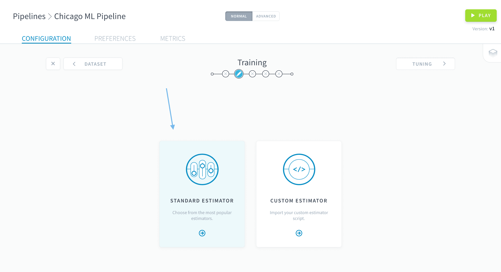
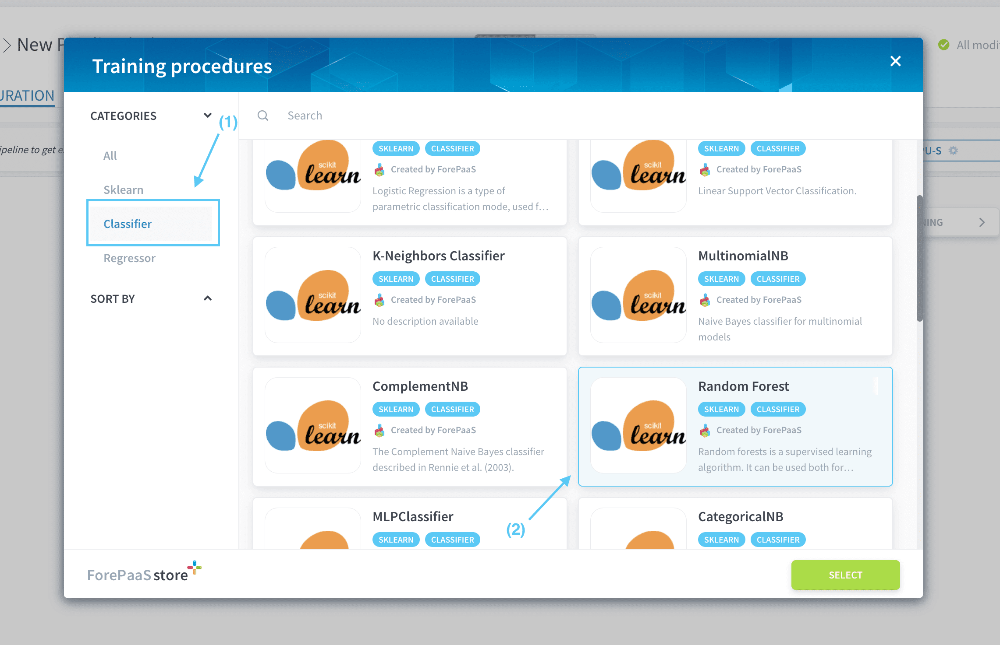
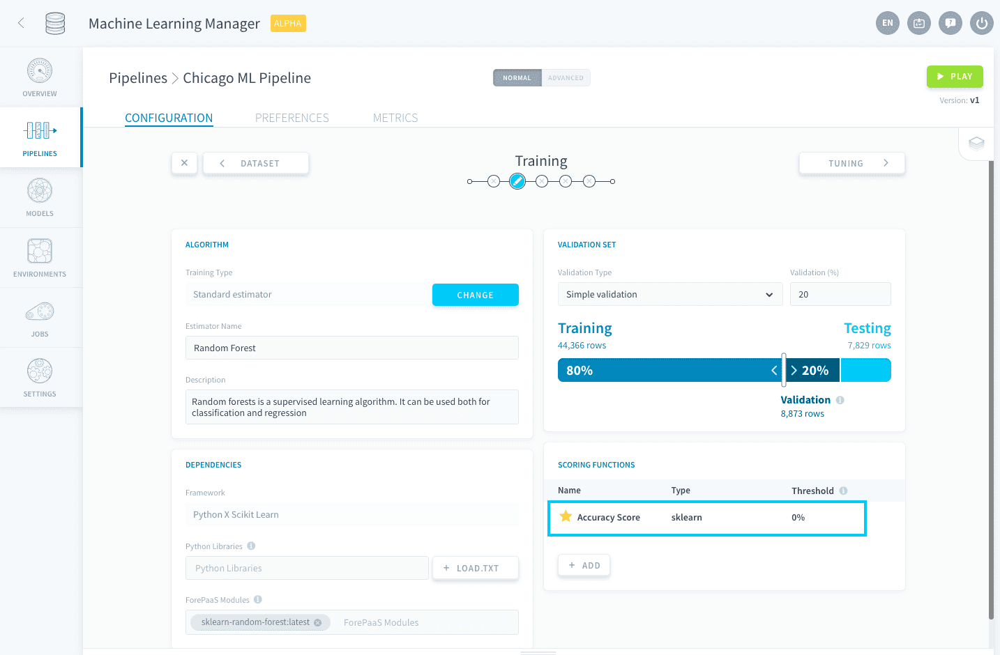
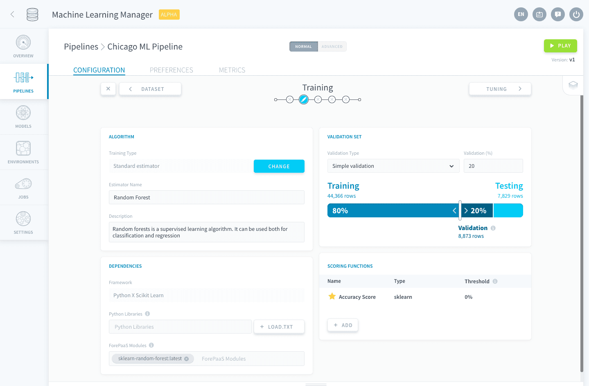

## Pick a training procedure

Moving on to the next step of building your own pipeline, it is now time to configure the training procedure at the core of your model.

### Choose an algorithm

The Data Platform makes it easy for you to choose industry-standard AI algorithms, or to use your own. The Data Platform comes with a long list of AI algorithms. The goal is to save you the trouble of learning about technical algorithms and instead focus on your business needs.

On the following screen, select **Standard Estimators**.

Let's use a [random forest of decision trees](https://en.wikipedia.org/wiki/Random_forest) for this problem. [Decision trees](https://en.wikipedia.org/wiki/Decision_tree_learning) are one of the most mainstream algorithms used to predict a categorical label (such as True/False or 1/0) based on a set of numerical variables. They are also simple to understand, implement and interpret. This makes them a good fit for your Chicago traffic example.

Start by **filtering on the Classifier category** in the store, then choose **Random Forest** (the **classifier** version - not Random Forest Regressor) by Scikit Learn, and press **Select**.

The **Algorithm** and **Dependencies** panels have been automatically configured to reflect the choice you just made: no need to scratch your head handling the library requirements, we are taking care of this for you!

> [!warning]
>
> Be careful not to erase pre-imported libraries and modules in the Dependencies box, else your pipeline will not run.
>

### Configure scoring and validation

Let’s go through a few concepts before we continue. These are important to help you build the perfect predictive model.

You chose the base algorithm but it still requires fine-tuning. For this, you'll eventually need to be able to measure the performance of your model. Since you are still in the training phase, you cannot touch the testing set. Best practices say you should instead define a **validation set**.  
The validation set is a subset of the previously-defined training set that is used to score models while you are fine-tuning them. Conversely, the testing set is used to measure how well your final model is doing on new, real-world data.

> [!primary]
>
> In other words, your pipeline will split your initial real-world data into three datasets as follows:  
> **Training set**: used to train (or 'fit') the model.  
> **Validation set**: used to provide an unbiased evaluation of a model fit during the training phase.  
> **Testing set**: used to provide an unbiased evaluation of a fully trained model.

But, again, nothing to worry about! The Data Platform makes it easy to create your validation dataset and to score your predictive model.

The Data Platform gives you the choice of 2 validation types to score your model: cross-validation or simple validation - let's stick to the latter for now. Use the slide bar to make sure the Validation set represents **20%** of the original Training Set:

> Note that the size of the testing set cannot be edited any longer as this should be done in [the first step](/pages/public_cloud/data_platform/tutorials/tuto_02_build_an_ai_model_from_scratch_step1).

There are many ways to score your validation dataset, and the Data Platform allows you to pick as many scoring functions as you want. To keep things simple, the Data Platform has picked by default the [*accuracy*](https://en.wikipedia.org/wiki/Accuracy_and_precision).

The platform also automatically configured a **threshold** at 0%. This value represents the minimum score that any model in the pipeline needs to reach (on both the validation and testing set) in order to be saved. Models for which any of the added scores doesn't reach its respective threshold will be discarded.

Make sure your screen eventually looks like this before moving on to the next step:

Everything is almost ready for your pipeline to run! The next step will be to fine-tune the hyper-parameters of the random forest algorithm you just selected.