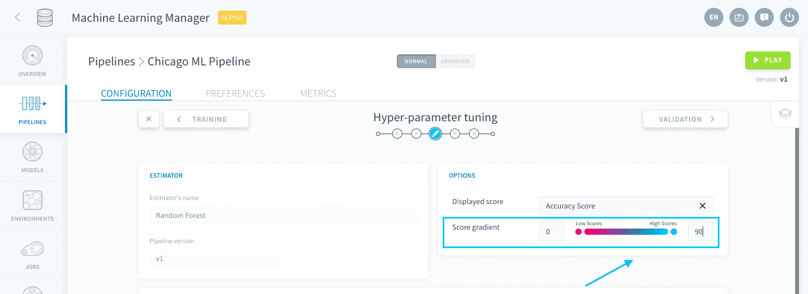
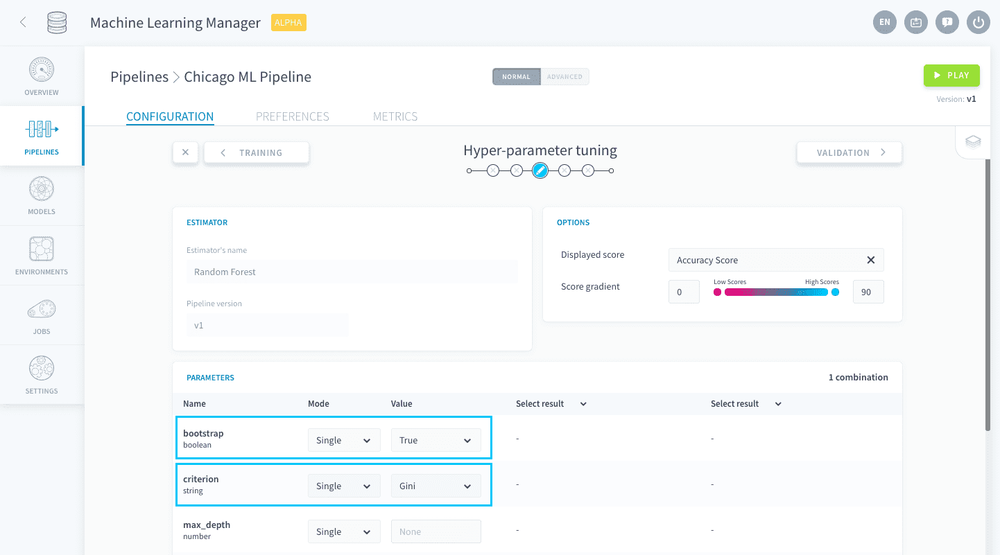
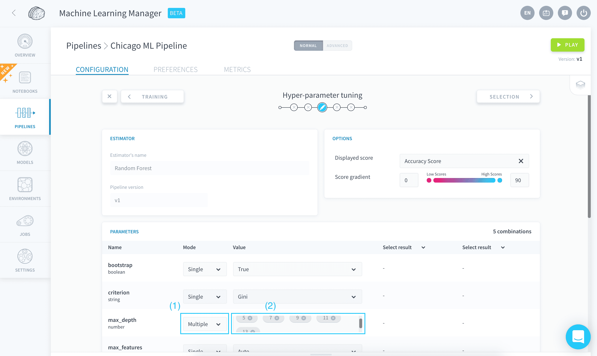
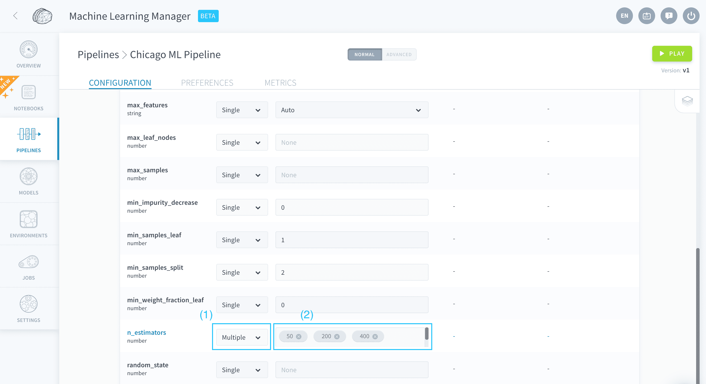
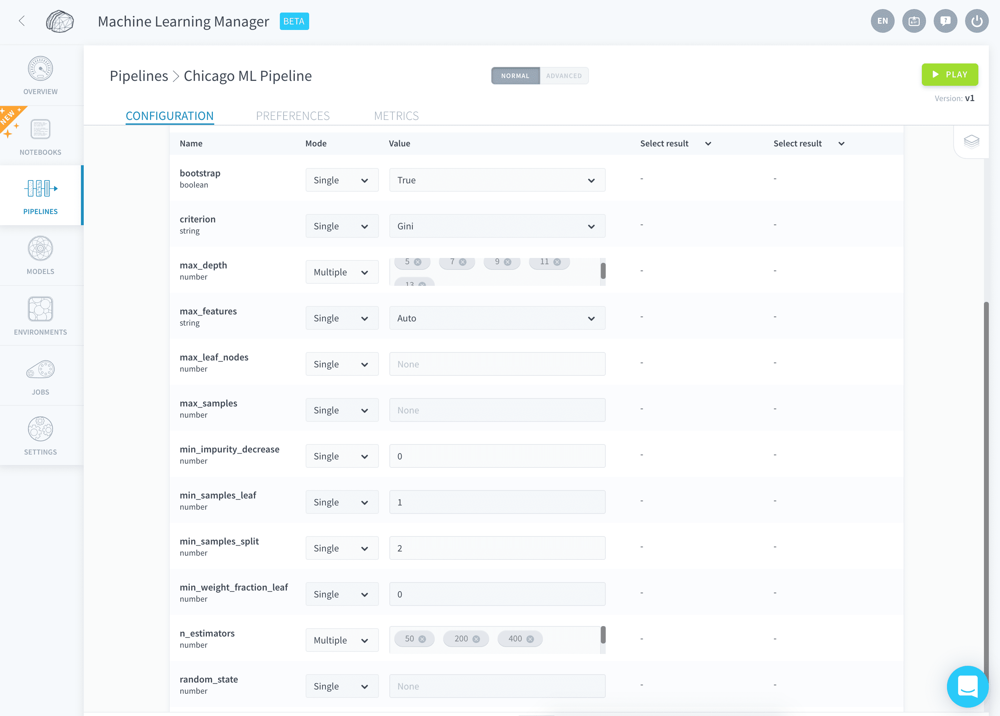
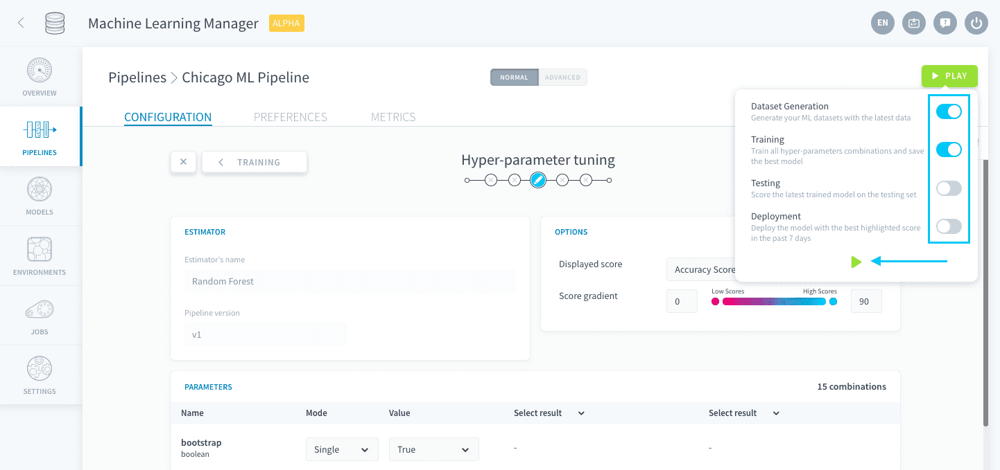

## Fine tune the hyperparameters of your model

In this tutorial, you will set the hyperparameters for your Random Forest algorithm and finally launch your first training and scoring jobs.

Hyperparameters are core variables of a machine learning algorithm that are set by the data scientist prior to the learning process. Think of it as setting the temperature and cooking time in an oven before baking. In a similar way, setting hyperparameters refers to a specific configuration of the underlying mathematical model with which the training is done.  
[Learn more about hyper-parameters on Wikipedia.](https://en.wikipedia.org/wiki/Hyperparameter_optimization)

### Make a first search of parameters

You just arrived in the hyperparameter tuning studio. It looks empty for the moment but you are going to fill it with precious insights very soon!

The two upper panels, Estimator and Options, give you a recap of the training algorithm and the scoring function you chose on the previous step. You can configure the color code for the scores in your pipeline by changing the score gradient.

Let's focus on the hyperparameters list. It has been populated with all the parameters that constitute a random forest algorithm.

The hyperparameter tuning studio lets you generate multiple configurations that are trained and scored. This gives you insight about the optimal combination of hyperparameters so you can either settle down with one of the combinations, or be more accurate in a second iteration of the search. By default, **each iteration saves only the best model in terms of score, for you to use it in the next steps**.

The first two parameters in the list are **bootstrap** and **criterion**: leave them to *Single* mode with the default values *True* and *Gini*.

> [!primary]
>
> All parameters have a default value defined by the algorithm.
>

The third parameter in the list is **max_depth**. It represents the maximum possible [depth of each decision tree](https://en.wikipedia.org/wiki/Tree-depth) in the forest.

> [!primary]
>
> You can get a description of each hyperparameter by hovering over its name.
>

Let's explore a couple of values for this parameter. Set the **Mode** to *Multiple*, and in the **Value** field remove the *None* value tag and enter *5*, *7*, *9*, *11* and *13* instead.

Now find the parameter **n_estimators** in the list. It defines the number of decision trees to be used.  
The score usually increases with the number of trees, but so does the training time and risk of overfitting. Set the **Mode** to *Multiple*, and in the **Value** field remove the *100* value tag and instead enter *50*, *200*, and *400*.

Finally, make sure the configuration for all other parameters is as follows:

| Hyperparameter | Mode | Value |
| :-: | --- | --- |
| **max_features** | Single | 'Auto' |
| **max_leaf_node** | Single | None |
| **max_samples**. | Single | None |
| **min_impurity_decrease** | Single | 0 |
| **min_samples_leaf** | Single | 1 |
| **min_samples_split** | Single | 2 |
| **min_weight_fraction_leaf** | Single | 0 |
| **random_state** | Single | None |

As you can see on the top-right just above the parameters list, you will generate 15 combinations.

You are now ready to run your pipeline for the first time. Press **Play**. Activate only *Dataset Generation* and *Training*, and run it.

The Data Platform is deploying cloud instances to generate datasets, train your models and score your combinations on the validation set.

After 5 minutes, all jobs should be done and you can move on to the next step: deploying your winner model.