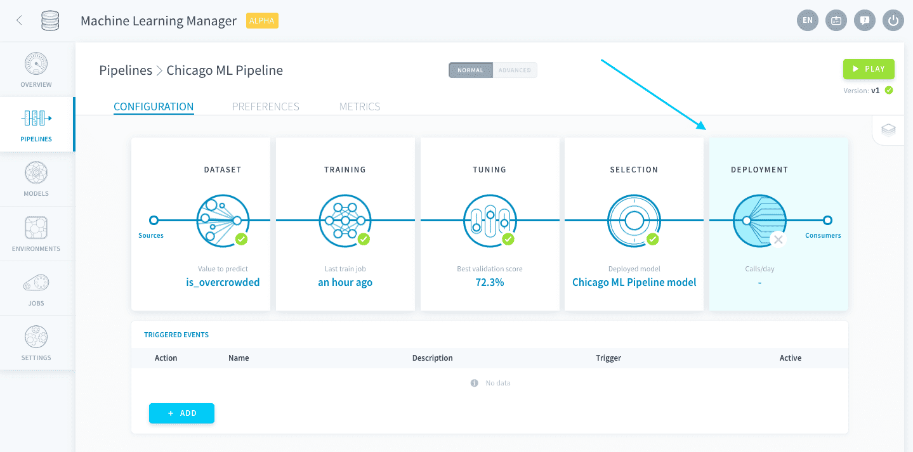
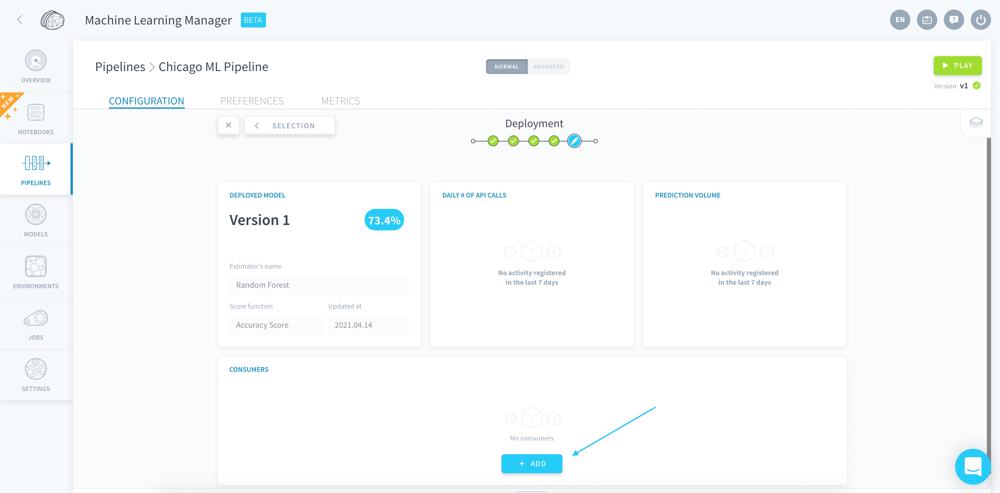
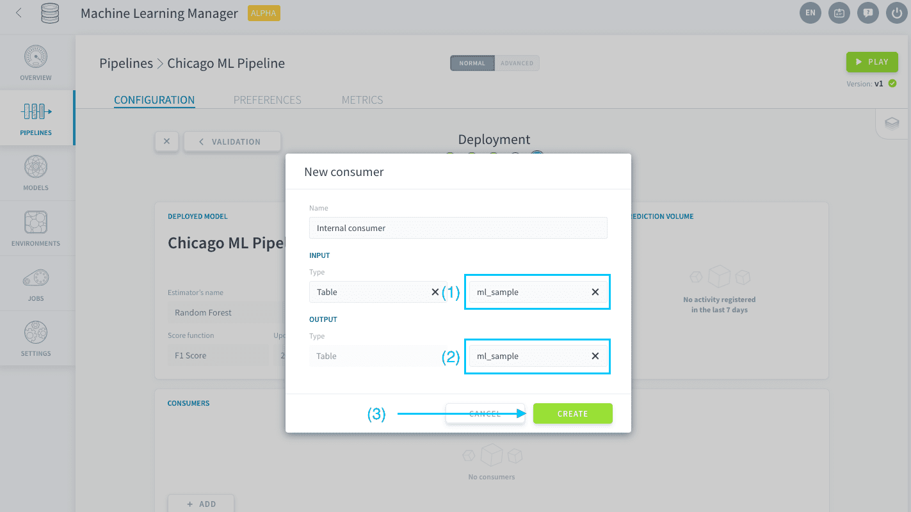
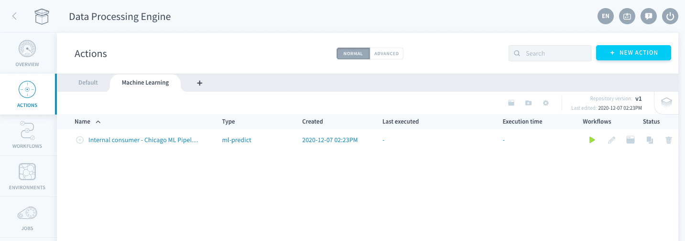
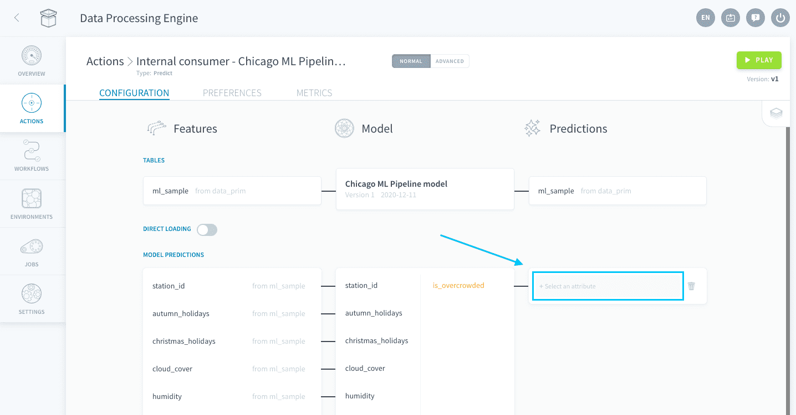
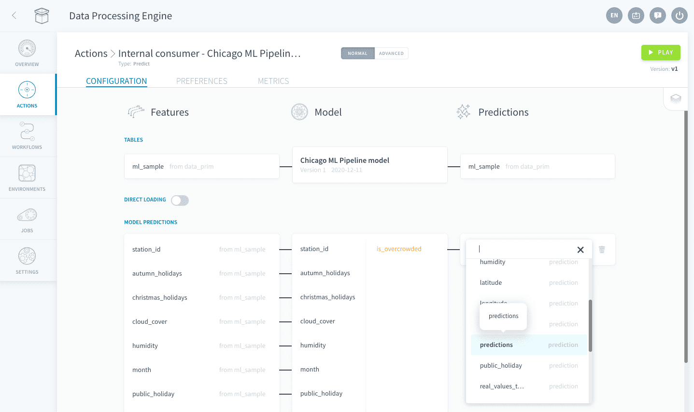
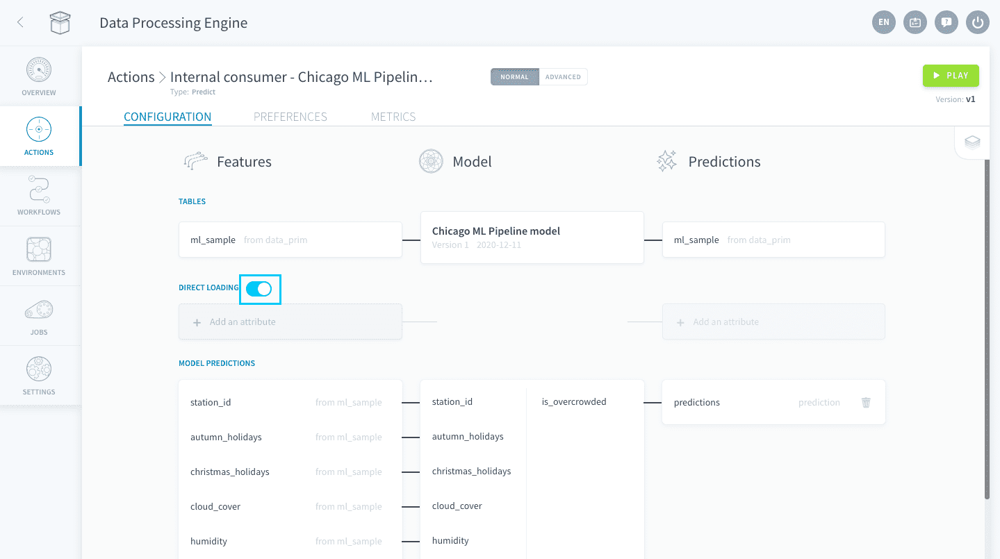
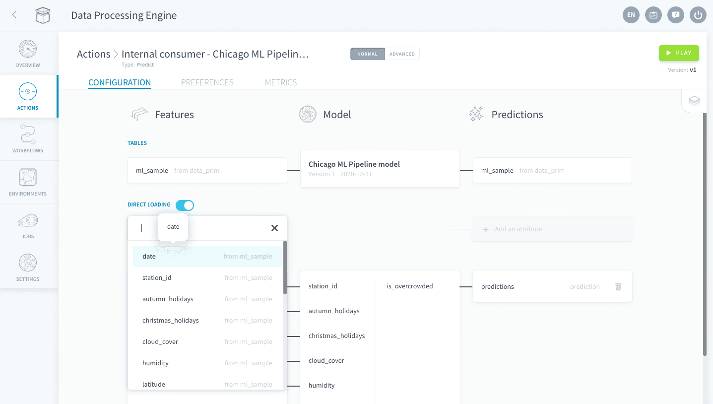
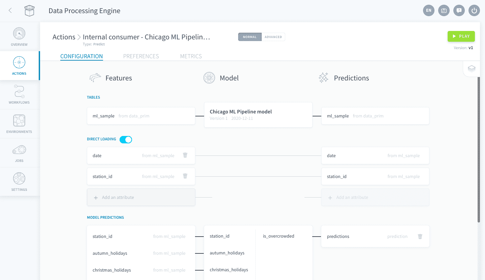

## Set model deployment options

In the Deployment step, you can configure all output options for your pipeline. In other words, this is the step where you truly put your model into production in order to operationalize the flow of predictions.

First, open the Deployment page.

### Manage consumers

The Data Platform gives you multiple options on how to use your model to make predictions: write in your Lakehouse Manager, make API calls, etc. For the moment let's keep it simple and fill a Data Platform table.

In the Consumers panel, click on **Add**.

Name it *Internal consumer* and select *Table* as the input (*Table* is automatically chosen as the output too).

Select *ml_sample* as the table for both the input and the output, then click on **Create**.

### Make your first prediction

Let’s go over the business context from the beginning of this tutorial: You’ve built an AI system to predict whether subway stations will be overcrowded and on which day. In other words, your model will make a prediction for each station id and date combination.

The best way to represent this is with an output table. Each row of the output table will feature a station id and a date combination, and show the value of 1 if the station is overcrowded, and 0 if it's not. You will keep other information from your dataset in that table, such as holidays, weather conditions and station coordinates in case you want to do other analyses or correlations. You will also keep the true outcome value for each row, in order to compare it with your predictions and evaluate how well your predictive model is working.

Your ML model has been incorporated in your Data Processing Engine when you created the consumer, in the form of a new Predict Action. Exit the Machine Learning Manager and head to the Data Processing Engine, in the Actions tab. Select the **Machine Learning** repository: there is a new Predict Action there.

Open the action. The lower panel is where you select the input and output for your model: edit the output on the right by clicking on *Select an attribute*.

The *predictions* column in the table *ml_sample* is currently empty and ready to be filled with predictions. To do this, select the attribute *predictions*.

You also need to specify which primary keys the action should use to write predictions. To do this, turn on **Direct Loading**.

Direct loading is used to copy your input data straight into your output table where the predictions will be, without going through your model. typically row indexes. This is where you can specify the primary keys to copy from the input table: select *date* in the left column.

Select *date* in the right column.

Repeat with *station_id*, which is the second primary key of *ml_sample*.

You're all set! The Predict action will automatically write the prediction in the correct row identified by the *date* and *station_id* primary keys.

Run your prediction by pressing the **Play** button.

Wait a couple of minutes for the sample data to call your deployed ML instance and gather predictions. You'll know it's finished when the *Jobs* tab in your DPE is clear.

Run a query in the Analytics Manager on the table *ml_sample* to check the values that have been predicted by your model!