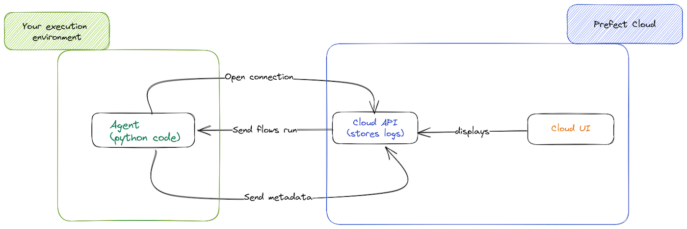
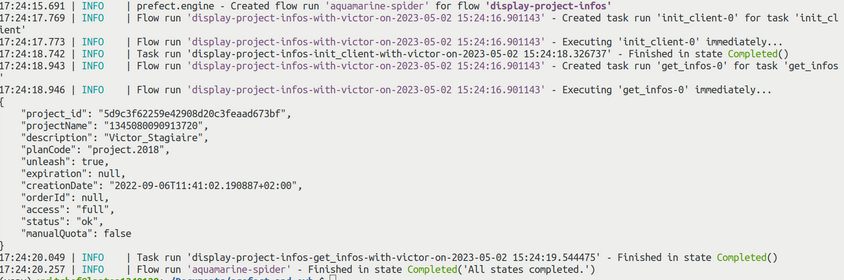
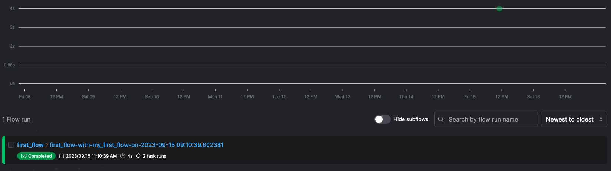

## Objective

The purpose of this guide is to discover [Prefect](https://docs.prefect.io/), an open source workflow management tool, and connect it to the [OVHcloud API](https://api.ovh.com/).<br>
Prefect provides a flexible Python framework to easily combine tasks into workflows, then deploy, schedule, and monitor their execution through the Prefect UI or API. 

## Requirements

- Access to the [OVHcloud Control Panel](https://www.ovh.com/auth/?action=gotomanager&from=https://www.ovh.it/&ovhSubsidiary=it)
- Access to the [OVHcloud API](https://api.ovh.com/). You can find more information [here](/pages/manage_and_operate/api/first-steps). Make sure your application token can access the **/cloud** POST and GET requests and the **/me** GET request. 
- A [Public Cloud project](https://www.ovhcloud.com/it/public-cloud/)

## Instructions

### What is Prefect ? 

Prefect is an open source tool used to build, schedule and monitor workflows. You can compare it to Apache Airflow for the global approach. A workflow management tool is useful to create and automate your pipelines, most often data pipelines or AI pipelines but not only. 

Prefect works with a local agent on your execution environment (your own computer, a virtual machine, ...) and a server which will interact with your agent. You can install yourself this server (**Self-hosted**) or it can be launched via the Prefect cloud offer..

It can be described as follows:

{.thumbnail} 

You can find more information on this [Prefect security overview](https://www.prefect.io/security/overview/). 

#### Key components

You will find below a non-exhaustive list of key elements that you will always meet during in our Prefect tutorials.

Feel free to read their [official Prefect documentation](https://docs.prefect.io/latest/concepts/) for detailed information.

- **Workspace**: an isolated environment within Prefect Cloud for your flows and deployments. You can use workspaces to organize or compartmentalize your workflows. Once created, you can launch your flows.

- **Flow** : a collection of tasks and dependencies between them that defines your work, such as a data pipeline. Flows in Prefect are designed to be composable and modular, allowing users to build complex workflows by piecing together smaller, reusable building blocks. 

- **Task** : a unit of computation that performs a specific operation. Tasks can be thought of as the building blocks of a Prefect flow, where each task represents a single step in a larger pipeline.  

As an example, if we want to create an AI Pipeline, one task could be a job launch to train a model and another task to deploy the model. With these two tasks, we can create a flow.

### Start with Prefect

As explained before, Prefect is an agent-server software. The agent has to be installed on your local execution environment, and the server can be installed manually or just started with the Prefect Cloud offer.

This [Prefect installation tutorial](https://docs.prefect.io/getting-started/installation/) may help you to deploy Prefect on an virtual machine. Prefect provides an interface (UI) to see the flows you run and the state of each flow. 

Alternatively, you can use the Prefect Cloud version. With this version, you will benefit from the same approach but with more features and support, and everything is managed by Prefect. 

For the next tutorials, we will choose this option. 

**To configure your Prefect Cloud account**, go on [their official website and create an account](https://www.prefect.io/). The Prefect Personal free plan is sufficient for the next steps.

### Generate OVHcloud API credentials

> [!primary]
>
> Exhaustive information can be found in following guide: [First steps with OVHcloud API](/pages/manage_and_operate/api/first-steps).
>

Any application that wants to communicate with the OVHcloud API must be declared in advance.

To do this, click the following [link](https://eu.api.ovh.com/createToken/).

Fill in your OVHcloud customer ID, password, and application name. The name will be useful later if you want to allow others to use it.

You can also add a description of the application and a validity period.

The `Rights` field allows you to restrict the use of the application to certain APIs. You must provide access to the **/cloud** POST and GET requests and the **/me** GET request.

Once you click `Create keys`{.action}, you will be issued with three keys:

- An **application key**, called AK.
- A **secret application key**, not to be disclosed, called AS.
- A **secret “consumer key“**, not to be disclosed, called CK. 

Store them safely.

### Install OVHcloud Python SDK for API

> [!primary]
>
> Don't forget to install Prefect with pip : `pip install prefect`. [Git repo](https://github.com/PrefectHQ/prefect)
>

To connect Prefect on an OVHcloud Public Cloud project, we will use the OVHcloud API and python. 

In Prefect, you can benefit from [multiple native integrations](https://docs.prefect.io/integrations/), simplifying your tasks creation.

So far we don't provide native integration for OVHcloud, but The OVHcloud Python SDK will ease the communication with OVHcloud APIs. It enables developers to automate tasks such as managing OVHcloud services, instances, domain names, and user accounts through Python scripts.

In these python scripts, we will create our Prefect flows. These flows will connect to the Public Cloud with the help of the application token you create to access the API. 

You can easily install the SDK for the API with pip : `pip install ovh`. SDK is detailed on this [git repository](https://github.com/ovh/python-ovh). 

### Connect Prefect to Public Cloud

Now that Prefect is configured and OVHcloud credentials are generated, we are able to merge everything.

Create a Python file, for example `first_flow.py`. In this file, put this Python code:

```python
# Import the required libraries
import ovh
from prefect import flow, task
import json

def generate_task_name():
    flow_name = flow_run.flow_name
    task_name = task_run.task_name

    parameters = task_run.parameters
    name = parameters["name"]
    date = datetime.datetime.utcnow()

    return f"{flow_name}-{task_name}-with-{name}-on-{date}"


def generate_flow_name():
    flow_name = flow_run.flow_name

    parameters = flow_run.parameters
    name = parameters["name"]
    date = datetime.datetime.utcnow()

    return f"{flow_name}-with-{name}-on-{date}"


# Define the task to create a client for your public Cloud.
@task(name="init_client",
      task_run_name=generate_task_name)
def init_ovh(name):
    ovh_client = ovh.Client(
        endpoint=<your-api-endpoint>,
        application_key=<your-api-key>,
        application_secret=<your-app-secret>,
        consumer_key=<your-app-consumer-key>,
    )
    return ovh_client

# Define the task to get all of your notebook

@task(name="get_infos",
      task_run_name=generate_task_name)
def get_project_infos(client,project_uuid,name:str):
    result = client.get(
        '/cloud/project/'+str(project_uuid))
    print(json.dumps(result, indent=4))

# Define the flow to run on prefect


# Define the flow to run on prefect
@flow(flow_run_name=generate_flow_name)
def display_project_infos(name:str):

    project_uuid = variables.get("Project UUID", default="<your-project-uuid>")

	# Create the OVHcloud client
    client = init_ovh(name="victor")
	# This task print all your Public Cloud project infos
    get_project_infos(client=client, project_uuid=project_uuid,name="victor")	
 
display_project_infos(name="victor")
```

In this python code, we create two tasks:

- One is for the initialization of an OVH_client
- The second is to get all of your Public Cloud project information, based on your Project UUID that you can find in the Control panel or via the API. 

### Run your Prefect flow locally

Now that our Python code is ready, let's run it:

```console
# Log into Prefect
$prefect cloud login

#Run your code
$python3 first_flow.py
```

We will see in our terminal the project information. You should see something similar to this: 

{.thumbnail} 

We can see one flow has been finished and which is in state `Completed()`. This flow has also completed two tasks that we defined before. Prefect Cloud provides a more precise online interface. Let's go and see what it provides to us. 

{.thumbnail} 

The graph shows us the execution time of the "display-swift-containers" flow based on the time it was executed.<br>
If you run your flow again, you will see another green point. If the flow had not been completed, the point on the graph would be of a different color.<br>
We can see below the details of the running flow.<br>
Note that you can name each flow if you want.

## Go further

- Official Prefect website : [Prefect.io](https://prefect.io/)
- Send an email with prefect : [Send an email through blocks and automation with Prefect](/pages/public_cloud/integrations/prefect_tuto_02_block_automation)
- Run your first job with Prefect and the OVHcloud API : [Create your first AI pipeline with prefect](/pages/public_cloud/integrations/prefect_tuto_03_ai_pipeline)

## Feedback

Please send us your questions, feedback and suggestions to improve the service:

- [Discord community](https://discord.gg/ovhcloud)
