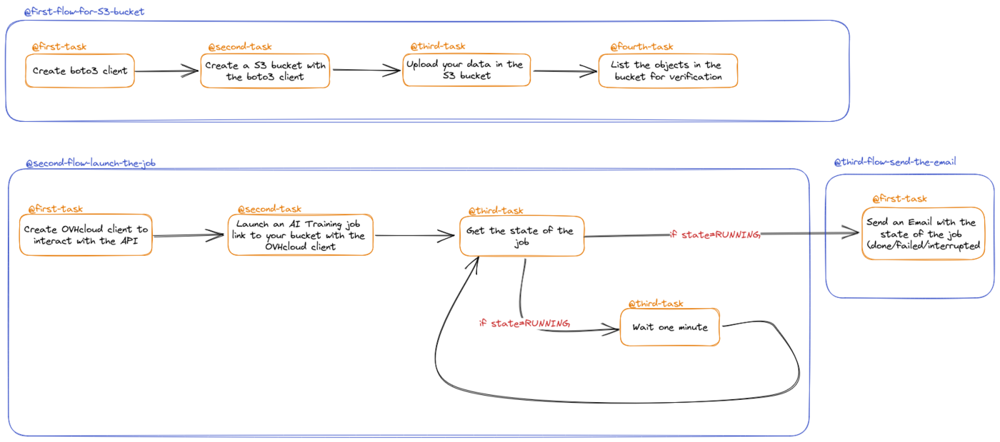
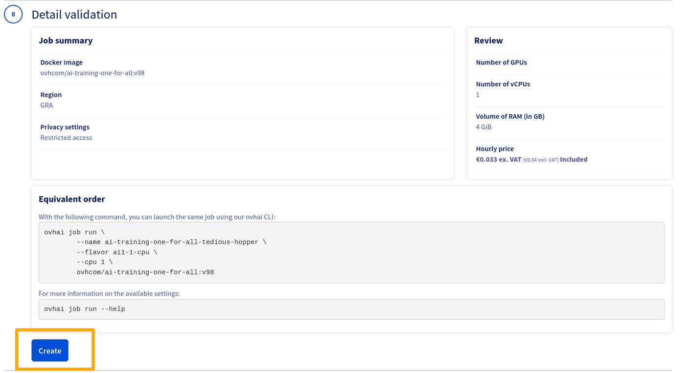
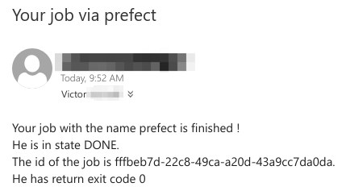
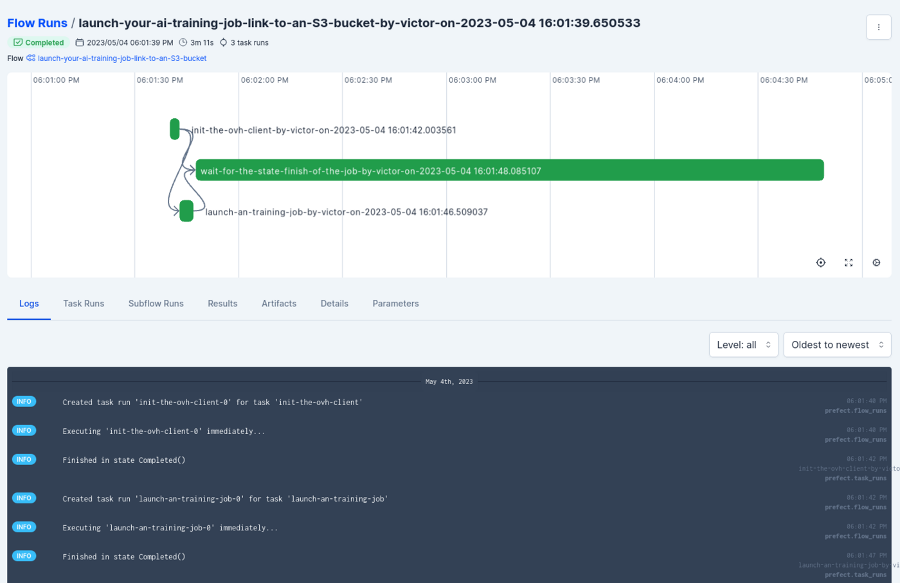

## Objective

The purpose of this tutorial is to create an end-to-end AI pipeline, from the ingestion of data in an S3 object storage to the email notification when your AI Training job is done. 
We will launch a flow in Prefect which will simulate an AI Training job in a Public cloud project. The main goal is to show that we can launch AI training jobs without having to monitor their state over time, and start a real use case with automation. Prefect will help us achieve these goals.

## AI pipeline overview

As a quick overview, here are the main flows and steps:

1. Create a new S3 bucket (object storage) and upload data in it.
2. Run an AI Training job linked to this data, and train a previously built model.
3. Once the job is completed, you receive a notification via email.

The model used will be a classical **PyTorch** image classification model. If you want to have more details about this model, don't hesitate to consult [our tutorial](/pages/public_cloud/ai_machine_learning/training_tuto_01_train_your_first_model). The AI pipeline can be represented as follows:

{.thumbnail}

## Requirements

- A Prefect cloud profile and an open Prefect workspace. See this [tutorial](/pages/public_cloud/integrations/prefect_guide_01_getting_started)
- A coding environment with Prefect configured. See this [tutorial](/pages/public_cloud/integrations/prefect_guide_01_getting_started)
- Access to the [OVHcloud Control Panel](https://www.ovh.com/auth/?action=gotomanager&from=https://www.ovh.pt/&ovhSubsidiary=pt)
- A [Public Cloud project](https://www.ovhcloud.com/pt/public-cloud/)
- An S3 data store configured (you can do this easily with cli: `ovhai data store ls`. If you have never done this before, you can check [our tutorial](/pages/public_cloud/ai_machine_learning/gi_08_s3_compliance)

## Instructions

### Generate credentials for S3 protocol

Object storage is the most common and powerful solution to easily store data. OVHcloud object storage offers are natevily compliant with S3 protocol.

First, we will generate credentials allowing us to manage S3 buckets and data over API. 
Follow our [S3 official documentaiton for credentials here](/pages/storage_and_backup/object_storage/s3_identity_and_access_management). 
Keep the access key and the secret key, we will need them later. 

Next, let's synchronize our S3 credentials with the boto3 client. To do this, we have to create a folder and two files in it. To configurate the boto3 client, we recommend following this [part](/pages/storage_and_backup/object_storage/s3_getting_started_with_object_storage#configuration) of the tutorial. Once the two files are created and you have filled them with your credentials, we can start coding and create our S3 object storage with a Prefect flow.

To create an S3 object storage, we must provide With the [SDK OVHcloud](https://github.com/ovh/python-ovh), we can easily communicate with the OVHcloud's API. To interact with an S3 object container, we must use an S3 protocol. OVHcloud does not provide this protocol yet, but [The boto3 library](https://github.com/boto/boto3) does. The boto3 SDK is the Amazon Web Services (AWS) Software Development Kit (SDK) for Python, which allows Python developers to write software that makes use of services like S3 containers. It provides a low-level interface to many of the services, as well as higher-level abstractions that facilitate working with these services. 

We require certain credentials to use this protocol. You can get these credentials as S3 users. You can create them in the OVHcloud control panel, go to your public cloud project and open the object storage tab. To know more about these credentials, consult this [guide](/pages/storage_and_backup/object_storage/s3_identity_and_access_management).

### Create environments variables inside our Prefect Cloud workspace. 

Before starting our flows, a best practice is to use environments variables, avoiding hard-coded and unsafe parameters. Instead of storing them in a `.env` file, we can do this directly on the Prefect cloud UI. In Prefect, variables enable you to store and reuse non-sensitive bits of data, such as configuration information. Variables are named, mutable string values, much like environment variables. Variables are scoped to a Prefect server instance or a single workspace in Prefect Cloud. For more information, you can consult their [official website](https://docs.prefect.io/latest/concepts/variables/) directly. 

For this pipeline, we will create 9 variables. Most of them are for your S3 access key or your credentials for the OVHcloud API. 

Go to the Prefect Cloud interface and create the 9 variables with their UI:

- app_endpoint = the endpoint of the OVHcloud API. It can be the European endpoint, for example.
- app_key = your application key to access the OVHcloud API's.
- app_secret = your application secret key to access the OVHcloud API's.
- consumer_key = your consumer key to access the OVHcloud API's.
- s3_key = your S3 key to configure the botoS3 client.
- s3_secret = your S3 secret key to configure the botoS3 client.
- s3_endpoint = your S3 endpoint.
- s3_region = the name of the region where your s3 bucket will be stored.
- project_uuid = your public cloud project id, you can find it on the url. 

Once your variables are created in the UI, you have to call them on your workspace in python. This will be ensured by a simple function directly provide by the SDK Prefect for python. Let's take a look at this code:

```python
# Get the variables from your environment in Prefect cloud:
appEndpoint = variables.get("app_endpoint", default="<your-app-endpoint>")
applicationKey = variables.get("app_key", default="<your-app-key>")
applicationSecret = variables.get("app_secret", default="<your-application-secret")
consumerKey = variables.get("consumer_key", default="<your-consumer-key>")
awsAccessKey = variables.get("s3_key", default="<your-S3-access-key>")
awsSecretKey = variables.get("s3_secret", default="<your-S3-secret-key>")
endpointUrl = variables.get("s3_endpoint", "<your-S3-endpoint>")
regionName = variables.get("s3_region", default="<your-S3-region>")
projectUuid = variables.get("project_uiid", default="<your-project-uuid>")
```
### Understanding flows and tasks

A good practice is to split your code with flows and tasks. Flows can call tasks of subflows, and tasks should represent a single logical step of your workflow.

Of course, putting all of our code in a single flow function with a no-name flow will be happily run by Prefect, but organizing our workflow code into a smaller flow and task units allows you to take advantage of Prefect features such as retries, more granular visibility into runtime state, the ability to determine the final state regardless of individual task state, and more. To easily name your flows and tasks, we can create two functions that will take as parameters your user name (chosen at random, for this tutorial we will use `OVHcloud`). This username is defined as a Prefect variable (directly via the UI). 

More information about tasks and flows can be found in the [Prefect official documentation](https://docs.prefect.io/latest/concepts/flows/). 
 
### Create a first flow for uploading data in S3 bucket

In this part, we will create the first flow for our S3 object storage. First of all, we will create a task (@first-task on the schema) to initialize our boto3 client. Let's do this in our python environment:

```python
@task(name="init-a-S3-user",
      task_run_name=generate_task_name)
def init_s3(username):
    # Log in OVHcloud Object Storage with S3 protocol
    # To get credentials, go to Control Panel / Public Cloud / (your project) / Users / (generate S3 credentials)
    # boto3 doc : https://boto3.amazonaws.com/v1/documentation/api/latest/guide/s3-examples.html
    # For the credentials of boto3 use the S3 credentials created on the OVHcloud control pannel
    client = boto3.client(
        's3',
        aws_access_key_id=awsAccessKey,
        aws_secret_access_key=awsSecretKey,
        endpoint_url=endpointUrl,
        region_name=regionName
    )
    return client
```

> [!primary]
>
> The **endpoint_url** should be similar to this: https://s3.gra.io.cloud.ovh.net/. In this case, your region name is `gra`. The access key and secret key are your credentials, created in the previous steps.
>
 
Now, let's create another task to create an S3 bucket. For this task, we will need a name for our bucket. To name an S3 object storage, you need to provide a unique object key which serves as the identifier for the object. The object key consists of the bucket name and a unique identifier, separated by a dash (-). To get this unique identifier, you can use a timestamp or a [UUID generator](https://www.uuidgenerator.net/). Here is the python code to create our second task:

```python
@task(name="create-a-S3-bucket",
      task_run_name=generate_task_name)
def create_bucket(bucket_name, client, region, username):
    try:
        location = {'LocationConstraint': region}
        response = client.create_bucket(
            Bucket=bucket_name, CreateBucketConfiguration=location)
    except ClientError as error:
        return (False)
    return (True)
```

> [!warning]
> 
> In this task, if there is a Client Error because the credentials are false, the task will return `False`. Thanks to this, we can raise and notify an error later, if necessary.
>

Now, let's upload our data in the S3 bucket. We will upload some code to create the model and extract our data, a requirements file and a .zip file with all the data to train. The python file and the requirements file can be downloaded on this [git repo](https://github.com/ovh/ai-training-examples/tree/main/jobs/getting-started/train-first-model). The dataset can be found [here](https://www.kaggle.com/datasets/zalando-research/fashionmnist) on Kaggle. Let's create this task!

```python
@task(name="upload-files-in-a-S3-bucket",
      task_run_name=generate_task_name)
def upload_data(files, bucket, client, username):
    # Upload a file to an S3 bucket
    # param file: File to upload
    # param bucket: Bucket to upload to
    # return: True if file was uploaded, else False
    for file in files:
        try:
            file = str(file)
            object_name = file
            response = client.upload_file(file, bucket, object_name)
        except ClientError as e:
            return False
    return True
```

Next, let's define our last task to list all of the objects from our bucket. In the schema, this is our fourth task for the first flow.

```python
@task(name="list_object-in-yourS3-bucket",
      task_run_name=generate_task_name)
def list_bucket_objects(bucket, client, username):
    try:
        response = client.list_objects_v2(Bucket=bucket, MaxKeys=10)
        print(response)
    except ClientError as error:
        # Put your error handling logic here
        raise ValueError("Unable to list bucket objects.")
    pass
```

Our fourth tasks for the first flow has been created. Now, we have to link variables and tasks in the flow:

```python
# Flow to create an S3 bucket and upload files in it
@flow(name="create-a-S3-container-and-upload-your-data",
      flow_run_name=generate_flow_name)
def create_and_upload_in_S3(username):
    # Run the first task
    client = initClient.init_s3(username=username)
    bucket_name = "python-eae22d77-77e6-4db0-a4d4-f80831b0fa3a"
    # Run the second task
    containerS3.create_bucket(bucket_name=bucket_name,
                              client=client, region="gra",
                              username=username)
    files = ["my-dataset.zip", "train-first-model.py", "requirements.txt"]
    # Run the third task
    res = containerS3.upload_data(
        files=files, bucket=bucket_name, client=client, username=username)
    if res == True:
        # Run the fourth task
        containerS3.list_bucket_objects(
            bucket=bucket_name, client=client, username=username)
    else:
        raise Exception("Sorry, we can't upload your data")
    return client
```

> [!warning]
> 
> Don't forget to download the data on your local environment. If you don't, it won't be able to be uploaded to the S3 Object Storage. 
>

### Create a second flow to train your machine learning model 

In this flow, we will need a Python client that can connect to the OVHcloud API. This is our first task. If you have followed the [getting started tutorial](/pages/public_cloud/integrations/prefect_guide_01_getting_started), you should already be able to perform this task.

The second task will use the OVHcloud SDK for Python. This library provides a POST method on the url we want from the API. According to the API, we will use this API call:

> [!api]
>
> @api {v1} /cloud POST /cloud/project/{serviceName}/ai/job
>

To launch a job, we must define some parameters. We can't launch a job without a name and an image. With the OVHcloud SDK, parameters are very easy to provide. 
The method **client.post("url",\*\*job_params)** has two parameters. The first one is the url of the `POST` request and the second one is a JSON object with all of the parameters of your job. If you are not sure what the body of the request looks like, you can use your web browser and launch your job with the OVHcloud control panel as shown below. The OVHcloud control panel is based on the OVHcloud API, so in developer mode you will see the provided parameters.

{.thumbnail}

Here is our Python code:

```python
# Define the task to launch a job
@task(name="launch-an-training-job",
      task_run_name=generate_task_name)
def launch_job(client, bucket_name, region_job, alias_s3, docker_image, name_job, cpu, username):
    job_creation_params = {
        "image": docker_image,
        "region": region_job,
        "volumes": [
            {
                "dataStore": {
                    "alias": alias_s3,
                    "container": bucket_name,
                    "prefix": ""
                },
                "mountPath": "/workspace/my_data",
                "permission": "RW",
                "cache": False
            }
        ],
        "name": name_job,
        "unsecureHttp": False,
        "resources": {
            "cpu": cpu,
            "flavor": "ai1-1-cpu"
        },
        "command": [
            "bash", "-c", "pip install -r ~/my_data/requirements.txt && python3 ~/my_data/train-first-model.py"
        ],
        "sshPublicKeys": []
    }
    result = client.post(
        f"/cloud/project/{projectUuid}/ai/job", **job_creation_params)
    return (result)
``` 

Once the job is launched, the next step is to determine whether it was successful or not. Thanks to the API, when you do the `POST` request of your job, you retrieve all of the information for your job. In our example, we will get the `id` and with this `id` we will do a `GET` request every minute to get the state of the training job. Here is the reference to the API:

> [!api]
>
> @api {v1} /cloud GET /cloud/project/{serviceName}/ai/job/{jobId}
>

The task that ensured the verification of the end of the job:

```python
@task(name="wait-for-the-state-finish-of-the-job",
      task_run_name=basePrefect.generate_task_name)
def wait_state(client, id, username):
    wait = True
    while wait:
        res = client.get(
            f"/cloud/project/{projectUuid}/ai/job/{id}")
        status = res['status']['state']
        if (status == "RUNNING" or status == "QUEUED" or status == "INITIALIZING" or status == "PENDING"):
            time.sleep(60)
        else:
            name = res['spec']['name']
            exitCode = res['status']['exitCode']
            wait = False
    return (name, exitCode, status, id)
```

### Create a last flow to send an email notification

Finally, we will send an email to indicate that our job is complete.
Create a flow with the parameters you want to send. Before creating the task, do not forget to create an `Email Server Credentials` block directly on the Prefect cloud UI. More information on this can be found [here](https://prefecthq.github.io/prefect-email/). You can also do this with Python code. This email configuration allows Prefect to send emails with the credentials of one of your email addresses.

Now, let's define the last flow: 

```python
@flow(name="send-email-with-details-of-the-job",
      flow_run_name=generate_flow_name)
def email(state_job, exit_code, id_job, name_job, username):
    email_credentials_block = EmailServerCredentials.load("email-block")
    line_1 = f"Your job with the name {name_job} is finished ! <br>"
    line_2 = f"He is in state {state_job}. <br>"
    line_3 = f"The id of the job is {id_job}. <br>"
    line_4 = f"He has return exit code {exit_code} <br>."
    message = line_1+line_2+line_3+line_4
    subject = email_send_message.with_options(name="send-an-email",
                                              task_run_name=f"send-an-email-by-{username}-to-notified-job_is_finished").submit(
        email_server_credentials=email_credentials_block,
        subject="Your job via prefect",
        msg=message,
        email_to="victor.vitcheff@ovhcloud.com",
    )
    return (subject)
```

The three flows are now defined. Let's run them!

### Run the three flows

Before running the flows, make sure you have installed the Prefect-email. You should have already done this if you followed the tutorial to create the `Email Server Credentials` block. 

The last thing to do is launch the function which Prefect will understand them as flow or task.

```python
# Run the flow for the data container and data
print("Welcome", create_and_upload_in_S3(username=myUsername),
      "Your data has been added in a S3 bucket")

# Run the flow for the job creation
name, exitCode, status, id = job(username=myUsername)

# Send an email when it is over
email(state_job=status,
      exit_code=exitCode,
      id_job=id,
      name_job=name,
      username=myUsername)
```

Open a terminal, launch the command `python3 <name-of-your-file.py` and wait until it's done. You should receive an email like this: 

{.thumbnail}

### Monitor your pipeline in Prefect Cloud UI

Now, let's see on the Prefect Cloud UI how the situation evolves.

The "Flow Runs" tab in the Prefect Cloud UI displays information about the executions of your Prefect flows. You can find the name of the flows, the state of the flows, the tasks executed inside the flows and many other information about your current or past flows. Overall, the "Flow Runs" tab provides a detailed overview of the execution history of your Prefect flows, allowing you to monitor performance, troubleshoot issues, and make improvements to your workflows. Here is an example: 

{.thumbnail}

We choose to display the launch of the job, the second flow in this pipeline. We can see our three tasks displayed on the graph. We also see the order in which they should be executed. Below the graph, you can find tabs to see the details of your tasks or the results of each task.

You also have the possibility to see the steps of your flows directly in the console but it is less precise than directly on the Prefect cloud UI.   

## Go further
 
- [Official Prefect documentation](https://docs.prefect.io/latest/)
- [OVHcloud API console](https://api.ovh.com/console/)
- Learn about AI Training jobs with tutorials : [AI Training - Tutorials](/products/public-cloud-ai-and-machine-learning-ai-training-tutorials)

## Feedback

Please send us your questions, feedback and suggestions to improve the service:

- On the OVHcloud [Discord server](https://discord.gg/ovhcloud)
