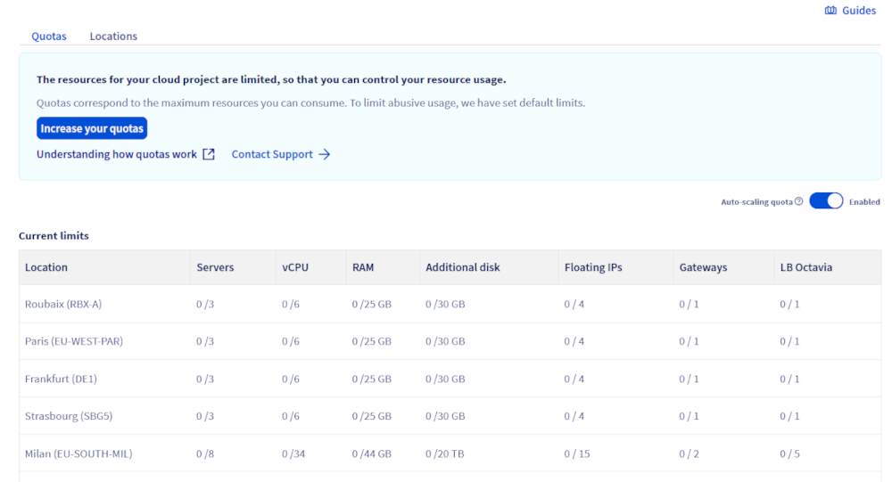
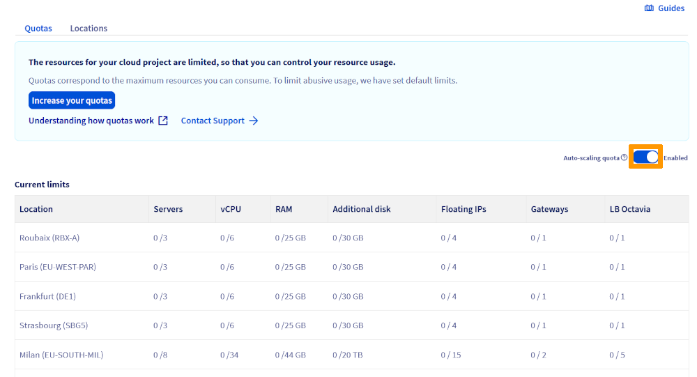
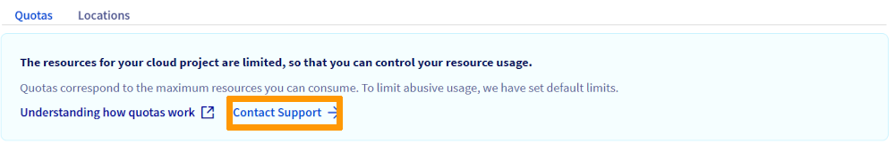
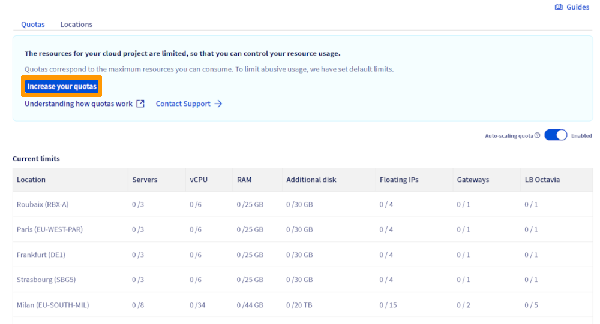
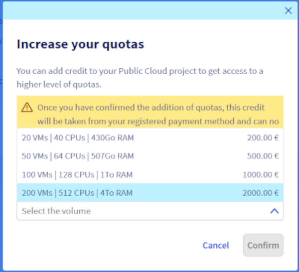

## Obiettivo

Per default, il numero di risorse (RAM, CPU, spazio disco, numero di istanze, ecc.) e di progetti che puoi creare è limitato per motivi di sicurezza.

Per creare di più, è necessario aumentare la quota disponibile.

**Questa guida ti mostra come richiedere e aumentare la quota Public Cloud dallo Spazio Cliente OVHcloud.**

## Prerequisiti

- [Disporre di una modalità di pagamento valida](/pages/account_and_service_management/managing_billing_payments_and_services/manage-payment-methods) nello Spazio Cliente OVHcloud.

## Procedura

<!-- CP-NAV-START:publiccloud-projects -->
---

### Accesso allo Spazio Cliente OVHcloud

- **Link diretto:** [Public Cloud Projects](/links/control-panel/publiccloud-projects)
- **Percorso di navigazione:** `Public Cloud`{.action} > Seleziona il tuo project

---
<!-- CP-NAV-END:publiccloud-projects -->

Nel menu a sinistra, fai clic su `Quota e Region`{.action} sotto **Impostazioni**.

{.thumbnail}

Questa pagina presenta un riepilogo delle quote attuali del tuo progetto per regione. Un avviso appare non appena una risorsa raggiunge l'80% della sua quota.

### Aumentare la quota di risorse

In base a criteri interni (anzianità, esistenza di fatture pagate, ecc.), puoi richiedere aumenti di quota per le risorse dei tuoi progetti Public Cloud direttamente dallo Spazio Cliente OVHcloud.

> [!primary]
>
> I nuovi utenti Public Cloud beneficiano di [200 € di credito offerto](/links/public-cloud/free-trial) attivato automaticamente alla creazione del progetto, valido per un mese. L'idoneità all'aumento della quota dipende da criteri quali l'anzianità dell'account e l'esistenza di fatture pagate. Gli utenti in periodo di prova possono quindi avere opzioni di aumento della quota limitate finché la loro prima fattura non è stata saldata.
>

È possibile aumentare la quota delle risorse manualmente o automaticamente.

#### Aumentare automaticamente la tua quota di risorse con la funzionalità "Quota autoscaling"

Questa opzione ti permette di richiedere un aumento automatico e progressivo della tua quota di risorse. La quota verrà regolata in base al tuo utilizzo effettivo **se superi il 60% della tua quota corrente per 30 giorni consecutivi**, nonché in base a un insieme di criteri interni e finanziari.

> [!primary]
>
> Questo processo non è adatto per aumenti rapidi della quota.
>

In alto a destra della pagina, l'opzione **Quota autoscaling** è disponibile:

- Per saperne di più su questa funzionalità, fai clic sul `?`{.action} accanto a questa opzione.
- Attiva l'opzione cliccando sul pulsante a destra di questa. Il suo stato passerà da *Disattivato* a *Attivo*.

{.thumbnail}

Una volta attivato, l'auto-scaling aumenta progressivamente la quota del tuo progetto in base ai tuoi reali bisogni.

#### Aumentare la tua quota di risorse manualmente

> [!primary]
>
> Se hai bisogno di aumentare la tua quota e il pulsante `Aumenta la quota disponibile`{.action} non è disponibile nel tuo Spazio Cliente, clicca sul pulsante `Contatta il supporto`{.action}.
>

{.thumbnail}

Questa procedura consente un aumento rapido e significativo delle tue quote (ad esempio: scalabilità rapida, istanze GPU, ecc.). Questo metodo si basa sull'acquisto immediato di un credito, dal quale tutte le spese cloud saranno automaticamente dedotte.

È possibile acquistare diversi importi di credito.

Clicca sul pulsante `Aumenta la quota disponibile`{.action}.

{.thumbnail}

In seguito, clicca sulla freccia a discesa accanto a `Seleziona il volume`{.action} per visualizzare l'elenco delle quote disponibili. In questa sezione viene inoltre indicato l'importo da pagare per poter beneficiare di tali risorse.

{.thumbnail}

La tabella seguente riporta le risorse ottenute per ciascuna quota:

|Quota|Istanze|CPU/Core|RAM (GB)|Dimensione dei volumi (TB)|Volumi (numero massimo)|Backup|Dimensione del backup (TB)|Floating IPs|Octavia Load Balancer|Gateway (Routers)|
|---|---|---|---|---|---|---|---|---|---|---|
|20 VMs|20|40|430|20|200|1200|120|30|10|4|
|50 VMs|50|64|507|20|500|3000|300|75|25|10|
|100 VMs|100|128|1015|40|1000|6000|600|300|50|10|
|200 VMs|200|512|4063|80|2000|12000|1200|600|50|50|

Una volta selezionato il tuo volume, fai clic su `Conferma`{.action}. Il pagamento verrà processato nel più breve tempo possibile.

> [!warning]
>
> **Qualsiasi aumento manuale della quota verrà fatturato immediatamente.**
>
> Dopo aver cliccato sul pulsante `Conferma`{.action}, l'ordine viene automaticamente creato e l'importo viene addebitato sul tuo metodo di pagamento predefinito.
>

Per una vista più dettagliata delle risorse, accedi all'[interfaccia Horizon](https://horizon.cloud.ovh.net/auth/login/). Una volta effettuato l'accesso, fai clic su `Progetto`{.action}, poi su `Panoramica`{.action}.

### Aumentare la quota dei progetti Public Cloud

Esistono due situazioni principali in cui potresti aver bisogno di un aggiustamento della quota:

1. **Numero massimo di progetti raggiunto**: se hai raggiunto il numero massimo di progetti Public Cloud autorizzati nel tuo Spazio Cliente e desideri crearne di nuovi, devi inviare una richiesta al nostro team di supporto.

2. **Altri tipi di richieste di quote**: per qualsiasi altra limitazione (CPU, RAM, storage, ecc.) o bisogno specifico riguardo ai tuoi progetti Public Cloud, puoi contattare il supporto per richiedere un aumento.

> [!primary]
>
> Le richieste di quota vengono elaborate manualmente dal nostro team. Il tempo di elaborazione può variare in base alla complessità della richiesta. Ti consigliamo di inviare la tua richiesta il prima possibile per evitare qualsiasi blocco nei tuoi progetti.

Per accelerare l'elaborazione, ti preghiamo di specificare nella tua richiesta:

- il tipo di quota da aumentare (numero di progetti, risorse, ecc.);
- l'uso previsto e la motivazione del bisogno;
- il periodo o la durata desiderata per l'aumento.

### Quote specifiche e risorse particolari

Per alcune risorse o servizi potrebbero essere applicate quote specifiche. Per ulteriori informazioni:

**Quota S3**1: consulta la documentazione ufficiale "[Object Storage - Limitazioni tecniche (EN)](/pages/storage_and_backup/object_storage/s3_limitations)".

**Quota Managed Kubernetes Service (MKS)**: consulta la documentazione ufficiale "[ETCD Quotas, usage, troubleshooting and error (EN)](/pages/public_cloud/containers_orchestration/managed_kubernetes/etcd-quota-error)".

## Per saperne di più

Contatta la nostra [Community di utenti](/links/community).

1: S3 is a trademark of Amazon Technologies, Inc. OVHcloud's service is not sponsored by, endorsed by, or otherwise affiliated with Amazon Technologies, Inc.
