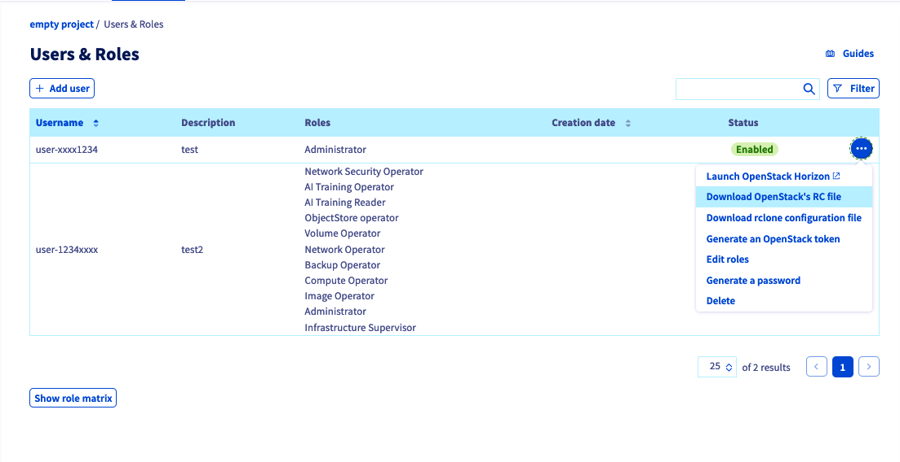

## Ziel

**In dieser Anleitung werden bewährte Verfahren zur Durchführung multipler OpenStack-Aktionen in kurzem Zeitraum beschrieben.**

> [!primary]
>
> Die in dieser Anleitung beschriebenen Schritte basieren auf Version 3.0 der Keystone-API.
>

### Definitionen

- **Endpoint**: HTTP-Adresse, die direkt auf die API eines Dienstes verweist. Zum Beispiel [https://auth.cloud.ovh.net/v3/](https://auth.cloud.ovh.net/v3/) für den Zugriffspunkt auf die Authentifizierung oder [https://image.compute.gra11.cloud.ovh.net/](https://image.compute.gra11.cloud.ovh.net/) für den Zugriffspunkt auf die Image-Verwaltung der Zone GRA11. 

- **Token**: Eine individuelle Zeichenkette, die zur Authentifizierung und den Zugriff auf Ressourcen verwendet wird. Ein Benutzer kann einen Token mithilfe der Login-Daten über die Authentifizierungsschnittstelle anfordern. Der Token wird generiert und ist 24 Stunden gültig.

- **OpenRC**: Um die Interaktion mit dem Identitätsdienst über den OpenStack-Client zu verbessern, unterstützt OpenStack einfache Umgebungsskripte, die auch als OpenRC-Dateien bezeichnet werden. Diese Dateien enthalten sowohl allgemeingültige als auch personalisierte Optionen.

### Struktur einer Anfrage

Die meisten an die OpenStack-API gesendeten Anfragen unterliegen einem Autorisierungsprozess, bei dem ein Token generiert und validiert wird.

Wenn Sie jedoch in kurzer Zeit zu viele Aktionen ausführen, können OpenStack-Aktionen aufgrund zu vieler API-Aufrufe Fehler produzieren. Die Obergrenze beträgt derzeit 60 Tokens pro Minute und Benutzer. Der Endpoint zur Authentifizierung wird beim Überschreiten dieses Limits Fehler vom Typ HTTP 429 zurückgeben.

Weitere Informationen finden Sie in der [OpenStack-API Dokumentation](http://developer.openstack.org/api-guide/quick-start/).

Diese Anleitung erklärt, wie Sie einen OpenStack-Token anfordern, für Aktionen verwenden und verwerfen.

## Voraussetzungen 

- [Vorbereitung der Umgebung für die Verwendung der OpenStack-API](/pages/public_cloud/public_cloud_cross_functional/prepare_the_environment_for_using_the_openstack_api).

<!-- CP-NAV-START:publiccloud-projects -->
---

### Zugriff auf das OVHcloud Kundencenter

- **Direkter Link:** [Public Cloud Projekte](/links/control-panel/publiccloud-projects)
- **Navigationspfad:** `Public Cloud`{.action} > Wählen Sie Ihr Projekt aus

---
<!-- CP-NAV-END:publiccloud-projects -->

> [!primary]
>
> Weitere Informationen zu diesem Tool finden Sie in der [OpenStack CLI Dokumentation](https://docs.openstack.org/python-openstackclient/latest/).

Sie können den Client über die Paketmanager `apt` (für Debian-basierte Distributionen) oder `yum` (für RHEL/CentOS-basierte Distributionen) installieren:

```bash
# Distributionen Debian  

sudo apt install python3-openstackclient

# Distributionen CentOS/RHEL

sudo yum install python3-openstackclient
```

Windows-Benutzer können dieser Anleitung folgen, um die Umgebungsvariablen zu exportieren: [OpenStack Umgebungsvariablen einrichten](/pages/public_cloud/public_cloud_cross_functional/loading_openstack_environment_variables).

## In der praktischen Anwendung

### Schritt 1: OpenRC-Datei herunterladen und sourcen

Klicken Sie auf `User und Rollen`{.action} im Bereich **Einstellungen** und dann auf `...`{.action} rechts neben Ihrem OpenStack-Benutzer.  
Laden Sie die OpenRC-Datei dieses Benutzers herunter und geben Sie die Region an, in der Sie Aktionen durchführen möchten.

{.thumbnail}

Öffnen Sie die OpenRC-Datei und fügen Sie diese Zeile ein:

```bash
OS_PASSWORD=<password>
```

Ersetzen Sie "<password>" mit dem Passwort-String Ihres OpenStack-Benutzers, der bei der Erstellung des Benutzers generiert wurde.

*Sourcen* Sie anschließend die Datei, die Sie zuvor heruntergeladen haben:

```bash
source openrc.sh
```

### Schritt 2: Ausgabe eines OpenStack-Tokens

> [!primary]
>
> Ein OpenStack-Token ist 24 Stunden nach Erstellung gültig. Für eine höhere Zuverlässigkeit können Sie beispielsweise alle 8 Stunden einen Token erstellen, um Aktionen mit einem abgelaufenen Token zu vermeiden.
>
> Für langfristige Aktionen wie Snapshots, Shelving von Instanzen, Erstellung von Images etc. fordern Sie vorzugsweise einen neuen Token an, statt die gewünschte Aktion direkt auszuführen.
>

Nach dem *Sourcen* Ihrer OpenRC-Datei führen Sie folgenden Befehl aus, um einen Token auszugeben:

```bash
openstack token issue
```

Dieser Befehl sollte eine ähnliche Ausgabe wie die folgende erzeugen:

```bash
+------------+----------------------------------------------------------------+
| Field      | Value                                                          |
+------------+----------------------------------------------------------------+
| expires    | 2023-04-06T08:33:15+0000                                       |
| id         | gAAAAA[...]                                                    |
| project_id | 8a7[...]                                                       |
| user_id    | f99[...]                                                       |
+------------+----------------------------------------------------------------+
```

Sie können nun die ID des zuvor ausgesendeten Tokens exportieren:

```bash
export OS_TOKEN = gAAAAA[...]
```

Mit folgendem Befehl können Sie den Token auch direkt exportieren:

```bash
export OS_TOKEN=$(openstack token issue -f value -c id)
```

### Schritt 3: Unnötige Variable löschen

Um den Token für Aktionen mit Ihrem Benutzer zu verwenden, muss die Variable `OS_USER_DOMAIN_NAME` entfernt werden.

Führen Sie hierzu folgenden Befehl aus:

```bash
unset OS_USER_DOMAIN_NAME
```

### Schritt 4: Token verwenden, um Befehle auszuführen

Mit dem Token können Sie nun klassische OpenStack-Aufrufe verwenden, um Ihre Infrastruktur zu verwalten.

```bash
openstack --os-auth-type token <command>
```

Beispiel: 

```bash
openstack --os-auth-type token image list
```

### Schritt 5: OpenStack-Token zurückziehen

Wenn Sie alle Aktionen durchgeführt haben, können Sie den OpenStack-Token verwerfen, um zu vermeiden, dass er für andere Aktionen verwendet wird.

Verwenden Sie hierzu folgenden Befehl:

```bash
openstack --os-auth-type token token revoke <token_id>

# oder

openstack --os-auth-type token token revoke $OS_TOKEN
```

## Weiterführende Informationen

Treten Sie unserer [User Community](/links/community) bei.