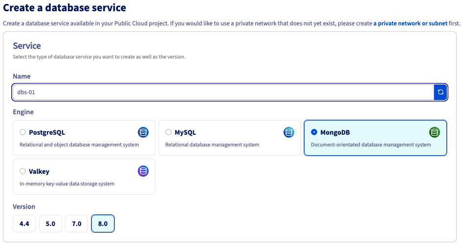
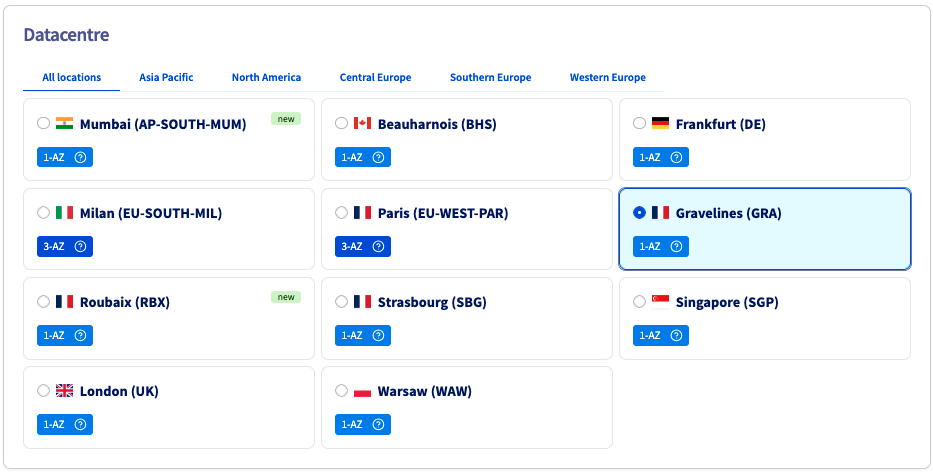
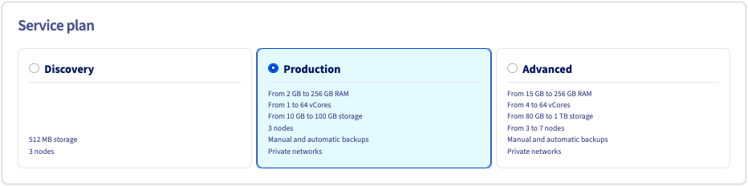
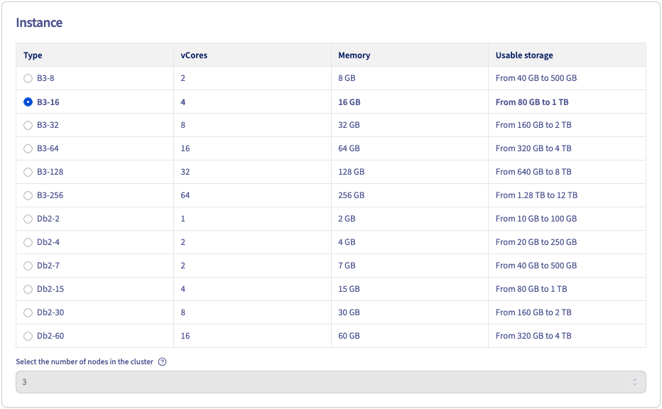
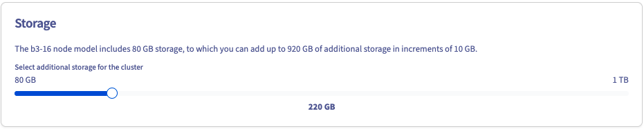
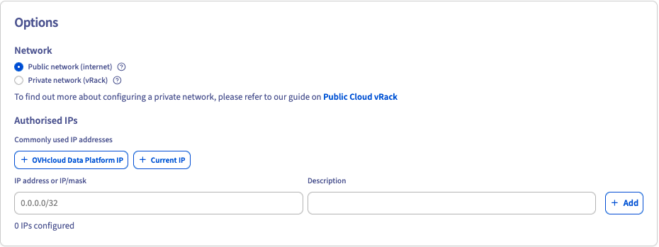
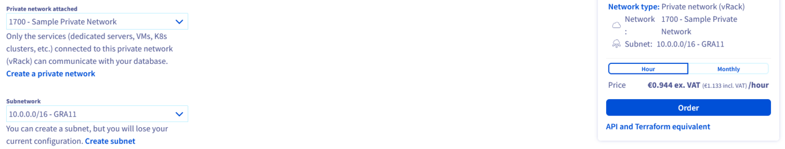
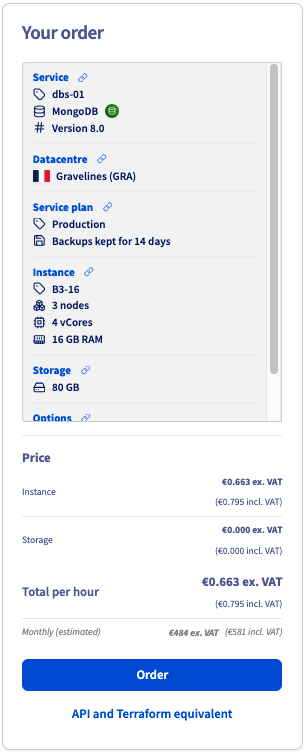

## Objective

OVHcloud Public Cloud managed databases let you focus on building and deploying cloud applications while OVHcloud handles the database infrastructure and maintenance.

**This guide explains how to order a Public Cloud managed database service via the OVHcloud Control Panel, API, CLI, or Terraform.**

## Requirements

- A [Public Cloud project](/links/public-cloud/public-cloud) in your OVHcloud account
- Access to the [OVHcloud API](/links/api) *(API and Terraform methods — create your credentials by consulting the [First steps with the OVHcloud API](/pages/manage_and_operate/api/first-steps) guide)*
- [Terraform](https://www.terraform.io/) installed *(Terraform method only — tested with version v1.14.6)*

<!-- CP-NAV-START:publiccloud-projects -->
---

### OVHcloud Control Panel Access

- **Direct link:** [Public Cloud Projects](/links/control-panel/publiccloud-projects)
- **Navigation path:** `Public Cloud`{.action} > Select your project

---
<!-- CP-NAV-END:publiccloud-projects -->

## Instructions

> [!tabs]
> Via the OVHcloud Control Panel
>> <!-- CP-STEPS-START:order-database-instance -->
>> <iframe class="video" width="560" height="315" src="https://www.youtube-nocookie.com/embed/y8Px-NhCRAE?si=cIXix30nL94aFeBi" title="YouTube video player" frameborder="0" allow="accelerometer; autoplay; clipboard-write; encrypted-media; gyroscope; picture-in-picture; web-share" referrerpolicy="strict-origin-when-cross-origin" allowfullscreen></iframe>
>>
>> Click `Databases`{.action} in the left-hand navigation bar under **Databases & Analytics**. The adjacent `Analytics`{.action} entry provides access to `Kafka`, `Kafka Connect`, `Kafka MirrorMaker`, `Dashboards`, and `OpenSearch`.
>>
>> Click `Create your managed database`{.action} (or `Create a service`{.action} if your project already contains databases).
>>
>> **Step 1: Select your engine and version**
>>
>> Optionally rename your service (auto-generated by default), then select the engine and version.
>>
>> {.thumbnail}
>>
>> **Step 2: Select a datacentre**
>>
>> Choose the geographical region of the data centre in which your database will be hosted.
>>
>> {.thumbnail}
>>
>> **Step 3: Select a service plan**
>>
>> Choose a service plan. You can upgrade it after creation.
>>
>> See the [capabilities page](/products/public-cloud-databases) of your selected database type for plan property details.
>>
>> {.thumbnail}
>>
>> **Step 4: Select your instance**
>>
>> Select the instance. The number of nodes is set by the solution selected above, and cannot be modified in this case.
>>
>> {.thumbnail}
>>
>> See the [capabilities page](/products/public-cloud-databases) of your selected database type for hardware and configuration details.
>>
>> Take note of the pricing information.
>>
>> **Step 5: Sizing**
>>
>> Additional storage can be ordered and, depending on the engine, the number of nodes in your cluster can be adjusted.
>>
>> {.thumbnail}
>>
>> **Step 6: Configure your options**
>>
>> Configure the network and authorised IPs.
>>
>> {.thumbnail}
>>
>> *Connecting a private network (optional)*
>>
>> {.thumbnail}
>>
>> If you already have a private subnet available, select **Private network (vRack)** and choose it from the drop-down menu. This option may not be available for the selected service type.
>>
>> You can be redirected to create a private network or subnet via the corresponding links. In that case, you will need to restart the database order.
>>
>> For detailed instructions, see the [Configuring vRack for Public Cloud](/pages/public_cloud/public_cloud_network_services/getting-started-07-creating-vrack) guide.
>>
>> *Authorised IPs*
>>
>> Add the IP addresses or address ranges allowed to connect to your service.
>>
>> > [!primary]
>> > For security, the default network configuration blocks all incoming connections. Authorise a suitable IP address to access your database.
>>
>> **Step 7: Summary and confirmation**
>>
>> The right-hand panel displays a live summary of your order that updates as you make selections. Review it, then click `Order`{.action} to confirm.
>>
>> To view the equivalent API or Terraform call before ordering, click `API and Terraform equivalent`{.action}.
>>
>> {.thumbnail}
>>
>> Your database service deploys within a few minutes. Messages in the OVHcloud Control Panel notify you when the database is ready to use.
>>
>> To configure your service after installation, see the *Configure your instance to accept incoming connections* guide for your database type, [available in our catalog](/products/public-cloud-databases).
>>
>> Configuration options vary by database type. Examples are available in the [public-cloud-databases-examples](https://github.com/ovh/public-cloud-databases-examples) repository.
>> <!-- CP-STEPS-END:order-database-instance -->
> Via the OVHcloud API
>> **Step 1: Gather the set of required parameters**
>>
>> To create a database service, specify at minimum:
>>
>> - an _engine_, and its _version_ (e.g. `MongoDB 8.0`)
>> - the _plan_ (e.g. `production`)
>> - the _nodes_ of the cluster (e.g. 3 nodes with 4 cores, 15 GiB memory, 100 GiB disk)
>>
>> *List the capabilities*
>>
>> The _capabilities_ endpoint lists the allowed engine, plan, and flavor values.
>>
>> > [!api]
>> > @api {v1} /cloud GET /cloud/project/{serviceName}/database/capabilities
>>
>> The call returns an object listing the allowed engines (with versions), plans, and flavors.
>>
>> *Get the availability*
>>
>> The _availability_ endpoint lists the valid parameter combinations. Each entry lists an _engine_, _version_, _plan_, _flavor_, _region_, public/private networking support, and min/max node count. Choose the combination that best fits your needs.
>>
>> > [!api]
>> > @api {v1} /cloud GET /cloud/project/{serviceName}/database/availability
>>
>> **Step 2: Create a MongoDB database service**
>>
>> > [!warning]
>> > Creating a cluster incurs charges.
>>
>> > [!api]
>> > @api {v1} /cloud POST /cloud/project/{serviceName}/database/mongodb
>>
>> - **description**: a human-readable description for the service.
>> - **plan**: the desired plan.
>> - **version**: the MongoDB version.
>> - **nodesPattern**: specify the _flavor_, _region_, and number of nodes.
>> - **nodeslist**: leave undefined — use **nodesPattern** instead for same-region, same-flavor clusters.
>> - **ipRestrictions**: IP address blocks allowed to connect.
>>
>> > [!primary]
>> > For security, the default network configuration blocks all incoming connections. Authorise a suitable IP address to access your database.
>>
>> For private networking, also specify **networkId** (vRack ID) and **subnetId** (vRack subnet ID).
>>
>> The call returns the cluster object. Its **status** is `CREATING`. Note the **id** for the next step.
>>
>> **Step 3: Wait for your database service to be ready**
>>
>> The cluster takes a few minutes to become usable. Check its status using:
>>
>> > [!api]
>> > @api {v1} /cloud GET /cloud/project/{serviceName}/database/mongodb/{clusterId}
>>
>> Its **status** transitions to `READY` when the cluster is available.
>>
>> **Step 4: Reset the primary user password**
>>
>> List your cluster's users to get the admin user ID:
>>
>> > [!api]
>> > @api {v1} /cloud GET /cloud/project/{serviceName}/database/mongodb/{clusterId}/user
>>
>> Reset the admin user's password:
>>
>> > [!api]
>> > @api {v1} /cloud POST /cloud/project/{serviceName}/database/mongodb/{clusterId}/user/{userId}/credentials/reset
>>
>> Note the new password to connect to the cluster.
>>
>> > [!warning]
>> > This password will not be available later: OVHcloud does not store user passwords.
>>
>> **Step 5: Start using the cluster**
>>
>> The cluster connection information is available in your OVHcloud Control Panel. You can now use the cluster.
>>
> Via the OVHcloud CLI
>> > [!primary]
>> > All commands require either the `--cloud-project <projectId>` flag or the `OVH_CLOUD_PROJECT_SERVICE` environment variable, set to your Public Cloud project ID.
>>
>> **Step 1: Gather the set of required parameters**
>>
>> List available engines, plans, and node flavors:
>>
>> ```bash
>> ovhcloud cloud reference managed-database list-engines --cloud-project <projectId>
>> ovhcloud cloud reference managed-database list-plans --cloud-project <projectId>
>> ovhcloud cloud reference managed-database list-node-flavors --cloud-project <projectId>
>> ```
>>
>> **Step 2: Create a MongoDB database service**
>>
>> > [!warning]
>> > Creating a cluster incurs charges.
>>
>> ```bash
>> ovhcloud cloud managed-database create \
>>   --cloud-project <projectId> \
>>   --engine mongodb \
>>   --version 8.0 \
>>   --plan production \
>>   --nodes-pattern.flavor db1-4 \
>>   --nodes-pattern.region GRA \
>>   --nodes-pattern.number 3 \
>>   --description "My MongoDB cluster" \
>>   --ip-restrictions "203.0.113.0/24"
>> ```
>>
>> > [!primary]
>> > For security, the default network configuration blocks all incoming connections. Authorise a suitable IP address to access your database.
>>
>> For private networking, add `--network-id <networkId>` and `--subnet-id <subnetId>`.
>>
>> **Step 3: Wait for your database service to be ready**
>>
>> ```bash
>> ovhcloud cloud managed-database get <clusterId> --cloud-project <projectId>
>> ```
>>
>> Its **status** transitions to `READY` when the cluster is available.
>>
>> **Step 4: Reset the primary user password**
>>
>> ```bash
>> # List users and retrieve the admin user ID
>> ovhcloud cloud managed-database user list <clusterId> --cloud-project <projectId>
>>
>> # Reset the admin user password
>> ovhcloud cloud managed-database user credentials-reset <clusterId> <userId> --cloud-project <projectId>
>> ```
>>
>> > [!warning]
>> > This password will not be available later: OVHcloud does not store user passwords.
>>
>> **Step 5: Start using the cluster**
>>
>> The cluster connection information is available in your OVHcloud Control Panel. You can now use the cluster.
>>
> Via Terraform
>> **Step 1: Gather the OVHcloud required parameters**
>>
>> The OVHcloud Terraform provider requires the following credentials:
>>
>> - an `application_key`
>> - an `application_secret`
>> - a `consumer_key`
>>
>> To retrieve them, follow the [First steps with the OVHcloud APIs](/pages/manage_and_operate/api/first-steps) guide. Generate credentials with the following rights:
>>
>> - **GET** `/cloud/project/*/database/*`
>> - **POST** `/cloud/project/*/database/*`
>> - **PUT** `/cloud/project/*/database/*`
>> - **DELETE** `/cloud/project/*/database/*`
>>
>> - [Generate OVHcloud API tokens (EU)](https://auth.eu.ovhcloud.com/api/createToken?GET=/cloud/project/*/database/*&POST=/cloud/project/*/database/*&PUT=/cloud/project/*/database/*&DELETE=/cloud/project/*/database/*)
>> - [Generate OVHcloud API tokens (CA)](https://auth.ca.ovhcloud.com/api/createToken?GET=/cloud/project/*/database/*&POST=/cloud/project/*/database/*&PUT=/cloud/project/*/database/*&DELETE=/cloud/project/*/database/*)
>>
>> The `service_name` is the ID of your Public Cloud project. Retrieve it via the `Copy to clipboard`{.action} button in the Public Cloud section.
>>
>> **Step 2: Gather the set of required parameters**
>>
>> To create a new MongoDB cluster, specify at least:
>>
>> - the _engine_ (e.g. `mongodb`)
>> - the _version_ (e.g. `8.2`)
>> - the _region_ (e.g. `EU-WEST-PAR`)
>> - the _plan_ (e.g. `production`)
>> - the _flavor_ (e.g. `b3-8`)
>>
>> **Step 3: Create Terraform files**
>>
>> Create a `main.tf` file:
>>
>> ```terraform
>> terraform {
>>   required_providers {
>>     ovh = {
>>       source  = "ovh/ovh"
>>       version = ">= 2.11.0"
>>     }
>>   }
>> }
>>
>> provider "ovh" {
>>   endpoint           = var.ovh.endpoint
>>   application_key    = var.ovh.application_key
>>   application_secret = var.ovh.application_secret
>>   consumer_key       = var.ovh.consumer_key
>> }
>>
>> resource "ovh_cloud_project_database" "service" {
>>   service_name = var.product.project_id
>>   description  = var.product.name
>>   engine       = var.product.engine
>>   version      = var.product.version
>>   plan         = var.product.plan
>>   nodes {
>>     region = var.product.region
>>   }
>>   nodes {
>>     region = var.product.region
>>   }
>>   nodes {
>>     region = var.product.region
>>   }
>>   flavor = var.product.flavor
>>   ip_restrictions {
>>     ip = var.product.ip
>>   }
>> }
>>
>> resource "ovh_cloud_project_database_mongodb_user" "dbuser" {
>>   service_name = ovh_cloud_project_database.service.service_name
>>   cluster_id   = ovh_cloud_project_database.service.id
>>   name         = var.access.name
>> }
>> ```
>>
>> Create a `variables.tf` file:
>>
>> ```terraform
>> variable "ovh" {
>>   type = map(string)
>>   default = {
>>     endpoint           = "ovh-eu"
>>     application_key    = ""
>>     application_secret = ""
>>     consumer_key       = ""
>>   }
>> }
>>
>> variable "product" {
>>   type = map(string)
>>   default = {
>>     project_id = ""
>>     name       = ""
>>     engine     = ""
>>     region     = "EU-WEST-PAR"
>>     plan       = "production"
>>     flavor     = "b3-8"
>>     version    = ""
>>     ip         = "0.0.0.0/32"
>>   }
>> }
>>
>> variable "access" {
>>   type = map(string)
>>   default = {
>>     name = "johndoe"
>>   }
>> }
>> ```
>>
>> Use `ovh-eu` for the OVHcloud Europe API, or `ovh-ca` for North America.
>>
>> Create a `secrets.tfvars` file with your actual values:
>>
>> ```terraform
>> ovh = {
>>   endpoint           = "ovh-eu"
>>   application_key    = "<application_key>"
>>   application_secret = "<application_secret>"
>>   consumer_key       = "<consumer_key>"
>> }
>>
>> product = {
>>   project_id = "<service_name>"
>>   name       = "mongodb-terraform"
>>   engine     = "mongodb"
>>   region     = "EU-WEST-PAR"
>>   plan       = "production"
>>   flavor     = "b3-8"
>>   version    = "8.2"
>>   ip         = "<ip_range>"
>> }
>>
>> access = {
>>   name = "johndoe"
>> }
>> ```
>>
>> > [!primary]
>> > Replace `<service_name>`, `<application_key>`, `<application_secret>`, `<consumer_key>`, and `<ip_range>` with your actual values.
>>
>> Create an `outputs.tf` file:
>>
>> ```terraform
>> output "cluster_uri" {
>>   value = ovh_cloud_project_database.service.endpoints.0.uri
>> }
>>
>> output "user_name" {
>>   value = ovh_cloud_project_database_mongodb_user.dbuser.name
>> }
>>
>> output "user_password" {
>>   value     = ovh_cloud_project_database_mongodb_user.dbuser.password
>>   sensitive = true
>> }
>> ```
>>
>> **Step 4: Run**
>>
>> ```bash
>> terraform init
>> terraform plan -var-file=secrets.tfvars
>> terraform apply -var-file=secrets.tfvars -auto-approve
>> ```
>>
>> Export the credentials and URI:
>>
>> ```bash
>> export PASSWORD=$(terraform output -raw user_password)
>> export USER=$(terraform output -raw user_name)
>> export URI=$(terraform output -raw cluster_uri)
>> ```
>>
>> Your MongoDB cluster is now ready.
>>
>> Examples for other engines (MySQL, PostgreSQL) are available in the [public-cloud-databases-examples](https://github.com/ovh/public-cloud-databases-examples) repository.

## Go further

[MongoDB capabilities](/pages/public_cloud/public_cloud_databases/mongodb_01_concept_capabilities)

[Managing a MongoDB service from the OVHcloud Control Panel](/pages/public_cloud/public_cloud_databases/mongodb_02_manage_control_panel)

[Configuring vRack for Public Cloud](/pages/public_cloud/public_cloud_network_services/getting-started-07-creating-vrack)

Visit our [dedicated Discord channel](https://discord.gg/ovhcloud) to ask questions, provide feedback, and interact directly with the team that builds our databases services.

If you need training or technical assistance to implement our solutions, contact your sales representative or our [Professional Services experts](/links/professional-services) for a quote and a custom analysis of your project.

Join our [community of users](/links/community).
