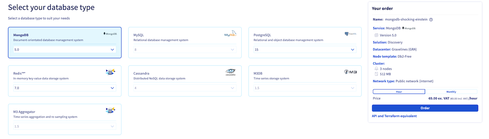
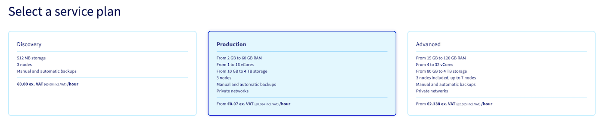
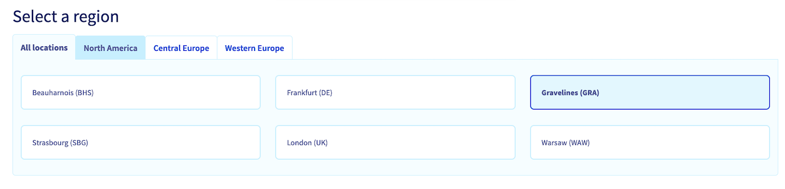
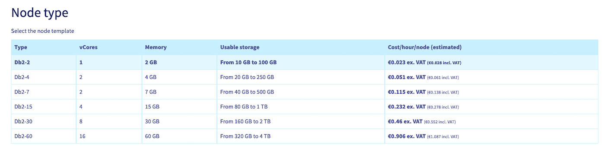
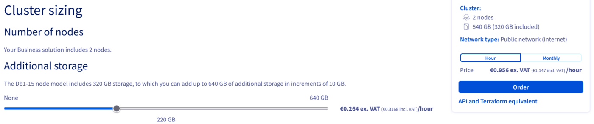
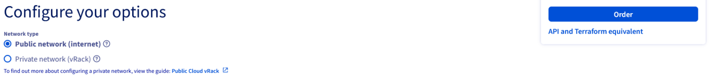
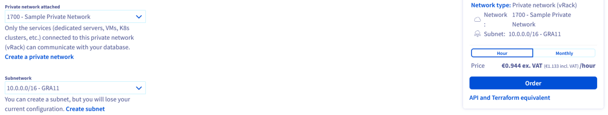
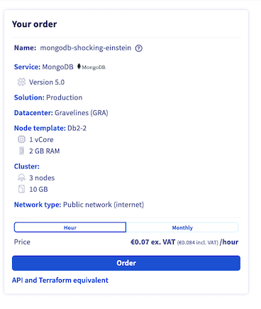

## Objective

OVHcloud Public Cloud managed databases allow you to focus on building and deploying cloud applications while OVHcloud takes care of the database infrastructure and maintenance.

**This guide explains how to order a Public Cloud managed database service using the OVHcloud Control Panel, the OVHcloud API, the OVHcloud CLI, or Terraform.**

## Requirements

- A [Public Cloud project](/links/public-cloud/public-cloud) in your OVHcloud account
- Access to the [OVHcloud API](/links/api) *(API and Terraform methods — create your credentials by consulting [this guide](/pages/manage_and_operate/api/first-steps))*
- [Terraform](https://www.terraform.io/) installed *(Terraform method only — tested with version v1.14.6)*

<!-- CP-NAV-START:publiccloud-projects -->
---

### OVHcloud Control Panel Access

- **Direct link:** [Public Cloud Projects](/links/control-panel/publiccloud-projects)
- **Navigation path:** `Public Cloud`{.action} > Select your project

---
<!-- CP-NAV-END:publiccloud-projects -->

## Instructions

> [!tabs]
> Via the OVHcloud Control Panel
>> <iframe class="video" width="560" height="315" src="https://www.youtube-nocookie.com/embed/y8Px-NhCRAE?si=cIXix30nL94aFeBi" title="YouTube video player" frameborder="0" allow="accelerometer; autoplay; clipboard-write; encrypted-media; gyroscope; picture-in-picture; web-share" referrerpolicy="strict-origin-when-cross-origin" allowfullscreen></iframe>
>>
>> Click on `Databases`{.action} in the left-hand navigation bar under **Databases & Analytics**.
>>
>> > [!primary]
>> >
>> > - Clicking on `Data Streaming`{.action} will give you access to `Kafka`, `Kafka Connect` and `KafkaMirrorMaker` services.
>> > - Clicking on `Data Analysis` will give you access to `Dashboards` and `OpenSearch` services.
>> >
>>
>> Click on the button `Create a database instance`{.action}. (`Create a service`{.action} if your project already contains databases.)
>>
>> **Step 1: Select your database type**
>>
>> Click on the type of database you want to use and then select the version to install from the respective drop-down menu.
>>
>> {.thumbnail}
>>
>> **Step 2: Select a Plan**
>>
>> Choose an appropriate service plan. You will be able to upgrade the plan after creation.
>>
>> Please visit the [capabilities page](/products/public-cloud-databases) of your selected database type for detailed information on each plan's properties.
>>
>> {.thumbnail}
>>
>> **Step 3: Select a location**
>>
>> Choose the geographical region of the data centre in which your database will be hosted.
>>
>> {.thumbnail}
>>
>> **Step 4: Configure database nodes**
>>
>> You can choose the node template in this step.
>>
>> {.thumbnail}
>>
>> Please visit the [capabilities page](/products/public-cloud-databases) of your selected database type for detailed information on the hardware resources and other properties of the database installation.
>>
>> Take note of the pricing information.
>>
>> **Step 5: Sizing**
>>
>> Additional storage can be ordered and, depending on the engine, the number of nodes in your cluster can be adjusted:
>>
>> {.thumbnail}
>>
>> **Step 6: Configure your options**
>>
>> Define your network configuration:
>>
>> {.thumbnail}
>>
>> *Connecting a private network (optional)*
>>
>> {.thumbnail}
>>
>> If you already have a private subnet available, check the box **Private** and select it from the drop-down menu. Note that this option might not be available for the selected service type.
>>
>> You can be forwarded to create a private network or subnet by clicking on the respective links. You will have to start the database order process anew in that case.
>>
>> Please follow [this guide](/pages/public_cloud/public_cloud_network_services/getting-started-07-creating-vrack) for detailed instructions.
>>
>> **Step 7: Summary and confirmation**
>>
>> The final section will display a summary of your order as well as the API equivalent of creating this database instance with the [OVHcloud API](/pages/manage_and_operate/api/first-steps).
>>
>> {.thumbnail}
>>
>> Within a few minutes your new database service will be deployed. Messages in the OVHcloud Control Panel will inform you when the database is ready to use.
>>
>> Continue with the *Configure your instance to accept incoming connections* guide of your selected database type available [here](/products/public-cloud-databases) to configure your service after installation.
>>
>> Note that the configuration options might be different, depending on the database type. You will find examples on this repository: <https://github.com/ovh/public-cloud-databases-examples>.
> Via the OVHcloud API
>> **Step 1: Gather the set of required parameters**
>>
>> In order to create a database service, you will need to specify at minimum:
>>
>> - an _engine_, and its _version_ (e.g. "MongoDB 8.0")
>> - the _plan_ (e.g. "production")
>> - the _nodes_ of the cluster (e.g. "3 nodes with 4 cores, 15 GiB memory, 100 GiB disk")
>>
>> *List the capabilities*
>>
>> The _capabilities_ endpoint lists the allowed values for the engine, plan, and flavor the service knows about.
>>
>> > [!api]
>> > @api {v1} /cloud GET /cloud/project/{serviceName}/database/capabilities
>>
>> The call returns an object listing allowed values for the various engines (with versions), the plans, and the flavors.
>>
>> *Get the availability*
>>
>> The _availability_ endpoint lists the valid parameter combinations. Each entry lists an _engine_, _version_, _plan_, _flavor_, _region_, public/private networking support, and min/max node count. Choose the combination that best fits your needs.
>>
>> > [!api]
>> > @api {v1} /cloud GET /cloud/project/{serviceName}/database/availability
>>
>> **Step 2: Create a MongoDB database service**
>>
>> > [!warning]
>> > By creating a cluster, you will be billed accordingly.
>>
>> > [!api]
>> > @api {v1} /cloud POST /cloud/project/{serviceName}/database/mongodb
>>
>> - **description**: A human-readable description for the service
>> - **plan**: the desired plan
>> - **version**: the MongoDB version
>> - **nodesPattern**: specify the _flavor_, _region_, and number of nodes
>> - **nodeslist**: Leave undefined — use **nodesPattern** instead for same-region, same-flavor clusters
>> - **ipRestrictions**: IP address blocks allowed to connect
>>
>> > [!primary]
>> > For security reasons, the default network configuration does not allow any incoming connections. You must authorize a suitable IP address to successfully access your database.
>>
>> For private networking, also specify **networkId** (vRack ID) and **subnetId** (vRack subnet ID).
>>
>> The call returns the cluster object. Its **status** will be `CREATING`. Note the **id** for the next step.
>>
>> **Step 3: Wait for your database service to be ready**
>>
>> The cluster will take a few minutes to become fully usable. Check its status using:
>>
>> > [!api]
>> > @api {v1} /cloud GET /cloud/project/{serviceName}/database/mongodb/{clusterId}
>>
>> Its **status** property will transition to `READY` when the cluster becomes available.
>>
>> **Step 4: Reset the primary user password**
>>
>> List your cluster's users to get the admin user ID:
>>
>> > [!api]
>> > @api {v1} /cloud GET /cloud/project/{serviceName}/database/mongodb/{clusterId}/user
>>
>> Reset the admin user's password:
>>
>> > [!api]
>> > @api {v1} /cloud POST /cloud/project/{serviceName}/database/mongodb/{clusterId}/user/{userId}/credentials/reset
>>
>> Note the new password to connect to the cluster.
>>
>> > [!warning]
>> > That password won't ever be available later on: OVHcloud never stores users' passwords.
>>
>> **Step 5: Start using the cluster**
>>
>> You'll find the cluster connection information in your OVHcloud Control Panel; you can now start using the cluster!
>>
> Via the OVHcloud CLI
>> > [!primary]
>> > All commands require the `--cloud-project <projectId>` flag, or the `OVH_CLOUD_PROJECT_SERVICE` environment variable set to your Public Cloud project ID.
>>
>> **Step 1: Gather the set of required parameters**
>>
>> List available engines, plans, and node flavors:
>>
>> ```bash
>> ovhcloud cloud reference managed-database list-engines --cloud-project <projectId>
>> ovhcloud cloud reference managed-database list-plans --cloud-project <projectId>
>> ovhcloud cloud reference managed-database list-node-flavors --cloud-project <projectId>
>> ```
>>
>> **Step 2: Create a MongoDB database service**
>>
>> > [!warning]
>> > By creating a cluster, you will be billed accordingly.
>>
>> ```bash
>> ovhcloud cloud managed-database create \
>>   --cloud-project <projectId> \
>>   --engine mongodb \
>>   --version 8.0 \
>>   --plan production \
>>   --nodes-pattern.flavor db1-4 \
>>   --nodes-pattern.region GRA \
>>   --nodes-pattern.number 3 \
>>   --description "My MongoDB cluster" \
>>   --ip-restrictions "203.0.113.0/24"
>> ```
>>
>> > [!primary]
>> > For security reasons, the default network configuration does not allow any incoming connections. You must authorize a suitable IP address to successfully access your database.
>>
>> For private networking, add `--network-id <networkId>` and `--subnet-id <subnetId>`.
>>
>> **Step 3: Wait for your database service to be ready**
>>
>> ```bash
>> ovhcloud cloud managed-database get <clusterId> --cloud-project <projectId>
>> ```
>>
>> Its **status** property will transition to `READY` when the cluster becomes available.
>>
>> **Step 4: Reset the primary user password**
>>
>> ```bash
>> # List users and retrieve the admin user ID
>> ovhcloud cloud managed-database user list <clusterId> --cloud-project <projectId>
>>
>> # Reset the admin user password
>> ovhcloud cloud managed-database user credentials-reset <clusterId> <userId> --cloud-project <projectId>
>> ```
>>
>> > [!warning]
>> > That password won't ever be available later on: OVHcloud never stores users' passwords.
>>
>> **Step 5: Start using the cluster**
>>
>> You'll find the cluster connection information in your OVHcloud Control Panel; you can now start using the cluster!
>>
> Via Terraform
>> **Step 1: Gather the OVHcloud required parameters**
>>
>> The "OVH provider" requires the following credentials:
>>
>> - an `application_key`
>> - an `application_secret`
>> - a `consumer_key`
>>
>> To retrieve them, follow the [First steps with the OVHcloud APIs](/pages/manage_and_operate/api/first-steps) tutorial. Generate credentials with the following rights:
>>
>> - **GET** `/cloud/project/*/database/*`
>> - **POST** `/cloud/project/*/database/*`
>> - **PUT** `/cloud/project/*/database/*`
>> - **DELETE** `/cloud/project/*/database/*`
>>
>> - [Generate OVHcloud API tokens (EU)](https://auth.eu.ovhcloud.com/api/createToken?GET=/cloud/project/*/database/*&POST=/cloud/project/*/database/*&PUT=/cloud/project/*/database/*&DELETE=/cloud/project/*/database/*)
>> - [Generate OVHcloud API tokens (CA)](https://ca.api.ovh.com/createToken?GET=/cloud/project/*/database/*&POST=/cloud/project/*/database/*&PUT=/cloud/project/*/database/*&DELETE=/cloud/project/*/database/*)
>>
>> The `service_name` is the ID of your Public Cloud project. Retrieve it using the `Copy to clipboard`{.action} button in the Public Cloud section.
>>
>> **Step 2: Gather the set of required parameters**
>>
>> To create a new MongoDB cluster, specify at least:
>>
>> - the _engine_ (e.g. "mongodb")
>> - the _version_ (e.g. "8.2")
>> - the _region_ (e.g. "EU-WEST-PAR")
>> - the _plan_ (e.g. "production")
>> - the _flavor_ (e.g. "b3-8")
>>
>> **Step 3: Create Terraform files**
>>
>> Create a `main.tf` file:
>>
>> ```bash
>> terraform {
>>   required_providers {
>>     ovh = {
>>       source  = "ovh/ovh"
>>       version = ">= 2.11.0"
>>     }
>>   }
>> }
>>
>> provider "ovh" {
>>   endpoint           = var.ovh.endpoint
>>   application_key    = var.ovh.application_key
>>   application_secret = var.ovh.application_secret
>>   consumer_key       = var.ovh.consumer_key
>> }
>>
>> resource "ovh_cloud_project_database" "service" {
>>   service_name = var.product.project_id
>>   description  = var.product.name
>>   engine       = var.product.engine
>>   version      = var.product.version
>>   plan         = var.product.plan
>>   nodes {
>>     region = var.product.region
>>   }
>>   nodes {
>>     region = var.product.region
>>   }
>>   nodes {
>>     region = var.product.region
>>   }
>>   flavor = var.product.flavor
>>   ip_restrictions {
>>     ip = var.product.ip
>>   }
>> }
>>
>> resource "ovh_cloud_project_database_mongodb_user" "dbuser" {
>>   service_name = ovh_cloud_project_database.service.service_name
>>   cluster_id   = ovh_cloud_project_database.service.id
>>   name         = var.access.name
>> }
>> ```
>>
>> Create a `variables.tf` file:
>>
>> ```bash
>> variable "ovh" {
>>   type = map(string)
>>   default = {
>>     endpoint           = "ovh-eu"
>>     application_key    = ""
>>     application_secret = ""
>>     consumer_key       = ""
>>   }
>> }
>>
>> variable "product" {
>>   type = map(string)
>>   default = {
>>     project_id = ""
>>     name       = ""
>>     engine     = ""
>>     region     = "EU-WEST-PAR"
>>     plan       = "production"
>>     flavor     = "b3-8"
>>     version    = ""
>>     ip         = "0.0.0.0/32"
>>   }
>> }
>>
>> variable "access" {
>>   type = map(string)
>>   default = {
>>     name = "johndoe"
>>   }
>> }
>> ```
>>
>> Use `ovh-eu` for the OVHcloud Europe API, or `ovh-ca` for North-America.
>>
>> Create a `secrets.tfvars` file with your actual values:
>>
>> ```bash
>> ovh = {
>>   endpoint           = "ovh-eu"
>>   application_key    = "<application_key>"
>>   application_secret = "<application_secret>"
>>   consumer_key       = "<consumer_key>"
>> }
>>
>> product = {
>>   project_id = "<service_name>"
>>   name       = "mongodb-terraform"
>>   engine     = "mongodb"
>>   region     = "EU-WEST-PAR"
>>   plan       = "production"
>>   flavor     = "b3-8"
>>   version    = "8.2"
>>   ip         = "<ip_range>"
>> }
>>
>> access = {
>>   name = "johndoe"
>> }
>> ```
>>
>> > [!primary]
>> > Replace `<service_name>`, `<application_key>`, `<application_secret>`, `<consumer_key>`, and `<ip_range>` with the real values.
>>
>> Create an `outputs.tf` file:
>>
>> ```bash
>> output "cluster_uri" {
>>   value = ovh_cloud_project_database.service.endpoints.0.uri
>> }
>>
>> output "user_name" {
>>   value = ovh_cloud_project_database_mongodb_user.dbuser.name
>> }
>>
>> output "user_password" {
>>   value     = ovh_cloud_project_database_mongodb_user.dbuser.password
>>   sensitive = true
>> }
>> ```
>>
>> **Step 4: Run**
>>
>> ```bash
>> terraform init
>> terraform plan -var-file=secrets.tfvars
>> terraform apply -var-file=secrets.tfvars -auto-approve
>> ```
>>
>> Export the credentials and URI:
>>
>> ```bash
>> export PASSWORD=$(terraform output -raw user_password)
>> export USER=$(terraform output -raw user_name)
>> export URI=$(terraform output -raw cluster_uri)
>> ```
>>
>> The MongoDB cluster is now created.
>>
>> Examples for other engines (MySQL, PostgreSQL) are available in the [public-cloud-databases-examples](https://github.com/ovh/public-cloud-databases-examples) repository.

## Go further

[MongoDB capabilities](/pages/public_cloud/public_cloud_databases/mongodb_01_concept_capabilities)

[Managing a MongoDB service from the OVHcloud Control Panel](/pages/public_cloud/public_cloud_databases/mongodb_02_manage_control_panel)

[Configuring vRack for Public Cloud](/pages/public_cloud/public_cloud_network_services/getting-started-07-creating-vrack)

Visit our dedicated Discord channel: <https://discord.gg/ovhcloud>. Ask questions, provide feedback and interact directly with the team that builds our databases services.

If you need training or technical assistance to implement our solutions, contact your sales representative or click on [this link](/links/professional-services) to get a quote and ask our Professional Services experts for a custom analysis of your project.

Join our [community of users](/links/community).
