## Objective

OVHcloud Databases as-a-service (DBaaS) allow you to focus on building and deploying cloud applications while OVHcloud takes care of the database infrastructure and maintenance. 

**This guide explains how to restore a backup of a database solution in the OVHcloud Control Panel.**

We continuously improve our offers. You can follow and submit ideas to add to our roadmap at <https://github.com/ovh/public-cloud-roadmap/projects/2>.

## Requirements

- Access to the [OVHcloud Control Panel](https://www.ovh.com/auth/?action=gotomanager&from=https://www.ovh.ie/&ovhSubsidiary=ie)
- A [Public Cloud database service](https://www.ovhcloud.com/en-ie/public-cloud/databases/) up and running

## Before we begin

In this guide we will use a PostgreSQL database engine as an example, but the procedure is exactly the same for all other engines.

You can learn more about how backups works on the [Automated backups guide](/pages/public_cloud/public_cloud_databases/databases_05_automated_backups).

Restoration of a backup is done by creating a new service and pushing the backup data to this new service. This full process is called forking and is fully automated. Once this process is done, you will have two independent service running, the one from which the backup comes from, and a new one on which the backup data has been imported.

## Instructions

### Step 1: Select the database service you want to restore data from

First you need to go on the overview page of the service you want to restore the backup from.

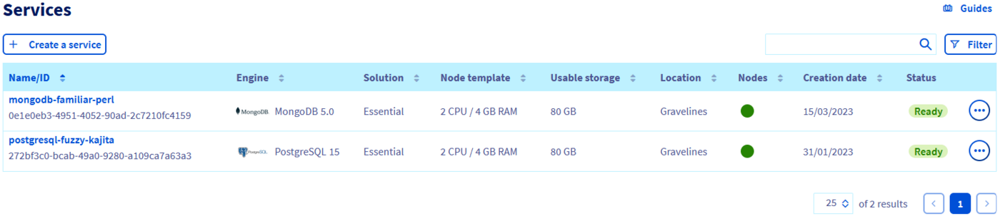{.thumbnail}

### Step 2: Go to the backup tab

In the tab list click on `Backups`{.action}.

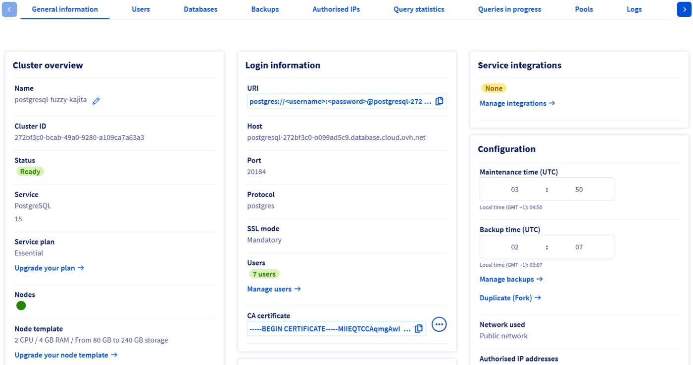{.thumbnail}

### Step 3: Select the backup to restore from

Select the backup from which you want to restore from. To help you choose, observe the dates at which the backups have been performed in the "Creation date" column.
Click on the `...`{.action} button corresponding to the chosen backup. Then click on `Duplicate (Fork)`{.action} to go on the configuration page of the new service.

> [!warning]
> The MongoDB service has the option to restore a backup in place, meaning restoring the backup on the same service. This option will rollback ALL data to the state it was in when the backup was done. This can induce data loss.

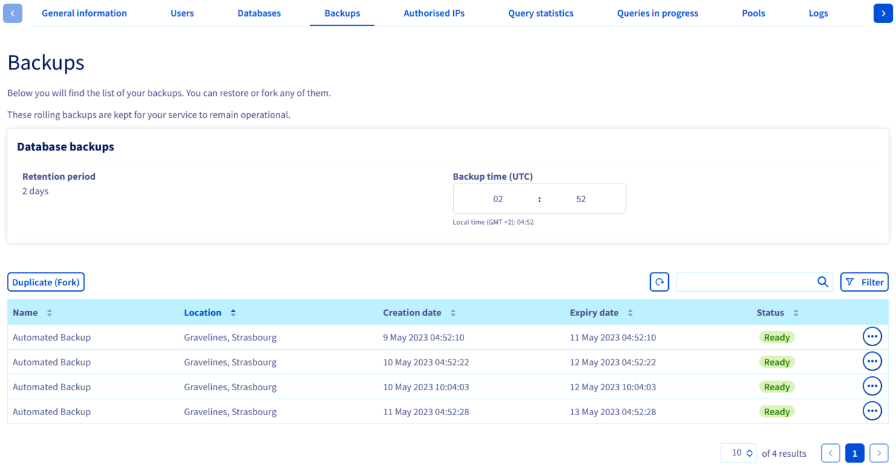{.thumbnail}

### Step 4: Configure the target service

As seen before, when restoring a backup you create a new separate database service on which the backup data will be imported. You are able to configure this new service as you wish.

#### Immutable options

For obvious reasons, you cannot change the engine, this option is not offered. The same goes for the engine version, you will be able to update it once the new service is running.

The region is not modifiable as well, your new service will be on the same region as the old one.

You will find a reminder of all these options in the order summary.

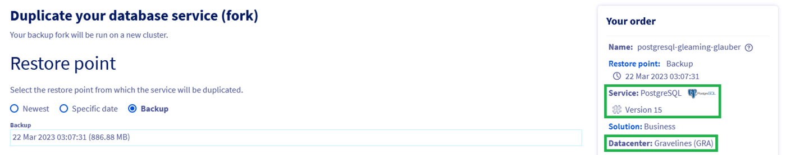{.thumbnail}

#### Restore point

You have to choose a restore point from which the service will be duplicated.

##### **Backup**

The most common option is to restore from a backup.

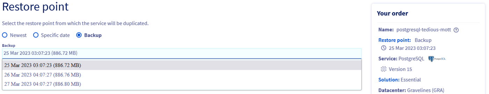{.thumbnail}

##### Specific date and latest

If your service supports point in time recovery (see [Automated Backup guide](/pages/public_cloud/public_cloud_databases/databases_05_automated_backups) for more details), you will also be offered the option to restore from a specific date and time.

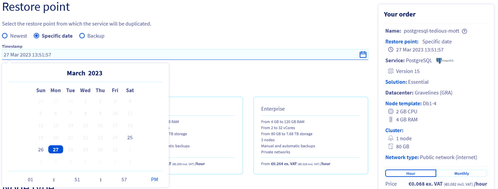{.thumbnail}

You will also be offered the ease to choose the most recent date directly.

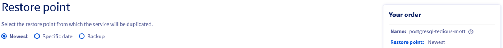{.thumbnail}

#### Plan

When restoring a backup you can select another service plan.

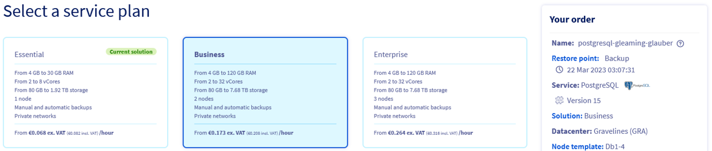{.thumbnail}

#### Nodes

You can choose to upgrade the node to a bigger flavor.

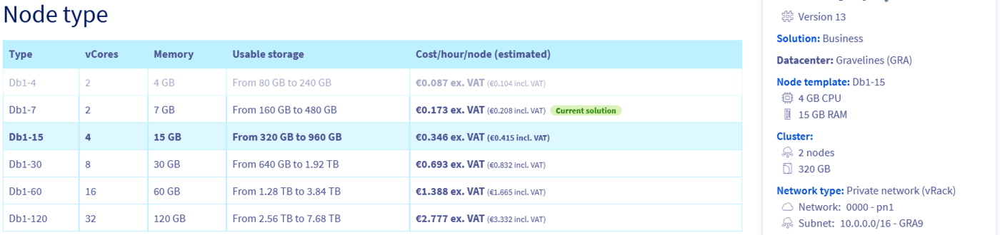{.thumbnail}

> [!primary]
> The flavor downgrade will soon be offered. The limitation being that the targeted flavor must have enough storage to restore the backup.

#### Sizing

Additional storage can be ordered while forking the service.

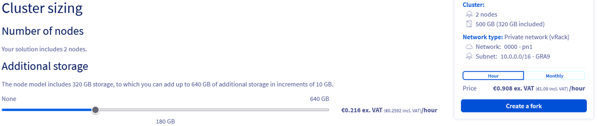{.thumbnail}

> [!primary]
> The storage reduction will soon be offered. The limitation being that the targeted total storage must be large enough to restore the backup.

#### Options

You can update the network options.

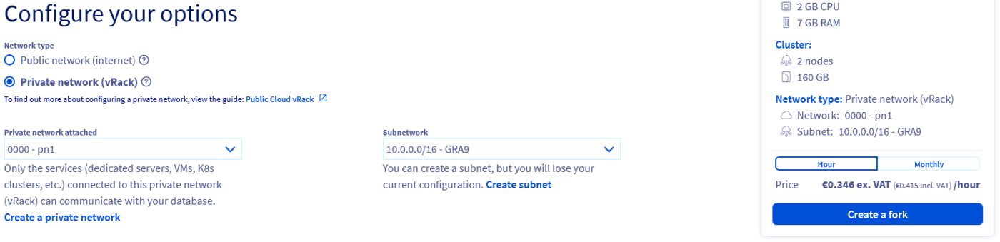{.thumbnail}

Now click on `Create a fork`{.action} and the new service will be created. Please note that depending on the backup size it can take some time before the service is available.

### Step 5: Wait for service creation

You now just have to wait for your service to be ready.
This new service is now completly independent from the one you forked the backup from. You can safely delete the old service without impacting the new one.

> [!warning]
> The newly created service does not duplicate IP restrictions nor users which were created on the old service. You will have to recreate those before using your new service.

{.thumbnail}

## We want your feedback!

We would love to help answer questions and appreciate any feedback you may have.

If you need training or technical assistance to implement our solutions, contact your sales representative or click on [this link](https://www.ovhcloud.com/en-ie/professional-services/) to get a quote and ask our Professional Services experts for a custom analysis of your project.

Are you on Discord? Connect to our channel at <https://discord.gg/ovhcloud> and interact directly with the team that builds our databases service!