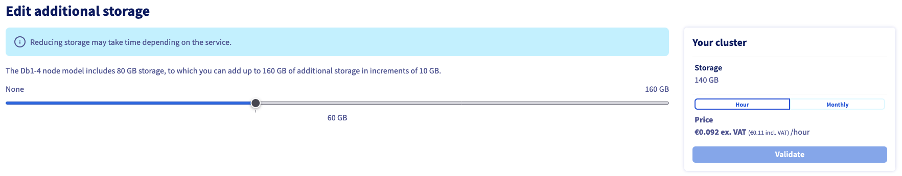

## Objective

Learn how to adjust the storage space of your cluster according to your needs.

> [!primary]
>
> This feature is only available for engines that use storage space.
>

## How to increase or decrease storage

You can increase or decrease the storage of your service at any time using either the OVHcloud [API](https://ca.api.ovh.com/console/) or the [Control Panel](https://ca.ovh.com/auth/?action=gotomanager&from=https://www.ovh.com/world/&ovhSubsidiary=we).

> [!primary]
>
> When changing the storage space of your service, the system checks that at least 20% of you total storage space will remain free after the resize operation. As a consequence, you might not be able to perform a storage space decrease if the new size you request is too close to your current disk space usage.
>

### How to adjust the storage space using the Control Panel

#### Requirements

- Access to the [OVHcloud Control Panel](https://ca.ovh.com/auth/?action=gotomanager&from=https://www.ovh.com/world/&ovhSubsidiary=we) 
- A [Public Cloud project](https://www.ovhcloud.com/en/public-cloud/) in your OVHcloud account

#### Instructions

To adjust the storage space of your cluster, log in to the OVHcloud Control Panel and open your Public Cloud project. Click `Databases`{.action} in the left navigation bar, select your engine instance then click the `General Information`{.action} tab.

Click `Edit additional storage`{.action} and adjust the storage space of your cluster. Use the slider to either increase or decrease the storage space.

### How to adjust the storage space using the API

#### Requirements

- Access to the OVHcloud [API](https://ca.api.ovh.com/console/){.external} (create your credentials by consulting [this guide](/pages/manage_and_operate/api/first-steps))
- A [Public Cloud project](https://www.ovhcloud.com/en/public-cloud/) in your OVHcloud account

#### Instructions

As an example, for MongoDB services, you can perform a storage space increase or decrease using this endpoint:

> [!api]
> @api {v1} /cloud PUT /cloud/project/{serviceName}/database/mongodb/{clusterId}

Other engines using a storage space provide similar endpoints, e.g.:

> [!api]
> @api {v1} /cloud PUT /cloud/project/{serviceName}/database/postgresql/{clusterId}

## We want your feedback!

We would love to help answer questions and appreciate any feedback you may have.

If you need training or technical assistance to implement our solutions, contact your sales representative or click on [this link](https://www.ovhcloud.com/en/professional-services/) to get a quote and ask our Professional Services experts for a custom analysis of your project.

Are you on Discord? Connect to our channel at <https://discord.gg/PwPqWUpN8G> and interact directly with the team that builds our databases service!
