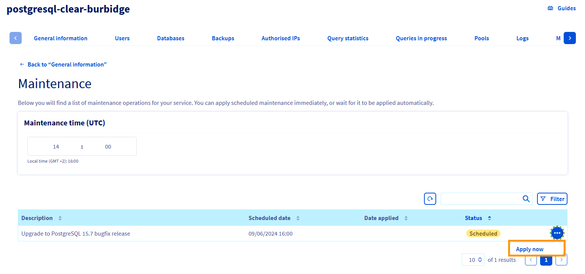

## Objective

Public Cloud managed databases allow you to focus on building and deploying cloud applications while OVHcloud takes care of the database infrastructure and maintenance.

**This guide explains how your database service schedules and performs maintenance operations.**

## Why maintenance operations?

Sometimes during a cluster lifecycle, it may happen that some action is required to keep it running smoothly. For example, a new patch version of some underlying OS package might get released to provide some fixes.

## How are those operations carried away?

- At some point, the system finds out that a maintenance operation becomes necessary. For example, a new version of some package participating in the service installation may become available.
- It then exposes a new maintenance operation for your service, with a description showing what needs to be done, a status (`SCHEDULED`, `APPLYING`, `APPLIED`) and a scheduled date. That date is computed using the "maintenance time" property of your service.
- The operation is triggered when the scheduled date is reached.

## What is the expected impact on the service?

The underlying VM often needs to get rebuild, or the service needs to restart.

For single node services, that means there is a short period of time when your service becomes unavailable.

For multi-node services, per-engine resiliency mechanisms ensure the service remains available when a node gets operated on. If the application handles such cases gracefully (for example, reconnects and retries properly on failure) then the impact should be minimal or even non-existent.

## How can I monitor the planned maintenances?

You can get a list of maintenances for a service through the dedicated API endpoint for each engine:

> [!api]
>
> @api {v1} /cloud GET /1.0/cloud/project/{serviceName}/database/postgresql/{productId}/maintenance
>

{.thumbnail}

> [!primary]
> If you are not familiar with using the OVHcloud API, please refer to our guide on [Getting started with the OVHcloud API](/pages/manage_and_operate/api/first-steps).

## How can I control the scheduling?

You can change the maintenance time for your service so to have maintenance operations scheduled at a time that suits you better. For example, if your application is less busy at night, you can target that timeframe. Be aware that this only affects future maintenance operation scheduling, it won't reschedule already existing operations.

{.thumbnail}

You can also decide to preemptively apply some operations, using this API endpoint:

> [!api]
>
> @api {v1} /cloud POST /1.0/cloud/project/{serviceName}/database/postgresql/{productId}/maintenance/{maintenanceId}/apply
>

This might be a good idea if e.g. you want to prepare for a busy period and thus want to avoid disturbances during that time.

## We want your feedback!

We would love to help answer questions and appreciate any feedback you may have.

If you need training or technical assistance to implement our solutions, contact your sales representative or click on [this link](https://www.ovhcloud.com/en-ca/professional-services/) to get a quote and ask our Professional Services experts for a custom analysis of your project.

Are you on Discord? Connect to our channel at <https://discord.gg/PwPqWUpN8G> and interact directly with the team that builds our databases service!
