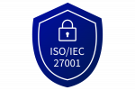

**Last updated 23rd May 2023**

## Objective

OVHcloud Public Cloud Databases allow you to focus on building and deploying cloud applications while OVHcloud takes care of the database infrastructure and maintenance.

**This guide lists and explains security measures implemented for the Cloud Databases services.**

## Certifications & Compliance

OVHcloud Public Cloud Databases as a whole are [ISO/IEC 27001, 27017 and 27018](https://www.ovhcloud.com/en-gb/enterprise/certification-conformity/iso-27001-27017-27018/) and [HDS](https://www.ovhcloud.com/en-gb/enterprise/certification-conformity/hds/) certified.  Those certifications assure you that our solutions meet highest security standards. Learn more about certified services at OVHcloud [here](https://www.ovhcloud.com/en-gb/enterprise/certification-conformity/).
 In addition, the service is GDPR compliant.

{.align-center}
{.align-center}
{.align-center}

Those certifications cover all DBMS in the Public Cloud Databases offer, you can find the complete list on the [Public Cloud Databases web page](https://www.ovhcloud.com/en-gb/public-cloud/databases/).

## Infrastructure & software

### High-availability

When choosing Business and Enterprise service plan, your data is replicated across multiple nodes, ensuring high availability of your data.

### Automatic daily backups

Public Cloud Databases services are backed up on a daily basis. Those backups are encrypted and uploaded to a remote, replicated storage backend, in a different datacenter from the database service. In case of a catastrophic failure of one of our datacenters,you will still be able to recover your data, with a 24 hours data loss maximum. Backup frequency and retention may vary depending on DBMS and service plan selected.

### Data encryption

We perform end-to-end encryption for all our Public Cloud Databases and backups.

#### In-transit encryption (transport)

All network traffic to managed databases clusters is protected by TLS by default. 

**TLS cannot be disabled**.

Depending on the DBMS selected, the default version may vary but the minimum is TLS v1.1. Data that is transmitted to managed databases clusters, as well as data transmitted between nodes of your clusters, is encrypted in-transit using TLS.

#### At-rest encryption (on disk)

> [!primary]
>
> Currently, OVHcloud does not offer a KMS as a service, you cannot bring your own keys. KMIP is managed by OVHcloud.
>

At-rest encryption is a database-level protection layer to guarantee that the written files and data are encrypted while stored.

##### All databases engines except MongoDB

For all the databases engines such as MySQL, PostgreSQL, Redis, and so on, at-rest data encryption covers both active service instances as well as service backups in cloud object storage.

- **Nodes:** service instances and the underlying VMs use full volume encryption using [LUKS](https://en.wikipedia.org/wiki/Linux_Unified_Key_Setup) with a randomly generated ephemeral key for each instance and each volume. 
The key is never re-used and will be trashed at the destruction of the instance, so there’s a natural key rotation with roll-forward upgrades. 
We use the LUKS2 default mode aes-xts-plain64:sha256 with a 512-bit key.

- **Backups:** backups are encrypted with a randomly generated key per file. These keys are in turn encrypted with a RSA key-encryption key-pair and stored in the header section of each backup segment. 
The file encryption is performed with AES-256 in CTR mode with HMAC-SHA256 for integrity protection. 
The RSA key-pair is randomly generated for each service. The key lengths are 256-bit for block encryption, 512-bit for the integrity protection and 3072-bits for the RSA key.

##### MongoDB

- **Nodes:** service instances and the underlying VMs use full volume encryption using LUKS with a randomly generated ephemeral key for each instance and each volume. 
The key is never re-used and will be trashed at the destruction of the instance, so there’s a natural key rotation with roll-forward upgrades. 
We use the LUKS2 mode aes-cbc-essiv:sha256 with a 512-bit key.

- **Backups:** backups are encrypted with a randomly generated key. This key is Asymetric RSA4096.

#### In-Use encryption (client side)

> [!primary]
>
> Currently, OVHcloud does not offer a KMS as a service, you cannot bring your own keys. KMIP is managed by OVHcloud.
>

Currently, we do not provide in-use encryption except for MongoDB Enterprise plans, based on MongoDB Client-Side Field Level Encryption.

Data is encrypted client-side with customer-controlled encryption keys, before being sent, stored, or retrieved from the database

Client-Side Field Level Encryption (FLE) is an in-use encryption capability that enables a client application to encrypt sensitive data before storing it in the MongoDB database. Sensitive data is transparently encrypted, remains encrypted throughout its lifecycle, and is only decrypted on the client side.

### CVE monitoring

The operation team in charge of the maintenance of the Public Cloud Databases services is constantly monitoring CVE on the different DBMS available. This monitoring is done through different channels, official mailing lists, security community, internal security check...

We are also in constant communication with MongoDB team, in order to provide fast and smooth transition to the latest security version of MongoDB.

## Network

### Private network

Public Cloud Databases provide interconnection with your private network. This option allows you to connect your database to other services in your private network, isolating your service from the outside.

### IP restriction

All database services are IPv4 restricted. By default, services are not accessible. Users can specify unique IP or IP blocks from which the service will accept connections. IP restriction prevents all attacks from the outside of a specific information system.

## Go further

[Public Cloud Databases documentation](/products/public-cloud-databases)

Visit our dedicated Discord channel: <https://discord.gg/ovhcloud>. Ask questions, provide feedback and interact directly with the team that builds our databases services.

If you need training or technical assistance to implement our solutions, contact your sales representative or click on [this link](https://www.ovhcloud.com/en-gb/professional-services/) to get a quote and ask our Professional Services experts for a custom analysis of your project.
