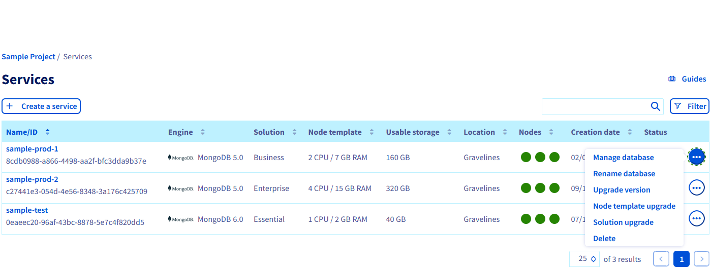
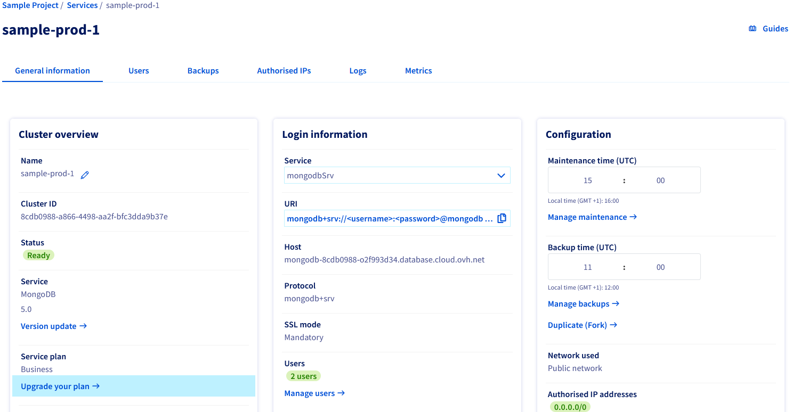
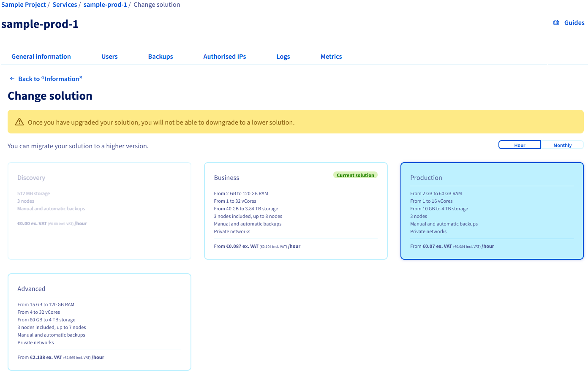
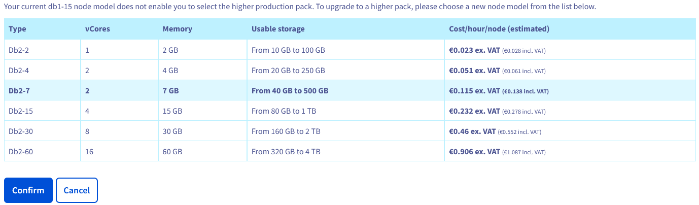
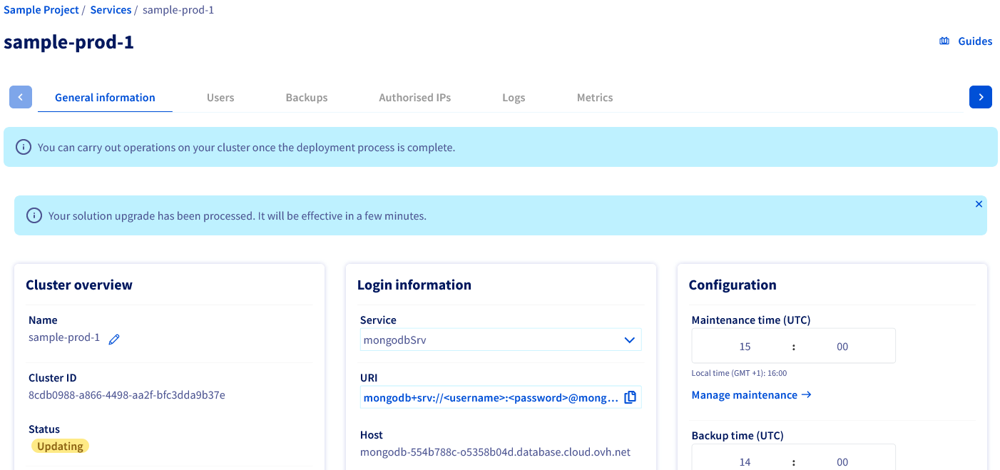
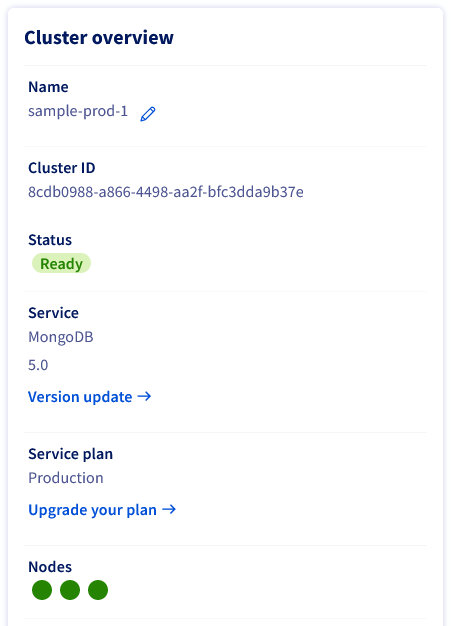

## Objective

Public Cloud Databases allow you to focus on building and deploying cloud applications while OVHcloud takes care of the database infrastructure and maintenance in operational conditions. 

Several plans for MongoDB existed (Essential, Business, Enterprise) and recent updates changed them to Discovery, Production and Advanced.
This update means your cluster needs to be migrated from one of the deprecated plan to a new one. 
Migration to Production and Advanced plans is automatic. If you want to migrate to Discovery from a deprecated plan, you will need to do it manually following the [dedicated guide](/pages/public_cloud/public_cloud_databases/mongodb_11_howto_migrate_to_discovery).

**This guide explains how to automatically migrate from a deprecated Essential or Business plan to a Production or Advanced plan.**

## Requirements

- A [Public Cloud project](https://www.ovhcloud.com/es-es/public-cloud/) in your OVHcloud account
- Access to the [OVHcloud Control Panel](/links/manager)
- A MongoDB database running on your OVHcloud Public Cloud Databases service ([this guide](/pages/public_cloud/public_cloud_databases/databases_01_order_control_panel) can help you to meet this requirement)

## Concept

The Public Cloud Databases MongoDB **Production** plan is intended for production applications on a high performance, scalable and secure cloud environment, while the **Advanced** plan will power large Enterprise-grade cloud workloads with advanced features.
The migration of a cluster from a deprecated plan to a Production or Advanced plan is automatic.

> [!primary]
>
> Migration to the **Advanced** plan is a two step process. First you need to migrate from the deprecated plan to the **Production** plan. Then you have to move on to the **Advanced** plan.
>

## Instructions

### Find the service to migrate

Locate the service to migrate from the Databases section and click on the menu from the service row.

{.thumbnail}

Either click directly on the `Solution upgrade`{.action} menu item to proceed to the next step or click on `Manage database`{.action} to see the detailed information of your service. From the `General Information`{.action} tab, click `Upgrade your plan`{.action} to proceed to the next step.

{.thumbnail}

### Initiate the migration

From the **Change solution** page you will be presented with your current plan and the new plan you can migrate to.

> [!primary]
>
> The automatic migration to the Discovery plan is disabled, please refer to the [dedicated migration guide](/pages/public_cloud/public_cloud_databases/mongodb_11_howto_migrate_to_discovery) to help you migrate to the Discovery plan.
>

First select the plan that suits your needs. In the following example we will choose to migrate from a Business to a Production plan.

{.thumbnail}

Then select the new flavor of your service and confirm the migration.

{.thumbnail}

In this example, we choose to keep the same compute resources by moving from DB1-7 to DB2-7.

> [!warning]
>
> The destination flavor storage must be large enough to handle your current data.
>

### Wait until the migration is complete

The migration time depends on data size.

{.thumbnail}

When the migration is complete the status turns to `ready` and the service plan now reflects the new plan of the service.

{.thumbnail}

## We want your feedback!

We would love to help answer questions and appreciate any feedback you may have.

If you need training or technical assistance to implement our solutions, contact your sales representative or click on [this link](https://www.ovhcloud.com/es-es/professional-services/) to get a quote and ask our Professional Services experts for a custom analysis of your project. Join our community of users on <https://community.ovh.com/en/>.

Are you on Discord? Connect to our channel at <https://discord.gg/ovhcloud> and interact directly with the team that builds our databases service!
