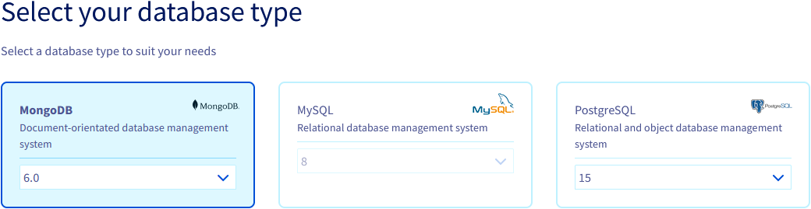
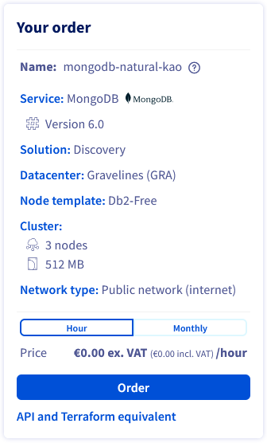

## Objective

TODO

**This guide explains how to get started with MongoDB on OVHcloud for free.**

## Requirements

- Access to the [OVHcloud Control Panel](https://www.ovh.com/auth/?action=gotomanager&from=https://www.ovh.co.uk/&ovhSubsidiary=GB)
- A [Public Cloud project](https://www.ovhcloud.com/en-gb/public-cloud/) in your OVHcloud account

## Instructions

Log in to your [OVHcloud Control Panel](https://www.ovh.com/auth/?action=gotomanager&from=https://www.ovh.co.uk/&ovhSubsidiary=GB) and switch to the `Public Cloud`{.action} section. After selecting your Public Cloud project, click on `Databases`{.action} in the left-hand navigation bar under **Databases & Analytics**.

Click on the button `Create a database instance`{.action}. (`Create a service`{.action} if your project already contains databases.)

### Select the database type

Select **MongoDB** and, eventually, change the version to install from the drop-down menu.

{.thumbnail}

### Review the order

All other options TODO

{.thumbnail}

The final section will display a summary of your order as well as the API equivalent of creating this database instance with the [OVHcloud API](/pages/manage_and_operate/api/first-steps).

{.thumbnail}

Within a few minutes your new database service will be deployed. Messages in the OVHcloud Control Panel will inform you when the database is ready to use.

Continue with the *Configure your instance to accept incoming connections* guide of your selected database type available [here](/products/public-cloud-databases) to configure your service after installation.

Then follow these steps:

1. Select **MongoDB** as database type.
2. Select **Discovery** as service plan.

The Discovery solution come with these limitations:

- There is only one region available: Gravelines (GRA).
- There is only one flavor the db2-free.
- 3 nodes for resilience.
- Disk is limited to 512 MB.
- No flex disk.
- No private network.

The final section will display a summary of your order.

Within a few minutes your new database service will be deployed. Messages in the OVHcloud Control Panel will inform you when the database is ready to use.

Continue with the *Configure your instance to accept incoming connections* guide of your selected database type available [here](/products/public-cloud-databases) to configure your service after installation.

Note that the configuration options might be different, depending on the database type. You will find example on this repository: <https://github.com/ovh/public-cloud-databases-examples>.

## We want your feedback!

Visit our dedicated Discord channel: <https://discord.gg/PwPqWUpN8G>. Ask questions, provide feedback and interact directly with the team that builds our databases services.

If you need training or technical assistance to implement our solutions, contact your sales representative or click on [this link](https://www.ovhcloud.com/en-gb/professional-services/) to get a quote and ask our Professional Services experts for a custom analysis of your project.

Join our community of users on <https://community.ovh.com/en/>.