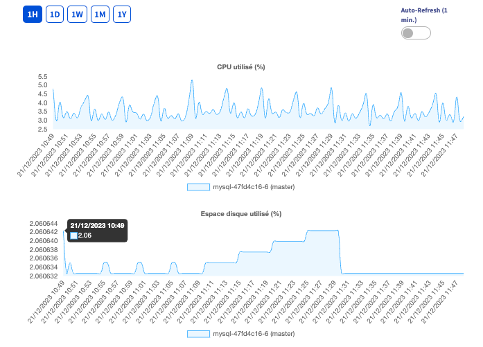

## Objective

Monitoring MongoDB databases is crucial for detecting glitches and slowdowns, which in turn allows you to make sure a system is working properly, particularly in terms of availability, reliability, and scalability.

You can monitor your databases via the OVHcloud Control Panel (and also view summary and history), using a command line interface (CLI), or a graphical user interface (GUI).

**In this guide, we will show you three ways to get and use best practice tips on a daily basis to keep your MongoDB databases in top shape.**

## Requirements

- A [Public Cloud project](https://www.ovhcloud.com/en/public-cloud/) in your OVHcloud account.
- Access to the [OVHcloud Control Panel](/links/manager).
- An OVHcloud managed MongoDB service. If you do not have one, please refer to the following guide: [Getting started with Public Cloud Databases](/pages/public_cloud/public_cloud_databases/databases_01_order_control_panel).
- An account you can use to log in to MongoDB. If you do not have one, please refer to the following guide: [Configure your MongoDB instance to accept incoming connections](/pages/public_cloud/public_cloud_databases/mongodb_02_manage_control_panel).

## Instructions

### Using the metrics provided by OVHcloud

You can use the main metrics and statistics in the [OVHcloud Control Panel](/links/manager) to track and manage your database instance.

For each Public Cloud Database service, in the `Metrics`{.action} tab, you can find the following charts:

- CPU used (%)
- Disk space used
- Number of read IOPS
- Number of write IOPS
- Memory used (only available for **Production** and **Advanced** service plans)
- Network reception (Mbps)
- Network transmission (Mbps)

These metrics are available for a set amount of time — 1 hour, 1 day, 1 week, 1 month, 1 year. You can also enable automatic refresh if you want to leave this tab open.

{.thumbnail}

### Using the CLI (Command Line Interface) to retrieve information

Depending on the solution you’ve signed up for (Discovery, Production or Advanced), you can use the same "mongo" tool. This binary is available in a .zip file, which you can find on the official MongoDB website via the following link: <https://www.mongodb.com/try/download/community>. You can then download the version that best suits your platform.

Please note that to access this data, you need MongoDB elevated privileges, including the "clusterMonitor" role for retrieving server statistics.

Three commands can be used to obtain real-time information.

You can find out how the server works via the general `serverStatus()` command. You can also use it to gather data about the different types of queries you perform.

```bash
> db.serverStatus()

{
	host: 'replicaset-0',
	version: '6.0.12',
	process: 'mongod',
	pid: Long("565"),
	uptime: 4430,
        …
        "ok" : 1
	…
  	opcounters: {
    		insert: Long("5"),
  		query: Long("2683"),
    		update: Long("1150"),
    		delete: Long("1324"),
    		getmore: Long("3099"),
   		command: Long("103420")
  	},
	…
}
```

There are other commands you can use to return encrypted values, especially for a specific database: **dbStats** (`db.stats()`)

```bash
> db.stats()

{
	 db: 'admin',
 	 collections: 3,
 	 views: 0,
 	 objects: 7,
 	 avgObjSize: 243,
 	 dataSize: 1701,
 	 storageSize: 94208,
 	 indexes: 4,
 	 indexSize: 131072,
 	 totalSize: 225280,
	  scaleFactor: 1,
	  fsUsedSize: 340033536,
	  fsTotalSize: 1020702720,
	  ok: 1,
	  …
}
```

Just as **dbStats** returns information on a specific database, you can also use the **collStats** command (`db.coll.stats()`), to access information about a specific data collection.

### Using a GUI (Graphical User Interface) to monitor the status of MongoDB instances

Depending on the solution you’ve signed up for (Discovery, Production or Advanced), you can use the same "MongoDB Compass" tool. This is a cross-platform tool — designed to run on any device: Mac, Windows, Linux. It is available on the official MongoDB website via the following link: <https://www.mongodb.com/try/download/compass>.

MongoDB Compass has a `Performance`{.action} tab.

{.thumbnail}

This tab displays the following information in real time, particularly for troubleshooting or fine-tuning:

- Operations: number of operations carried out (i.e., INSERT, COMMAND, UPDATE, etc.)
- Read & write: the number of reads/writes performed
- Network: the number of current server connections
- Memory: server’s RAM usage
- Hottest Collections: means the most frequently used collections at the time they are collected
- Slowest Operations: the slowest operations at the time of reading

You can also stop an operation listed under "Slowest Operations" if it takes too long.
Clicking on the targeted operation will open the "Operation Details" panel on the right. Clicking on the `KILL OP`{.action} button will terminate this request.

## We want your feedback!

For more information about Managed Databases for MongoDB, please visit our [product page](https://www.ovhcloud.com/en/public-cloud/mongodb/).

We would love to help answer questions and appreciate any feedback you may have.

Visit our dedicated Discord channel: <https://discord.gg/ovhcloud>. Ask questions, provide feedback and interact directly with the team that builds our databases services.

Join our community of users on <https://community.ovh.com/en/>.

If you need training or technical assistance to implement our solutions, contact your sales representative or click on [this link](https://www.ovhcloud.com/en/professional-services/) to get a quote and ask our Professional Services experts for a custom analysis of your project.