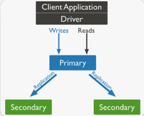
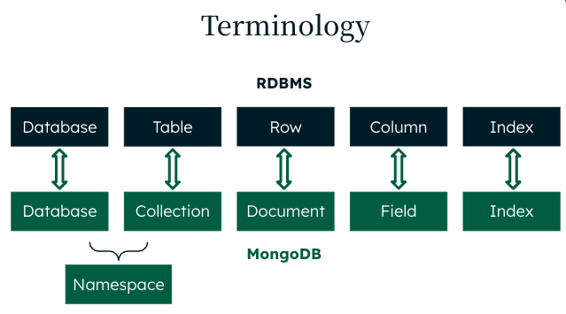
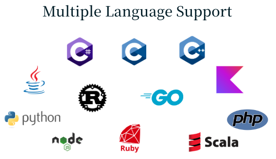

## Introduction

[MongoDB](https://www.mongodb.com/) is a leading NoSQL database that provides a flexible, scalable, and high-performance solution for modern application development. It stores data in JSON-like documents, which allows for a dynamic schema, making it ideal for handling unstructured and semi-structured data. This document-oriented approach ensures high flexibility in how data is stored, queried, and indexed.

MongoDB's architecture is built for high availability and horizontal scalability. It supports replica sets, providing automatic failover and data redundancy to ensure data availability and reliability. This ensures that applications can continue to run smoothly even in the event of hardware failures.

The database engine uses a storage model based on collections and documents, where collections hold sets of documents and documents are the basic units of data. This structure simplifies the development process, allowing developers to interact with data using native and intuitive APIs. MongoDB's powerful querying capabilities, including ad-hoc queries, indexing, and real-time aggregation, enable developers to create robust and efficient applications.

MongoDB also offers comprehensive security features, including encryption at rest and in transit, role-based access control, and auditing. These features ensure that data is protected and meets compliance requirements. The MongoDB community and enterprise support options, provide developers and organizations with the resources and assistance needed to optimize their use of the database.

## Main Benefits of Choosing MongoDB
- [Flexible Schema](https://www.mongodb.com/docs/manual/data-modeling/): MongoDB's document-oriented storage allows for dynamic schema, making it easy to handle unstructured and semi-structured data.
  - #### Example of a MongoDB Collection with 2 Documents:
    ```json
      {
        "_id": 1,
        "name": "John Doe",
        "address": {
          "street": "123 Main St",
          "city": "Springfield",
          "postal_code": "12345"
        },
        "phone_numbers": ["555-1234", "555-5678"],
        "email": "john.doe@example.com"
      },
      {
        "_id": 2,
        "name": "Jane Smith",
        "address": {
          "street": "456 Elm St",
          "city": "Shelbyville"
        },
        "phone_numbers": ["555-8765"],
        "date_of_birth": "1985-01-01"
      }
    ```
  - #### Key Points:
    - <ins>Nested Documents</ins>: The address field in both documents is a nested document containing subfields like street, city, and postal_code.
    - <ins>Array Fields</ins>: The phone_numbers field in both documents is an array containing multiple phone numbers.
    - <ins>Varying Fields</ins>: The email field is present only in the first document, while the date_of_birth field is present only in the second document. The structure and number of fields vary between the two documents within the same collection.

- [Scalability](https://www.mongodb.com/resources/basics/scaling): Horizontal scaling with replica sets ensures high availability and scalability to meet growing data and workload demands.

  

- [High Performance](https://www.mongodb.com/docs/manual/administration/analyzing-mongodb-performance/#mongodb-performance): Efficient storage and indexing mechanisms enable fast query responses and data processing.

- [Rich Query Language](https://www.mongodb.com/docs/manual/tutorial/query-documents/#query-documents): Supports complex queries, including ad-hoc queries, indexing, aggregation, and geospatial queries.

- [High Availability](https://www.mongodb.com/resources/basics/high-availability): Automatic failover and data redundancy through replica sets ensure data is always available.

- [Document Model](https://www.mongodb.com/resources/basics/json-and-bson): The document data model is a powerful way to store and retrieve data in any modern programming language, allowing developers to move quickly.

- [Real-Time Analytics](https://www.mongodb.com/solutions/use-cases/analytics/real-time-analytics): Built-in aggregation framework allows for real-time data analysis and transformation.

- [Strong Security](https://www.mongodb.com/docs/manual/security/): Comprehensive security features such as encryption at rest and in transit, In-Use Encryption, role-based access control, and auditing.

- [Robust Ecosystem](https://www.mongodb.com/products/tools): Integration with various tools and platforms such as VS Code, Terraform, Kubernetes, and kafka, enhancing functionality and ease of use.

- [Community](https://www.mongodb.com/community/forums/) and [Enterprise Support](https://www.mongodb.com/services/support/enterprise-advanced-support-plans): Access to a large community and enterprise-level support ensures help and resources are readily available.

## MongoDB vs SQL Database Engines

| Feature                    | MongoDB                                  | RDBMS (e.g., MySQL, PostgreSQL)          |
|----------------------------|------------------------------------------|------------------------------------------|
| **Data Model**             | Document-oriented (JSON-like documents)  | Table-based (rows and columns)           |
| **Schema**                 | Flexible, dynamic schema                 | Fixed, predefined schema                 |
| **Scalability**            | Horizontal scaling with ease             | Primarily vertical scaling, horizontal scaling is complex |
| **Transactions**           | Supports multi-document ACID transactions | Supports ACID transactions               |
| **Query Language**         | MongoDB Query Language (MQL)              | SQL (Structured Query Language)          |
| **Indexing**               | Supports various types of indexes, including compound, geospatial, text, etc. | Supports various types of indexes, primarily B-tree and hash |
| **Joins**                  | Supports joins using `$lookup`            | Supports joins to combine data from multiple tables |
| **Performance**            | Optimized for read and write performance, especially for large volumes of data | Performance can degrade with complex joins and large datasets |
| **Flexibility**            | High flexibility due to dynamic schema   | Less flexible due to rigid schema constraints |
| **Use Cases**              | Best for unstructured data, real-time analytics, and applications with rapidly changing data requirements | Best for structured data and applications requiring complex transactions and relationships |
| **Deployment**             | Cloud-native, on-premises, hybrid        | On-premises, cloud                        |
| **Community and Support**  | Strong community, enterprise support available | Strong community, enterprise support available |


## MongoDB vs Other Document Databases
### MongoDB vs Azure Cosmos DB

Azure Cosmos DB, a fully managed service from Microsoft, supports multiple data models (including document, graph, and key-value) and provides global distribution with multi-region write capabilities. It offers multiple consistency levels and integrates seamlessly with other Azure services but does not support all MongoDB features and is limited to the Azure ecosystem.

#### General Features

| Feature                                                    | MongoDB                                         | Azure Cosmos DB                                 |
|------------------------------------------------------------|-------------------------------------------------|-------------------------------------------------|
| **Choice of Cloud Providers**                              | Yes                                             | No                                              |
| **Integrated Text Search, Geospatial Processing**          | Yes                                             | Limited                                         |
| **Supports All MongoDB Features**                          | Yes                                             | No                                              |
| **Access to Latest MongoDB Version**                       | Yes                                             | No                                              |
| **Free Tier**                                              | Yes                                             | Limited                                         |
| **Live Migration**                                         | Yes                                             | Only for eligible accounts                      |
| **Choice of Instance Configuration**                       | Yes                                             | No                                              |
| **Support for Multi-Document ACID Transactions**           | Yes                                             | Limited                                         |
| **Maximum Document Size**                                  | 16 MB                                           | 2 MB                                            |
| **JSON Schema for Data Governance Controls**               | Yes                                             | No                                              |
| **Integrated Text Search and Graph Queries**               | Yes                                             | No                                              |
| **Integrated Querying of Data in Cloud Object Storage**    | Yes                                             | No                                              |
| **Automatically Tier Data to Cloud Object Storage**        | Yes                                             | No                                              |
| **Blend Data with Joins and Unions for Analytics Queries** | Yes                                             | No                                              |
| **Automatic Performance Recommendations**                  | Yes                                             | No                                              |
| **Replica Set Configuration**                              | Up to 50 replicas                               | 3 data-bearing nodes                            |
| **Hedged Reads**                                           | Yes                                             | No                                              |
| **Pause and Resume Clusters**                              | Yes                                             | No                                              |
| **Native Data Visualization**                              | Yes                                             | No                                              |
| **Supported in On-Premise and Hybrid Deployments**         | Yes                                             | No                                              |
| **Embeddable Database with Sync for Mobile Devices**       | Yes                                             | No                                              |

#### Global Clusters

| Feature                                                    | MongoDB                                         | Azure Cosmos DB                                 |
|------------------------------------------------------------|-------------------------------------------------|-------------------------------------------------|
| **Multi-Cloud Deployment**                                 | Yes                                             | No                                              |

#### Monitoring and Disaster Recovery

| Feature                                                    | MongoDB                                         | Azure Cosmos DB                                 |
|------------------------------------------------------------|-------------------------------------------------|-------------------------------------------------|
| **Automatic Scaling of Compute and Storage**               | Yes                                             | Yes (with limitations)                          |
| **Monitoring of Database Health with Automated Alerting**  | Yes                                             | Partial                                         |
| **Queryable Backups**                                      | Yes                                             | No                                              |
| **Automated & Consistent Snapshots of Sharded Clusters**   | Yes                                             | No                                              |

#### Security Controls

| Feature                                                    | MongoDB                                         | Azure Cosmos DB                                 |
|------------------------------------------------------------|-------------------------------------------------|-------------------------------------------------|
| **Granular Role-Based Access Control**                     | Yes                                             | Limited                                         |
| **AWS VPC Peering**                                        | Yes                                             | N/A                                             |
| **Client-Side Field Level Encryption**                     | Yes                                             | No                                              |
| **Encryption of Data In-Use**                              | Yes                                             | No                                              |
| **Queryable Encryption**                                   | Yes                                             | No                                              |
| **Bring Your Own KMS**                                     | Yes                                             | No                                              |

#### Support and Services

| Feature                                                    | MongoDB                                         | Azure Cosmos DB                                 |
|------------------------------------------------------------|-------------------------------------------------|-------------------------------------------------|
| **Direct Support by Database Engineers**                   | Yes                                             | No                                              |
| **Consulting Services**                                    | Yes                                             | No                                              |

### Amazon DocumentDB vs MongoDB

Amazon DocumentDB is a managed service that emulates the MongoDB API but does not support the latest MongoDB features. It focuses on providing a scalable, high-performance database service within the AWS ecosystem but lacks some advanced functionalities like multi-document ACID transactions and global replication.

#### General Features

| Feature                                                    | MongoDB                                         | Amazon DocumentDB                                 |
|------------------------------------------------------------|-------------------------------------------------|--------------------------------------------------|
| **Fully compatible with MongoDB**                          | Yes                                             | No, incomplete                                   |
| **Support for latest MongoDB version**                     | Yes                                             | No, resembles MongoDB 3.0/3.2                    |
| **Scale writes and partition data beyond a single node**   | Yes, full sharding support                      | Limited, only within Elastic Clusters             |
| **Replicate and scale beyond a single region**             | Yes, global clusters with up to 50 replicas     | No, constrained to a single region                |
| **High resilience, rapid failure recovery**                | Yes, typical failover sub-5 seconds             | No, ~120 second failover                          |
| **Multi-statement distributed ACID transactions**          | Yes                                             | Limited                                           |
| **Integrated text search, geospatial processing**          | Yes                                             | Limited                                           |
| **Native support for time series data**                    | Yes                                             | No                                                |
| **Hedged Reads**                                           | Yes                                             | No                                                |
| **Online Archive**                                         | Yes, automatically tier data to cloud storage   | No                                                |
| **Integrated querying of data in cloud object storage**    | Yes                                             | No                                                |
| **On-demand Materialized Views**                           | Yes                                             | No                                                |
| **Schema governance**                                      | Yes, JSON schema                                | No, enforced in the app                           |
| **Rich data types**                                        | Yes                                             | Limited                                           |
| **Reactive, event-driven data pipelines**                  | Yes, Change Streams & Atlas Triggers            | Limited                                           |
| **Support for role-based access control**                  | Yes                                             | Limited                                           |
| **Fine-grained monitoring telemetry**                      | Yes, 100+ metrics                               | No, <50 metrics                                   |
| **Client-side field level encryption**                     | Yes                                             | No                                                |
| **Queryable Encryption**                                   | Yes                                             | No                                                |
| **Availability of advanced developer and analysis tools**  | Yes, Compass, Charts, SQL, Tableau, Power BI, Spark Connectors | Limited                                   |
| **Freedom from vendor lock-in**                            | Yes, AWS, Azure, Google Cloud                   | No, AWS only                                      |
| **Develop & run anywhere**                                 | Yes, mobile, laptop, data center, hybrid        | No, AWS only                                      |
| **Mobile & Edge Sync**                                     | Yes                                             | No                                                |
| **Access to MongoDB expertise**                            | Yes, hundreds of engineers                      | No                                                |


## MongoDB Use Cases

### 1. Real-Time Analytics
**Example:** E-commerce Websites
- **Scenario:** An e-commerce website needs to analyze user behavior, sales data, and inventory in real-time to optimize user experience and sales strategies.
- **MongoDB Advantage:** MongoDB's document model allows for flexible data structures that can store complex data types. Its aggregation framework supports real-time analytics by processing data directly within the database, reducing the need for additional ETL processes.

### 2. Content Management Systems (CMS)
**Example:** Blogging Platforms
- **Scenario:** A blogging platform needs to manage and serve diverse content types, including articles, images, and metadata, with varying schema requirements.
- **MongoDB Advantage:** MongoDB's flexible schema makes it easy to handle different content types and adapt to changing requirements without significant changes to the database schema. This flexibility accelerates development and iteration cycles.

### 3. Internet of Things (IoT)
**Example:** Smart Home Devices
- **Scenario:** A smart home system collects and processes data from various sensors and devices in real-time to automate and optimize home environments.
- **MongoDB Advantage:** MongoDB can efficiently store and process large volumes of time-series data from IoT devices. Its horizontal scalability ensures it can handle the growing amount of data generated by an increasing number of connected devices.

### 4. Mobile Applications
**Example:** Social Media Apps
- **Scenario:** A social media app requires a backend that can handle a high volume of user-generated content, real-time interactions, and complex relationships between data.
- **MongoDB Advantage:** MongoDB's document-oriented model suits the storage of user profiles, posts, comments, and likes, all within a single database. Furthermore, Its scalability supports growing user bases.

## Main MongoDB Engine Concepts

### 1. Documents
- **Definition:** The basic unit of data in MongoDB, similar to a row in a relational database, but more flexible.
- **Format:** JSON-like (BSON) structure, allowing for nested objects and arrays.

### 2. Collections
- **Definition:** A group of MongoDB documents, similar to a table in a relational database.
- **Characteristics:** Collections do not enforce a schema, allowing for a diverse set of documents.

### 3. Databases
- **Definition:** A container for collections.
- **Usage:** Each database has its own set of files on the file system.

### 4. Replica Sets
- **Definition:** A group of MongoDB servers that maintain the same data set, providing redundancy and high availability.
- **Components:** Consists of a primary node and secondary nodes, with automatic failover.

### 5. Sharding
- **Definition:** The process of distributing data across multiple machines to support large datasets and high throughput operations.
- **Components:** Shards, config servers, and query routers.

### 6. Indexes
- **Definition:** Special data structures that store a small portion of the data set in an easy-to-traverse form.
- **Usage:** Improve query performance by allowing MongoDB to quickly locate documents.

### 7. Aggregation Framework
- **Definition:** A powerful tool for performing data processing and transformation operations directly within the database.
- **Usage:** Supports operations like filtering, grouping, and sorting.

### 8. Transactions
- **Definition:** Multi-document ACID transactions that ensure data integrity.
- **Usage:** Allows for operations across multiple documents to be executed in a way that ensures atomicity, consistency, isolation, and durability.

### 9. Storage Engines
- **Definition:** The components responsible for managing how data is stored, retrieved, and maintained on disk.
- **Common Engines:** WiredTiger (default), In-Memory, and MMAPv1 (deprecated).

### 10. Security
- **Features:** Role-based access control, encryption at rest, encryption in transit, and auditing capabilities.
- **Purpose:** Ensure data security and compliance with various regulations.


## MongoDB Community vs MongoDB Enterprise

| Feature                                        | MongoDB Community                             | MongoDB Enterprise                                |
|------------------------------------------------|-----------------------------------------------|--------------------------------------------------|
| **License**                                    | Open Source (SSPL)                            | Commercial (with additional features)             |
| **Deployment Options**                         | Self-managed                                  | Self-managed, MongoDB Atlas, Enterprise Advanced  |
| **Security**                                   | Basic security features                       | Advanced security (LDAP, Kerberos, auditing)      |
| **Data Encryption**                            | Encryption at rest and in transit             | FIPS 140-2 encryption, Key Management Encryption  |
| **Backup and Recovery**                        | Manual backups                                | Automated backups, point-in-time recovery         |
| **Monitoring**                                 | Basic monitoring                              | Advanced monitoring (MongoDB Ops Manager, Cloud Manager) |
| **Operational Tools**                          | Basic tools                                   | Advanced tools (Ops Manager, Cloud Manager)       |
| **Performance Optimization**                   | Basic performance tools                       | Advanced performance tools and auto-tuning        |
| **Scalability**                                | Sharding and replication                      | Advanced scalability features, multi-region clusters |
| **Support**                                    | Community support                             | 24/7 enterprise-grade support                     |
| **Advanced Analytics and Visualization**       | Basic tools                                   | MongoDB Charts, BI Connector                      |
| **Time Series**                                | Supported                                     | Enhanced features and optimizations               |
| **Mobile Sync**                                | Basic sync                                    | Advanced mobile sync with MongoDB Realm           |
| **Search**                                     | Basic text search                             | Advanced full-text search with MongoDB Atlas Search |
| **Data Lake**                                  | Basic integration                             | Advanced data lake capabilities with MongoDB Atlas Data Lake |
| **Consulting and Training**                    | Limited                                       | Extensive consulting and training services        |


## MongoDB Drivers


[MongoDB drivers](https://www.mongodb.com/docs/drivers/) provide the interface for applications to interact with MongoDB databases. They offer:

- **Native Language Support**: Drivers are available for various programming languages, including JavaScript (Node.js), Python, Java, C#, PHP, Ruby, Go, and more.
- **Asynchronous Operations**: Many drivers support non-blocking, asynchronous operations to improve performance.
- **Comprehensive Documentation**: Detailed guides and examples to help developers implement database operations.
- **Compatibility**: Drivers are designed to work seamlessly with MongoDB features, ensuring reliable and efficient data manipulation.

These drivers ensure that applications can efficiently and securely communicate with MongoDB databases across different programming environments.
## MongoDB Tools

### MongoDB Developer Tools

[MongoDB Developer Tools](https://www.mongodb.com/products/tools) provide the easiest way for you to connect and work with your MongoDB data from an interface that you are most comfortable and familiar with.

- [VS Code Extension](https://www.mongodb.com/products/tools/vs-code): Integrates MongoDB with Visual Studio Code, allowing developers to browse, modify, and interact with MongoDB databases directly within the VS Code environment.
- [MongoDB Compass](https://www.mongodb.com/products/tools/compass): A graphical user interface (GUI) for MongoDB, providing a visual exploration of your data, performance insights, and query building tools.
- [MongoDB Shell](https://www.mongodb.com/docs/mongodb-shell/): An interactive JavaScript interface for MongoDB, enabling command-line access to MongoDB instance operations, queries, and administrative functions.

### MongoDB Command Line Tools

The [MongoDB Database Tools](https://www.mongodb.com/docs/database-tools/#the-mongodb-database-tools-documentation) are a collection of command-line utilities for working with a MongoDB deployment. The Database Tools include the following binaries:

- **mongodump**: Creates binary backups of your MongoDB data, useful for creating full data snapshots.
- **mongorestore**: Restores data from binary backups created by `mongodump`, enabling data recovery and migration.
- **mongoimport**: Imports data from JSON, CSV, or TSV files into a MongoDB collection, facilitating data ingestion from various formats.
- **mongoexport**: Exports data from a MongoDB collection to JSON or CSV files, useful for data sharing and analysis.
- **mongostat**: Provides a real-time overview of MongoDB server performance metrics, helping in monitoring and troubleshooting.
- **mongotop**: Displays read and write activity on a MongoDB instance, sorted by collection, helping to identify performance bottlenecks.

### MongoDB Migration Tools

[MongoDB migration tools](https://www.mongodb.com/docs/tools-and-connectors/#migrators--tools--and-connectors) facilitate seamless data transfer by supporting migrations from one MongoDB environment to another as well as from relational databases (RDBMS) to MongoDB, ensuring data integrity and minimal downtime during the transition.

#### Relational Migrator
[MongoDB Relational Migrator](https://www.mongodb.com/docs/relational-migrator/) is a tool designed to facilitate the migration of data from relational databases to MongoDB. It automates the process of converting schemas, importing data, and transforming SQL queries into MongoDB's query language. This tool aids in the seamless transition from traditional relational databases to MongoDB's flexible, document-oriented model, minimizing the effort and complexity involved in database migration.

#### MongoDB Connector for Apache Kafka

The [MongoDB Connector for Apache Kafka](https://www.mongodb.com/docs/kafka-connector/current/) is a powerful tool that integrates MongoDB with Kafka for real-time data streaming. It includes:

- **MongoSink**: A Kafka sink connector that allows you to stream data from Kafka topics into MongoDB, enabling real-time data ingestion and storage.
- **MongoSource**: A Kafka source connector that streams data from MongoDB to Kafka topics, facilitating real-time data pipelines and enabling applications to react to database changes immediately.

These connectors provide a seamless way to connect MongoDB with Kafka, supporting scalable and efficient data flow between systems.


#### Mongosync
[MongoSync](https://www.mongodb.com/docs/cluster-to-cluster-sync/current/reference/mongosync/) is a tool designed to facilitate the real-time synchronization of data between MongoDB clusters. It supports unidirectional synchronization, ensuring data consistency and integrity across different MongoDB environments. MongoSync is particularly useful for scenarios like cross-datacenter replication, data migration, and disaster recovery, allowing seamless and efficient data flow between MongoDB instances.

### MongoDB Third Party Tools
#### Studio 3T
[Studio 3T](https://studio3t.com/) is a professional GUI and IDE for MongoDB that enhances productivity with features like a visual query builder, SQL query support, import/export capabilities, and in-place editing. It is designed to streamline MongoDB tasks and data management for developers and database administrators.

While Compass and Studio 3T both offer graphical interfaces for MongoDB, Studio 3T provides advanced features like SQL query support and an integrated development environment (IDE), whereas MongoDB Compass focuses more on visual data exploration and basic query building.

#### Hatchet
[Hatchet](https://github.com/simagix/hatchet) is a powerful and sophisticated logs analyzer and viewer specifically designed for MongoDB JSON logs. It provides advanced features for logs processing, aggregation and storage of the processed data. You need to [setup logs forwarding with OVH cloud](https://help.ovhcloud.com/csm/en-gb-public-cloud-databases-logs-to-customers?id=kb_article_view&sysparm_article=KB0062093) in order to collect logs and analyze them with Hatchet.
#### mtools
[mtools](https://github.com/rueckstiess/mtools) is a collection of helper scripts to parse, filter, and visualize MongoDB log files (mongod, mongos). mtools also includes mlaunch, a utility to quickly set up complex MongoDB test environments on a local machine, and mtransfer, a tool for transferring databases between MongoDB instances.
#### SimRunner
[SimRunner](https://github.com/schambon/SimRunner) is a tool that binds:
- a powerful data generator for MongoDB.
- a declarative and highly scalable workload generator.
## Ressources

#### [MongoDB Documentation](https://www.mongodb.com/docs/)
#### [MongoDB Reference architecture](https://www.mongodb.com/resources/products/fundamentals/mongodb-architecture-guide)
#### [MongoDB University](https://learn.mongodb.com/)
#### [MongoDB Community](https://www.mongodb.com/community/)
#### [MongoDB Developer Center](https://www.mongodb.com/developer/)

## We want your feedback!

We would love to help answer questions and appreciate any feedback you may have.

If you need training or technical assistance to implement our solutions, contact your sales representative or click on [this link](https://www.ovhcloud.com/en-gb/professional-services/) to get a quote and ask our Professional Services experts for a custom analysis of your project. Join our community of users on <https://community.ovh.com/en/>.

Are you on Discord? Connect to our channel at <https://discord.gg/ovhcloud> and interact directly with the team that builds our databases service!
