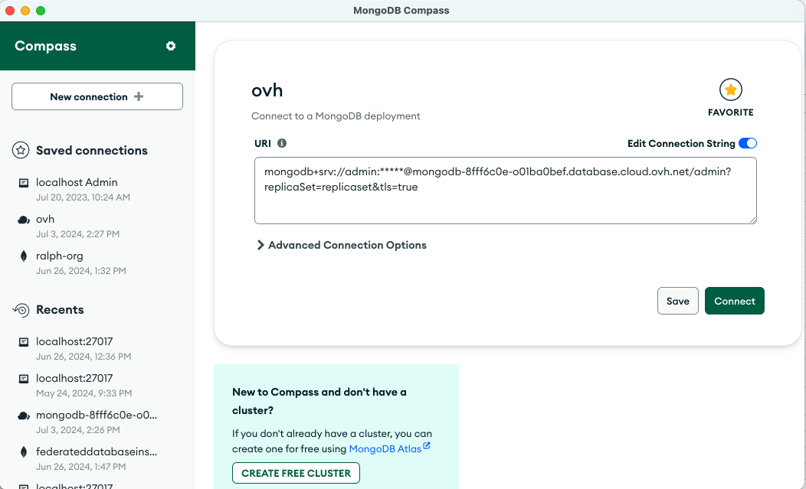
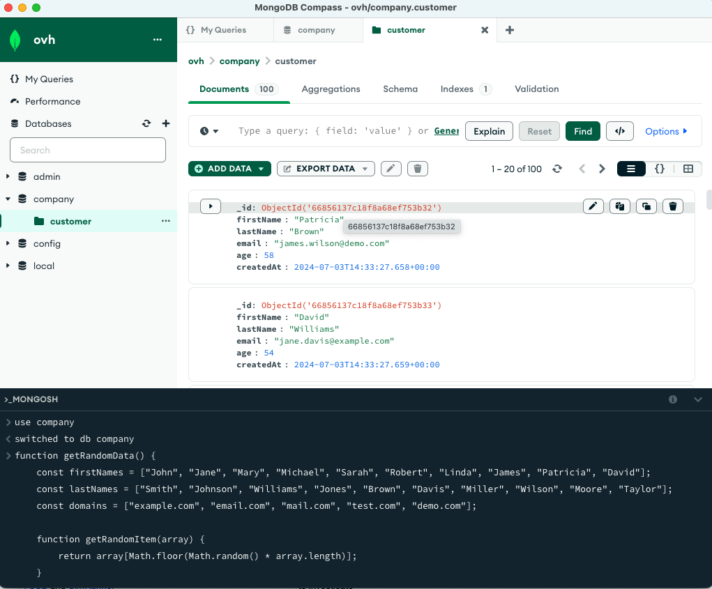
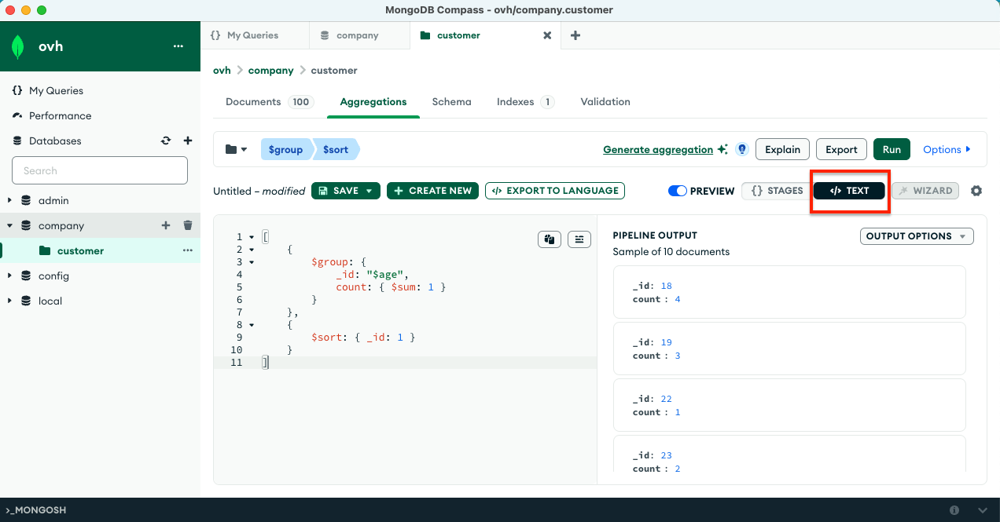

## Objective

To get you started with MongoDB on OVH cloud, the following page will show you how to determine the initial sizing for a MongoDB deployment, considering whether to opt for an Advanced or Production subscription on a public or Vrack network. After deploying the cluster, we will provide guidelines on how to connect with Compass and then how to upscale and downscale an OVH cloud cluster. Additionally, we will cover MongoDB basics such as Design Patterns, indexing, and querying to help you  get started effectively with MongoDB.

## MongoDB Cluster Sizing

In order to properly size a MongoDB cluster, there are four key elements to keep in account:
1. **RAM** - The most important part for a MongoDB cluster.
2. **CPU**.
3. **Storage & IOPS** - Minimize access to disk, but ensure the storage layer is fast and has low latency.
4. **Network** - MongoDB is a distributed database.

Sizing a MongoDB cluster is closely linked to designing a MongoDB schema. Evaluating the schema model and understanding the data access patterns are essential. To effectively size a cluster, two preliminary operations must be performed:

1. **To Qualify**:
   - Define domain objects
   - Define your queries
   - Know your indexes
   - Determine your access pattern
   - Choose a shard key when dealing with sharding

2. **To Quantify**:
   - Estimate the number of documents after 1 month, 6 months, and a year
   - Identify the most frequently read data (e.g., last month's worth of data)

### Determine RAM Size

#### Determine Total Index Size:
To determine the quantity of RAM a cluster should be provisioned with, it's necessary to determine the total index size and the working set size. Use a custom function in the MongoDB shell (`mongosh`) or `db.collection.totalIndexSize()` for this purpose.
```javascript
  indexSize = function () {
    var total = 0,
      dbnames = function () {
        var r = db.adminCommand({
          listDatabases: 1
        });
        if (!r || r.databases === undefined) {
          return [];
        };
        return r.databases.map(n => n.name).filter(name => name !== "admin" && name !== "config" && name !== "local");
      };
    var div = 1024 * 1024;
    dbl = dbnames();
    for (var i = 0; i < dbl.length; i++) {
      var s = db.getSiblingDB(dbl[i]).stats();
      if (!s) continue;
      total += Number(s.indexSize ? s.indexSize : 0);
    }
    return Math.round(total / div) + ' MB';
  }

  indexSize()
```
##### Estimating Index Size:
- Indexes in memory can use prefix compression.
- For in-memory pages, WiredTiger stores the common prefix once.
- Unlike storage/block compression, it doesn't eat CPU cycles.
- Ordering of compound indexes can impact the size of the index on disk.
##### Example on prefix compression

| Index Entry | Prefix |
|-------------|--------|
| use         | 0 => ‘use’ |
| used        | 1 => ‘0d’ |
| useful      | 2 => ‘0ful’ |
| usefully    | 3 => ‘2ly’ |
| usefulness  | 4 => ‘2ness’ |

**The Formula:**

2 * ( number of documents * (average field size * compression factor) )


**Example:**
A string type field of an average of 12 bytes, if we index a collection with 100k documents on a date field the formula will be, if we decide to not count in the compression factor as the value will be highly dynamic:

(2*(100000*12))/1024/1024 = 2.40MB

with a heuristic compression factor:

(2*(100000*(12*0.95)))/1024/1024 = 2.28MB

For compound indexes, it's the same formula, just sum up all average field sizes. But, we stop here as other types of indexes are way more difficult to determine dimensions.

#### Note on Types of Indexes:
- MongoDB can index full text, multikey (fields that are array), wildcard.
- These types of indexes occupy more space and are difficult to calculate.
- Creating a dummy database with similar data helps in estimation.

#### Determine the Working Set Size
The working set is the most frequently used data that MongoDB tends to retain in memory. Calculating this value is challenging and can be based on assumptions and statistics. Reserve space in the WiredTiger cache to allow MongoDB to work with frequently accessed data in memory.

**Formula:**

WS = ((FDD / TDSD) * S%) * TDS

**The formula explained:**

| Frequently used data in days (FDD)  | How long we are querying back in time in terms of days. |
|-------------------------------------|---------------------------------------------------------|
| Total data set in days (TDSD)       | The data set we're analyzing is worth of how many days/years in days. |
| Subset percentage of the FDD (S%)   | ex. 50% Are all the queries "touching" all the FDD days worth of data or just a subset of it? |
| Target data set size (TDS)          | How big is the entire data set. |


**Example:**
For 30 days of frequently used data over a year, with 30% of queries on frequently used data, and a dataset of 100GB:

WS = ((30 / 365) * 30%) * 100000 (MB) = 2500 MB~


#### Determine the RAM quantity

The MongoDB's storage engine, WiredTiger, manages its own cache, where indexes and most recently read documents reside, among a number of other elements. Cache size is, by default, around 50% of the host machine total RAM. It is possible to customize the cache size for on-premise deployment; however, it is not advisable to do so.

If we provision with a 32GB RAM per node, then we can assume WiredTiger will have around 16GB for its own cache. WiredTiger has a target threshold to keep the cache 80% full. After this limit, it will start to evict blocks. Therefore, only ~40% of the memory available on the host system will be used for cached documents and, most importantly, for indexes. 

The formula then is reversed by the 250% to the correct total RAM value.

**Total cluster memory (TCM) = (TIS + WS) * 250% + 1000 (MB)**

- **Total index size (TIS)** in MB
- **Working set size (WS)** in MB

### Determine Storage Size

Storage size estimation is quite straightforward. Use your test data set as a baseline and look at your db-stats storage size. A formula that can be used is the following:

- **Test data storage size (TDSS)**
- **Test data document count (TSDC)**
- **Target data document count (TADC)**
- **Buffer percentage (B%)** = usually 70%

**Total storage size (TSS) = (TDSS / TSDC) * TADC / B%**

Example: If I have 10 million documents in my test data set and the total storage size of that data set is 10 GB and the target system should store 1 billion documents, then it would require ~1.4 TB disk space.

**TSS = (10 GB / 10,000,000) * 1,000,000,000 / 70% = ~1.4 TB**

### Determine CPU

Unfortunately, CPU is a bit more difficult to estimate because it depends strongly on the use case and the number of cores the CPUs themselves have.

However, following the ratio of 1 CPU for every 4GB of RAM for MongoDB clusters usually provides the best performance for the vast majority of applicable use cases. If the application using the MongoDB database does not use much CPU (no aggregation pipeline framework, indexes perfectly covering the majority of the queries), then it is possible to cut the ratio from 1/4 to 1/8. For instance, a workload that performs more writes than reads can easily perform normally with lower CPU usage. The CPU aspect ratio is strictly connected to the WiredTiger storage engine and the quantity of cache it manages. To process the cache properly, the ratio has to be respected.

**Total Cluster CPU (TCC) = TCM / 4**

Therefore, in an example where the total count of necessary memory is 10 GB, this will produce a result of 2.5 CPUs to allow MongoDB to work properly. A 16 GB RAM size will produce 4 CPUs.


### Determine Storage IOPS

The most complicated aspect is to determine how much IOPS the storage layer is using as per MongoDB workload. The only way to know precisely is to, firstly know your disk capacity in terms of IOPS, and secondly, perform performance testing on the use case. This will reveal how much IOPS MongoDB is consuming. Keep in mind that every update on a single field of a document will produce a full rewrite of the document every time the storage engine decides to persist the document on disk.

#### Rule of Thumb:
- Count one IO per 4KB (compressed) write per unit time.
- At high write levels (several K/s), IOs will be merged (>8KB document will use 2 IOs).
- It is difficult to estimate the merging factor: when IO requests start piling up, it is not uncommon to see a factor of 5-10 (or more).
- When in doubt, model the workload, test it, and collect metrics.
- Add enough IO / disk throughput to handle writing 60s worth of data to disk in a few seconds.
- Checkpoints are sensitive operations, happening every 60s normally, and you want them to run in a small amount of time.

If you write small documents, smaller than 4KB, there is a potential waste of IOPS.

The following blog article describes how to use design patterns to improve data quality. The bucket pattern, among other useful patterns, is explained: [Building with Patterns: A Summary](https://www.mongodb.com/blog/post/building-with-patterns-a-summary).

### Network Considerations for MongoDB

- Aim for latency under 1 millisecond between MongoDB nodes in a replica set.
- Aim for as high bandwidth as possible between the application and the database.

As a distributed database, MongoDB relies on efficient network transport during query routing and inter-node replication. Based on the snappy compression algorithm, network traffic across a MongoDB cluster can be compressed by up to 80%, providing major performance benefits in bandwidth-constrained environments and reducing networking costs.

You can add the [compressors](https://www.mongodb.com/docs/manual/reference/connection-string/#compression-options) parameter to the connection string to enable compression:

mongodb://localhost/?compressors=snappy

## Create your MongoDB Database Cluster
You can refer to the [Getting Started](https://help.ovhcloud.com/csm/en-public-cloud-databases-getting-started?id=kb_article_view&sysparm_article=KB0048745) documentation to create your MongoDB cluster based on the result of the sizing.

## Private vs Public Networks for Managed MongoDB Database
When deploying a managed MongoDB database, one critical decision involves choosing between a [private and public network setup](https://help.ovhcloud.com/csm/en-ie-public-cloud-databases-configure-vrack?id=kb_article_view&sysparm_article=KB0048817). Each option has its own set of advantages and considerations. Understanding these differences can help you make an informed decision that best suits your application's requirements.

## Scale Up MongoDB Cluster
[Upscaling a MongoDB cluster](https://help.ovhcloud.com/csm/en-ie-public-cloud-databases-update-cluster-plan?id=kb_article_view&sysparm_article=KB0061030) by adding more CPU, RAM, and I/O resources ensures optimal performance as workloads increase. Additional CPU power enhances query processing capabilities, while increased RAM allows more data to be cached in memory, speeding up read operations. Enhanced I/O capacity improves data read/write speeds, essential for high-throughput applications. Overall, upscaling maintains database responsiveness and reliability, supporting evolving business needs.

## Scale Down MongoDB Cluster
Not available for now.
## Connecting to MongoDB Database with MongoDB Compass

To connect to your MongoDB database hosted on OVH using MongoDB Compass, follow these steps:

1. **Install MongoDB Compass**: If you haven't already, [download and install MongoDB Compass](https://www.mongodb.com/try/download/compass)
2. [**Add a Database User**](https://help.ovhcloud.com/csm/en-public-cloud-databases-mongodb-managing-service?id=kb_article_view&sysparm_article=KB0049061): In your OVHcloud account, navigate to your MongoDB cluster under section **General Information > Login Information > Manage users** and add a new [database user with the appropriate permissions](https://www.mongodb.com/docs/manual/tutorial/manage-users-and-roles/).
3. **Whitelist your IP address**: Navigate to your MongoDB cluster, under the **Authorized IPs** tab, make sure to include your IP.
4. **Open MongoDB Compass**: Launch MongoDB Compass on your computer.
5. **Obtain Connection String**: In your OVHcloud account, navigate to your MongoDB cluster, and under **General Information** obtain the connection string. This string includes necessary information such as the hostname and authentication details.
6. **Edit Connection String**: Make sure to replace the `<username>` and `<password>` with user information you created in the previous step.


   
8. **Connect**: click the "Connect" button to establish a connection to your MongoDB database.

## Insert and Query Data
you can use the [mongoshell](https://www.mongodb.com/docs/mongodb-shell/), integrated in Compass, to create your first database and collection. Below is a script that creates the database **company** and collection **customer** and inserts 100 random documents.

### Load Data into MongoDB

To load 100 documents into a collection called `customer` with random data, use the following `mongosh` script:

```javascript
use company;

// Function to generate random data
function getRandomData() {
    const firstNames = ["John", "Jane", "Mary", "Michael", "Sarah", "Robert", "Linda", "James", "Patricia", "David"];
    const lastNames = ["Smith", "Johnson", "Williams", "Jones", "Brown", "Davis", "Miller", "Wilson", "Moore", "Taylor"];
    const domains = ["example.com", "email.com", "mail.com", "test.com", "demo.com"];
    
    function getRandomItem(array) {
        return array[Math.floor(Math.random() * array.length)];
    }
    
    return {
        firstName: getRandomItem(firstNames),
        lastName: getRandomItem(lastNames),
        email: `${getRandomItem(firstNames).toLowerCase()}.${getRandomItem(lastNames).toLowerCase()}@${getRandomItem(domains)}`,
        age: Math.floor(Math.random() * 60) + 18,
        createdAt: new Date()
    };
}

// Insert 100 random documents into the customer collection
const bulk = db.customer.initializeUnorderedBulkOp();
for (let i = 0; i < 100; i++) {
    bulk.insert(getRandomData());
}
bulk.execute();

print("100 random documents inserted into the 'customer' collection.");
```


### Query Data with the Aggregation Framework

The below MongoDB aggregation pipeline uses the [MongoDB Aggregation Framework](https://www.mongodb.com/docs/manual/aggregation/) to group customers by age and count each occurence. You can use the mongoshell to execute:

```javascript
db.customer.aggregate([
    {
        $group: {
            _id: "$age",
            count: { $sum: 1 }
        }
    },
    {
        $sort: { _id: 1 }
    }
]);
```

You can also use the UI with Compass to execute the aggregation pipeline.



## MongoDB Developer Best Practices

### Data Modeling and Design Patterns

- **Understand Your Application Requirements**: Start by thoroughly understanding the application requirements and how data will be accessed. This helps in designing schemas that meet performance and scalability needs.

- **Use Schema Design Patterns**: Utilize common [schema design patterns](https://www.mongodb.com/blog/post/building-with-patterns-a-summary) like the **Bucket Pattern**, **Outlier Pattern**, **Subset Pattern**, and **Attribute Pattern** to handle large datasets efficiently. Each pattern has specific use cases:
  - [Bucket Pattern](https://www.mongodb.com/blog/post/building-with-patterns-the-bucket-pattern): Ideal for time-series data, this pattern groups related data into buckets to reduce the number of documents and improve query performance.
  - [Outlier Pattern](https://www.mongodb.com/blog/post/building-with-patterns-the-outlier-pattern): Manage outliers separately to maintain efficient indexing and querying for the majority of your data.
  - [Subset Pattern](https://www.mongodb.com/blog/post/building-with-patterns-the-subset-pattern): Break down large datasets into manageable subsets to enhance performance and maintainability.
  - [Attribute Pattern](https://www.mongodb.com/blog/post/building-with-patterns-the-attribute-pattern): used to handle scenarios where documents contain a large number of similar fields, by consolidating them into a key-value pair array, thus optimizing for query flexibility and storage efficiency.

- **Avoid Schema Design Anti-Patterns**: Be aware of and avoid common [schema design anti-patterns](https://www.mongodb.com/developer/products/mongodb/schema-design-anti-pattern-summary/) such as:
  - **Massive Arrays**: Arrays with large numbers of elements can lead to inefficient querying and increased memory usage.
  - **Overly Deeply Nested Documents**: Deeply nested documents can complicate queries and degrade performance. Instead, consider flattening your data structure or using references.
  - **Monolithic Collections**: Avoid storing unrelated data in a single collection, which can lead to inefficient indexing and querying.

- **Leverage Document Validation**: Leverage, whenever necessary, MongoDB’s [schema validation](https://www.mongodb.com/docs/manual/core/schema-validation/#schema-validation) to enforce data integrity and ensure that documents adhere to a defined structure. Be cautious not to overuse this feature, as it consumes additional resources. Remember, MongoDB is designed to be flexible.

### Indexing

When developing your [indexing strategy](https://www.mongodb.com/docs/manual/applications/indexes/#indexing-strategies) you should have a deep understanding of your application's queries. Before you build indexes, map out the types of queries you will run so that you can build indexes that reference those fields. Indexes come with a performance cost, but are more than worth the cost for frequent queries on large data sets. 

- **Create Indexes Based on Query Patterns**: Analyze your query patterns and create indexes that support the most frequent and performance-critical queries. Use [compound indexes](https://www.mongodb.com/docs/manual/core/indexes/index-types/index-compound/#compound-indexes) where multiple fields are queried together.

- **Use Covered Queries**: Design [indexes that cover the fields](https://www.mongodb.com/docs/manual/core/query-optimization/#covered-query) required by your queries. This allows MongoDB to satisfy the query using only the index, without scanning the documents, leading to significant performance improvements.

- **Optimize Index Size**: Regularly monitor and optimize the size of your indexes. Use MongoDB’s built-in tools to calculate the total index size and ensure it fits within the available RAM to avoid excessive disk I/O.

- **Avoid Over-Indexing**: While indexes improve query performance, too many indexes can degrade write performance and increase storage requirements. Only create indexes that are necessary for your application’s queries.

- **Use TTL Indexes for Expiring Data**: For data that needs to expire after a certain period, such as session information or logs, use [TTL (Time-To-Live) indexes](https://www.mongodb.com/docs/manual/core/index-ttl/#ttl-indexes). This helps in automatically removing expired data and maintaining an efficient dataset.

- **Equality Sort Range Rule (ESR)**: The [ESR rule](https://www.mongodb.com/docs/manual/tutorial/equality-sort-range-rule/#the-esr--equality--sort--range--rule) in MongoDB is a guideline for optimizing query performance by structuring compound indexes. The rule suggests placing fields used for equality comparisons first, followed by fields used for sorting, and finally fields used for range queries. This order maximizes the efficiency of index utilization and improves query performance.

### ReadPreference and WriteConcern

[ReadPreference](https://www.mongodb.com/docs/manual/core/read-preference/) controls how MongoDB clients direct read operations to the members of a replica set. It determines which member of the replica set will be used for read operations. Here are the types of ReadPreference:

[WriteConcern](https://www.mongodb.com/docs/manual/reference/write-concern/) describes the level of acknowledgment requested from MongoDB for write operations. It ensures data durability and consistency by specifying how many members of the replica set must acknowledge the write.

For more information refer to the following [documentation](https://github.com/ralphsawaya/ovh/blob/main/MongoDoc/mongodb_08_Read%20performance%20%26%20write%20concerns/guide.en-gb.md#introduction).

### Leverage MongoDB Change Streams

MongoDB [Change Streams](https://www.mongodb.com/docs/manual/changeStreams/) provide a powerful way to listen and react to real-time changes in your MongoDB collections. This feature allows applications to be more responsive by enabling real-time updates and notifications. With Change Streams, you can watch for changes such as insertions, updates, deletions, and more in your collections, and then trigger specific actions based on these changes. This capability is essential for building reactive applications, enabling real-time analytics, synchronizing data across different systems, and more.

### Monitoring

- **Implement Comprehensive Monitoring**: Utilize MongoDB’s monitoring tools, such as [database commands](https://www.mongodb.com/docs/manual/administration/monitoring/#mongodb-reporting-tools), [OVH Metrics tab](https://help.ovhcloud.com/csm/en-ie-public-cloud-databases-mongodb-monitoring?id=kb_article_view&sysparm_article=KB0061661), or third-party monitoring solutions, to continuously monitor database performance, resource utilization, and operational metrics.

- **Set Up Alerts**: Configure alerts for key performance indicators such as high CPU usage, memory consumption, disk I/O, and slow queries. This enables proactive management and quick resolution of potential issues.

- **Analyze Query Performance**: Regularly review and analyze query performance using tools like the [MongoDB Profiler](https://www.mongodb.com/docs/manual/reference/database-profiler/) and [Explain Plans](https://www.mongodb.com/docs/manual/reference/explain-results/). Identify and optimize slow queries to ensure efficient data retrieval.

- **Monitor Index Performance**: Keep track of index usage statistics to identify unused or underutilized indexes. Remove or optimize these indexes to maintain optimal performance.

- **Plan for Backups and Disaster Recovery**: Ensure regular backups are scheduled and tested. Utilize MongoDB’s backup tools to create consistent and reliable backups, and have a well-defined disaster recovery plan in place.

By following these best practices, developers can design efficient and scalable MongoDB databases that meet the performance and operational needs of their applications.


## We want your feedback!

We would love to help answer questions and appreciate any feedback you may have.

If you need training or technical assistance to implement our solutions, contact your sales representative or click on [this link](https://www.ovhcloud.com/en-gb/professional-services/) to get a quote and ask our Professional Services experts for a custom analysis of your project. Join our community of users on <https://community.ovh.com/en/>.

Are you on Discord? Connect to our channel at <https://discord.gg/ovhcloud> and interact directly with the team that builds our databases service!
