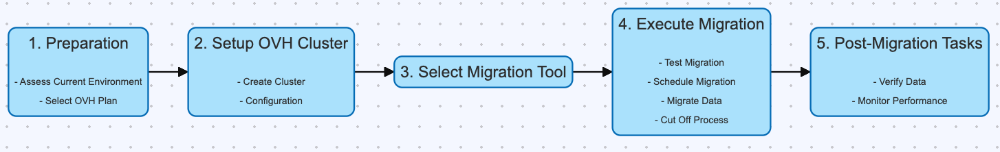

## Objective

This documentation is to provide a comprehensive approach to MongoDB database migration, ensuring data integrity, minimal downtime, and optimal performance. Whether you are migrating from:

- MongoDB instance to a new MongoDB OVHcloud instance.
- Any Document DB to MongoDB OVHcloud instance.

This guide covers the essential tools and processes required for a successful migration.

## Migration Tools

### Tools With Expected Downtime

These tools are used during migration processes where some expected downtime.

#### 1. mongodump
[mongodump](https://www.mongodb.com/docs/database-tools/mongodump/) is a utility for creating a binary export of the contents of a MongoDB database. It is particularly useful for backing up databases and migrating data between MongoDB instances.

Use the [`--dumpDbUsersAndRoles`](https://www.mongodb.com/docs/database-tools/mongodump/#std-option-mongodump.--dumpDbUsersAndRoles) option to include user and role definitions in the database's dump directory when performing mongodump on a specific database. This option applies only when you specify a database in the --db option

#### 2. mongorestore
[mongorestore](https://www.mongodb.com/docs/database-tools/mongorestore/) complements mongodump by allowing you to restore a binary dump created by mongodump. This tool is essential for restoring data to a MongoDB instance.

Use the [`restoreDbUsersAndRoles`](https://www.mongodb.com/docs/database-tools/mongorestore/#std-option-mongorestore.--restoreDbUsersAndRoles) option to Restore user and role definitions for the given database. Restoring the admin database by specifying `--db admin` to mongorestore already restores all users and roles.

### Tools With Minimal Downtime

These tools are designed to minimize downtime during the migration process.

#### 1. mongosync
The [mongosync](https://www.mongodb.com/docs/cluster-to-cluster-sync/current/reference/mongosync/) binary is the primary process used in Cluster-to-Cluster Sync. provides you with continuous, uni-directional data synchronization of MongoDB clusters in the same or different environments. Check the mongosync [limitations](https://www.mongodb.com/docs/cluster-to-cluster-sync/current/reference/limitations/) before starting the migration.

#### 2. MongoDB Kafka Connector
[MongoDB Kafka Connector](https://www.mongodb.com/docs/kafka-connector/current/) allows you to integrate MongoDB with Apache Kafka, enabling real-time data synchronization and minimizing downtime during migrations by streaming data changes directly to MongoDB.

# Migration Strategy

## 1. Preparation

### Assess Current Environment
- **Metrics Collection**: Collect current metrics such as CPU usage, RAM, IOPS, disk space, and network usage. This will help you choose the appropriate OVH cluster size.
- **Backup**: Create a comprehensive backup of your current MongoDB instance.

### Select OVH cloud Plan
- Based on the metrics collected (CPU, RAM, Disk IOPS, Disk Space, etc.), choose an OVH cloud plan that meets or exceeds the current specifications of your MongoDB instance.
- Consider future growth and scalability needs. You might want to consider how to [size a MongoDB cluster](https://github.com/ralphsawaya/ovh/blob/main/MongoDoc/mongodb_02_Best_practise_to_implement%20_your_first_mongoDB_instance/guide.en-gb.md#mongodb-cluster-sizing).

## 2. Setup OVH cloud Cluster
- **Create Cluster**: [Set up the new OVH managed MongoDB cluster](https://help.ovhcloud.com/csm/en-public-cloud-databases-getting-started?id=kb_article_view&sysparm_article=KB0048745).
- **Configuration**: Configure the OVH cloud cluster settings to match your current MongoDB cluster's configuration as closely as possible.

## 3. Data Migration Tools

Use one of the tools mentioned in the [previous section](https://github.com/ralphsawaya/ovh/blob/main/MongoDoc/mongodb_03_Move%20to%20OVHcloud%20mongoDB%20managed%20from%20an%20existing%20mongoDB%20instance/guide.en-gb.md#migration-tools).

## 5. Migration Execution

### Schedule Migration
- Plan the migration during a maintenance window to minimize impact.
- Inform stakeholders of potential downtime.

### Migrate Data
- Execute the chosen migration method.
- Monitor the process to ensure data is transferred correctly.

### Cut Off Process
- **Continuous Synchronization**: If using `mongosync`  mentioned in the [previous section](https://github.com/ralphsawaya/ovh/blob/main/MongoDoc/mongodb_03_Move%20to%20OVHcloud%20mongoDB%20managed%20from%20an%20existing%20mongoDB%20instance/guide.en-gb.md#migration-tools), which offer continuous synchronization, monitor the synchronization logs.
- **Identify Synchronization Lag**: Wait until the logs indicate that the target cluster is only a few seconds behind (e.g., 2 seconds) the source cluster.
- **Stop Writes to Source Cluster**: At this point, stop all write operations to the source cluster to ensure no data loss.
- **Update Application Configuration**: Change the application configuration to point to the new OVH cloud cluster.
- **Deploy Changes**: Deploy the updated configuration to your application.
- **Restart Application**: Restart the application to begin using the new OVH cloud target cluster.

## 6. Post-Migration Tasks

### Verify Data
- Validate that all data has been transferred and is accessible.
- Check for any discrepancies or missing data.

### Monitor Performance
- Continuously monitor the new OVH cloud cluster to ensure it meets performance expectations.
- Adjust configurations as needed based on performance metrics.

## We want your feedback!

We would love to help answer questions and appreciate any feedback you may have.

If you need training or technical assistance to implement our solutions, contact your sales representative or click on [this link](https://www.ovhcloud.com/en-gb/professional-services/) to get a quote and ask our Professional Services experts for a custom analysis of your project. Join our community of users on <https://community.ovh.com/en/>.

Are you on Discord? Connect to our channel at <https://discord.gg/ovhcloud> and interact directly with the team that builds our databases service!
