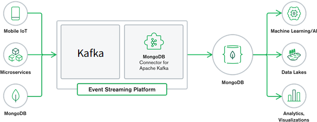
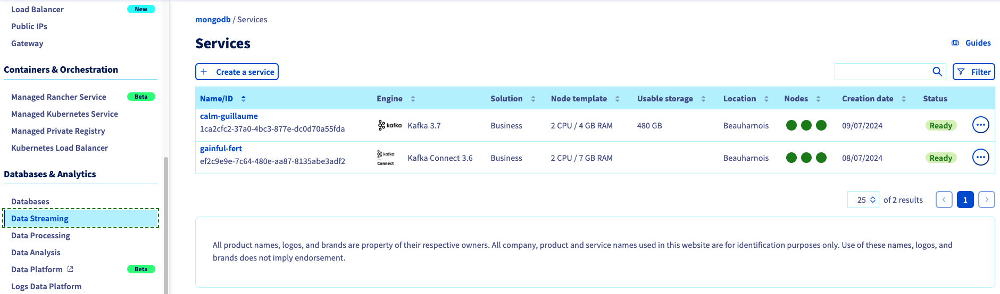
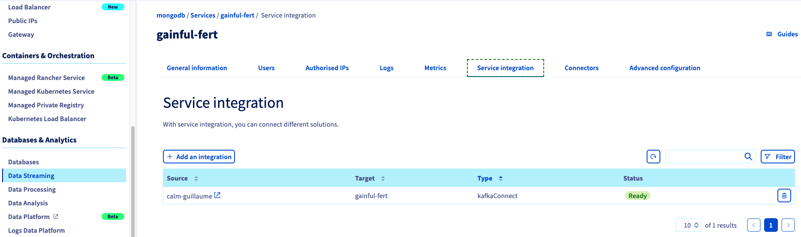
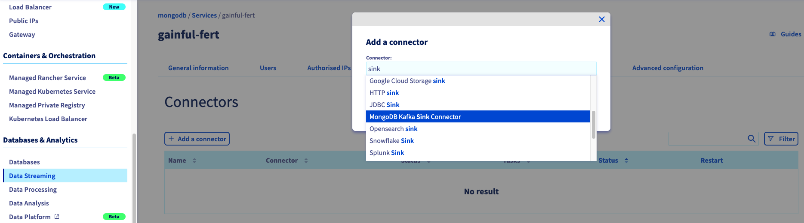
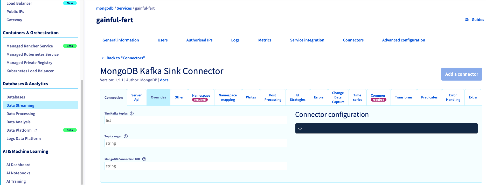

## Introduction
The [MongoDB Kafka Connector](https://www.mongodb.com/docs/kafka-connector/current/#mongodb-kafka-connector) is an integration tool that bridges MongoDB with Apache Kafka, enabling real-time data synchronization and streaming between the two platforms. This connector facilitates the seamless transfer of data, allowing MongoDB to be used both as a source and a sink within a Kafka ecosystem. By leveraging this connector, developers can build robust data pipelines, ensuring efficient and reliable data flow across their applications.

## Quick Start Guide
Learn how to get started with the MongoDB Kafka Connector and begin working with data in the Kafka [Connector Quick Start](https://www.mongodb.com/docs/kafka-connector/current/quick-start/#std-label-kafka-quick-start) section.

## Tutorials
Follow [tutorials](https://www.mongodb.com/docs/kafka-connector/current/tutorials/#std-label-kafka-connector-tutorials) to learn how to set up the MongoDB Kafka Connector to read and write data for several use cases.

## Key Components
1. [Source Connector](https://www.mongodb.com/docs/kafka-connector/current/source-connector/#source-connector): Captures changes from MongoDB and streams them into Kafka topics. It uses MongoDB’s Change Streams to monitor changes in collections and databases.
2. [Sink Connector](https://www.mongodb.com/docs/kafka-connector/current/sink-connector/#std-label-kafka-sink-overview): Reads data from Kafka topics and writes it into MongoDB collections. This component ensures that data from various Kafka topics can be persisted in MongoDB for further processing or querying.

### Setup Kafka Sink and Source Connectors

#### STEP 1: Create `KafkaConnect` and `Kafka` services

Under `Data Streaming` create `KafkaConnect` and `Kafka` services.

#### STEP 2: Integrate the `Kafka` service to `KafkaConnect`
Select the `Kafka Connect` service and under `Service Integration`, click the `+ Add an Integration` button and select `KafkaConnect` as integration type, an then add the `Kafka` service.

#### STEP 3: Add the Connector 
Under `Connectors` tab in `KafkaConnect`, click the `+ Add a Connector` and then select either `MongoDB Kafka Sink Connector` or `MongoDB Kafka Source Connector`.

#### STEP 4: Configure the Connector
You can refer to [Sink Connector Configuration Properties](https://www.mongodb.com/docs/kafka-connector/current/sink-connector/configuration-properties/) and [Source Connector Configuration Properties](https://www.mongodb.com/docs/kafka-connector/current/source-connector/configuration-properties/#source-connector-configuration-properties) to complete the setup.

## Monitoring
Learn how to [monitor](https://www.mongodb.com/docs/kafka-connector/current/monitoring/#std-label-kafka-monitoring) your MongoDB Kafka source and sink connectors in the Monitoring section.

## Troubleshooting
Learn how to resolve issues you may encounter while running the MongoDB Kafka Connector in the [Troubleshooting](https://www.mongodb.com/docs/kafka-connector/current/troubleshooting/#std-label-kafka-troubleshooting) section.

## Use Cases
- **Data Streaming**: Real-time data streaming from MongoDB to Kafka for analytics and monitoring.
- **ETL Pipelines**: Using Kafka as a central hub for ETL processes, with MongoDB serving as a source or sink.
- **Microservices Integration**: Synchronizing data across microservices architectures, ensuring consistent data states.
- **Event-Driven Architectures**: Building event-driven systems where MongoDB and Kafka work together to handle events and triggers efficiently.

## We want your feedback!

We would love to help answer questions and appreciate any feedback you may have.

If you need training or technical assistance to implement our solutions, contact your sales representative or click on [this link](https://www.ovhcloud.com/en-gb/professional-services/) to get a quote and ask our Professional Services experts for a custom analysis of your project. Join our community of users on <https://community.ovh.com/en/>.

Are you on Discord? Connect to our channel at <https://discord.gg/ovhcloud> and interact directly with the team that builds our databases service!
