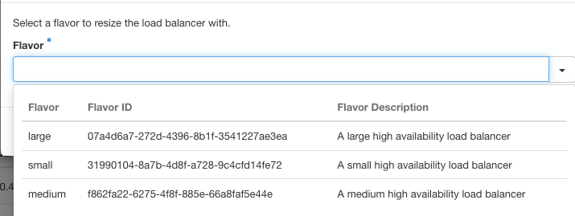

## Objective

This guide explains how to change the size of your load balancer in the OVHcloud Horizon interface.

## Requirements

- Access to the [OVHcloud Horizon interface](https://horizon.cloud.ovh.net/project/load_balancer)
- A load balancer [already created and available](pages/public_cloud/public_cloud_network_services/getting-started-01-create-lb-service)
- User privileges to modify load balancer settings

## Instructions

### Step 1: Log into Horizon

1. Navigate to the [OVHcloud Horizon interface](https://horizon.cloud.ovh.net/project/load_balancer).
2. Log in with your credentials.

### Step 2: Locate the Load Balancer

1. Once logged in, go to the **Load Balancer** section.
2. Find your existing load balancer in the list.

### Step 3: Edit the Load Balancer

1. On the right side of your load balancer entry, click the down arrow button next to it.
2. Select **Edit Load Balancer** from the dropdown menu.

### Step 4: Resize the Load Balancer

1. In the options menu, choose **Resize Load Balancer**.  
   

2. A window will prompt you to select a new size for your load balancer.

### Step 5: Select a Flavor

1. In the dropdown, select the desired size for your load balancer:
   - **Small**
   - **Medium**
   - **Large**

   

2. Confirm your selection and apply the changes.

### Step 6: Save Changes

1. After selecting the new flavor, click **Apply** or **Save** to update the size of your load balancer.

## Go Further

For additional help or information, join our community of users on <https://community.ovh.com/en/>.
