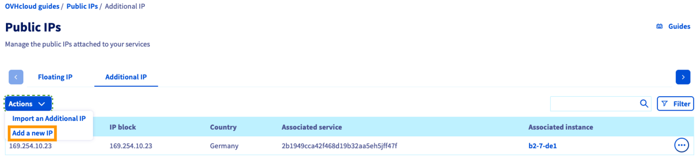
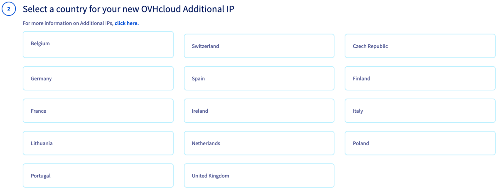
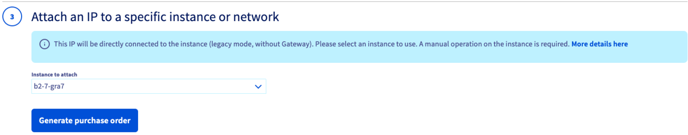

> [!primary]
> Diese Übersetzung wurde durch unseren Partner SYSTRAN automatisch erstellt. In manchen Fällen können ungenaue Formulierungen verwendet worden sein, z.B. bei der Beschriftung von Schaltflächen oder technischen Details. Bitte ziehen Sie im Zweifelsfall die englische oder französische Fassung der Anleitung zu Rate. Möchten Sie mithelfen, diese Übersetzung zu verbessern? Dann nutzen Sie dazu bitte den Button "Beitragen" auf dieser Seite.
>

**Letzte Aktualisierung am 04.01.2023**

> [!primary]
>
> Seit dem 6. Oktober 2022 heißt unser Dienst "Failover-IP" nun [Additional IP](https://www.ovhcloud.com/de/network/additional-ip/). Die Namensänderung hat keine Auswirkungen auf dessen technische Funktionen.
>

## Ziel

Aus verschiedenen Gründen kann es sein, dass Sie eine Additional IP-Adresse auf Ihren Instanzen konfigurieren müssen:

- Sie haben auf Ihrer Instanz mehrere Websites.
- Sie hosten internationale Projekte.

Um diesen Anforderungen zu entsprechen, können Sie eine Additional IP-Adresse für Ihre Public Cloud Instanzen erwerben.

Diese Additional IPs können nur für Instanzen desselben Projekts migriert werden.

**Diese Anleitung erklärt, wie Sie eine Additional IP-Adresse für Ihr OVHcloud Public Cloud Projekt erwerben können.**

## Voraussetzungen

- Sie haben Zugriff auf Ihr [OVHcloud Kundencenter](https://www.ovh.com/auth/?action=gotomanager&from=https://www.ovh.de/&ovhSubsidiary=de).
- Sie haben mindestens eine [Public Cloud Instanz](/pages/public_cloud/compute/public-cloud-first-steps) in Ihrem Kunden-Account.

> [!warning]
> Diese Funktion ist derzeit für Metal Instanzen nicht verfügbar.
>

## In der praktischen Anwendung

Loggen Sie sich in Ihrem [OVHcloud Kundencenter](https://www.ovh.com/auth/?action=gotomanager&from=https://www.ovh.de/&ovhSubsidiary=de) ein und wählen Sie im Bereich `Public Cloud`{.action} Ihr Projekt aus.

Öffnen Sie im linken Menü `Public IPs`{.action} unter `Network`.

Öffnen Sie den Tab `Additional IP`{.action} und klicken Sie auf den Button `Aktionen`{.action}. Wählen Sie `Eine neue IP hinzufügen`{.action}.

{.thumbnail}

Klicken Sie in Schritt 1 der Bestellung auf `Weiter`{.action}.

{.thumbnail}

In Schritt 2 können Sie ein Land für die neue IP-Adresse auswählen.

{.thumbnail}

Folgende Länder sind für die Geolokalisierung von IPs verfügbar:

|          |          |          |           |                |
|:--------:|:--------:|:--------:|:---------:|:--------------:|
| Belgien  | Finnland  | Frankreich   | Deutschland   | Tschechische Republik |
| Irland  |  Italien   | Litauen | Niederlande | Vereinigtes Königreich    |
| Portugal |  Spanien   |  Polen |  Schweiz |                 |

> [!primary] **Verfügbarkeit**
> 
> Es ist möglich, dass einige dieser Länder nicht aufgelistet werden, abhängig von der aktuellen Verfügbarkeit der IPv4-Adressen.
> 

> [!primary] **Lokalisierung**
>
> Die Geolokalisierung referenziert ausschließlich die jeweils authoritative Organisation.
> 
> Zum Beispiel bedient [RIPE NCC](https://www.ripe.net/){.external} Europa als die *Regional Internet Registry*.
>
> Wenn Sie die Geolokalisierung anderweitig überprüfen möchten, wenden Sie sich direkt an die betreffenden Organisationen. OVHcloud kann Ihnen diesbezüglich keine Unterstützung gewähren.

Klicken Sie nach der Auswahl auf `Weiter`{.action}.

Wählen Sie im letzten Schritt Ihre Instanz im Drop-down-Menü aus. Klicken Sie anschließend auf `Bestellschein erstellen`{.action}.

{.thumbnail}

Der Bestellschein wird automatisch geöffnet, damit Sie Ihre Bestellung abschließen können.

Weitere Informationen finden Sie in unserer [Anleitung zur Verwaltung von Bestellungen](/pages/account_and_service_management/managing_billing_payments_and_services/managing_ovh_orders).

Sie finden den Bestellschein auch in Ihrem Kundencenter, wenn Sie im Bereich `Dashboard`{.action} auf `Meine Bestellungen`{.action} klicken.

Im nächsten Schritt muss die IP-Adresse in Ihrem Betriebssystem konfiguriert werden. Lesen Sie dazu unsere [Anleitung zur IP-Konfiguration](/pages/public_cloud/public_cloud_network_services/getting-started-04-configure-additional-ip-to-instance).

## Weiterführende Informationen

Wenn Sie Schulungen oder technische Unterstützung bei der Implementierung unserer Lösungen benötigen, wenden Sie sich an Ihren Vertriebsmitarbeiter oder klicken Sie auf [diesen Link](https://www.ovhcloud.com/de/professional-services/), um einen Kostenvoranschlag zu erhalten und eine persönliche Analyse Ihres Projekts durch unsere Experten des Professional Services Teams anzufordern.

Für den Austausch mit unserer User Community gehen Sie auf <https://community.ovh.com/en/>.