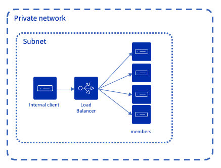
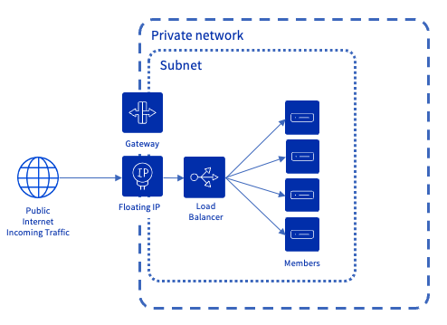

## Objectif

Le Load Balancer du Public Cloud est basé sur le projet OpenStack Octavia et fournit beaucoup de capacités de configuration. Le but de cette page est d'expliciter les concepts de configuration pour que vous puissiez avoir une meilleure compréhension des capacités du Load Balancer.

## Load Balancer Configuration concepts

Les illustrations suivantes montrent 2 configurations : une minimale et une complète qui utilise toutes les fonctionnalités. Les chapitres suivants donne une définition de chacun des concepts présents dans ces illustrations.

### Listener

Un Listener définit un point d'entrée pour le trafic qui sera traité par le Load Balancer. Ses attributs principaux sont le protocole et le port, par exemple `HTTPS` et `443`. Vous pouvez définir plusieurs listeners sur un Load Balancer.

Les protocoles suivants sont disponibles pour le trafic entrant : `HTTP`, `HTTPS`, `TCP`, `UDP`, `SCTP`.

Un protocole spécifique est `PROMETHEUS`, il permet de configurer un point de terminaison prometheus et ne gère pas le trafic lui-même. Retrouvez plus d'informations sur cette configuration sur [cette page](/pages/public_cloud/public_cloud_network_services/technical-resources-02-octavia-monitoring-prometheus).

### Pool

Un pool définit un ensemble de membres à qui est envoyé le trafic. Un pool est associé à un listener. Pour une configuration avancée avec les L7 Policies, il est possible qu'un listener redirige le trafic vers plusieurs pools. 
Les attributs principaux d'un pool sont l'algorithme (par exemple `Round Robin`) et le protocole utilisé pour transmettre le trafic aux membres (par exemple `HTTPS`).

Les protocoles suivants sont disponibles : `HTTP`, `HTTPS`, `PROXY`, `PROXYV2`, `SCTP`, `TCP` ou  `UDP`.

Retrouvez plus d'informations sur le protocole proxy [ici](https://www.haproxy.org/download/1.8/doc/proxy-protocol.txt).

Le tableau suivant fournit la matrice de compatibilité entre le protocole du listener et le protocole du pool :

| Listener Pool | HTTP | HTTPS | SCTP | TCP | TERMINATED_HTTPS | UDP |
|-------------|-------|--------|-------|------|-------------------|------|
| HTTP        | Y  | N   | N  | Y | Y              | N |
| HTTPS       | N  | Y   | N  | Y | N              | N |
| PROXY       | Y  | Y   | N  | Y | Y              | N |
| PROXYV2     | Y  | Y   | N  | Y | Y              | N |
| SCTP        | N  | N   | Y  | N | N              | N |
| TCP         | N  | Y   | N  | Y | N              | N |
| UDP         | N  | N   | N  | N | N              | Y |

### Membre

Un membre définit la configuration d'un serveur à qui le trafic est envoyé. Ses attributs principaux sont une IP (`192.168.1.10`) et le port (`443`). Un membre fait partie d'un pool.

### Health Monitor

Le Health Monitor définit comment le load balancer va vérifier la santé des membres qui constituent le pool. Ses attributs principaux sont la méthode de vérification (par exemple `PING`) et des délais / timeouts. Un Health Monitor est associé à exactement un pool. 

Les Health Monitors suivants sont disponibles : `HTTP`, `HTTPS`, `PING`, `SCTP`, `TCP`, `TLS-HELLO`, `UDP-CONNECT`.

Le tableau suivant fournit la matrice de compatibilité entre le protocole du pool et le type de Health Monitor :

| Health Monitor Pool    | HTTP  | HTTPS | PING  | SCTP  | TCP   | TLS-HELLO | UDP-CONNECT   |
|------------------------   |------ |-------|------ |------ |-----  |-----------|-------------  |
| HTTP                      | Y     | Y     | Y     | N     | Y     | Y         | N             |
| HTTPS                     | Y     | Y     | Y     | N     | Y     | Y         | N             |
| PROXY                     | Y     | Y     | Y     | N     | Y     | Y         | N             |
| PROXYV2                   | Y     | Y     | Y     | N     | Y     | Y         | N             |
| SCTP                      | Y     | N     | N     | Y     | Y     | N         | Y             |
| TCP                       | Y     | Y     | Y     | N     | Y     | Y         | N             |
| UDP                       | Y     | N     | N     | Y     | Y     | N         | Y             |

### Règle L7 (L7 Rule)

Une règle est une expression logique unique qui est évaluée sur une requête HTTP entrante, par exemple sur un Header HTTP ou sur une partie de l'URI. Une règle L7 est associée à exactement une Politique L7. Par exemple une règle L7 évalue si l'URI commence par "/api".

### Politique L7 (L7 Policy)

Une politique L7 est l'association entre une ou plusieurs règles L7 et un listener. Son attribut principal est l'action qui est faite lorsque toutes les règles L7 associées retourne `vrai`. Par exemple, un utilisateur peut spécifier une politique L7 pour que toutes les requêtes dont l'URI commence par "/api" soit routées vers un pool spécifique. 

Lorsqu'une requête arrive sur un listener, les politiques sont évaluées dans l'ordre défini par l'attribut `position`. Lorsqu'une politique retourne `vrai`, l'action est effectuée et l'évaluation s'arrête. Si toutes les politiques retournent `faux`, la requête est alors envoyée au pool par défaut du listener.

## Considérations réseau

La configuration requise pour le Load Balancer Public Cloud varie en fonction du type de trafic entrant (privé ou public) et des adresses IP des membres (privées ou publiques). Les chapitres suivants présentent les 3 différents types d'architectures auxquels le Load Balancer peut répondre. Le tableau ci-dessous présente également les prérequis sur le réseau / les composants supplémentaires liés à chaque architecture.

### Private to Private Load Balancer

{.thumbnail}

Le trafic entrant provient d'un réseau privé et est routé vers des instances accessibles à partir de ce réseau privé. Dans ce cas, une adresse Floating IP ou une Public Gateway ne sont pas nécessaires.

### Public to Private Load Balancer

{.thumbnail}

Le trafic entrant provient d'Internet et atteint une adresse Floating IP associée au Load Balancer. Les instances derrière le Load Balancer sont situées sur un réseau privé et n'ont pas d'IP publique, ce qui garantit qu'elles restent complètement privées et isolées d'Internet.

### Public to Public Load Balancer

{.thumbnail}

Le trafic entrant provient d'Internet et atteint une adresse Floating IP associée au Load Balancer. Les instances vers lesquelles le Load Balancer route le trafic sont accessibles avec une IP publique. Le Load Balancer utilise donc l’adresse Floating IP avec une sortie pour atteindre ces instances.

### Prérequis réseau 

| Type d'architecture | Réseau privé & sous-réseau | IP de passerelle définie dans les attributs de sous-réseau | Nombre d'adresses IP « libres » dans le sous-réseau | Composant Gateway & Floating IP \* |
|---|---|---|---|---|
|Private to Private | Obligatoire | Non requis | 3 ([src](/pages/public_cloud/public_cloud_network_services/known-limits)) | Non requis |
|Public to Private | Obligatoire | Obligatoire | 5 ([src](/pages/public_cloud/public_cloud_network_services/known-limits)) | Obligatoire |
|Public to Public | Obligatoire | Obligatoire | 5 ([src](/pages/public_cloud/public_cloud_network_services/known-limits)) | Obligatoire |

\* : selon l'interface de contrôle que vous choisissez, soit ces composants seront créés pour vous (via l'espace client OVHcloud), soit vous devrez les créer spécifiquement (CLI OpenStack, Terraform ou GUI).

## Operating status et Provisioning status

Deux statuts sont utilisés pour tous les concepts de Load Balancer. 

Le *operating status* décrit le fonctionnement du composant, tandis que le *provisioning status* décrit l'état du cycle de vie. 

Le *provisioning status* est hérité des composants qui sont « contenus » par le composant père. Par exemple, si un membre est mis à jour, son *provisioning status* change, de même que le *provisioning status* du pool, du listener et du load balancer.

Dans la suite de la description, lorsque l'on utilise le terme « composant », il s'agit du composant et de tous les « composants » qu'il contient.

### Provisioning status

- `ACTIVE` : le composant a été correctement provisioné.
- `DELETED` : Le composant a été supprimé avec succès.
- `ERROR` : Échec de la mise en service du composant. Veuillez contacter le support.
- `PENDING_CREATE` : le composant est en cours de création.
- `PENDING_UPDATE` : Le composant est en cours de mise à jour.
- `PENDING_DELETE` : Le composant est en cours de suppression.

### Operating status

- `ONLINE` : le composant fonctionne normalement, ce qui signifie que tous les membres du pool sont en bonne santé.
- `DRAINING` : applicable à un membre d'un pool UDP : le membre n'accepte pas de nouvelles connexions, cela se produit parce que son `weight` a été défini sur `0`.
- `OFFLINE` : il s'agit de l'état après une action de désactivation ou si le paramétrage de `admin_state_up` sur `false` est effectué sur un composant (listener ou load balancer). Ce statut est également utilisé lors de la création du composant. 
- `DEGRADED` : Applicable au pool et au load balancer uniquement. Un ou plusieurs des composants contenus sont en erreur. Par exemple, si un membre est en `ERROR`, le pool et le load balancer sont également en mode `DEGRADED`.
- `ERROR` : le composant a échoué. Par exemple, le membre est considéré comme défaillant si son contrôle d'état (health monitoring) échoue. Un pool est considéré comme ayant échoué si tous ses membres sont en erreur.
- `NO_MONITOR` : Lorsqu'aucun health monitor n'est configuré pour ce pool, le membre et le pool auront un statut `NO_MONITOR`. Cela n'a aucun impact sur le listener ou sur le *operating status* du load balancer.

## Aller plus loin

- Une documentation technique complète (en anglais) sur la [page du projet OpenStack](https://docs.openstack.org/octavia/latest/).

- Configurez votre premier load balancer avec ce [guide](/pages/public_cloud/public_cloud_network_services/getting-started-01-create-lb-service).

Si vous avez besoin d'une formation ou d'une assistance technique pour la mise en oeuvre de nos solutions, contactez votre commercial ou cliquez sur [ce lien](https://www.ovhcloud.com/fr-ca/professional-services/) pour obtenir un devis et demander une analyse personnalisée de votre projet à nos experts de l’équipe Professional Services.

Échangez avec notre communauté d'utilisateurs sur <https://community.ovh.com/>.
