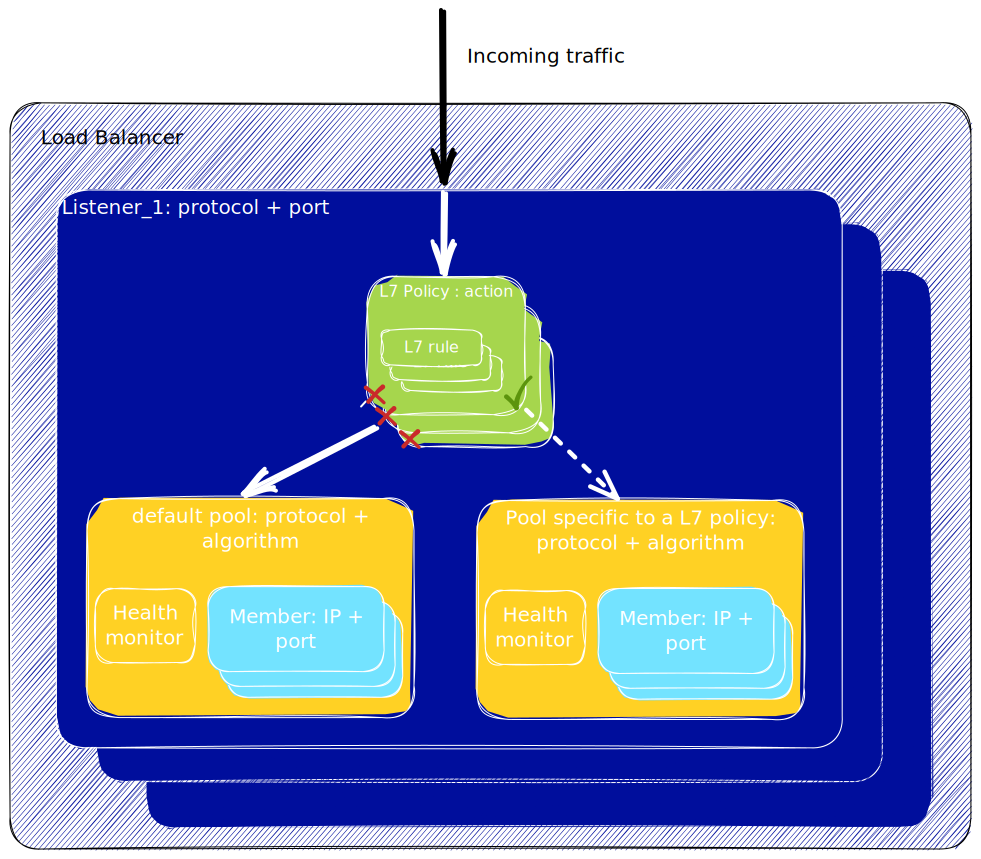

## Objectif

Le Load Balancer du Public Cloud est basé sur le projet OpenStack Octavia et fournit beaucoup de capacités de configuration. Le but de cette page est d'expliciter les concepts de configuration pour que vous puissiez avoir une meilleure compréhension des capacités du Load Balancer.

## Load Balancer Configuration concepts

Les illustrations suivantes montrent 2 configurations : une minimale et une complète qui utilise toutes les fonctionnalités. Les chapitres suivants donne une définition de chacun des concepts présents dans ces illustrations.

### Listener

Un Listener définit un point d'entrée pour le trafic qui sera traité par le Load Balancer. Ses attributs principaux sont le protocole et le port, par exemple `HTTPS` et `443`. Vous pouvez définir plusieurs listeners sur un Load Balancer.

### Pool

Un pool définit un ensemble de membres à qui est envoyé le trafic. Un pool est associé à un listener. Pour une configuration avancée avec les L7 Policies, il est possible qu'un listener redirige le trafic vers plusieurs pools. 
Les attributs principaux d'un pool sont l'algorithme (par exemple `Round Robin`) et le protocole utilisé pour transmettre le trafic aux membres (par exemple `HTTPS`).

### Membre

Un membre définit la configuration d'un serveur à qui le trafic est envoyé. Ses attributs principaux sont une IP (`192.168.1.10`) et le port (`443`). Un membre fait partie d'un pool.

### Heath Monitor

Le Health Monitor définit comment le load balancer va vérifier la santé des membres qui constituent le pool. Ses attributs principaux sont la méthode de vérification (par exemple `PING`) et des délais / timeouts. Un Health Monitor est associé à exactement un pool. 

### Règle L7 (L7 Rule)

Une règle est une expression logique unique qui est évaluée sur une requête HTTP entrante, par exemple sur un Header HTTP ou sur une partie de l'URI. Une règle L7 est associée à exactement une Politique L7. Par exemple une règle L7 évalue si l'URI commence par "/api".

### Politique L7 (L7 Policy)

Une politique L7 est l'association entre une ou plusieurs règles L7 et un listener. Son attribut principal est l'action qui est faite lorsque toutes les règles L7 associées retourne `vrai`. Par exemple, un utilisateur peut spécifier une politique L7 pour que toutes les requêtes dont l'URI commence par "/api" soit routées vers un pool spécifique. 

Lorsqu'une requête arrive sur un listener, les politiques sont évaluées dans l'ordre défini par l'attribut `position`. Lorsqu'une politique retourne `vrai`, l'action est effectuée et l'évaluation s'arrête. Si toutes les politiques retournent `faux`, la requête est alors envoyée au pool par défaut du listener.

## Aller plus loin

- Une documentation technique complète (en anglais) sur la [page du projet OpenStack](https://docs.openstack.org/octavia/latest/).

- Configurez votre premier load balancer avec ce [guide](/pages/public_cloud/public_cloud_network_services/getting-started-01-create-lb-service).

Si vous avez besoin d'une formation ou d'une assistance technique pour la mise en oeuvre de nos solutions, contactez votre commercial ou cliquez sur [ce lien](https://www.ovhcloud.com/fr/professional-services/) pour obtenir un devis et demander une analyse personnalisée de votre projet à nos experts de l’équipe Professional Services.

Échangez avec notre communauté d'utilisateurs sur <https://community.ovh.com/>.