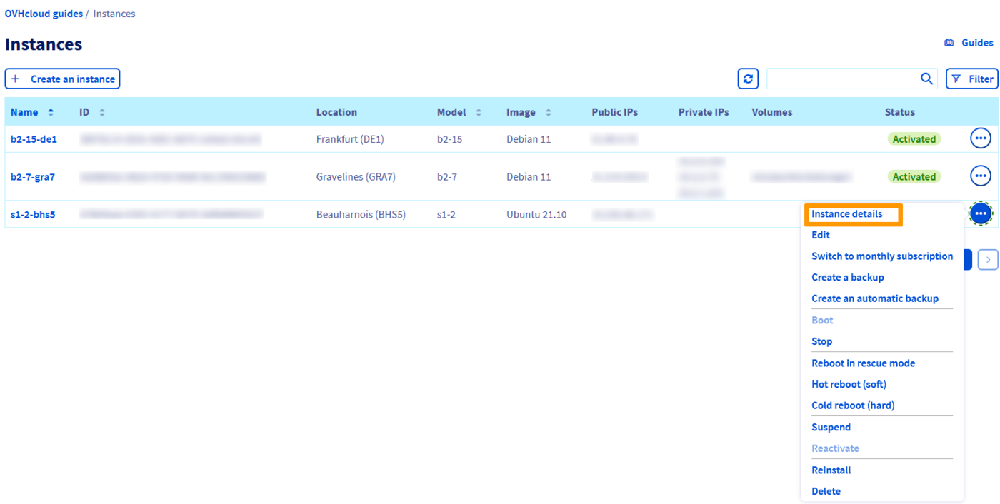
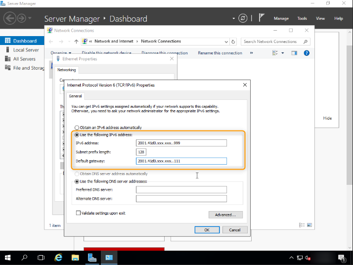

> [!primary]
> Questa traduzione è stata generata automaticamente dal nostro partner SYSTRAN. I contenuti potrebbero presentare imprecisioni, ad esempio la nomenclatura dei pulsanti o alcuni dettagli tecnici. In caso di dubbi consigliamo di fare riferimento alla versione inglese o francese della guida. Per aiutarci a migliorare questa traduzione, utilizza il pulsante "Contribuisci" di questa pagina.
>

## Obiettivo

Internet Protocol version 6 (IPv6) è la versione più recente dell’Internet Protocol (IP), sviluppato per risolvere il problema (a lungo anticipato) dell'esaurimento degli indirizzi IPv4. Infatti, mentre IPv4 utilizza indirizzi IP a 32 bit, IPv6 utilizza indirizzi a 128-bit.

Tutte le istanze Public Cloud vengono consegnate  con un indirizzo IPv4 e un indirizzo IPv6.

Di default è configurato soltanto l’IPv4 perciò.

**Questa guida ti mostra come configurare un indirizzo IPv6 su un’istanza Public Cloud.**

> [!primary]
> 
> Al momento, le offerte Floating IP e Gateway non supportano l'IPv6. L'IPv6 è utilizzabile solo con le istanze in [modalità pubblica](/pages/public_cloud/public_cloud_network_services/concepts-01-public-cloud-networking-concepts#publicmode).
>

## Prerequisiti

* Disporre di un qualsiasi modello di istanza Public Cloud
* *Avere accesso amministrativo (sudo) via SSH o desktop remoto (Windows) al server
* Possedere conoscenze base di rete
* Avere accesso allo [Spazio Cliente OVHcloud](/links/manager)

## Procedura

Nelle sezioni seguenti vengono illustrate le configurazioni delle distribuzioni attualmente disponibili e le distribuzioni/sistemi operativi più comunemente utilizzati. Il primo step consiste sempre nel connettersi al server in SSH o tramite una sessione di connessione GUI (RDP per un’istanza Windows).

> [!warning]
>
> Si noti che nelle versioni recenti dei sistemi operativi Linux, l’indirizzo IPv6 è configurato di default sulle istanze Public Cloud. In questo caso, non è necessario configurarla. Prima di apportare qualsiasi modifica, assicurati di controllare il file di configurazione del sistema operativo.
>

### Lessico

Ecco una lista di termini impiegati in questa guida:

|Lessico|Descrizione|
|---|---|
|YOUR_IPV6|Indirizzo IPv6 assegnato al servizio|
|IPV6_PREFIX|Il prefisso del tuo blocco IPv6 (esempio: 2607:5300:60:62ac::/128 -> netmask = 128)|
|IPV6_GATEWAY|Gateway del blocco IPv6|

### Recupera le informazioni di rete

Accedi al tuo Spazio Cliente, vai alla sezione `Public Cloud`{.action}, seleziona il tuo progetto Public Cloud e clicca su `Instances`{.action} nella barra di navigazione a sinistra. Poi clicca su `...`{.action} accanto all'istanza corrispondente e clicca su `Dettagli dell’istanza`{.action}.

{.thumbnail}

Tutte le informazioni necessarie saranno visibili nella sezione **Reti**.

{.thumbnail}

### Esempi di configurazioni persistenti

> [!primary]
> **Esempi**
> 
>Le informazioni fornite qui di seguito sono a titolo di esempio.
>
>In qualità di amministratore dei tuoi servizi, spetta a te adeguarli alla tua distribuzione.
>

> [!warning]
>
> Prima di modificare un file di configurazione, crea sempre un backup dell'originale in caso di problemi.
>

<br>Per prima cosa, accedi alla tua istanza in SSH.

#### Debian (tranne Debian 12)

Per impostazione predefinita, i file di configurazione si trovano nella directory `/etc/network/interfaces.d/`.

Per configurare l'IPV6, è consigliabile creare un file di configurazione separato nella directory `/etc/network/interfaces.d/`. Nel nostro esempio, il nostro file si chiama `51-cloud-init-ipv6`:

```bash
sudo nano /etc/network/interfaces.d/51-cloud-init-ipv6
```

In questo modo è possibile separare la configurazione IPv6 e annullare le modifiche in caso di errore.

Aggiungere le righe seguenti al file. Sostituisci i valori generici (*YOUR_IPV6*, *IPV6_PREFIX* e *IPV6_GATEWAY*) e l’interfaccia di rete (se il tuo server non utilizza **eth0**) con valori specifici:

```console
iface eth0 inet6 static
address YOUR_IPV6
netmask IPV6_PREFIX
post-up /sbin/ip -6 route add IPV6_GATEWAY dev eth0
post-up /sbin/ip -6 route add default via IPV6_GATEWAY dev eth0
pre-down /sbin/ip -6 route del default via IPV6_GATEWAY dev eth0
pre-down /sbin/ip -6 route del IPV6_GATEWAY dev eth0
```

Per esempio:

```console
iface eth0 inet6 static
address 2607:5300:201:abcd::7c5
netmask 128
post-up /sbin/ip -6 route add 2607:5300:201:abcd::1 dev eth0
post-up /sbin/ip -6 route add default via 2607:5300:201:abcd::1 dev eth0
pre-down /sbin/ip -6 route del default via 2607:5300:201:abcd::1 dev eth0
pre-down /sbin/ip -6 route del 2607:5300:201:abcd::1 dev eth0
```

Riavvia il servizio di rete eseguendo uno dei comandi seguenti:

```bash
sudo service networking restart
```

```bash
sudo systemctl restart networking
``` 
#### Ubuntu e Debian 12

I file di configurazione di rete si trovano nella directory `/etc/netplan/`.

Per configurare l'IPV6, è consigliabile creare un file di configurazione separato nella directory `/etc/netplan/`. Nel nostro esempio, il nostro file si chiama `51-cloud-init-ipv6.yaml`:

```bash
sudo touch /etc/netplan/51-cloud-init-ipv6.yaml
```

In questo modo è possibile separare la configurazione IPv6 e annullare le modifiche in caso di errore.

Aggiungere le righe seguenti al file. Sostituisci i valori generici (ad esempio *YOUR_IPV6*, *IPV6_PREFIX* e *IPV6_GATEWAY*) e l’interfaccia di rete (se il tuo server non utilizza **eth0**) con valori specifici:

```bash
sudo nano /etc/netplan/51-cloud-init-ipv6.yaml
```

```yaml
network:
    version: 2
    ethernets:
        eth0:
            dhcp6: no
            match:
              name: eth0
            addresses:
              - YOUR_IPV6/IPv6_PREFIX
            routes:
              - to: ::/0
                via: IPv6_GATEWAY
```

Ecco un esempio concreto:

```yaml
network:
    version: 2
    ethernets:
        eth0:
            dhcp6: no
            match:
              name: eth0
            addresses:
              - 2607:5300:201:abcd::7c5/128
            routes:
              - to: ::/0
                via: 2607:5300:201:abcd::1
```

> [!warning]
>
> È importante rispettare l'allineamento di ciascun elemento del file, come indicato nell'esempio di cui sopra. Non utilizzare il tasto di tabulazione per creare la tua spaziatura. E' necessario solo il tasto spazio.
>

Per testare la tua configurazione utilizza questo comando:

```bash
sudo nano netplan try
```

Se è corretta, applicala utilizzando il seguente comando:

```bash
sudo nano netplan apply
``` 

#### RedHat/CentOS/Rocky Linux/Alma Linux

I file di configurazione di rete si trovano nella directory `/etc/sysconfig/network-scripts/`. Prima di iniziare ti consigliamo di effettuare un backup dei file di configurazione.

Nel nostro esempio, il nostro file si chiama `ifcfg-eth0`, quindi facciamo un backup del file `ifcfg-eth0` utilizzando i seguenti comandi. Non dimenticare di sostituire **eth0** con la tua interfaccia reale, se necessario.

```bash
cd /etc/sysconfig/network-scripts/
sudo mkdir backup
sudo cp ifcfg-eth0 backup/ifcfg-eth0
```

È quindi possibile invertire le modifiche utilizzando i comandi riportati di seguito:

```bash
sudo rm -f /etc/sysconfig/network-scripts/ifcfg-eth0
sudo cp /etc/sysconfig/network-scripts/backup/ifcfg-eth0 /etc/sysconfig/network-scripts/ifcfg-eth0
```

In seguito modifichiamo il file `ifcfg-eth0`, aggiungendo solo le linee per la configurazione IPv6 del server. Sostituire gli elementi generici (*YOUR_IPV6*, *IPV6_PREFIX* e *IPV6_GATEWAY*) per valori specifici.

```console
IPV6INIT=yes
IPV6ADDR=YOUR_IPV6/IPV6_PREFIX
IPV6_DEFAULTGW=IPV6_GATEWAY
```

Per evitare confusione, non è stata specificata la configurazione IPv4, mentre la configurazione IPv6 viene eseguita nello stesso file di configurazione.

Per esempio:

```console
IPV6INIT=yes
IPV6ADDR=2607:5300:201:abcd::7c5/128
IPV6_DEFAULTGW=2607:5300:201:abcd::1
```

Riavvia l’interfaccia di rete utilizzando uno dei comandi seguenti:

```bash
sudo service networking restart
```

```bash
sudo systemctl restart networking
``` 

#### Fedora

Il file di configurazione di rete si trova nella directory `/etc/NetworkManager/system-connections/`. Prima di iniziare ti consigliamo di effettuare un backup dei file di configurazione.

Nel nostro esempio, il nostro file si chiama `cloud-init-eth0.nmconnection`, quindi facciamo una copia del file `cloud-init-eth0.nmconnection` utilizzando i seguenti comandi. Non dimenticare di sostituire **eth0** con la tua interfaccia reale, se necessario.

```bash
cd /etc/NetworkManager/system-connections/
sudo mkdir backup
sudo cp cloud-init-eth0.nmconnection backup/cloud-init-eth0.nmconnection
```

In seguito modifichiamo il file `cloud-init-eth0.nmconnection`, aggiungendo solo le linee per la configurazione IPv6 del server. Sostituire gli elementi generici (*YOUR_IPV6*, *IPV6_PREFIX* e *IPV6_GATEWAY*) per valori specifici.

```console
[ipv6]
method=auto
may-fail=true
address1=YOUR_IPV6/IPV6_PREFIX
route1=::/0,IPV6_GATEWAY
```

Per evitare confusione, non è stata specificata la configurazione IPv4, mentre la configurazione IPv6 viene eseguita nello stesso file di configurazione.

Per esempio:

```console
[ipv6]
method=auto
may-fail=true
address1=2607:5300:201:abcd::7c5/128
route1=::/0,2607:5300:201:abcd::1
```

Riavvia l’interfaccia di rete con questo comando:

```bash
sudo systemctl restart NetworkManager
``` 

#### Windows

Di default, l’IPv6 non è configurato sui server Windows. Per attivarla, attenersi alla procedura descritta di seguito.

Vai alla sezione `Connessione di rete`{.action} di Windows.

{.thumbnail}

Clicca con il tasto destro sulla scheda di rete per accedere a `Proprietà`{.action}.

{.thumbnail}

Clicca su `Internet Protocol Version 6 (TCP/IPv6)`{.action} e poi sul pulsante `Proprietà`{.action}.

{.thumbnail}

Inserisci le informazioni del tuo IPv6.

{.thumbnail}

Una volta terminata, spunta la casella `Conferma le impostazioni all’uscita` e clicca sul pulsante `OK`{.action} per confermare le modifiche.

### Diagnostica

Hai configurato il tuo IPv6 ma non funziona? 

Esiste una semplice operazione per stabilire se l’errore si trova nella configurazione effettuata oppure sulla rete di OVHcloud.

In un primo momento [riavvia la tua istanza in modalità di ripristino Rescue-pro](/pages/public_cloud/compute/put_an_instance_in_rescue_mode).

Prendi spunto dai comandi mostrati qui di seguito per configurare il tuo IP in maniera non-persistente:

```bash
ip addr add YOUR_IPV6/IPV6_PREFIX dev eth0
ip -6 route add IPV6_GATEWAY dev eth0
ip -6 route add default via IPV6_GATEWAY dev eth0
```

Fai un test della tua connessione tramite un ping6, ad esempio:

```bash
ping6 ipv6.google.com
```
Se la tua istanza risponde, significa che uno degli step della configurazione iniziale non è stato seguito accuratamente.

In ogni caso, se necessario, invia una richiesta di assistenza con gli elementi testati di cui sopra per ottenere un’analisi da parte nostra.

## Per saperne di più

Se avete bisogno di formazione o di assistenza tecnica per implementare le nostre soluzioni, contattate il vostro rappresentante o cliccate su [questo link](https://www.ovhcloud.com/it/professional-services/) per ottenere un preventivo e richiedere un'analisi personalizzata del vostro progetto da parte dei nostri esperti del team Professional Services.

Contatta la nostra Community di utenti all’indirizzo <https://community.ovh.com/en/>.