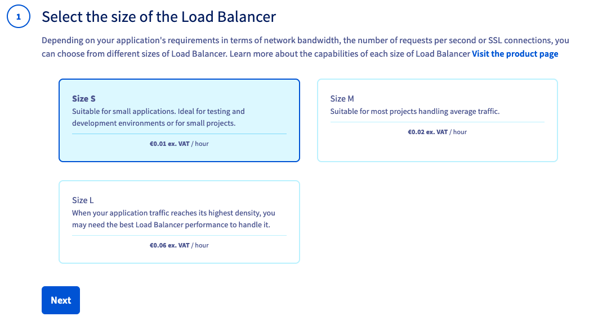
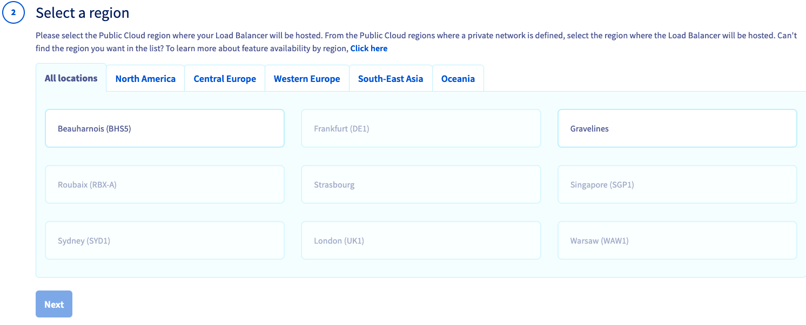
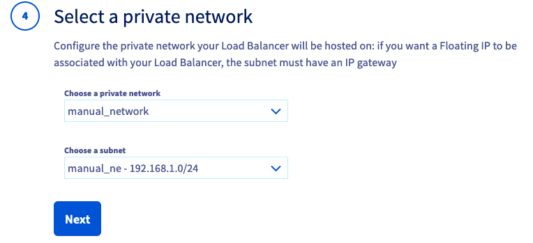
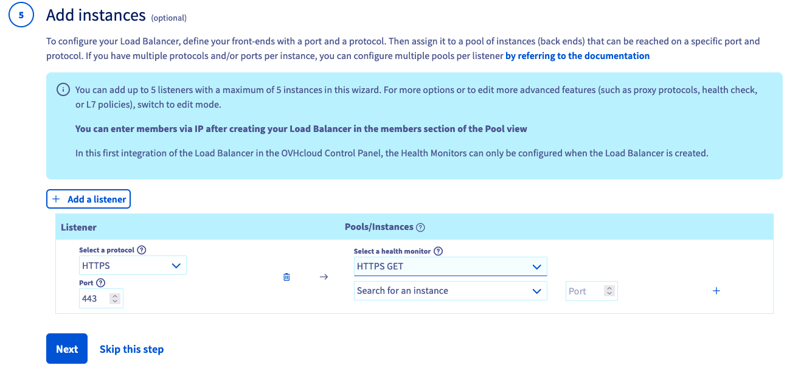
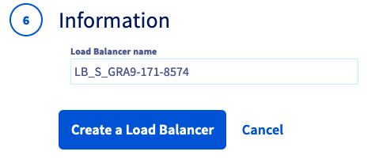

## Objective

Our Public Cloud Load Balancer  is based on [OpenStack Octavia](https://wiki.openstack.org/wiki/Octavia) and is fully integrated into the Public Cloud universe. 

**Learn how to configure an OVHcloud Load Balancer with the help of this guide.**

## Requirements

- A [Public Cloud project](https://www.ovhcloud.com/asia/public-cloud/) in your OVHcloud account
- Understanding the [Load Balancer concepts](/pages/public_cloud/public_cloud_network_services/concepts-03-loadbalancer)
- Understanding the [Public Cloud Networking concepts](/pages/public_cloud/public_cloud_network_services/concepts-01-public-cloud-networking-concepts)
- A Load Balancer requires a subnet, read [this guide](/pages/public_cloud/public_cloud_network_services/getting-started-07-creating-vrack) for more information
- (Optional): This guide explains the load balancer configuration through Graphical Interface & Command Line Interface. If you want to use the latter, then install the [OpenStack Command Line environment](/pages/public_cloud/compute/prepare_the_environment_for_using_the_openstack_api)

## Instructions

### Creating the Load Balancer from the OVHcloud Control Panel

Open your Public Cloud project and click `Load Balancer`{.action} (under `Network`) in the left menu, then click the `Create a Load Balancer`{.action} button.

The configuration page will open.

#### Step 1 : Size choice

{.thumbnail}

The interface contains a link to the website on which the characteristics / benchmark of all size are provided. Once you have chosen your size, click `Next`{.action}.

#### Step 2 : Region choice

{.thumbnail}

Only regions on which you have a private network and at least one subnet can be selected. Select the region and click `Next`{.action}.

#### Step 3 : Attach a public IP (or not)

{.thumbnail}

At this stage, you need to know if your Load Balancer will be receiving public traffic or not (for more details, read our [Public Cloud Networking concepts](/pages/public_cloud/public_cloud_network_services/concepts-01-public-cloud-networking-concepts) page). 

If your Load Balancer is processing public traffic, you have 2 options :

- `New Public IP`: this option will create a new Floating IP for your Load Balancer. 
- If you already have a Floating IP, the interface will offer you to pick one.

If your Load Balancer is processing private traffic, choose `No Public IP`.

#### Step 4 : Select the private network and the subnet where the Load Balancer will be spawned

{.thumbnail}

The interface will inform you if the private network / subnet is not compliant with the prerequisites (see [Public Cloud Networking concepts](/pages/public_cloud/public_cloud_network_services/concepts-03-loadbalancer#network-prerequisites)).

#### Step 5 (optional) : Define the listener(s) and the members

{.thumbnail}

- First, choose the listener protocol & the port according to the traffic you will receive. Note that a specific listener called `Prometheus` is available to monitor your Load Balancer. In that case, it is not possible to add members. For more information on this listener, read [this page](/pages/public_cloud/public_cloud_network_services/technical-resources-02-octavia-monitoring-prometheus).
- Then, choose the Health Monitor type. Note that since some health monitor types are not compatible with some protocols, the user interface filters those types so that you can only choose compatible items. For more information on the health monitor compatibility, read [this page](/pages/public_cloud/public_cloud_network_services/concepts-01-public-cloud-networking-concepts).
- Finally, from the instances of your region, choose the member IP & port that will be part of the pool. Note that in order to simplify the configuration workflow, it is only possible to have a pool with the same protocol as the listener, and that the member can only be chosen from the instance. Those limitations can be bypassed by skipping this part of configuration and use the pool / member configuration once the Load Balancer is created. 

> [!primary]
> In order to simplify the Load Balancer configuration workflow, it is only possible to have a pool with the same protocol as the listener and the member can only be chosen from the instance. Furthermore the pool load balancing algorithm is by default set to `ROUND_ROBIN`.
> Those limitations can be bypassed by skipping this part of configuration and use the pool / member configuration once the Load Balancer is created. 
>

#### Step 6 Define the name of Load Balancer 

{.thumbnail}

You can update the name according to your choice and click on `Create a Load Balancer`{.action}.

You will be redirected to the Load Balancer listing page. Among the attributes that are displayed, the `Operating status` and `Provisioning status` provide information on the state of your load balancer. Find more information on the [Load Balancer concepts page](/pages/public_cloud/public_cloud_network_services/concepts-03-loadbalancer#operating-provisioning-status).

### Creating the Load Balancer from the Openstack Command Line Interface

Another way to create a Load Balancer is through the Openstack Command Line Interface. Before you begin, consult the following guides:

[Preparing an environment for using the OpenStack API](/pages/public_cloud/compute/prepare_the_environment_for_using_the_openstack_api).</br>
[Setting OpenStack environment variables](/pages/public_cloud/compute/loading_openstack_environment_variables).

#### Configuring your private network

Before creating a Load Balancer, you will need to set up a private network:

```bash
openstack network create my_network

openstack subnet create my_subnet --subnet-range <my_private_ip_range/mask> --network my_network --no-dhcp

openstack router create my_router

openstack router add subnet my_router my_subnet

openstack router set --external-gateway Ext-Net my_router
```

You can now attach your instances to the new network. We recommend following our guide to [integrate an instance into vRack](/pages/public_cloud/public_cloud_network_services/getting-started-07-creating-vrack#instance-integration). List the addresses of your instances in your network with the following command:

```bash
openstack server list
```

In the next step, configure the network interfaces of your instances according to this output.

#### Creating the Load Balancer

You can view a list of the different Load Balancer flavors we offer with this command:

```bash
openstack loadbalancer flavor list
```

You can now create your Load Balancer with the following command. In this example, we will create a "Small" Load Balancer.

```bash
openstack loadbalancer create --name my_load_balancer --flavor small --vip-subnet-id my_subnet
```

Your Load Balancer will be configured with an IP address of the private network. If you want to have access from the internet, you will need to attach a Floating IP address.

#### Attaching a Floating IP address to a Load Balancer

This is how to attach a Floating IP address to a Load Balancer:

```bash
openstack floating ip create Ext-Net
openstack floating ip set --port <my_load_balancer_vip_port_id> <floating_ip>
```

> [!primary]
>
> To retrieve the VIP port ID of your Load Balancer, use `openstack loadbalancer show my_load_balancer`.

#### Configuring your Load Balancer

In this example we will configure an HTTP Load Balancer. In order to listen on port 80 of the Load Balancer, create a Listener with this command:

```bash
openstack loadbalancer listener create --name my_listener_http --protocol HTTP --protocol-port 80 my_loadbalancer
```

Once the Listener has been created, you need to add each instance that can respond to external requests. To do this, you must create an Instance Pool:

```bash
openstack loadbalancer pool create --name my_pool_http --lb-algorithm ROUND_ROBIN --listener my_listener --protocol HTTP
```

Add your instances to the Instance Pool:

```bash
openstack loadbalancer member create --subnet-id my_subnet --address <private_ip_instance_1> --protocol-port 80 my_pool
openstack loadbalancer member create --subnet-id my_subnet --address <private_ip_instance_2> --protocol-port 80 my_pool
```

You can now access your Load Balancer via the Floating IP or private IP address from an instance in your private network.

## Go further

[Official documentation of OpenStack Octavia](https://docs.openstack.org/octavia/latest/)

[Cookbook OpenStack Octavia](https://docs.openstack.org/octavia/latest/user/guides/basic-cookbook.html)

If you need training or technical assistance to implement our solutions, contact your sales representative or click on [this link](https://www.ovhcloud.com/asia/professional-services/) to get a quote and ask our Professional Services experts for assisting you on your specific use case of your project.

Join our community of users on <https://community.ovh.com/en/>.

Join our [Discord](https://discord.gg/PwPqWUpN8G) to discuss with the OVHcloud team and other users.
