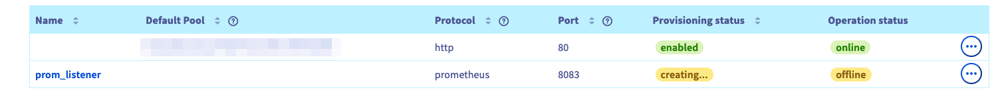

## Objective

The Public Cloud Load Balancer provides 2 ways to monitor your Load Balancers. You can either query an API to get usage statistics or configure a prometheus listener that can be scraped by your prometheus infrastructure to gather metrics.

This guide will discuss those options to monitor your Octavia Load Balancer.

## Instructions

### Pre requisites
A Load balancer has been created. If this is not the case, please check this [guide](../getting-started-01-create-lb-service/guide.en-gb.md).

### Monitoring using CLI

The Load Balancer service aggregates these statistics and makes them available via the OpenStack API. Those statistics are available at the Load Balancer or listener level.

Load Balancer statistics can be queried using the [OpenStack Client](https://docs.openstack.org/python-openstackclient/latest/). They include metrics for all the listeners configured for the queried Load Balancer.

```bash
$ openstack loadbalancer stats show <lb id>

+--------------------+-----------+
| Field              | Value     |
+--------------------+-----------+
| active_connections | 0         |
| bytes_in           | 2236722   |
| bytes_out          | 100973832 |
| request_errors     | 0         |
| total_connections  | 3606      |
+--------------------+-----------+
```

Individual listener statistics can also be queried using the [OpenStack Client](https://docs.openstack.org/python-openstackclient/latest/).

```bash
$ openstack loadbalancer listener stats show <listener id>

+--------------------+-------+
| Field              | Value |
+--------------------+-------+
| active_connections | 0     |
| bytes_in           | 89    |
| bytes_out          | 237   |
| request_errors     | 0     |
| total_connections  | 1     |
+--------------------+-------+
```

### Monitoring with Prometheus

To add a Prometheus endpoint on a Public Cloud Load Balancer, create a listener with a `PROMETHEUS` special protocol. This will enable the endpoint `/metrics` on the listener. This listener type provides the same features as the "regular" listeners, such as `allowed_cidrs`, but does not support attaching pools or L7 policies. All metrics will be identified by the Octavia object ID (UUID) of the resources.

> [!primary]
>
> Currently UDP and SCTP specific metrics are not reported via Prometheus endpoints.
>

#### Create a Prometheus listener via OVHcloud Control Panel
Under `Network` category, select `Load Balancer`. 
A page listing the load balancer will be displayed. 
Select one load balancer by clicking on its `name`.
The load balancer details page will be displayed. Click on the `Listeners` tab then click on `Add a listener`

In the form:
* fill in the `Name`
* select `prometheus` in the Protocol
* choose a port (different from the already existing listener ports of your Load Balancer)
The default pool is greyed out because the `prometheus` listener does not need a pool contrary to the other types of listeners.


Click on `Add` to trigger the listener creation. 
The new listener is added in the listener list.




#### Create a Prometheus listener via Openstack GUI (Horizon)

Log in to Horizon by following this [guide](../../compute/introducing_horizon/)
Click on `Network` > `Load Balancers`
The Load Balancer list is displayed. 
Click on the load balancer name. The load balancer details page is displayed.


Click on the `Listeners` tab then `Create Listener`
In the listener creation page, fill in the `Name` and the `Protocol` to `PROMETHEUS`. The port will be set to a default value:  change it if needed.


#### Create a Prometheus listener via Openstack CLI

To create a Prometheus endpoint on port 9100 for Load Balancer lb1, run the following command:

```bash
$ openstack loadbalancer listener create --name stats-listener --protocol PROMETHEUS --protocol-port 9100 lb1

+-----------------------------+--------------------------------------+
| Field                       | Value                                |
+-----------------------------+--------------------------------------+
| admin_state_up              | True                                 |
| connection_limit            | -1                                   |
| created_at                  | 2023-11-30T01:44:25                  |
| default_pool_id             | None                                 |
| default_tls_container_ref   | None                                 |
| description                 |                                      |
| id                          | fb57d764-470a-4b6b-8820-627452f55b96 |
| insert_headers              | None                                 |
| l7policies                  |                                      |
| loadbalancers               | b081ed89-f6f8-48cb-a498-5e12705e2cf9 |
| name                        | stats-listener                       |
| operating_status            | OFFLINE                              |
| project_id                  | 4c1caeee063747f8878f007d1a323b2f     |
| protocol                    | PROMETHEUS                           |
| protocol_port               | 9100                                 |
| provisioning_status         | PENDING_CREATE                       |
| sni_container_refs          | []                                   |
| timeout_client_data         | 50000                                |
| timeout_member_connect      | 5000                                 |
| timeout_member_data         | 50000                                |
| timeout_tcp_inspect         | 0                                    |
| updated_at                  | None                                 |
| client_ca_tls_container_ref | None                                 |
| client_authentication       | NONE                                 |
| client_crl_container_ref    | None                                 |
| allowed_cidrs               | None                                 |
| tls_ciphers                 | None                                 |
| tls_versions                | None                                 |
| alpn_protocols              | None                                 |
| tags                        |                                      |
+-----------------------------+--------------------------------------+
```

Note that you add the `--allowed-cidr` option in order to filter the listener to a specific network.

#### Create a Prometheus listener via Openstack CLI
The ressource [openstack_lb_listener_v2](https://registry.terraform.io/providers/terraform-provider-openstack/openstack/latest/docs/resources/lb_listener_v2) from the Openstack provider enables to configure a prometheus listener. The following snippet is extracted from a full example available on [github](https://github.com/yomovh/tf-at-ovhcloud/tree/main/simple_http_lb_with_prom_grafana), adapt it to your need. 


```hcl
resource "openstack_lb_listener_v2" "prom_listener" {
  protocol        = "PROMETHEUS"
  protocol_port   = 9100
  loadbalancer_id = openstack_lb_loadbalancer_v2.tf_lb.id
  #restrict the access of the listener to the private network subnet
  allowed_cidrs = [openstack_networking_subnet_v2.tf_lb_subnet.cidr]
}
```
#### Configure Prometheus to collect your metrics
Once the `PROMETHEUS` listener is `ACTIVE`, you can configure Prometheus to collect metrics from the Load Balancer by updating the `prometheus.yml` file.

```yaml
[scrape_configs]
- job_name: 'Octavia LB1'
  static_configs:
  - targets: ['192.0.2.10:9100']
```

For more information on setting up Prometheus, see the [Prometheus project website](https://prometheus.io/).

You can connect [Grafana](https://grafana.com) to the [Prometheus](https://prometheus.io) instance to provide additional graphing and dashboard capabilities. A Grafana dashboard for Octavia Load Balancers is available [here](https://grafana.com/grafana/dashboards/15828-octavia-amphora-load-balancer/)

## Go further

If you are interested in automating this scenario with terraform and with our managed Grafana service, you can find ready to run example on this [github repo](https://github.com/yomovh/tf-at-ovhcloud)

Visit our dedicated Discord channel: <https://discord.gg/ovhcloud>. Ask questions, provide feedback and interact directly with the team that builds our databases services.

If you need training or technical assistance to implement our solutions, contact your sales representative or click on [this link](https://www.ovhcloud.com/en-gb/professional-services/) to get a quote and ask our Professional Services experts for a custom analysis of your project.

Join our community of users on <https://community.ovh.com/en/>.
