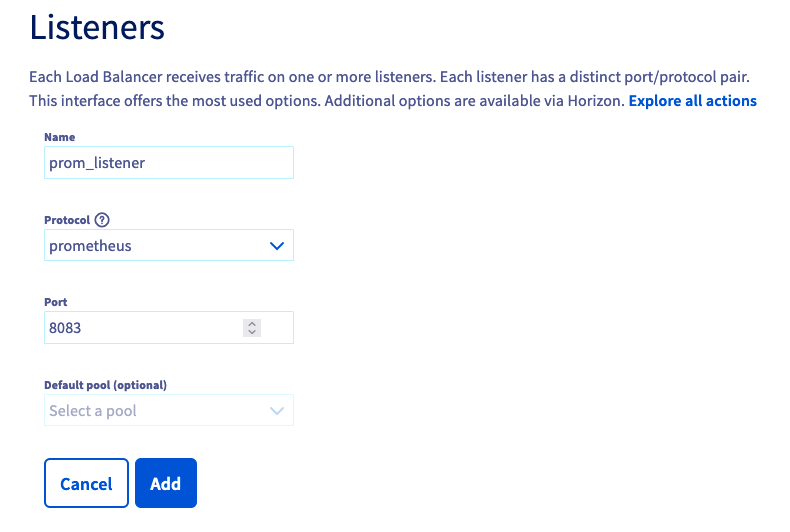
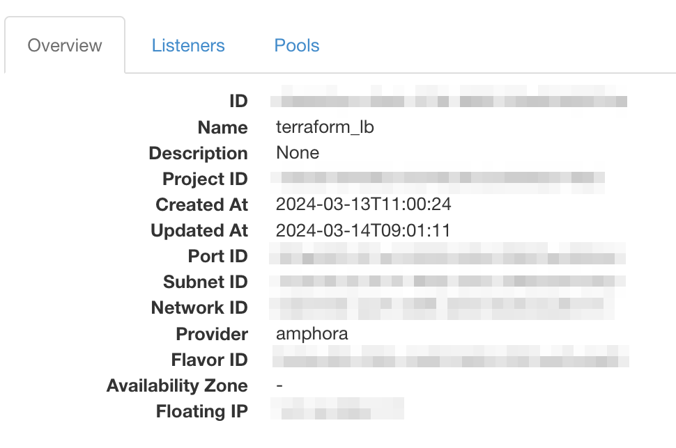
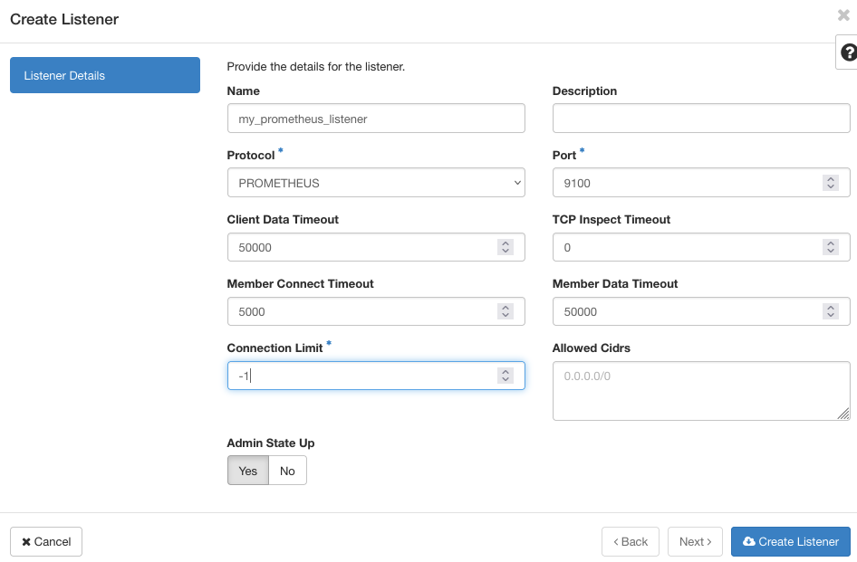

## Objective

The Public Cloud Load Balancer provides 2 ways to monitor your Load Balancers. You can either query an API to get usage statistics or configure a prometheus listener that can be scraped by your prometheus infrastructure to gather metrics.

This guide will discuss those options to monitor your Octavia Load Balancer.

## Requirements

- A Load Balancer created. If this is not the case, please check this [guide](/pages/public_cloud/public_cloud_network_services/getting-started-01-create-lb-service).

## Instructions

### Monitoring using CLI

The Load Balancer service aggregates these statistics and makes them available via the OpenStack API. Those statistics are available at the Load Balancer or listener level.

Load Balancer statistics can be queried using the [OpenStack Client](https://docs.openstack.org/python-openstackclient/latest/). They include metrics for all the listeners configured for the queried Load Balancer.

```bash
$ openstack loadbalancer stats show <lb id>

+--------------------+-----------+
| Field              | Value     |
+--------------------+-----------+
| active_connections | 0         |
| bytes_in           | 2236722   |
| bytes_out          | 100973832 |
| request_errors     | 0         |
| total_connections  | 3606      |
+--------------------+-----------+
```

Individual listener statistics can also be queried using the [OpenStack Client](https://docs.openstack.org/python-openstackclient/latest/).

```bash
$ openstack loadbalancer listener stats show <listener id>

+--------------------+-------+
| Field              | Value |
+--------------------+-------+
| active_connections | 0     |
| bytes_in           | 89    |
| bytes_out          | 237   |
| request_errors     | 0     |
| total_connections  | 1     |
+--------------------+-------+
```

### Monitoring with Prometheus

To add a Prometheus endpoint on a Public Cloud Load Balancer, create a listener using the `PROMETHEUS` protocol. This will enable the  `/metrics` endpoint which by default listens on all the interfaces from your load balancer. **This means that if your load balancer is using a Floating IP, by default the `/metrics` endpoint will be opened to the internet**. To avoid that, we advise setting the `allowed_cidrs` option to protect your metrics, for example with the CIDR of the subnet where the load balancer is spawned.

This listener type provides the same features as the "regular" listeners but does not support attaching pools or L7 policies. All metrics will be identified by the Octavia object ID (UUID) of the resources.

> [!primary]
>
> Currently UDP and SCTP specific metrics are not reported via Prometheus endpoints.
>

#### Create a Prometheus listener via OVHcloud Control Panel

Under the `Network`{.action} category, select `Load Balancer`{.action}. A page listing the load balancers will be displayed.

Select one load balancer by clicking its `name`{.action}.

The load balancer details page will be displayed. Click the `Listeners`{.action} tab then click on `Add a listener`{.action}.

In the form:

- Fill in the `Name`.
- Select `prometheus` as the Protocol.
- Choose a port (different from the already existing listener ports of your Load Balancer).

The default pool is greyed out because the `prometheus` listener does not need a pool unlike the other types of listeners.

{.thumbnail}

Click `Add`{.action} to trigger the listener creation. The new listener is added to the listeners list.

{.thumbnail}

#### Create a Prometheus listener via OpenStack GUI (Horizon)

Log in to Horizon using this [guide](/pages/public_cloud/compute/introducing_horizon).

Click `Network`{.action} then `Load Balancers`{.action}. The Load Balancer list is displayed. 

Click on the load balancer name. The load balancer details page is then displayed.

{.thumbnail}

Click the `Listeners`{.action} tab then `Create Listener`{.action}.

n the listener creation page, fill in the `Name` and switch the `Protocol` to `PROMETHEUS`.
The port will be set to a default value, change it if needed.

{.thumbnail}

#### Create a Prometheus listener via OpenStack CLI

To create a Prometheus endpoint on port 9100 for Load Balancer lb1, run the following command:

```bash
$ openstack loadbalancer listener create --name stats-listener --protocol PROMETHEUS --protocol-port 9100 lb1

+-----------------------------+--------------------------------------+
| Field                       | Value                                |
+-----------------------------+--------------------------------------+
| admin_state_up              | True                                 |
| connection_limit            | -1                                   |
| created_at                  | 2023-11-30T01:44:25                  |
| default_pool_id             | None                                 |
| default_tls_container_ref   | None                                 |
| description                 |                                      |
| id                          | fb57d764-470a-4b6b-8820-627452f55b96 |
| insert_headers              | None                                 |
| l7policies                  |                                      |
| loadbalancers               | b081ed89-f6f8-48cb-a498-5e12705e2cf9 |
| name                        | stats-listener                       |
| operating_status            | OFFLINE                              |
| project_id                  | 4c1caeee063747f8878f007d1a323b2f     |
| protocol                    | PROMETHEUS                           |
| protocol_port               | 9100                                 |
| provisioning_status         | PENDING_CREATE                       |
| sni_container_refs          | []                                   |
| timeout_client_data         | 50000                                |
| timeout_member_connect      | 5000                                 |
| timeout_member_data         | 50000                                |
| timeout_tcp_inspect         | 0                                    |
| updated_at                  | None                                 |
| client_ca_tls_container_ref | None                                 |
| client_authentication       | NONE                                 |
| client_crl_container_ref    | None                                 |
| allowed_cidrs               | None                                 |
| tls_ciphers                 | None                                 |
| tls_versions                | None                                 |
| alpn_protocols              | None                                 |
| tags                        |                                      |
+-----------------------------+--------------------------------------+
```

Note that you should add the `--allowed-cidr` option in order to filter the listener to a specific network.

#### Create a Prometheus listener via Terraform

The resource [openstack_lb_listener_v2](https://registry.terraform.io/providers/terraform-provider-openstack/openstack/latest/docs/resources/lb_listener_v2) from the OpenStack provider enables to configure a Prometheus listener. The following snippet is extracted from a full example available on [Github](https://github.com/yomovh/tf-at-ovhcloud/tree/main/simple_http_lb_with_prom_grafana), adapt it to your needs. 

```hcl
resource "openstack_lb_listener_v2" "prom_listener" {
  protocol        = "PROMETHEUS"
  protocol_port   = 9100
  loadbalancer_id = openstack_lb_loadbalancer_v2.tf_lb.id
  #restrict the access of the listener to the private network subnet
  allowed_cidrs = [openstack_networking_subnet_v2.tf_lb_subnet.cidr]
}
```

#### Configure Prometheus to collect your metrics

Once the `PROMETHEUS` listener is `ACTIVE`, you can configure Prometheus to collect metrics from the Load Balancer by updating the `prometheus.yml` file.

```yaml
[scrape_configs]
- job_name: 'Octavia LB1'
  static_configs:
  - targets: ['192.0.2.10:9100']
```

For more information on setting up Prometheus, see the [Prometheus project website](https://prometheus.io/).

You can connect [Grafana](https://grafana.com) to the [Prometheus](https://prometheus.io) instance to provide additional graphing and dashboard capabilities. A Grafana dashboard for Octavia Load Balancers is available [here](https://grafana.com/grafana/dashboards/15828-octavia-amphora-load-balancer/).

The metrics have the following naming format:

- `octavia_loadbalancer_xxx` or `octavia_memory_pool_xxx` metrics are global to the load balancer
- `octavia_listener_xxx` metrics are instantiated per listener using the label {listener=ID}
- `octavia_pool_xxx` metrics are instantiated per pool using the label {pool=ID}
- `octavia_member_xxx`  metrics are instantiated per member using the label {member=ID}

| Metric| Description |
|-------------------------------|--------------------------------------------|
|octavia_loadbalancer_cpu|Load balancer CPU utilization (percentage).|
|octavia_loadbalancer_memory|Load balancer memory utilization (percentage).|
|octavia_memory_pool_allocated_bytes|Total amount of memory allocated in the memory pools (in bytes).|
|octavia_memory_pool_used_bytes|Total amount of memory used in the memory pools (in bytes).|
|octavia_memory_pool_failures_total|Total number of failed memory pool allocations.|
|octavia_loadbalancer_max_connections|Maximum number of concurrent connections.|
|octavia_loadbalancer_current_connections|Number of active sessions.|
|octavia_loadbalancer_connections_total|Total number of created sessions.|
|octavia_loadbalancer_requests_total|Total number of requests (TCP or HTTP).|
|octavia_loadbalancer_max_ssl_connections|Configured maximum number of concurrent SSL connections.|
|octavia_loadbalancer_current_ssl_connections|Number of active SSL connections.|
|octavia_loadbalancer_ssl_connections_total|Total number of opened SSL connections.|
|octavia_loadbalancer_current_connection_rate|Current number of connections per second over last elapsed second.|
|octavia_loadbalancer_limit_connection_rate|Configured maximum number of connections per second.|
|octavia_loadbalancer_max_connection_rate|Maximum observed number of connections per second.|
|octavia_loadbalancer_current_session_rate|Current number of sessions per second over last elapsed second.|
|octavia_loadbalancer_limit_session_rate|Configured maximum number of sessions per second.|
|octavia_loadbalancer_max_session_rate|Maximum observed number of sessions per second.|
|octavia_loadbalancer_current_ssl_rate|Current number of SSL sessions per second over last elapsed second.|
|octavia_loadbalancer_limit_ssl_rate|Configured maximum number of SSL sessions per second.|
|octavia_loadbalancer_max_ssl_rate|Maximum observed number of SSL sessions per second.|
|octavia_loadbalancer_current_frontend_ssl_key_rate|Current frontend SSL Key computation per second over last elapsed second.|
|octavia_loadbalancer_max_frontend_ssl_key_rate|Maximum observed frontend SSL Key computation per second.|
|octavia_loadbalancer_current_backend_ssl_key_rate|Current backend SSL Key computation per second over last elapsed second.|
|octavia_loadbalancer_max_backend_ssl_key_rate|Maximum observed backend SSL Key computation per second.|
|octavia_loadbalancer_ssl_cache_lookups_total|Total number of SSL session cache lookups.|
|octavia_loadbalancer_ssl_cache_misses_total|Total number of SSL session cache misses.|
|octavia_loadbalancer_http_comp_bytes_in_total|Number of bytes per second over last elapsed second, before http compression.|
|octavia_loadbalancer_http_comp_bytes_out_total|Number of bytes per second over last elapsed second, after http compression.|
|octavia_loadbalancer_limit_http_comp|Configured maximum input compression rate in bytes.|
|octavia_loadbalancer_listeners|Current number of active listeners.|
|octavia_loadbalancer_dropped_logs_total|Total number of dropped logs.|
|octavia_listener_status|Current status of the listener. 0=OFFLINE, 1=ONLINE, 2=DEGRADED.|
|octavia_listener_current_sessions|Current number of active sessions.|
|octavia_listener_max_sessions|Maximum observed number of active sessions.|
|octavia_listener_limit_sessions|Configured session limit.|
|octavia_listener_sessions_total|Total number of sessions.|
|octavia_listener_limit_session_rate|Configured limit on new sessions per second.|
|octavia_listener_max_session_rate|Maximum observed number of sessions per second.|
|octavia_listener_connections_rate_max|Maximum observed number of connections per second.|
|octavia_listener_connections_total|Total number of connections.|
|octavia_listener_bytes_in_total|Current total of incoming bytes.|
|octavia_listener_bytes_out_total|Current total of outgoing bytes.|
|octavia_listener_requests_denied_total|Total number of denied requests.|
|octavia_listener_responses_denied_total|Total number of denied responses.|
|octavia_listener_request_errors_total|Total number of request errors.|
|octavia_listener_denied_connections_total|Total number of requests denied by connection rules.|
|octavia_listener_denied_sessions_total|Total number of requests denied by session rules.|
|octavia_listener_failed_header_rewriting_total|Total number of failed header rewriting rules.|
|octavia_listener_http_requests_rate_max|Maximum observed number of HTTP requests per second.|
|octavia_listener_http_requests_total|Total number of HTTP requests received.|
|octavia_listener_http_responses_total|Total number of HTTP responses.|
|octavia_listener_intercepted_requests_total|Total number of intercepted HTTP requests.|
|octavia_listener_http_cache_lookups_total|Total number of HTTP cache lookups.|
|octavia_listener_http_cache_hits_total|Total number of HTTP cache hits.|
|octavia_listener_http_comp_bytes_in_total|Total number of HTTP response bytes fed to the compressor.|
|octavia_listener_http_comp_bytes_out_total|Total number of HTTP response bytes emitted by the compressor.|
|octavia_listener_http_comp_bytes_bypassed_total|Total number of bytes that bypassed the HTTP compressor (CPU/BW limit).|
|octavia_listener_http_comp_responses_total|Total number of HTTP responses that were compressed.|
|octavia_pool_status|Current status of the pool. 0=OFFLINE, 1=ONLINE.|
|octavia_pool_current_sessions|Current number of active sessions.|
|octavia_pool_max_sessions|Maximum observed number of active sessions.|
|octavia_pool_limit_sessions|Configured session limit.|
|octavia_pool_sessions_total|Total number of sessions.|
|octavia_pool_max_session_rate|Maximum observed number of sessions per second.|
|octavia_pool_last_session_seconds|Number of seconds since last session assigned to a member.|
|octavia_pool_current_queue|Current number of queued requests.|
|octavia_pool_max_queue|Maximum observed number of queued requests.|
|octavia_pool_connection_attempts_total|Total number of connection establishment attempts.|
|octavia_pool_connection_reuses_total|Total number of connection reuses.|
|octavia_pool_bytes_in_total|Current total of incoming bytes.|
|octavia_pool_bytes_out_total|Current total of outgoing bytes.|
|octavia_pool_queue_time_average_seconds|Avg. queue time for last 1024 successful connections.|
|octavia_pool_connect_time_average_seconds|Avg. connect time for last 1024 successful connections.|
|octavia_pool_response_time_average_seconds|Avg. response time for last 1024 successful connections.|
|octavia_pool_total_time_average_seconds|Avg. total time for last 1024 successful connections.|
|octavia_pool_max_queue_time_seconds|Maximum observed time spent in the queue|
|octavia_pool_max_connect_time_seconds|Maximum observed time spent waiting for a connection to complete|
|octavia_pool_max_response_time_seconds|Maximum observed time spent waiting for a member response.|
|octavia_pool_max_total_time_seconds|Maximum observed total request+response time (request+queue+connect+response+processing)|
|octavia_pool_requests_denied_total|Total number of denied requests.|
|octavia_pool_responses_denied_total|Total number of denied responses.|
|octavia_pool_connection_errors_total|Total number of connection errors.|
|octavia_pool_response_errors_total|Total number of response errors.|
|octavia_pool_retry_warnings_total|Total number of retry warnings.|
|octavia_pool_redispatch_warnings_total|Total number of redispatch warnings.|
|octavia_pool_failed_header_rewriting_total|Total number of failed header rewriting warnings.|
|octavia_pool_client_aborts_total|Total number of data transfers aborted by the client.|
|octavia_pool_member_aborts_total|Total number of data transfers aborted by the server.|
|octavia_pool_active_members|Current number of active members.|
|octavia_pool_backup_members|Current number of backup members.|
|octavia_pool_check_up_down_total|Total number of UP->DOWN transitions.|
|octavia_pool_check_last_change_seconds|Number of seconds since the last UP<->DOWN transition.|
|octavia_pool_downtime_seconds_total|Total downtime (in seconds) for the pool.|
|octavia_pool_loadbalanced_total|Total number of times a pool was selected, either for new sessions, or when redispatching.|
|octavia_pool_http_requests_total|Total number of HTTP requests received.|
|octavia_pool_http_responses_total|Total number of HTTP responses.|
|octavia_pool_http_cache_lookups_total|Total number of HTTP cache lookups.|
|octavia_pool_http_cache_hits_total|Total number of HTTP cache hits.|
|octavia_pool_http_comp_bytes_in_total|Total number of HTTP response bytes fed to the compressor.|
|octavia_pool_http_comp_bytes_out_total|Total number of HTTP response bytes emitted by the compressor.|
|octavia_pool_http_comp_bytes_bypassed_total|Total number of bytes that bypassed the HTTP compressor (CPU/BW limit).|
|octavia_pool_http_comp_responses_total|Total number of HTTP responses that were compressed.|
|octavia_member_status|Current status of the member. 0=ERROR, 1=ONLINE, 2=OFFLINE, 3=DRAIN.|
|octavia_member_current_sessions|Current number of active sessions.|
|octavia_member_max_sessions|Maximum observed number of active sessions.|
|octavia_member_limit_sessions|Configured session limit.|
|octavia_member_sessions_total|Total number of sessions.|
|octavia_member_max_session_rate|Maximum observed number of sessions per second.|
|octavia_member_last_session_seconds|Number of seconds since last session assigned to the member.|
|octavia_member_current_queue|Current number of queued requests.|
|octavia_member_max_queue|Maximum observed number of queued requests.|
|octavia_member_queue_limit|Configured maxqueue for the member (0 meaning no limit).|
|octavia_member_bytes_in_total|Current total of incoming bytes.|
|octavia_member_bytes_out_total|Current total of outgoing bytes.|
|octavia_member_queue_time_average_seconds|Avg. queue time for last 1024 successful connections.|
|octavia_member_connect_time_average_seconds|Avg. connect time for last 1024 successful connections.|
|octavia_member_response_time_average_seconds|Avg. response time for last 1024 successful connections.|
|octavia_member_total_time_average_seconds|Avg. total time for last 1024 successful connections.|
|octavia_member_max_queue_time_seconds|Maximum observed time spent in the queue|
|octavia_member_max_connect_time_seconds|Maximum observed time spent waiting for a connection to complete|
|octavia_member_max_response_time_seconds|Maximum observed time spent waiting for a member response.|
|octavia_member_max_total_time_seconds|Maximum observed total request+response time (request+queue+connect+response+processing)|
|octavia_member_connection_attempts_total|Total number of connection establishment attempts.|
|octavia_member_connection_reuses_total|Total number of connection reuses.|
|octavia_member_responses_denied_total|Total number of denied responses.|
|octavia_member_connection_errors_total|Total number of connection errors.|
|octavia_member_response_errors_total|Total number of response errors.|
|octavia_member_retry_warnings_total|Total number of retry warnings.|
|octavia_member_redispatch_warnings_total|Total number of redispatch warnings.|
|octavia_member_failed_header_rewriting_total|Total number of failed header rewriting warnings.|
|octavia_member_client_aborts_total|Total number of data transfers aborted by the client.|
|octavia_member_server_aborts_total|Total number of data transfers aborted by the server.|
|octavia_member_weight|Member weight.|
|octavia_member_check_failures_total|Total number of failed check (Only counts checks failed when the member is up).|
|octavia_member_check_up_down_total|Total number of UP->DOWN transitions.|
|octavia_member_downtime_seconds_total|Total downtime (in seconds) for the member.|
|octavia_member_check_last_change_seconds|Number of seconds since the last UP<->DOWN transition.|
|octavia_member_current_throttle|Current throttle percentage for the member, when slowstart is active, or no value if not in slowstart.|
|octavia_member_loadbalanced_total|Total number of times a member was selected, either for new sessions, or when redispatching.|
|octavia_member_http_responses_total|Total number of HTTP responses.|
|octavia_member_idle_connections_current|Current number of idle connections available for reuse|
|octavia_member_idle_connections_limit|Limit on the number of available idle connections|

## Go further

If you are interested in automating this scenario with terraform and with our managed Grafana service, you can find ready to run example on this [github repo](https://github.com/yomovh/tf-at-ovhcloud)

Visit our dedicated Discord channel: <https://discord.gg/ovhcloud>. Ask questions, provide feedback and interact directly with the team that builds our databases services.

If you need training or technical assistance to implement our solutions, contact your sales representative or click on [this link](https://www.ovhcloud.com/pl/professional-services/) to get a quote and ask our Professional Services experts for a custom analysis of your project.

Join our community of users on <https://community.ovh.com/en/>.
