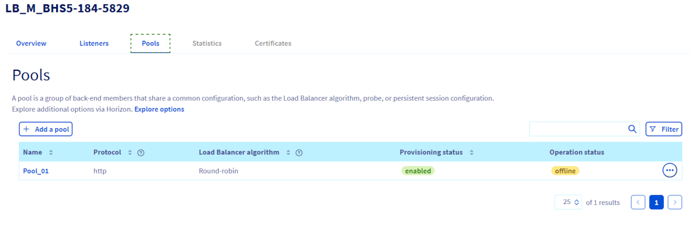

## Objectif

Apprenez à créer et à gérer un Health Monitor pour vos Load Balancers OVHcloud, en utilisant différentes interfaces telles que l'espace client OVHcloud, la ligne de commande (CLI), Horizon et Terraform.

## Prérequis

- Un [compte OVHcloud actif](/links/manager)
- Comprendre les [concepts du OVHcloud Load Balancer](/pages/public_cloud/public_cloud_network_services/concepts-03-loadbalancer).
- Un [projet Public Cloud OVHcloud](/pages/public_cloud/compute/create_a_public_cloud_project).
- Un Load Balancer [déjà configuré](/pages/public_cloud/public_cloud_network_services/getting-started-01-create-lb-service) dans votre projet Public Cloud.

## En pratique

### Création d’un Health Monitor

Les Health Monitors jouent un rôle crucial dans la gestion de la disponibilité et des performances des services hébergés sur des infrastructures comme le Public Cloud OVHcloud. Ils effectuent des vérifications régulières des serveurs pour garantir leur capacité à traiter les requêtes entrantes. Si un serveur ne répond pas aux critères de santé établis, il est temporairement retiré du pool, assurant ainsi que le trafic est dirigé uniquement vers les serveurs fonctionnels.

### Types de Health Monitors et configurations

Différents types de Health Monitors répondent à divers besoins spécifiques :

#### HTTP/S

- Effectue des requêtes HTTP ou HTTPS, idéal pour vérifier l'état de santé des applications web ou d'API REST.
- **`url_path`**: chemin d'accès ciblé pour la vérification, par défaut à `/`.
- **`http_method`**: méthode HTTP utilisée pour la vérification, généralement `GET`.
- **`expected_codes`**: codes de réponse indiquant un état sain, typiquement `200`.

#### PING

- Envoie des pings ICMP pour tester la disponibilité réseau d'un serveur.

#### TCP

- Tente d'établir une connexion TCP pour confirmer la disponibilité d'un service écoutant sur un port donné, sans transfert de données.

#### TLS-HELLO

- Initie une négociation SSL/TLS avec un message 'Client Hello', vérifiant la capacité de réponse SSL/TLS du serveur.

#### Utilisations et points clés

- Les vérifications **HTTP/S** et **TLS-HELLO** sont adaptées aux contextes sécurisés, particulièrement quand une authentification par certificat client est requise.
- Les types **PING** et **TCP** conviennent pour des vérifications basiques de la connectivité, sans nécessiter de réponses spécifiques des serveurs.

La configuration précise des Health Monitors, incluant la fréquence des vérifications (`delay`), le temps d'attente maximal pour une réponse (`timeout`), et le nombre d'essais avant de marquer un serveur comme défaillant (`max_retries`), est essentielle pour équilibrer efficacement une détection rapide des problèmes avec la minimisation des fausses alertes et la réduction de la charge sur les serveurs surveillés.

#### Options clés de configuration

- **`url_path`**: spécifie le chemin d'accès pour les requêtes HTTP/S, permettant de cibler des endpoints spécifiques pour la vérification.
- **`http_method`**: détermine la méthode HTTP (GET, POST, HEAD) à utiliser pour les vérifications HTTP/S.
- **`expected_codes`**: configure les codes de réponse HTTP considérés comme valides, indiquant que le serveur est sain.
- **`delay`**: intervalle en secondes entre chaque vérification de santé, permettant de contrôler la fréquence des tests.
- **`timeout`**: temps d'attente maximum pour une réponse du serveur avant de le considérer comme défaillant.
- **`max_retries`**: nombre de tentatives de vérification échouées avant que le serveur ne soit marqué comme défaillant.

### Bonnes pratiques pour la configuration des Health Monitors

La mise en place efficace d’un Health Monitor est essentielle pour maintenir la haute disponibilité et la performance de vos services en ligne. Voici les meilleures pratiques pour optimiser votre configuration.

#### Conseils pour les Health Monitors HTTP

Lors de la configuration de Health Monitors pour des applications web, gardez à l'esprit les conseils suivants :

- **Chemin d'accès URL (`url_path`)** : choisissez un chemin d'accès léger et rapide à charger pour les vérifications de santé, idéalement une page qui ne nécessite pas de traitement lourd ou d'authentification.
- **Méthode HTTP (`http_method`)** : utilisez des méthodes moins gourmandes en ressources, comme `HEAD` ou `GET`, pour minimiser l'impact sur les performances du serveur.
- **Codes de réponse attendus (`expected_codes`)** : configurez les codes de réponse HTTP qui indiquent qu'un serveur est sain, typiquement `200`.

#### Surveillance et tests

- **Validation** : testez la configuration en simulant des pannes de serveur pour vérifier que le Health Monitor réagit comme attendu.
- **Monitoring** : utilisez les outils de surveillance d’OVHcloud pour suivre les performances et l'état de santé de votre Load Balancer et ajustez la configuration au besoin. Consultez le guide « [Mettre en place un monitoring du Load Balancer Public Cloud avec Prometheus](/pages/public_cloud/public_cloud_network_services/technical-resources-02-octavia-monitoring-prometheus) ».

En intégrant ces bonnes pratiques dans votre processus de configuration, vous maximisez la disponibilité et la performance de vos applications hébergées, tout en assurant une expérience utilisateur optimale.

#### Surveillance et optimisation

Pour maintenir une performance optimale, il est recommandé de :

- Surveiller régulièrement la santé de vos serveurs et l'efficacité de votre Load Balancer.
- Ajuster les paramètres du Health Monitor (délai, timeout, max-retries) selon les besoins et les performances observées.
- Explorer des stratégies d'optimisation basées sur les données de performance et les retours d'expérience.

### Configuration d'un Health Monitor via diverses interfaces OVHcloud

Selon l'interface choisie, voici les étapes à suivre :

#### Espace client OVHcloud

Suivez ces étapes pour ajouter un Health Monitor à un pool de votre Load Balancer OVHcloud, ce qui permet de surveiller l'état de santé des serveurs du pool :

1\. Connectez-vous à votre [espace client OVHcloud](/links/manager).
2\. Rendez-vous dans l'onglet `Public Cloud`{.action} et sélectionnez votre projet.
3\. Cliquez sur `Load Balancer`{.action} dans le menu de gauche. Sélectionnez le Load Balancer que vous souhaitez configurer.
4\. Cliquez sur l'onglet `Pools`{.action} puis cliquez sur le Pool pour lequel vous souhaitez créer un Health Monitor.

{.thumbnail}

5\. Cliquez sur l'onglet `Health Monitors`{.action} dans les détails du Pool, puis sur `Ajouter un Health Monitor`{.action}.

{.thumbnail}

- **Informations générales**:
   - **Nom**: doit contenir uniquement des lettres, nombres, underscores (`_`), tirets (`-`) ou points (`.`).
   - **Type**: sélectionnez le type de Health Monitor (par exemple: HTTP, HTTPS, TCP, TLS-hello).

- Pour les types **HTTP** et **HTTPS**:
   - **URL PATH**: spécifiez le chemin d'accès utilisé pour le test.
   - **Code Attendu**: indiquez les codes d'état HTTP attendus, pouvant être un seul chiffre, une liste de chiffres séparés par des virgules, ou un intervalle (deux chiffres séparés par un trait d'union).

- **Paramètres de test**:
   - **Max Retries Down**: nombre d'échecs de connexion autorisés avant de marquer le membre comme défaillant (entre 1 et 10, défaut 3).
   - **Delay**: intervalle entre deux tests du Health Monitor (doit être supérieur au timeout).
   - **Max Retries**: nombre total d'échecs de connexion autorisés avant de marquer le membre comme inactif (entre 1 et 10).
   - **Timeout**: durée après laquelle un test s'arrête (doit être égal ou supérieur à la périodicité).

6\. Une fois toutes les informations renseignées, cliquez sur `Ajouter`{.action} pour activer votre Health Monitor.

{.thumbnail}

Ce processus crée un Health Monitor qui effectuera régulièrement des contrôles d'intégrité sur chaque membre du pool, utilisant les résultats pour déterminer si le membre doit recevoir de nouvelles connexions. Un seul Health Monitor peut être défini pour chaque pool.

#### CLI (OpenStack)

1\. **Préparation** : assurez-vous que l'outil CLI OpenStack est installé et configuré sur votre machine.
2\. **Création du Health Monitor** : utilisez la commande suivante pour créer un Health Monitor :

```bash
openstack loadbalancer healthmonitor create --delay 5 --max-retries 4 --timeout 3 --type HTTP --http-method GET --url-path /healthcheck --expected-codes 200 <POOL_ID>
```

Remplacez <POOL_ID> par l'ID de votre Pool.

3\. Vérification : confirmez la création du Health Monitor en listant les Health Monitors associés à votre Load Balancer avec :

```bash
openstack loadbalancer healthmonitor list
```

#### Horizon (OpenStack)

Il existe deux façons d'accéder à l'interface Horizon :

- Pour vous connecter avec l'authentification unique OVHcloud : utilisez le lien `Horizon`{.action} dans le menu de gauche sous « Interfaces de gestion » après avoir ouvert votre projet `Public Cloud`{.action} dans l'[espace client OVHcloud](/links/manager).

- Pour vous connecter avec un utilisateur OpenStack spécifique : ouvrez la [page de connexion à Horizon](https://horizon.cloud.ovh.net/auth/login/) et entrez les [identifiants de l'utilisateur OpenStack](/pages/public_cloud/compute/create_and_delete_a_user) précédemment créées, puis cliquez sur `Se connecter`{.action}.

1. Dans le menu de gauche, cliquez sur l'onglet `Network`{.action} et sélectionnez `Load Balancers`{.action}.
2. Choisissez le Load Balancer que vous souhaitez configurer et cliquez sur l'onglet `Health Monitors`{.action}.
3. Cliquez sur `Create Health Monitor`{.action} et remplissez les champs requis tels que le type, l'intervalle de vérification, le nombre maximal de tentatives et le délai d'expiration.
4. Confirmez la création en cliquant sur `Create`{.action}.

#### Terraform

Créez un fichier `.tf` et définissez votre Health Monitor comme une ressource. Par exemple :

```hcl
resource "openstack_lb_monitor_v2" "monitor_1" {
  pool_id     = "<POOL_ID>"
  type        = "HTTP"
  delay       = 5
  timeout     = 3
  max_retries = 4
  url_path    = "/healthcheck"
  http_method = "GET"
  expected_codes = "200"
}
```

Remplacez `<POOL_ID>` par l'ID de votre Pool. Pour plus de détails sur les options disponibles pour cette ressource, consultez la [documentation officielle de la ressource `openstack_lb_monitor_v2`](https://registry.terraform.io/providers/terraform-provider-openstack/openstack/latest/docs/resources/lb_monitor_v2) sur Terraform Registry.

**Application de la configuration**

Pour appliquer votre configuration Terraform :

- Exécutez `terraform init` pour initialiser le répertoire de travail Terraform.
- Exécutez `terraform apply` pour appliquer les changements définis dans votre configuration.

**Vérification**

Après avoir exécuté `terraform apply`, Terraform vous fournira un résumé des ressources créées, modifiées ou supprimées. Cela confirme la création ou la mise à jour de votre Health Monitor.

Chaque méthode offre des avantages spécifiques selon votre familiarité avec les outils et votre environnement de travail. Le choix de l'interface dépend de vos préférences personnelles et des exigences techniques de votre projet.

## Aller plus loin

Échangez avec notre communauté d'utilisateurs sur <https://community.ovh.com/>.
