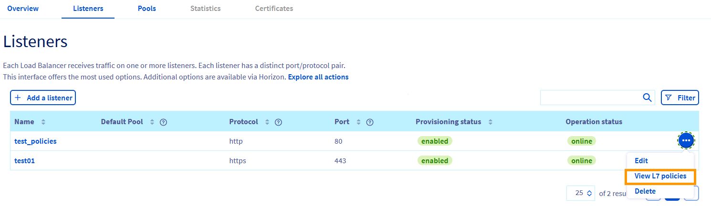
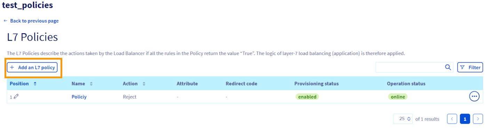
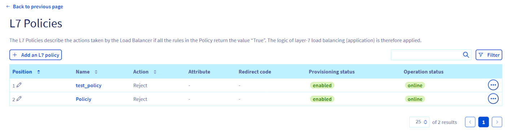
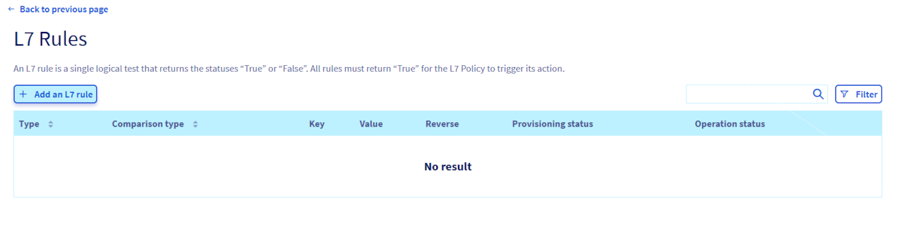
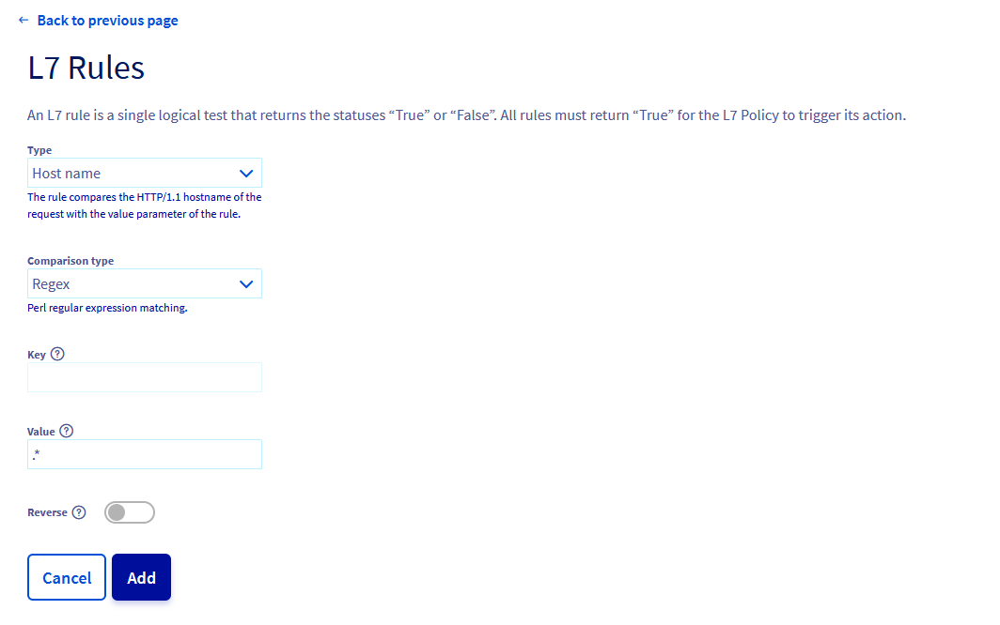

## Objectif

Utiliser les capacités L7 permet de diriger le trafic de manière intelligente, basée sur le contenu des requêtes HTTP/HTTPS, améliorant ainsi la sécurité, la performance, et la fiabilité de vos applications.

**Ce guide a pour but d'expliquer comment configurer et gérer des policies et règles de niveau 7 (L7) pour les Load Balancers Public Cloud dans l'environnement OVHcloud.**

### Concepts clés

#### Policies et Règles L7

##### **Policy L7** 

Une Policy L7U est une directive appliquée à un listener de Load Balancer pour contrôler le trafic en fonction de critères spécifiques, tels que l'URI, les en-têtes HTTP, ou les cookies. Les actions possibles incluent la redirection vers une URL spécifique ou un pool de serveurs, ou le rejet de la requête.

**L'ordre d'évaluation des politiques L7 est important et est déterminé par le paramètre de position de chaque politique.**

Les politiques sont évaluées dans un ordre spécifique défini par l'attribut de position, où la première politique correspondante est celle dont l'action est suivie. Si plusieurs politiques L7 sont associées à un listener, le paramètre de position devient crucial pour déterminer l'ordre d'évaluation.

Les politiques de rejet (REJECT) ont la priorité sur toutes les autres, suivies par les redirections vers une URL (REDIRECT_TO_URL) et enfin les redirections vers un pool (REDIRECT_TO_POOL). Si une politique correspondante est trouvée, son action est exécutée.

Si aucune politique ne correspond, la requête est dirigée vers le pool par défaut du listener, ou retourne une erreur 503 si aucun pool par défaut n'existe.

- **Principales caractéristiques des policies L7:**
    - **action** : l'action à réaliser (par exemple : redirect, reject).
    - **redirect_http_code** : le code HTTP utilisé lors de la redirection.
    - **redirect_pool_id** : l'ID du pool de serveurs vers lequel rediriger.
    - **redirect_prefix** : Le préfixe à ajouter à l'URL lors d'une redirection.
    - **redirect_url** : l'URL spécifique vers laquelle rediriger.
- **Contraintes des policies L7:**
    - Les L7 policies ne s'appliquent qu'à des listeners de type `HTTP` ou `TERMINATED_HTTPS`.

##### **Règle L7** 

Une règle L7 est une condition sous-jacente d'une policy L7, qui définit les critères spécifiques de correspondance du trafic, comme une correspondance d'URI ou de cookie. Plusieurs règles peuvent être associées à une politique, et toutes doivent correspondre (logique *AND*) pour que l'action de la politique soit appliquée. Pour exprimer une opération logique *OR* entre les règles, il est nécessaire de créer plusieurs politiques avec la même action.

- **Principales caractéristiques :**
    - **type** : le type de condition (par exemple : HEADER, COOKIE, URI).
    - **compare_type** : le type de comparaison (par exemple : EQUAL_TO, STARTS_WITH).
    - **value** : la valeur à comparer.
    - **key** : la clé spécifique à comparer, si applicable.

#### Exemples de L7 Policy et L7 Rules

- **Exemple de Policy L7 :**
    - **Action** : Redirect
    - **redirect_url** : `https://example.com/newpath`
    - **redirect_http_code** : 302

- **Règle L7 associée :**
    - **Type** : URI
    - **compare_type** : STARTS_WITH
    - **value** : `/oldpath`

Cet exemple montre comment rediriger le trafic de `/oldpath` vers `https://example.com/newpath` avec un code de redirection HTTP 302 lorsque l'URI commence par `/oldpath`.

### Conseils pour la configuration des règles L7

- **Testez chaque règle individuellement** : avant de combiner plusieurs règles, assurez-vous que chaque règle fonctionne comme prévu en la testant dans divers scénarios.
- **Documentez vos règles** : gardez une trace de la logique derrière chaque règle pour faciliter les modifications futures ou pour aider les nouveaux administrateurs à comprendre la configuration.
- **Surveillez l'impact des règles** : après l'activation des règles, surveillez le comportement du trafic pour s'assurer qu'elles fonctionnent comme prévu sans bloquer de trafic légitime.

## Prérequis

- Un [compte OVHcloud actif](/links/manager)
- Comprendre les [concepts du OVHcloud Load Balancer](/pages/public_cloud/public_cloud_network_services/concepts-03-loadbalancer).
- Un [projet Public Cloud OVHcloud](/pages/public_cloud/compute/create_a_public_cloud_project).
- Un Load Balancer [déjà configuré](/pages/public_cloud/public_cloud_network_services/getting-started-01-create-lb-service) dans votre projet Public Cloud.

##  En pratique

Plusieurs options de gestion sont disponibles pour configurer votre load balancer chez OVHcloud. Vous n'avez pas besoin de toutes les utiliser, mais il est nécessaire d'en choisir au moins une selon vos préférences :

- **Espace client OVHcloud :** permet la gestion via l'interface graphique, idéal pour ceux qui préfèrent une approche visuelle et intuitive.
- **CLI OpenStack :** pour la gestion via la ligne de commande. Retrouvez plus d'informations pour préparer votre environnement API OpenStack sur [ce guide](/pages/public_cloud/compute/prepare_the_environment_for_using_the_openstack_api).
- **Interface Horizon :** offre une gestion graphique via OpenStack pour les utilisateurs familiarisés avec cette plateforme. Retrouvez plus de détails supplémentaires sur [cette page](/pages/public_cloud/compute/introducing_horizon).
- **Terraform :** permet la gestion via Infrastructure as Code, utile pour automatiser et reproduire des environnements via des fichiers de code. Retrouvez plus d'informations sur le provider OVH pour Terraform sur [cette page](https://registry.terraform.io/providers/ovh/ovh/latest/docs).

Chaque méthode offre des avantages spécifiques, permettant de personnaliser la gestion de votre load balancer selon vos besoins et votre expertise technique.

### Configuration via l'espace client OVHcloud

La configuration des politiques et règles L7 via l'espace client OVHcloud vous permet de gérer votre Load Balancer de manière intuitive et graphique. Voici le détail des étapes à suivre :

#### Etape 1 - Accéder à l'espace client OVHcloud

Connectez-vous à [l'espace client OVHcloud](/links/manager). Une fois connecté, vous aurez une vue d'ensemble de tous vos services OVHcloud.

#### Etape 2 - Naviguer vers le Load Balancer

Cliquez sur l'onglet `Public Cloud`{.action}. Sélectionnez le projet Public Cloud souhaité si vous en avez plusieurs.

Sélectionnez `Load Balancer`{.action}, vous verrez apparaître la liste de vos Load Balancers. Cliquez sur celui que vous souhaitez configurer.

#### Etape 3 - Gérer les Politiques L7

Après avoir sélectionné votre Load Balancer, vous accéderez à son interface de gestion. Cliquez sur l'onglet `Listeners`{.action} pour afficher la liste des listeners.

Pour accéder aux options de gestion des politiques L7 d'un listener spécifique, cliquez sur le bouton `...`{.action} situé à droite du listener que vous souhaitez configurer. 

Sélectionnez l'option `Voir les L7 policies`{.action} dans le menu déroulant.

{.thumbnail}

> [!warning]
> La gestion des politiques L7 n'est disponible que pour les listeners utilisant les protocoles `HTTP` et `TERMINATED HTTPS`. Assurez-vous que votre listener utilise l'un de ces protocoles avant de tenter d'accéder à ces paramètres.
>

Une fois dans la section des politiques L7, vous pouvez voir les politiques existantes ou cliquer sur `Ajouter une L7 policy`{.action} pour créer une nouvelle politique, selon les options disponibles dans l'interface.

{.thumbnail}

##### Remplissage du formulaire de création de politique L7

- **Nom :** attribuez un nom unique à votre politique pour l'identifier facilement.
- **Position :** indiquez la position de la politique dans l'ordre d'évaluation. Les positions commencent à 1 et déterminent l'ordre dans lequel les politiques sont évaluées.
- **Action :** sélectionnez l'action que la politique doit exécuter lorsque les conditions sont remplies. Les options incluent :
    - `REDIRECT_TO_URL` : redirige les requêtes vers une URL spécifiée. Vous devrez fournir l'URL de redirection et sélectionner le code de réponse HTTP (par exemple, 301, 302, 303, 307, ou 308).
    - `REDIRECT_TO_POOL` : redirige les requêtes vers un pool de serveurs spécifié. Une liste déroulante nommée `pool` apparaîtra où vous pourrez choisir votre pool. Assurez-vous d'avoir des pools existants préalablement configurés.
    - `REDIRECT_PREFIX` : ici, le Load Balancer ajoute un préfixe à l'URL reçue dans la requête. Remplissez le champ `Préfixe` et choisissez le code de réponse HTTP approprié pour la redirection.
    - `REJECT` : Rejette les requêtes et retourne le code HTTP 403 (Forbidden).

{.thumbnail}

Après avoir rempli tous les champs nécessaires, cliquez sur **Ajouter** pour créer votre politique L7.

{.thumbnail}

#### Etape  4 - Ajout de règles spécifiques à une politique L7

Après avoir créé une L7 policy, vous pouvez y ajouter des règles pour préciser les conditions sous lesquelles cette politique doit s'activer. Voici les étapes pour ajouter des règles L7 à une politique existante :

1\. **Accès aux options de la politique L7**

Sur la page des politiques L7 de votre listener, localisez la politique pour laquelle vous souhaitez ajouter des règles. Cliquez sur sur le bouton `...`{.action} à côté de la politique concernée et sélectionnez `Gérer les L7 rules`{.action}.

{.thumbnail}

2\. **Ajouter une nouvelle règle L7**

Sur la page des règles L7, cliquez sur le bouton `Ajouter une L7 rule`{.action}.

{.thumbnail}

Une L7 rule est un test logique qui renvoie les statuts `True` ou `False`. Pour déclencher l'action de la politique, toutes les règles doivent retourner `True`.

3\. **Configuration de la règle L7**

- **Type de la L7 Rule** : sélectionnez le type de règle que vous souhaitez créer (par exemple : Cookie, Header, Host name, Path, etc.).
- **Type de comparaison** : choisissez comment vous souhaitez comparer les données (Regex, starts with, ends with, contains, equal to).
- **Clé** : pour certains types de règles comme Cookie ou Header, spécifiez la clé à évaluer.
- **Valeur** : indiquez la valeur utilisée par le type de comparaison.
- **Inverser** : optionnellement, vous pouvez inverser la logique de la règle pour que lorsque la condition est `True`, la logique de la règle soit considérée comme `False` et vice versa.

4\. **Types de Règles L7 disponibles**

- **Cookie** : inspecte les cookies des requêtes pour identifier des critères spécifiques.
- **Header** : analyse les en-têtes HTTP pour détecter des valeurs définies.
- **Host Name** : compare le nom d'hôte de la requête à une valeur spécifique.
- **Path** : examine le chemin d'accès URI pour trouver des correspondances spécifiques.
- **SSL Conn Has Cert** : vérifie si une connexion SSL possède un certificat.
- **SSL Verify Result** : évalue le résultat de la validation de certificat SSL.
- **File Type** : analyse le type de fichier dans l'URI pour identifier des extensions spécifiques.
- **SSL BN Field** : examine les champs de noms de certificat SSL pour des correspondances spécifiques.

{.thumbnail}

5\. **Enregistrement de la règle**

Une fois tous les champs remplis selon vos critères, cliquez sur `Ajouter`{.action} pour enregistrer la règle à votre politique L7.

{.thumbnail}


### Utilisation de la CLI OpenStack et d'Horizon

La CLI OpenStack et l'interface graphique Horizon offrent des alternatives à l'espace client OVHcloud pour la gestion des politiques et règles L7.

- **CLI (Command Line Interface)** : Idéale pour ceux qui préfèrent une approche scriptable et rapide pour la gestion des configurations.
- **Horizon (Interface Graphique)** : Parfait pour ceux qui privilégient une interface visuelle intuitive pour la navigation et la gestion des configurations. Horizon est particulièrement utile pour les utilisateurs moins familiers avec la ligne de commande.

Que vous optiez pour la CLI pour sa rapidité et sa flexibilité dans les scripts, ou Horizon pour sa facilité d'utilisation et son interface graphique intuitive, ces outils augmentent considérablement votre capacité à gérer finement le trafic entrant sur vos applications déployées chez OVHcloud.

#### Utilisation de la CLI OpenStack

La CLI OpenStack permet de gérer vos ressources cloud via des commandes exécutées dans votre terminal. Pour la création de politiques L7 sur vos Load Balancers, suivez ces instructions :

1\. **Ouvrez votre terminal**. 

Assurez-vous que l'environnement de votre CLI est configuré avec les bons identifiants.

2\. **Lister les listeners disponibles**.

Utilisez la commande suivante pour obtenir la liste des listeners de votre Load Balancer :

```bash
openstack loadbalancer listener list
```

3\. **Créer une politique L7**

Après avoir identifié le listener approprié, créez une politique L7 en utilisant la commande suivante. Remplacez `<LISTENER_ID>` par l'ID du listener où vous voulez ajouter la politique :

```bash
openstack loadbalancer l7policy create --action REDIRECT_TO_POOL --redirect-pool <POOL_ID> --name <POLICY_NAME> --position 1 <LISTENER_ID>
```

4\. **Ajouter une règle L7 à la politique**

Pour ajouter une règle à la politique que vous venez de créer, utilisez la commande suivante. Adaptez les paramètres tels que `<POLICY_ID>`, `<TYPE>`, `<COMPARE_TYPE>`, `<VALUE>` selon vos besoins :

```bash
openstack loadbalancer l7rule create --type <TYPE> --compare-type <COMPARE_TYPE> --value '<VALUE>' <POLICY_ID>
```

- Les types de règles incluent `PATH`, `HEADER`, `COOKIE`, etc.
- Les types de comparaison peuvent être `REGEX`, `STARTS_WITH`, `ENDS_WITH`, `EQUAL_TO`, `CONTAINS`.

5\. **Vérifier la création de la règle**

Pour confirmer que la règle a été correctement ajoutée à votre politique L7, vous pouvez lister les règles associées à la politique :

```bash
openstack loadbalancer l7rule list <POLICY_ID>
```

En suivant ces étapes, vous pouvez efficacement configurer et gérer les politiques et les règles L7 pour vos Load Balancers en utilisant la CLI OpenStack, offrant une approche flexible et puissante pour le contrôle avancé du trafic réseau.

Voici un exemple de format de sortie de la commande :

```shell
| id       | default_pool_id | name                           | project_id | protocol | protocol_port | admin_state_up |
|----------|-----------------|--------------------------------|------------|----------|---------------|----------------|
| REDACTED | REDACTED        | LB_S_GRA9-154-360-listener-1   | REDACTED   | HTTP     | 80            | True           |
```

**Explications des Colonnes dans la Liste des Listeners :**

| Colonne               | Détails                                                            |
|-----------------------|--------------------------------------------------------------------|
| `id`                  | Identifiant unique du listener.                                    |
| `default_pool_id`     | ID du pool par défaut (où le listener envoie le trafic par défaut) |
| `name`                | Nom du listener                                                    |
| `project_id`          | ID du projet associé à ce listener                                 |
| `protocol`            | Le protocole utilisé par le listener (par exemple, HTTP, HTTPS)    |
| `protocol_port`       | Le port sur lequel le listener écoute                              |
| `admin_state_up`      | Indique si le listener est activé (`True`) ou désactivé (`False`)  |


#### Créer une nouvelle Policy L7

Utilisez la commande suivante pour créer une nouvelle politique L7, en remplaçant `mon-listener-id` par l'identifiant de votre listener et `https://monsite.com` par l'URL de redirection désirée :

```bash
openstack loadbalancer l7policy create \
  --name ma-politique-l7 \
  --listener mon-listener-id \
  --action REDIRECT_TO_URL \
  --redirect-url https://monsite.com
```

#### Gestion via Horizon

Horizon, l'interface web d'OpenStack, offre une vue graphique sur la configuration de vos ressources cloud, y compris les Load Balancers et les politiques L7.

Il existe deux façons d'accéder à l'interface Horizon :

- Pour vous connecter avec l'authentification unique OVHcloud : utilisez le lien `Horizon`{.action} dans le menu de gauche sous « Interfaces de gestion » après avoir ouvert votre projet `Public Cloud`{.action} dans l'[espace client OVHcloud](/links/manager).

- Pour vous connecter avec un utilisateur OpenStack spécifique : ouvrez la [page de connexion à Horizon](https://horizon.cloud.ovh.net/auth/login/) et entrez les [identifiants de l'utilisateur OpenStack](/pages/public_cloud/compute/create_and_delete_a_user) précédemment créées, puis cliquez sur `Se connecter`{.action}.

Dans le tableau de bord d'Horizon, sélectionnez votre `Projet`{.action}.<br>
Dans le menu de gauche, cliquez sur l'onglet `Network`{.action} et sélectionnez `Load Balancers`{.action}.<br>

##### Configuration des Politiques L7

1\. **Accès au Load Balancer** :

Naviguez jusqu'au Load Balancer que vous souhaitez configurer et cliquez dessus pour accéder à ses détails.

2\. **Gestion des Listeners** :

Trouvez le listener auquel vous souhaitez ajouter des politiques L7 et cliquez dessus pour accéder à ses détails.

Dans les détails du listener, localisez et cliquez sur l'onglet `L7 policies`{.action}. Cet onglet liste toutes les politiques existantes.

Pour ajouter une nouvelle politique, cliquez sur le bouton `Create L7 Policy`{.action}.

3\. **Création de la Politique L7** :

Vous serez guidé à travers un formulaire pour définir :

- **Nom de la politique** : attribuez un nom unique à la politique.
- **Action** : choisissez l'action que la politique doit exécuter (par exemple : REDIRECT_TO_URL, REDIRECT_TO_POOL, REJECT).
- **Conditions spécifiques** : définissez tout critère spécifique qui doit être rencontré pour que la politique soit activée.

4\. **Ajout de Règles à la Politique** :

Une fois la politique créée, pour ajouter des règles spécifiques à cette politique, retournez à l'écran de détails de la politique L7.

Cliquez sur `Add Rule`{.action} pour configurer les règles qui détermineront les conditions précises sous lesquelles la politique s'appliquera.

Vous serez invité à spécifier des critères tels que le type de condition (URI, Header, Cookie), le type de comparaison (EQUAL_TO, STARTS_WITH, etc.), et les valeurs à comparer.

### Configuration automatisée avec Terraform

La configuration automatisée avec Terraform permet de déployer et de gérer des ressources cloud de manière déclarative, en utilisant des fichiers de configuration au format HashiCorp Language (HCL). Cela facilite la mise en place de politiques L7 pour les Load Balancers chez OVHcloud. 

Pour plus d'informations sur les ressources spécifiques de Terraform, consultez la documentation pour [L7 Policy](https://registry.terraform.io/providers/terraform-provider-openstack/openstack/latest/docs/resources/lb_l7policy_v2) et [L7 Rule](https://registry.terraform.io/providers/terraform-provider-openstack/openstack/latest/docs/resources/lb_l7rule_v2). Retrouvez ci-dessous un exemple plus détaillé de configuration d'une politique L7 avec Terraform.

#### Prérequis

- **Installation de Terraform :** assurez-vous d'avoir Terraform installé sur votre machine. Vous pouvez télécharger la dernière version de Terraform sur le [site officiel](https://www.terraform.io/downloads.html).
- **Configuration du Provider OpenStack :** configurez Terraform pour utiliser le provider OpenStack. Vous devrez fournir vos identifiants d'API OVHcloud pour permettre à Terraform d'interagir avec votre projet Public Cloud.

#### Configuration d'une Politique de Redirection HTTPS

L'exemple suivant montre comment définir une ressource Terraform pour créer une politique L7 qui redirige toutes les requêtes HTTP vers HTTPS :

```bash
# Définir le provider OpenStack
provider "openstack" {
  auth_url    = "https://auth.cloud.ovh.net/v3"
  user_name   = "votre_nom_utilisateur"
  tenant_name = "nom_de_votre_projet"
  password    = "votre_mot_de_passe"
  region      = "votre_région"
}

# Ressource pour le Load Balancer
resource "openstack_lb_loadbalancer_v2" "loadbalancer_1" {
  name          = "mon-loadbalancer"
  vip_subnet_id = "id_de_votre_subnet"
}

# Ressource pour le Listener
resource "openstack_lb_listener_v2" "listener_1" {
  name            = "mon-listener"
  protocol        = "HTTP"
  protocol_port   = 80
  loadbalancer_id = openstack_lb_loadbalancer_v2.loadbalancer_1.id
}

# Ressource pour la Politique L7
resource "openstack_lb_l7policy_v2" "l7policy_1" {
  name         = "https_redirect"
  action       = "REDIRECT_TO_URL"
  listener_id  = openstack_lb_listener_v2.listener_1.id
  redirect_url = "https://www.example.com"
}

# Ressource pour la Règle L7
resource "openstack_lb_l7rule_v2" "l7rule_1" {
  l7policy_id   = openstack_lb_l7policy_v2.l7policy_1.id
  type          = "HOST_NAME"
  compare_type  = "REGEX"
  value         = ".*"
}
```

## Aller plus Loin

Échangez avec notre communauté d'utilisateurs sur <https://community.ovh.com/>.
