## Objective

In today’s digital age, web application security is critical for protecting cloud infrastructures from sophisticated cyber threats. As businesses increasingly adopt cloud solutions, ensuring that web applications and APIs are secure is essential for maintaining data integrity and preventing breaches.
**U**bika **W**AAP **G**ateway (UWG) offers advanced Web Application and API Protection (WAAP) features, including powerful tools such as web application firewalls (WAFs), API protection, bot management, and DDoS mitigation. These tools help protect your cloud environment from a wide array of application-level threats.

This guide provides step-by-step instructions for deploying and configuring Ubika WAAP Gateway on the OVHcloud Public Cloud. By following this guide, you will learn how to configure private networks for management and workload, deploy Ubika WAAP Gateway instances, set up High Availability (HA) using Additional IP and vRack and public IP routing, and ensure a secure and reliable architecture for your cloud infrastructure.

**This guide explains how to secure your OVHcloud infrastructure with Ubika WAAP Gateway deployed on Public Cloud.**

> [!warning]
> This guide will show you how to use one or more OVHcloud solutions with external tools, and will describe the actions to be carried out in a specific context. ou may need to adapt the instructions according to your situation.
>
> If you encounter any difficulties performing these actions, please contact a [specialist service provider](/links/partner) and/or discuss the issue with our community. You can find more information in the [Go further](#gofurther) section of this guide.
>

## Requirements

- A [Public Cloud project](/pages/public_cloud/compute/create_a_public_cloud_project) in your OVHcloud account
- Access to the [OVHcloud Control Panel](/links/manager)
- An [OpenStack user](/pages/public_cloud/compute/create_and_delete_a_user) (optional)
- Basic networking knowledge
- A Ubika account on the [Ubika website](https://my.ubikasec.com/){.external}
- Ensure that an appropriate block of Additional IPs is available
- Ensure that the vRack is enabled and configured to allow secure communication between the components of the infrastructure
- [Additional IP address](/links/network/additional-ip) for ensuring network failover and high availability setup.
- Ubika WAAP Gateway Licence BYOL (**B**ring **Y**our **O**wn **L**icence), obtained directly from Ubika via the [official Ubika website](https://my.ubikasec.com/){.external}. You will need to provide it during the installation and configuration process

## Instructions

In addition to the installation and configuration of UWG, this tutorial offers a use case where you'll test UWG by deploying and running a web application on your Public Cloud infrastructure:

- [Configure your vRack](#step1)
- [Install and configure Ubika WAAP Gateway on your Public Cloud environment](#step2)
- [Configure the licences](#step3)
- [Create your web server environment](#step4)

### Configure your vRack <a name="step1"></a>

In this step, we are configuring the vRack, a private virtual network provided by OVHcloud. The vRack allows you to interconnect multiple instances or servers within a Public Cloud environment, ensuring network isolation while maintaining secure communication. By adding your Public Cloud project and your Additional IP block to the same vRack, along with public IP routing, you can enable your UWG instances to communicate securely, while keeping full control over IP address management. Private vRack network also allows you to secure Baremetal Cloud servers or Private Cloud VMs with security appliances deployed on top of Public Cloud.

**Add your public cloud project and your Additional IP block to the same vRack**

Please refer to the guide [Configuring an IP block in a vRack](/pages/bare_metal_cloud/dedicated_servers/configuring-an-ip-block-in-a-vrack) for more information.

Below is the architecture that we are going to set-up:

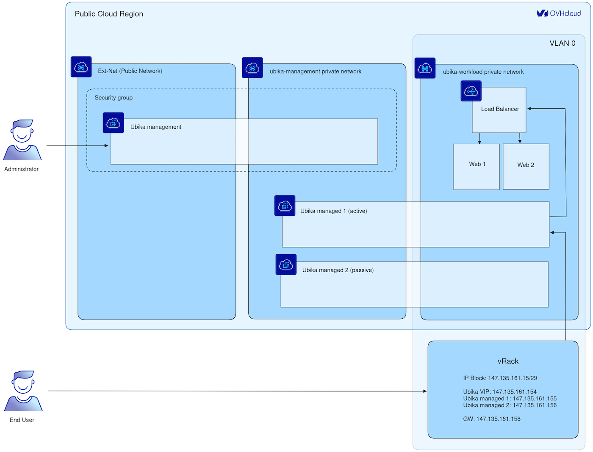{.thumbnail}

### Install and configure Ubika WAAP Gateway on your Public Cloud environment <a name="step2"></a>

> [!primary]
> In this tutorial, the installation and configuration of UWG is done primarily via the command line. Open a terminal to execute the instructions.
>
> Please note that all sections related to « High Availability » are optional as well as using vRack network with Additional IP. They are included to demonstrate how to set up the system with two instances in an active/passive mode for high availability. In a minimal version, it can also work with just one instance if that is sufficient for your needs.

#### Configure Ubika WAAP Gateway management networking

> [!primary]
> In this scenario, we will use a two virtual machines setup for the security appliance to achieve High Availability (HA), and an additional VM for management. This setup ensures failover protection and continuous service availability. For more examples and detailed guidance on scalability options, please refer to [Ubika documentation](https://www.ubikasec.com/ressources/){.external}.

Create a private network for management:

```bash
openstack network create --provider-network-type vrack --provider-segment 1000 ubika-management
```

This command creates a private network for managing the UWG instances, using the virtual private network (vRack) provided by OVHcloud. This isolated network is intended for internal communication between the Ubika components.

```bash
openstack subnet create --network ubika-management --subnet-range 192.168.1.0/24 --dhcp --gateway none --dns-nameserver 213.186.33.99 ubika-management
```

Here, you configure a subnet for the management network, specifying an IP address range and a DNS server for internal communications.

#### Configure Ubika WAAP Gateway workload networking

Create a private network for the workload:

```bash
openstack network create --provider-network-type vrack --provider-segment 0 --disable-port-security ubika-workload
```

This command creates a private network for the workload, designed to host applications secured by UWG.

```bash
openstack subnet create --network ubika-workload --subnet-range 192.168.2.0/24 --dhcp --dns-nameserver 213.186.33.99 ubika-workload
```

Here, you define a subnet for the workload network, enabling efficient management of network traffic.

Create a gateway:

> [!primary]
> A Gateway may be required for accessing the internet from web servers, especially for tasks such as software installation (Nginx for example) or remote management. However, for inbound client traffic, this component is not used.

```bash
openstack router create --external-gateway Ext-Net ubika-workload
```

```bash
openstack router add subnet 2481bcaf-efa2-419a-ad92-d6d27737dfd1 ubika-workload
```

#### Deploy the Ubika WAAP Gateway instances

Upload UWG image to OpenStack:

Go to the `download`{.action} section of the [official Ubika website](https://my.ubikasec.com/){.external}. Log in to your Ubika account and follow the instructions to download the UWG OpenStack image.

Go to the folder where you have downloaded your UWG Openstack image and upload the UWG OpenStack image (for this tutorial, we use the image `UBIKA_WAAP_Gateway-generic-cloud-6.11.10+51a56f6201.b56855.qcow2`):

```bash
openstack image create --disk-format raw --container-format bare --file ~/Downloads/UBIKA_WAAP_Gateway-generic-cloud-6.11.10+51a56f6201.b56855.qcow2 Ubika-WAAP-Gateway-6.11.10
```

[Import your SSH public key](https://docs.openstack.org/python-openstackclient/pike/cli/command-objects/keypair.html){.external}:

```bash
openstack keypair create --public-key ~/.ssh/id_rsa.pub <username>
```

Create a security group for the management UWG instance:

```bash
openstack security group create ubika-management
```

```bash
openstack security group rule create --ingress --remote-ip 192.168.1.0/24 ubika-management
```

```bash
openstack security group rule create --ingress --remote-ip 109.190.254.24/32 --dst-port 22 --protocol tcp ubika-management
```

```bash
openstack security group rule create --ingress --remote-ip 109.190.254.24/32 --dst-port 3001 --protocol tcp ubika-management
```

Create the UWG management instance:

Before executing the next OpenStack command, first create a `management.json` file and add the following content, adapting the parameters to your environment:

```console
{
    "instance_name": "management",
    "admin_user": "admin",
    "admin_password": "adminpassword"
}
```

Once the `management.json` file is created, execute the following command:

```bash
openstack server create --flavor r3-64 --image Ubika-WAAP-Gateway-6.11.10 --network Ext-Net --network ubika-management ubika-management --key-name <username> --security-group ubika-management --user-data ./management.json
```

Create the UWG managed instances:

Before executing the next OpenStack command, first create a `managed-1.json` file and add the following content, adapting the parameters to your environment.

```console
{
    "instance_role": "managed",
    "instance_name": "managed-1"
}
```

Once the `managed-1.json` file is created, execute the following command:

```bash
openstack server create --flavor c3-16 --image Ubika-WAAP-Gateway-6.11.10 --network ubika-management --network ubika-workload ubika-managed-1 --key-name <username> --user-data ./managed-1.json
```

Re-do these steps to create a second UWG managed instance but use the `managed-2.json` file. Create and add the following content to the `managed-2.json` file:

```console
{
    "instance_role": "managed",
    "instance_name": "managed-2"
}
```

#### Configure the HA on the UWG managed instances

Get the management instance public IP:

```bash
openstack port list --server ubika-management --network Ext-Net
```

Log in to the Ubika Java GUI and add the two managed UWG instances:

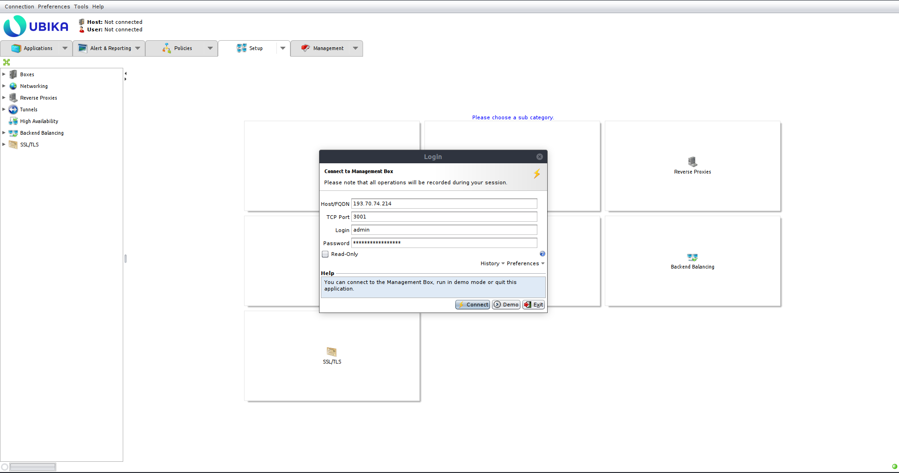{.thumbnail}

Get the management IP of the managed instances:

```bash
openstack port list --server ubika-managed-1 --network ubika-management
```

```bash
openstack port list --server ubika-managed-2 --network ubika-management
```

Add the first managed UWG instance to the UWG management (`Setup` > `Boxes` > `Add`):

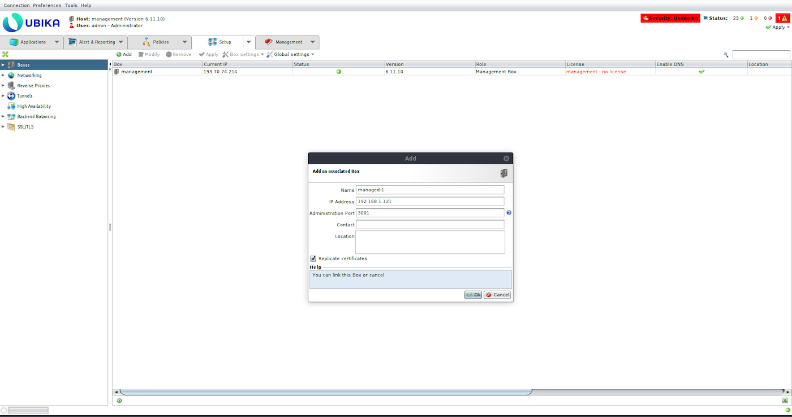{.thumbnail}

Add the second one:

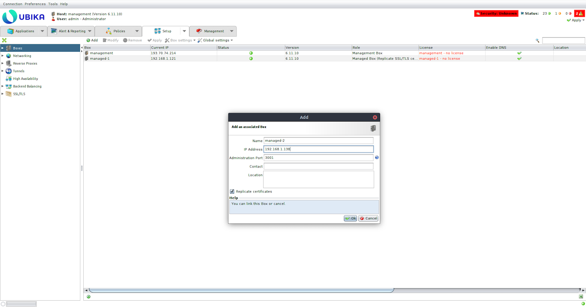{.thumbnail}

Add a virtual interface to the `eth1` interface of each managed UWG instance and configure it with an IP of your IP block instead of the private IP (`Setup` > `Networking` > `IP Addresses`).

UWG managed-1:

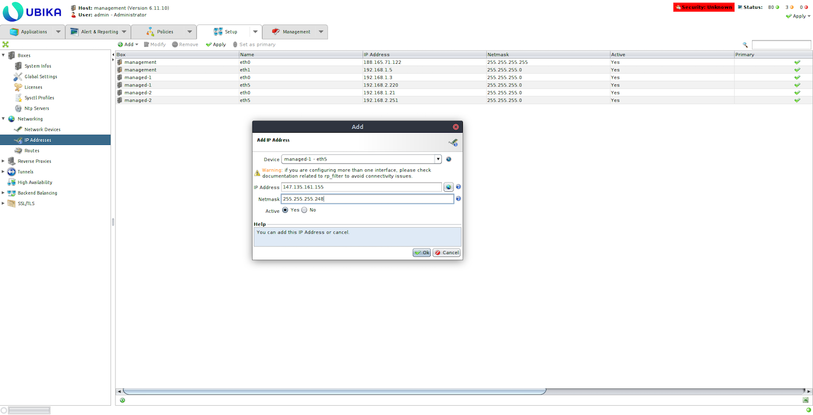{.thumbnail}

UWG managed-2:

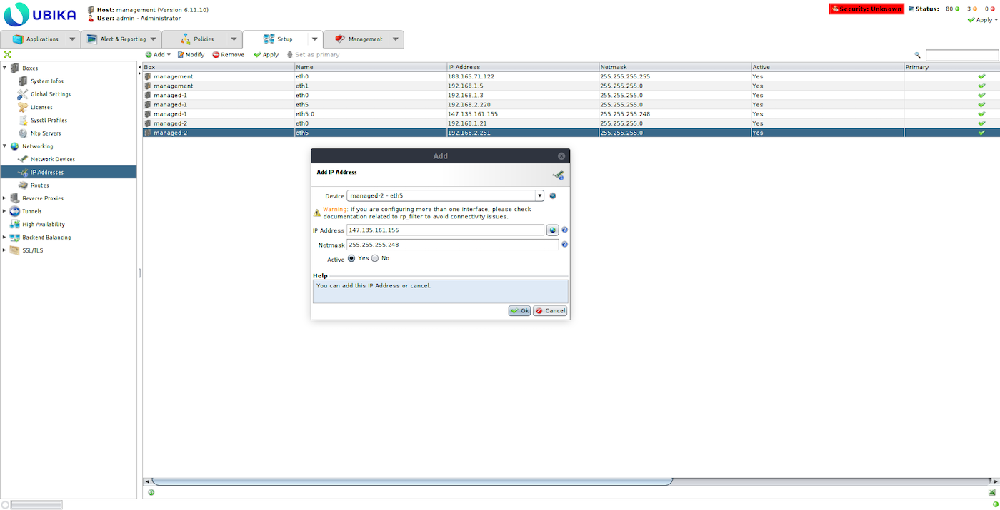{.thumbnail}

Remove the default gateway and add the vRack gateway for each managed Ubika (`Setup` > `Networking` > `Routes`).

UWG managed-1:

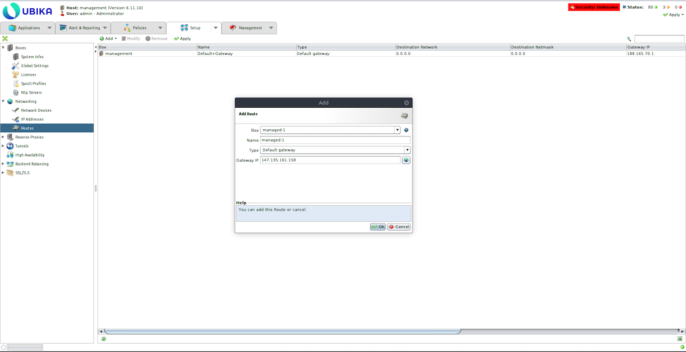{.thumbnail}

UWG managed-2:

{.thumbnail}

Create a High Availability Active/Passive configuration (`Setup` > `High Availability` > `Add`):

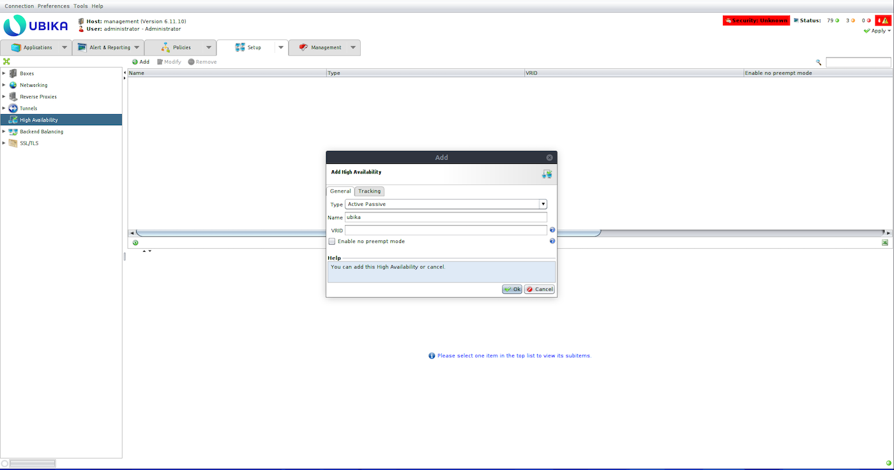{.thumbnail}

Add an IP of the IP block as Virtual IP:

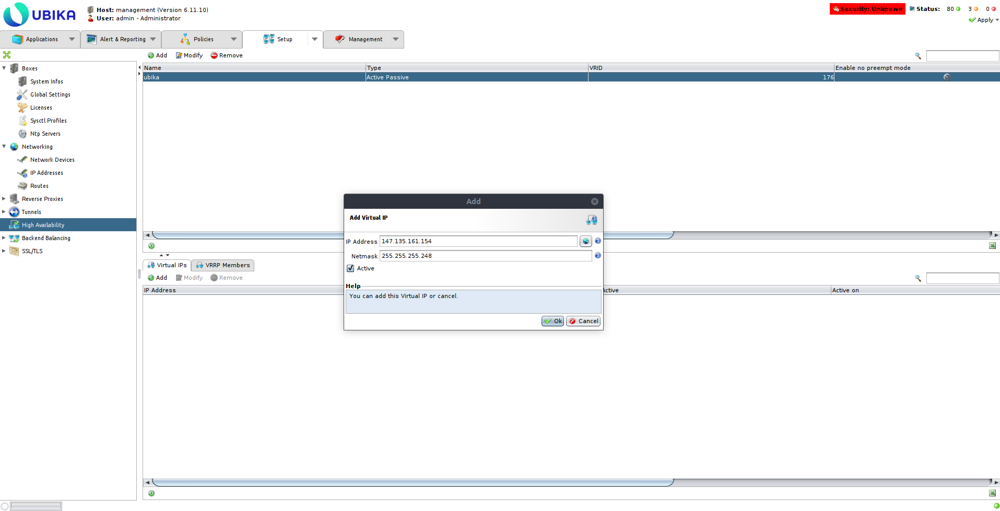{.thumbnail}

Add the two managed UWG instances as VRRP members using the workload interfaces (eth1):

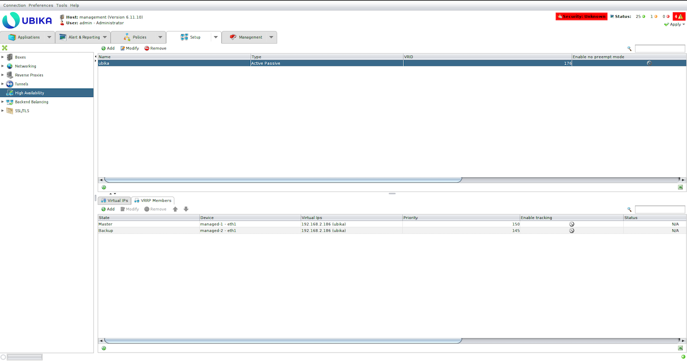{.thumbnail}

Apply the configuration (top right corner button):

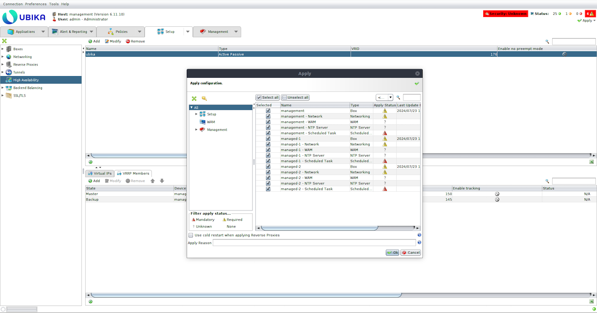{.thumbnail}

### Configure the licences <a name="step3"></a>

Ubika WAAP Gateway licences are available directly from Ubika via the [official Ubika website](https://my.ubikasec.com/){.external}. Depending on your deployment needs, you can choose between a single VM licence or a High Availability mode licence, which supports an Active-Backup configuration with two data-plane instances and one-or-more control plane instances. The licences also vary based on the SSL TPS (Transactions Per Second), supporting either multiple SSL certificates or failover capabilities.

We strongly recommend to use latest compute instances for appliance deployments, i.e.:

- C3-8 for basic needs and VMcloud licences.
- C3-16, C3-32, C3-64 and C3-128 for Ubika Enterprise Edition 1500, 2450, 4450, 5450 and 6450 licences respectively.
- C3-16 for small MGMT console, or C3-128 for big MGMT console (depends on the observability options enabled).

To apply the licences, you will need to provide the following information to UWG:

- Type of UWG deployment (single instance or HA)
- Serial number of the UWG instance
- Number of vCPUs and the amount of RAM allocated to each instance

Once you receive the licences from Ubika, apply them to the corresponding instances to complete the setup.

### Create your web server environment <a name="step4"></a>

In this section, we will create a web server environment and set up a load balancer to distribute traffic between multiple web servers. This step is crucial to validate the proper functioning of the network, security, and high availability settings of your UWG setup. By implementing a load balancer, we ensure that traffic is balanced across your web servers, enabling failover protection and redundancy, which is essential for maintaining service availability.

Create two web servers on the workload network.

Before executing the next OpenStack command, first create a `webserver.cloud-init` file and add the following content, adapting the parameters to your environment:

```console
{
    #cloud-config
    users:
    - default

    package_update: true

    packages:
    - nginx

    runcmd:
    - hostname > /var/www/html/index.html
    - systemctl enable nginx
    - systemctl start nginx
}
```

Once the `webserver.cloud-init` file is created, execute the following commands:

```bash
openstack server create --flavor b3-8 --image "Ubuntu 22.04" --network ubika-workload ubika-test-webserver-1 --key-name <username> --user-data ./webserver.cloud-init
```

```console
openstack server create --flavor b3-8 --image "Ubuntu 22.04" --network ubika-workload ubika-test-webserver-2 --key-name <username> --user-data ./webserver.cloud-init
```

Create an Octavia private load balancer:

```bash
openstack loadbalancer create --name ubika-test-webserver --vip-subnet-id ubika-workload
```

Check the status of the load balancer, it should be `ACTIVE`:

```bash
openstack loadbalancer show 367ecaef-28f6-4866-9af2-7ce519ba688f
```

Create an HTTP listener for the load balancer:

```bash
openstack loadbalancer listener create --name ubika-test-webserver --protocol HTTP --protocol-port 80 29590860-2852-44c3-9514-dfb271bd9371
```

```bash
openstack loadbalancer pool create --name ubika-test-webserver --listener 3e77b59f-0abb-4861-b0a5-7de442ee6d1b --protocol HTTP --lb-algorithm ROUND_ROBIN
```

Create health check for the load balancer backends pool:

```bash
openstack loadbalancer healthmonitor create --type HTTP --delay 5 --timeout 5 --max-retries 3 212ff492-6935-4810-973f-83b7346e72ac
```

Get the IP of the two web servers:

```bash
openstack port list --server ubika-test-webserver-1 --network ubika-workload
```

```bash
openstack port list --server ubika-test-webserver-2 --network ubika-workload
```

Add the web servers to the backends pool of the load balancer:

```bash
openstack loadbalancer member create --address 192.168.2.164 --protocol-port 80 212ff492-6935-4810-973f-83b7346e72ac
```

```bash
openstack loadbalancer member create --address 192.168.2.237 --protocol-port 80 212ff492-6935-4810-973f-83b7346e72ac
```

Create a Reverse Proxy (Setup -> Reverse Proxy -> Add) on one of the Ubika managed boxes:

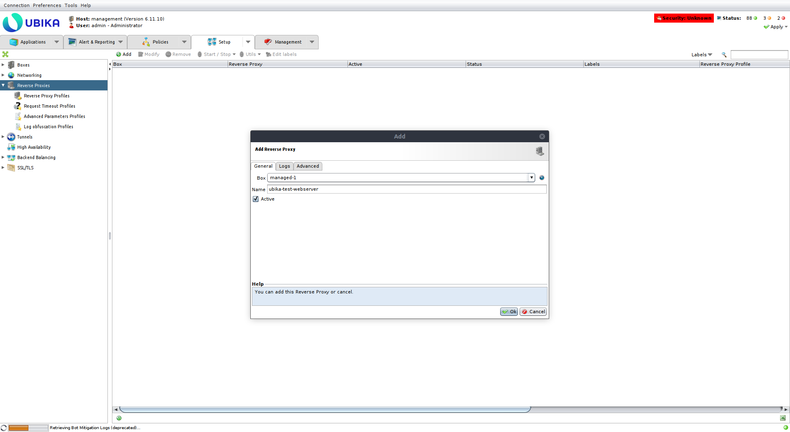{.thumbnail}

Create a DNS A record for the webserver pointing to the virtual IP of the Ubika deployment:

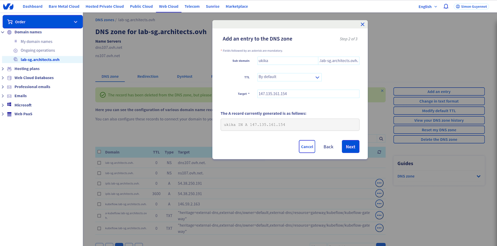{.thumbnail}

Get the VIP of the load balancer:

```bash
openstack loadbalancer show 29590860-2852-44c3-9514-dfb271bd9371
```

Create a tunnel (`Setup` > `Tunnels` > `Add`):

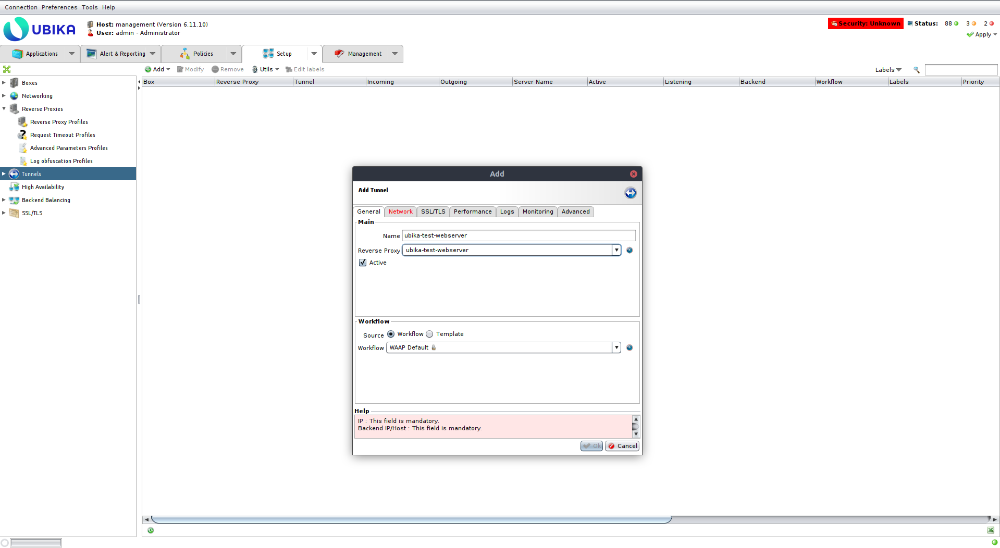{.thumbnail}

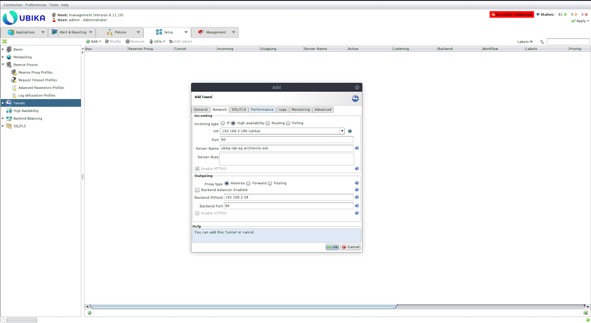{.thumbnail}

Apply the configuration:

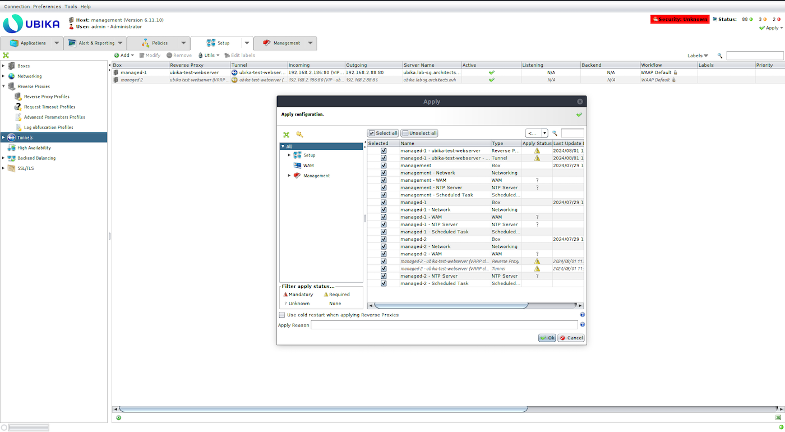{.thumbnail}

Try to access the webserver:

```bash
curl http://ubika.lab-sg.architects.ovh

ubika-test-webserver-1
```

## Go further <a name="gofurther"></a>

If you need training or technical assistance to implement our solutions, contact your sales representative or click on [this link](/links/professional-services) to get a quote and ask our Professional Services experts for assisting you on your specific use case of your project.

Join our [community of users](/links/community).
