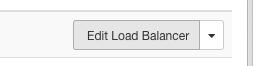
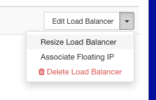
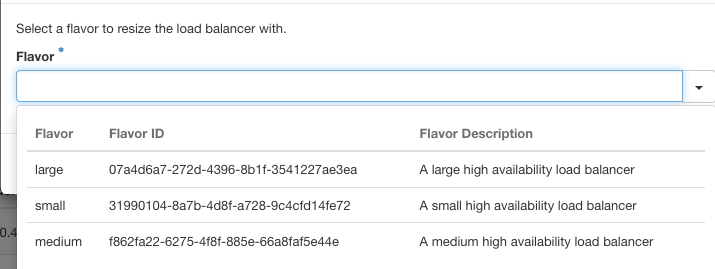

## Objectif

**Découvrez comment modifier la taille de votre Load Balancer via l’interface Horizon.**

> [!success]
> Retrouvez plus d’informations sur les différentes tailles de Load Balancer et leurs capacités sur notre [page Load Balancer](/links/public-cloud/load-balancer).

## Prérequis

- Accès à l'interface [OVHcloud Horizon](https://horizon.cloud.ovh.net/project/load_balancer)
- Un Load Balancer [déjà créé et disponible](/pages/public_cloud/public_cloud_network_services/getting-started-01-create-lb-service)
- Les privilèges nécessaires pour modifier les paramètres du Load Balancer

## En pratique

### Étape 1 - Se connecter à Horizon

Accédez à [l'interface OVHcloud Horizon](https://horizon.cloud.ovh.net/project/load_balancer) et connectez-vous avec vos identifiants. Pour plus d'informations sur la façon de se connecter à Horizon, consultez le guide « [Présentation de Horizon](/pages/public_cloud/compute/introducing_horizon) ».

### Étape 2 - Localiser le Load Balancer

Une fois connecté, allez dans la section `Load Balancer`{.action}. Recherchez le Load Balancer existant dans la liste.

### Étape 3 - Modifier le Load Balancer

A droite de votre Load Balancer, cliquez sur la flèche pointant vers le bas. Sélectionnez `Modifier le Load Balancer`{.action} dans le menu déroulant.

{.thumbnail}

### Étape 4 - Redimensionner le Load Balancer

Dans le menu d'options, choisissez `Redimensionner le Load Balancer`{.action}.

{.thumbnail}

Une fenêtre s’ouvrira alors pour vous permettre de sélectionner une nouvelle taille pour votre Load Balancer.

Dans la liste déroulante, sélectionnez la taille souhaitée pour votre Load Balancer :

- **Petite**
- **Moyenne**
- **Grande**

{.thumbnail}

Confirmez votre sélection et appliquez les modifications.

Après avoir choisi la nouvelle *flavor*, cliquez sur `Appliquer`{.action} ou `Sauvegarder`{.action} pour mettre à jour la taille de votre Load Balancer.

## Aller plus loin

Échangez avec notre [communauté d'utilisateurs](/links/community).