## Objective

In today's rapidly evolving digital landscape, securing cloud infrastructure has become a top priority for organizations of all sizes. As businesses increasingly rely on cloud solutions for their operations, ensuring the protection of sensitive data and maintaining network integrity are critical tasks. **S**tormshield **N**etwork **S**ecurity (SNS) is a comprehensive security solution designed to protect cloud environments from a wide range of threats. This guide provides step-by-step instructions for deploying and configuring SNS on the OVHcloud Public Cloud with RTvRack, covering key features such as network firewalls, IPSec VPNs, and SSL/TLS VPNs. By following this guide, you will enhance the security of your OVHcloud Public Cloud infrastructure and ensure safe and secure operations.

**This guide explains how to securing your OVHcloud infrastructure with Stormshield Network Security deployed on Public Cloud.**

## Requirements

- A [Public Cloud project](https://www.ovhcloud.com/en-gb/public-cloud/) in your OVHcloud account
- Access to the [OVHcloud Control Panel](https://www.ovh.com/auth/?action=gotomanager&from=https://www.ovh.co.uk/&ovhSubsidiary=GB)
- An [OpenStack user](/pages/public_cloud/compute/create_and_delete_a_user) (optional)
- Basic networking knowledge
- Stormshield account on the [Stormshield website](https://www.stormshield.com/en/){.external}
- Stormshield Network Security License BYOL (**B**ring **Y**our **O**wn **L**icense), obtained through [third-party partners or resellers](https://www.stormshield.com/partner/partner-finder/){.external}, as you will need to provide it during the installation and configuration process.

## Instructions

In addition to the installation and configuration of Stormshield Network Security, this tutorial offers different use cases based on your needs :

- [Install and configure Stormshield Network Security on your Public Cloud environment](#step1)
- [Usecase 1 : configure Stormshield Network Security to be used as a gateway](#step2)
- [Usecase 2 : configure a NAT to access a private HTTP service from outside](#step3)
- [Usecase 3 : IPsec tunnel (site-to-site)](#step4)
- [Usecase 4 : SSL/TLS VPN (client-to-site)](#step5)

### Install and configure Stormshield Network Security on your Public Cloud environment <a name="step1"></a>

> [!primary]
> In this tutorial, the installation and configuration of Stormshield Network Security is done primarily via the command line. Open a terminal to execute the instructions.
>
> Please note that all sections related to « High Availability » or « stormshield-2 » are optional. They are included to demonstrate how to set up the system with two instances in an active/passive mode for high availability. Normally, it can also function with just one instance if that is sufficient for your needs.

> [!primary]
> In this scenario, we will use two virtual machines setup for the security appliance to achieve High Availability (HA), and an additional VM for management. This setup ensures failover protection and continuous service availability. For more examples and detailed guidance on scalability options, please refer to the [Stormshield's documentation](https://documentation.stormshield.eu/HOME/Content/Website_Topics/Root-HomePage-EN.htm){.external}.


#### Configure your vRack

In this step, we are configuring the vRack, a private virtual network provided by OVHcloud. The vRack allows you to interconnect multiple instances or servers within a Public Cloud environment, ensuring network isolation while maintaining secure communication. By adding your Public Cloud project and your IP block to the same vRack, you can enable your SNS instances to communicate securely, while keeping full control over IP address management.

**Add your public cloud project and your IP block to the same vRack**

In this guide sample, the IP block is `147.135.161.152/29`.
We use the first usable IP `147.135.161.153` for the first instance of SNS and use temporally the second usable IP `147.135.161.154` for the second SNS.
The gateway address is `147.135.161.158`.

Please refer to the guide [Configuring an IP block in a vRack](/pages/bare_metal_cloud/dedicated_servers/configuring-an-ip-block-in-a-vrack) for more information.

Below is the architecture that we are going to set-up.


#### Configure OpenStack networking

* Create the private network for the SNS external interfaces :

```console
openstack network create --provider-network-type vrack --provider-segment 0 --disable-port-security stormshield-ext
```

```console
openstack subnet create --network stormshield-ext --subnet-range 192.168.1.0/29 --dhcp stormshield-ext
```

* Create the private network for the SNS internal interfaces:

```console
openstack network create --provider-network-type vrack --provider-segment 200 --disable-port-security stormshield-vlan200
```

```console
openstack subnet create --network stormshield-vlan200 --subnet-range 10.200.0.0/16 --dhcp --dns-nameserver <dns_address_ip> stormshield-vlan200
```

* Create the private network for the SNS HA (**H**igh **A**vailability) interfaces :

```console
openstack network create --provider-network-type vrack --provider-segment 199 --disable-port-security stormshield-ha
```

```console
openstack subnet create --network stormshield-ha --subnet-range 192.168.2.0/29 --dhcp --gateway none stormshield-ha
```

#### Deploy the SNS instances

Go to the `download` section of the [official Stormshield website](https://documentation.stormshield.eu/SNS/v4/fr/Content/PAYG_Deployment_Guide/Downloading_installation_file.htm){.external}. Log in to your Stormshield account and follow the instructions to download the Stormshield OpenStack image.

Go to the folder where you have downloaded your SNS Openstack image and upload the image (for this tutorial, we use the image `utm-SNS-EVA-4.7.6-openstack.qcow2`) :

```console
openstack image create --disk-format raw --container-format bare --file ./utm-SNS-EVA-4.7.6-openstack.qcow2 stormshield-SNS-EVA-4.7.6
```

* Create the SNS instances (for this example, we called them `stormshield-1` and `stormshield-2`) :

```console
openstack server create --flavor b2-15 --image stormshield-SNS-EVA-4.7.6 --network stormshield-ext --network stormshield-vlan200 --network stormshield-ha stormshield-1
```

```console
openstack server create --flavor b2-15 --image stormshield-SNS-EVA-4.7.6 --network stormshield-ext --network stormshield-vlan200 --network stormshield-ha stormshield-2
```

> [!primary]
> In this tutorial, we use the `b2-15` instance. To avoid compatibility problems, we suggest to not use the following instance types : b3, c3, r3.
>

#### Configure the SNS instances

Log into your OVHcloud client area, go to the Public Cloud section, and select the relevant Public Cloud project. In the left menu, click on `Instances` under the `Compute` section, then find your two SNS instances.

Access the VNC console for both SNS instances and configure the keyboad layout and the password.

* Configure the default gateway on the first SNS with our IP block gateway :

```console
vi /usr/Firewall/ConfigFiles/object

[Host]
Firewall_out_router=147.135.161.158,resolve=static
...
```

* Configure the external network interface on the first SNS with the first usable IP address of our IP block and the internal network interface with the `10.200.0.1` IP address :

```console
vi /usr/Firewall/ConfigFiles/network

...
[ethernet0]
...
Address=147.135.161.153
Mask=255.255.255.248

[ethernet1]
...
Address=10.200.0.1
Mask=255.255.0.0
...
```

* Apply the new network configuration

```console
ennetwork
```

* Do the same configuration for the second SNS but with the second IP address `147.135.161.154` of our IP block for the external interface instead of `147.135.161.153`.

* Add a different license on both SNS instances by following the [official documentation](https://documentation.stormshield.eu/SNS/v4/en/Content/Installation_and_first_time_configuration/Firewall_license_installation.htm){.external}.

* Create a firewall rule similar to this on both SNS in the web GUI :

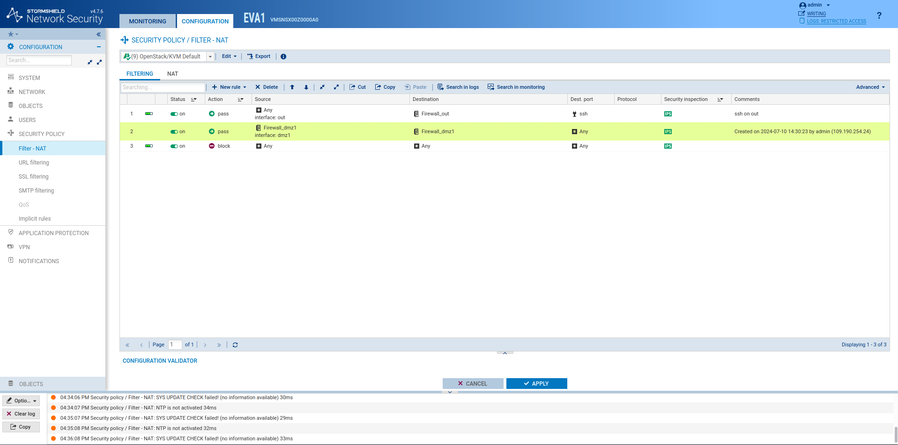

* On the first SNS, create a group of firewalls (Configuration -> System -> High Availability). For the IP address, check which IP was assign to the HA interface by the OpenStack DHCP.

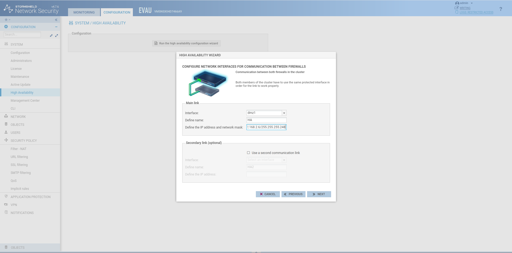

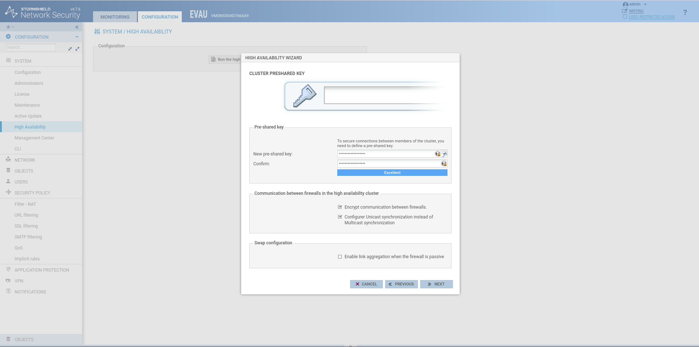

* When the configuration of the HA is finished on the first SNS. Join the firewalls group on the second one :


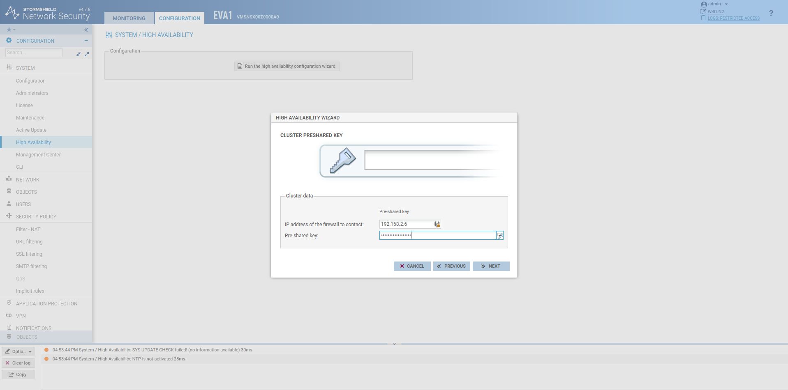

The second SNS external interface will now use the same IP address than the first SNS. Therefore the `147.135.161.154` IP address can be used for something else now.

If everything is configured properly, after the reboot of the second SNS, you should see something similar to this in the Health Indicators of the HA Link:

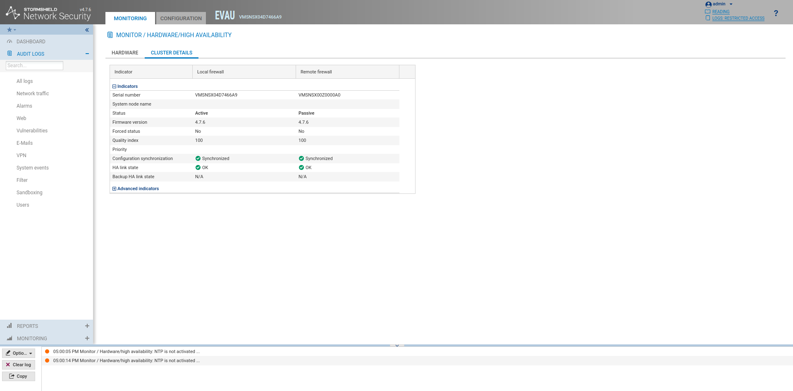

#### Configure and secure the SNS management

> [!tabs]
> **Step 1**
>>
>> Get your public IP :
>> ```console
>> curl ipinfo.io/ip
>> <ip_address>
>> ```
>>
> **Step 2**
>>
>> Create a host object for your public IP :
>>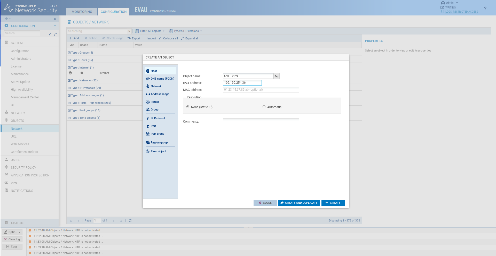
>>
> **Step 3**
>>
>> Limit the access to the GUI to your public IP and enable SSH :
>> 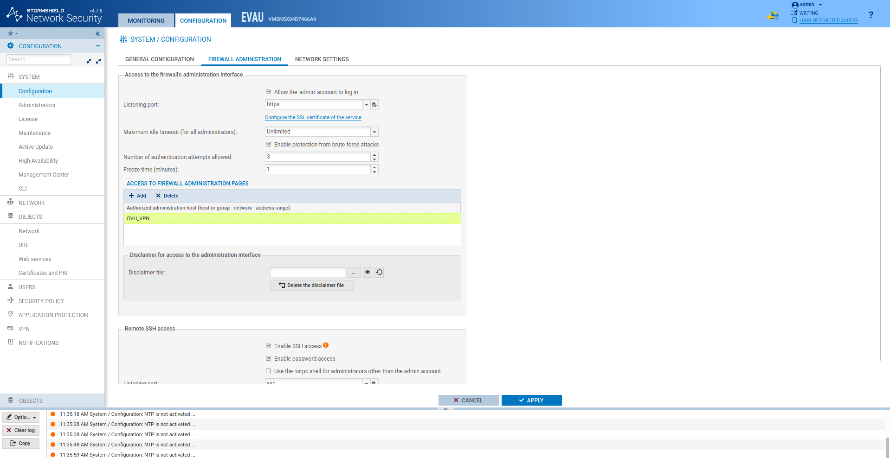
>>
> **Step 4**
>>
>> Limit the access to the SSH to your public IP
>> 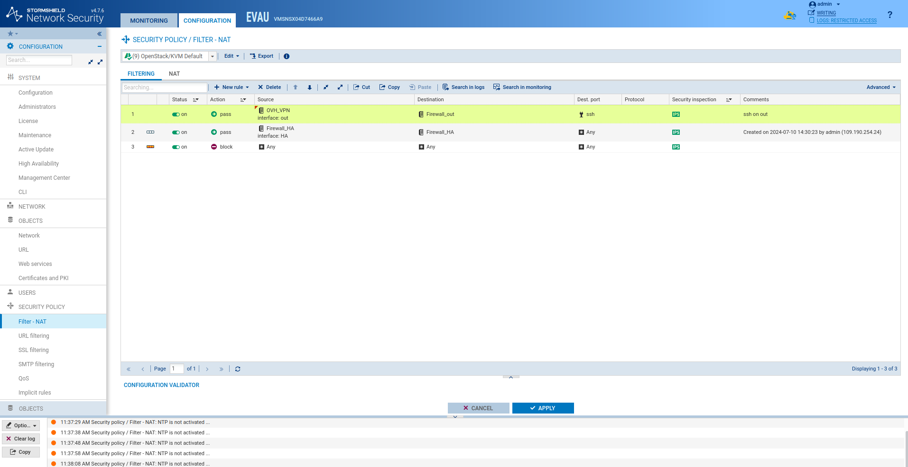

##### Re-synchronize the HA configuration

The synchronization between the two SNS instances is crucial to ensure that both firewalls are always up to date with the same configuration. At this point, the two SNS instances should not be in sync anymore as we configured a lot of parameters on the first instance than the second one is not aware of.

* Log in to the active SNS instance using SSH :

```console
ssh admin@<ip_address>
```

* Synchronize the two SNS :

```console
hasync
```

You need to do this each time you update the configuration.

### Usecases configuration

After deploying SNS **E**lastic **V**irtual **A**ppliance (EVA) firewall, it can be used in multiple advanced security scenarios such as IPsec VPN, SSL/TLS VPN, network gateways (IN or OUT) as described below.
Thanks to the vRack private network, listed VLANs can also be used outside Public Cloud environment : across BareMetal or PrivateCloud products.

#### Usecase 1 : configure Stormshield Network Security to be used as a gateway <a name="step2"></a>

In this example, virtual firewall appliance will act as a secure gateway for private instances (or any other servers) inside VLAN200 of given vRack network. Such traffic can be a subject for URL filtering on the firewall.

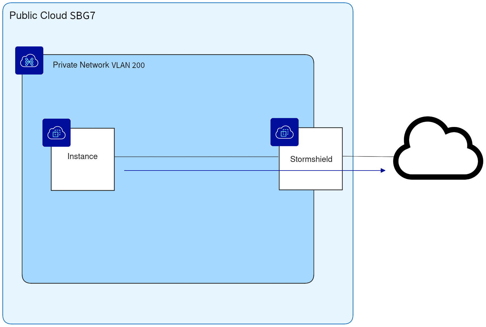

* Create a network object for the VLAN200 by following this [part of the official Stormshield documentation](https://documentation.stormshield.eu/SNS/v4/en/Content/Stormshield_Network_SSO_Agent_Linux/Configure_Firewall_Objects.htm){.external}.

* [Create a new filter rule](https://documentation.stormshield.com/SNS/v4/en/Content/HowTo_-_IPSec_VPN_-_Authentication_by_certificate/Setup-Main-Site-30-Creating-Filtering-policy.htm){.external} similar to this one to allow the traffic coming from VLAN200 to go out : 

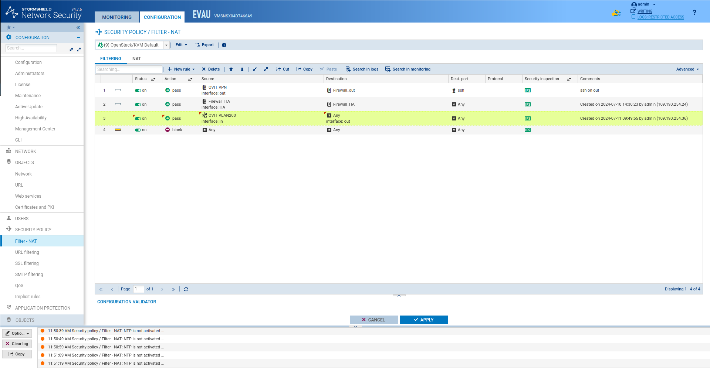

* [Create a NAT rule](https://documentation.stormshield.eu/SNS/v4/en/Content/SNS_for_Cloud_-_VMWare_NSX/NAT-Rules.htm){.external} similar to this one :

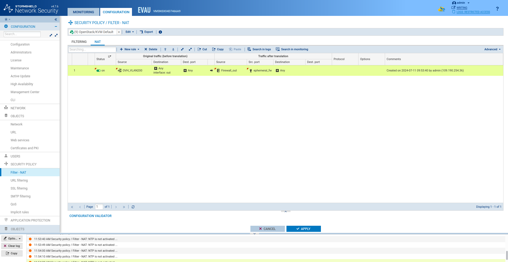

* Synchronize the two HA SNS instances :

```console
ssh admin@<ip_address>
hasyn
```

##### Verify if an instance can reach Internet from VLAN200

* [Import your SSH public key](https://docs.openstack.org/python-openstackclient/pike/cli/command-objects/keypair.html){.external} :

```console
openstack keypair create --public-key ~/.ssh/id_rsa.pub <name>
```

* Create an instance on VLAN200 :

```console
openstack server create --flavor b2-7 --image "Ubuntu 22.04" --network stormshield-vlan200 --key-name <name> ubuntu-webserver
```

* Log-in via SSH to the SNS instance :

```console
ssh -A admin@<instance_ip>
```

* From the SNS instance, log-in via SSH to the Ubuntu webserver. Check which IP was assigned to your Ubuntu webserver instance by the OpenStack DHCP :

```console
ssh ubuntu@<ip_address>
```

* Test if you can reach a public website :

```console
curl -I https://www.ovh.com/manager/
HTTP/2 200
```

#### Usecase 2 : configure a NAT to access a private HTTP service from outside <a name="step3"></a>

In this example, Internet should be able to reach-out to the private webserver installed inside VLAN200. The goal of such setup is to protect webserver with network firewall.

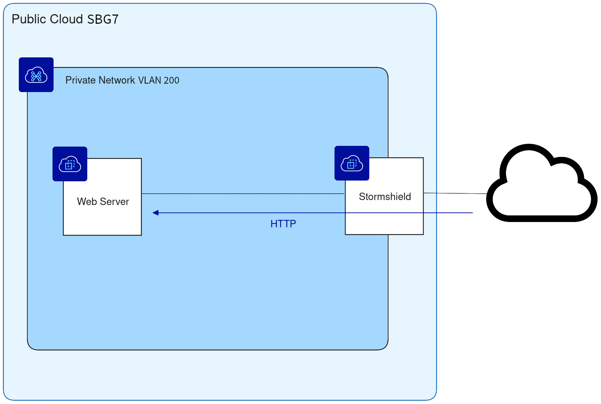

> [!tabs]
> **Step 1**
>>
>> Install Nginx on the ubuntu-webserver instance :
>> ```console
>>sudo apt-get update
>> sudo apt-get install -y nginx
>> ```
> **Step 2**
>>
>> Create a host object for the ubuntu-webserver :
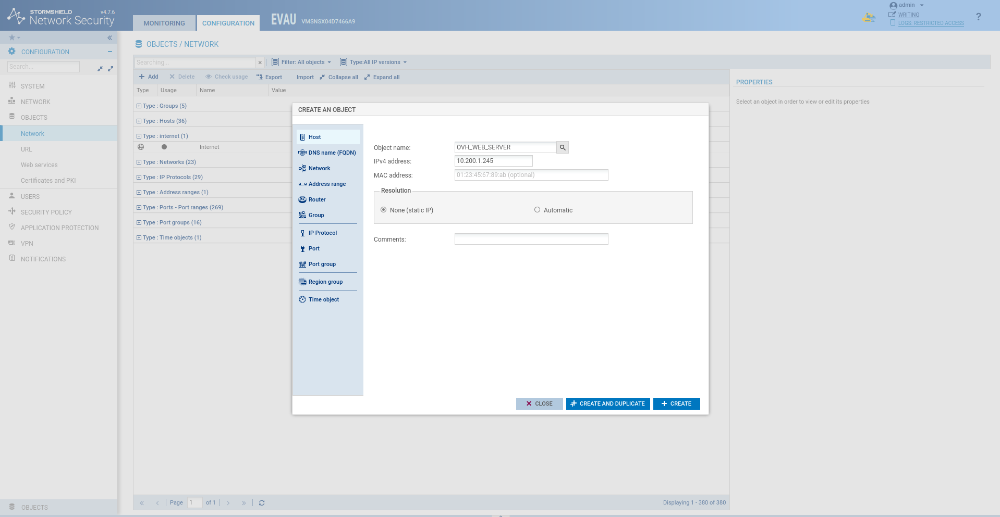
>>
> **Step 3**
>>
>> Create a NAT rule like this one :
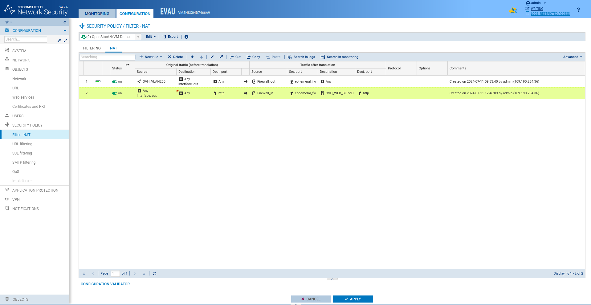
>>
> **Step 4**
>>
>> Create a filter rule like this one :
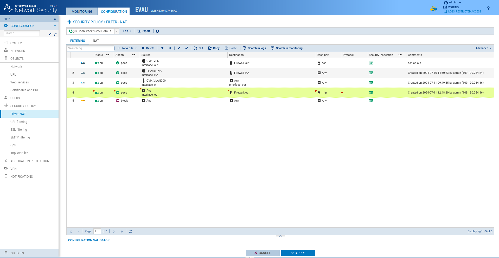

* Test to access the website from outside :

```console
curl -I http://<ip_address>
HTTP/1.1 200 OK
```

* Synchronize the two HA SNS instances :

```console
ssh admin@<ip_address>
hasyn
```

#### Usecase 3 : IPsec tunnel (site-to-site) <a name="step4"></a>

In this example, IPsec tunnel is configured to interconnect two different PCI regions: SBG7 (network VLAN200) and GRA11 (network VLAN201), but any of those sites can be a remote site like an office or data center.

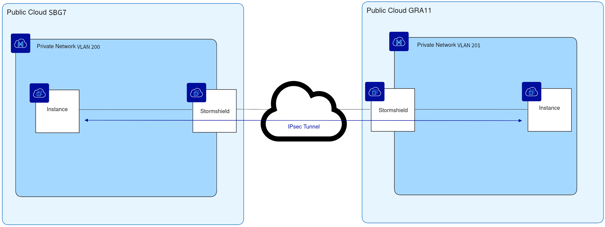

* Re-do all the steps in another region using the VLAN 201 instead of the VLAN 200 and different IP ranges for the stormshield-ext and stormshield-ha subnet.

##### Configure the first site

* [Add a host object](https://documentation.stormshield.eu/SNS/v4/en/Content/Stormshield_Network_SSO_Agent_Linux/Configure_Firewall_Objects.htm){.external} for the remote SNS and add a network object for the VLAN201 remote private network.

* [Create a standard site-to-site tunnel](https://documentation.stormshield.eu/SNS/v4/en/Content/User_Configuration_Manual_SNS_v4/IPSec_VPN/Encryption_policy-Tunnels_tab-Site_to_Site-Creating.htm){.external}.

> [!tabs]
> **Step 1**
>>
>> Add the local and the remote private network :
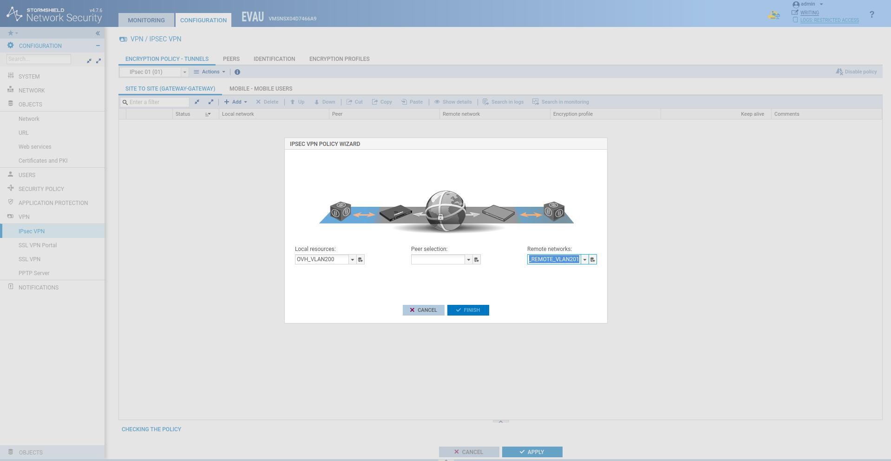
> **Step 2**
>>
>> Create the remote gateway :
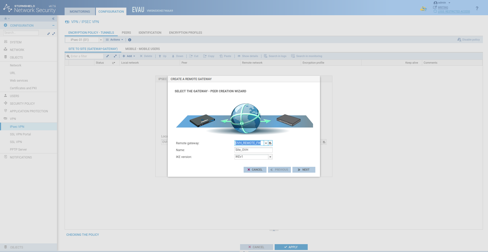
>>
> **Step 3**
>>
>> Choose a pre-shared key :
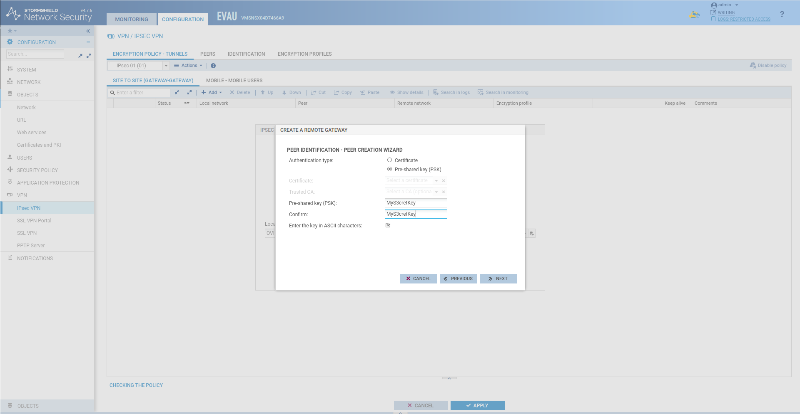
>>
> **Step 4**
>>
>> Create and activate the tunnel :
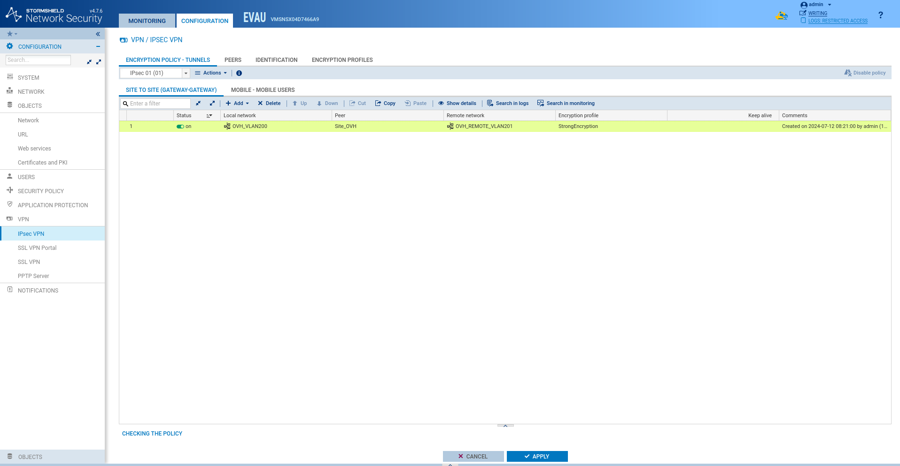
>>
> **Step 5**
>>
>> Add a filter rule like this one to allow traffic through the tunnel :
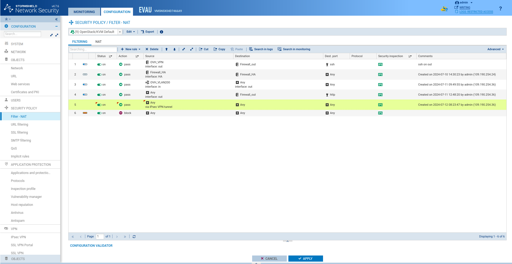

* Synchronize the two HA SNS instances :

```console
ssh admin@<ip_address>
hasync
```

##### Configure the second site

Do exactly the same than for the first site, but use VLAN200 for the remote private network and the appropriate IP address for the OVH_REMOTE_FW.

##### Test the IPsec VPN tunnel

* From the first site private webserver instance :

```console
ssh -A admin@<ip_address>
ssh ubuntu@<ip_address>
ping <ip_address>
PING <ip_address>(<ip_address>) 56(84) bytes of data.
64 bytes from <ip_address>: icmp_seq=1 ttl=64 time=15.2 ms
64 bytes from <ip_address>: icmp_seq=2 ttl=64 time=14.0 ms
```

* From the second site private webserver instance :

```console
ssh -A admin@<ip_address>
ssh ubuntu@<ip_address>
ping <ip_address>
PING <ip_address> (<ip_address>) 56(84) bytes of data.
64 bytes from <ip_address>: icmp_seq=2 ttl=64 time=16.9 ms
64 bytes from <ip_address>: icmp_seq=3 ttl=64 time=16.4 ms
```

#### Usecase 4 : SSL/TLS VPN (client-to-site) <a name="step5"></a>

In this example, a remote OpenVPN client will connect with private network inside VLAN200.

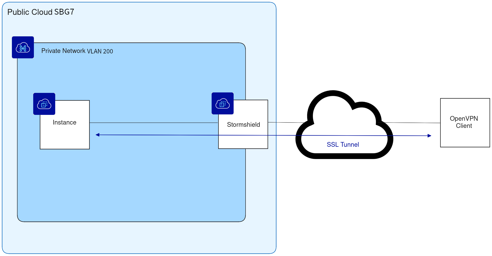

##### Configuring the LDAP directory

* [Create a internal LDAP directory](https://documentation.stormshield.eu/SNS/v4/en/Content/User_Configuration_Manual_SNS_v4/Directory_configuration/Creating_an_internal_LDAP.htm){.external} to manage the VPN users. In a production scenario, this LDAP/AD should be remote and not local.

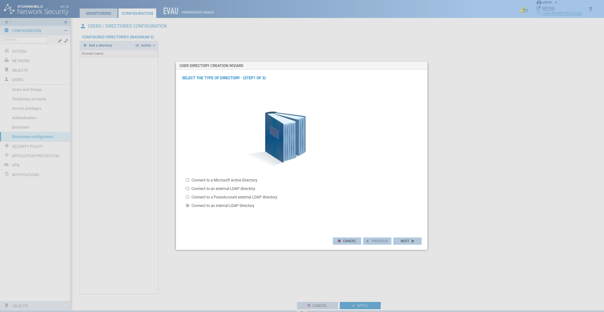

* Create the user directory :

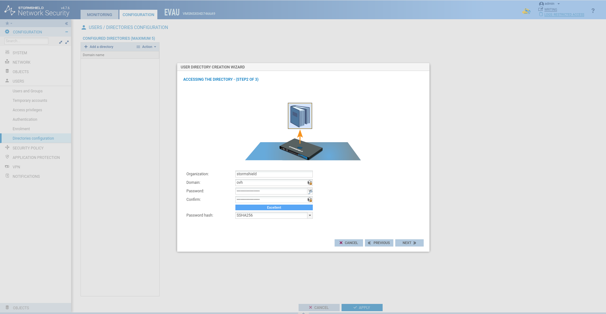

* Add a user to our local directory :

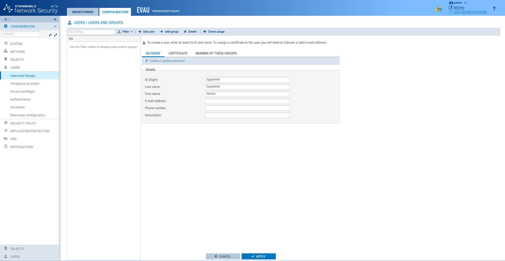

* Choose a password for the new user :

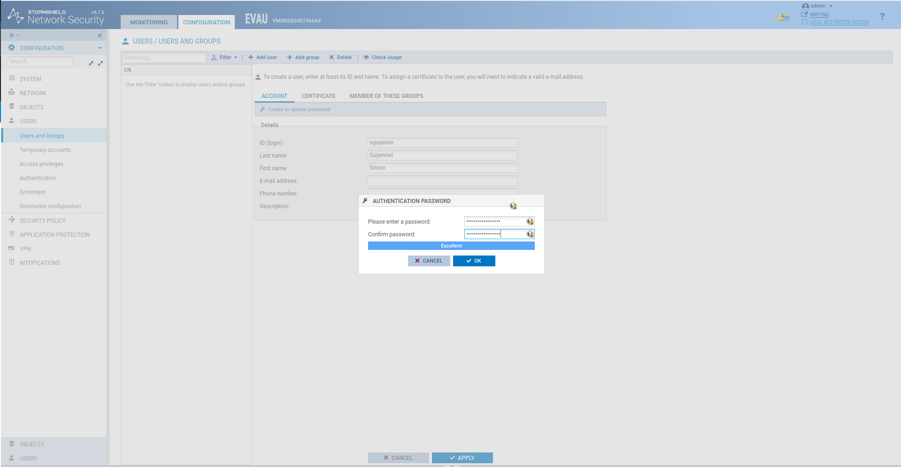

##### Configuring VPN network objects

* Create two network objects for the SSL VPN client.

UDP client network :

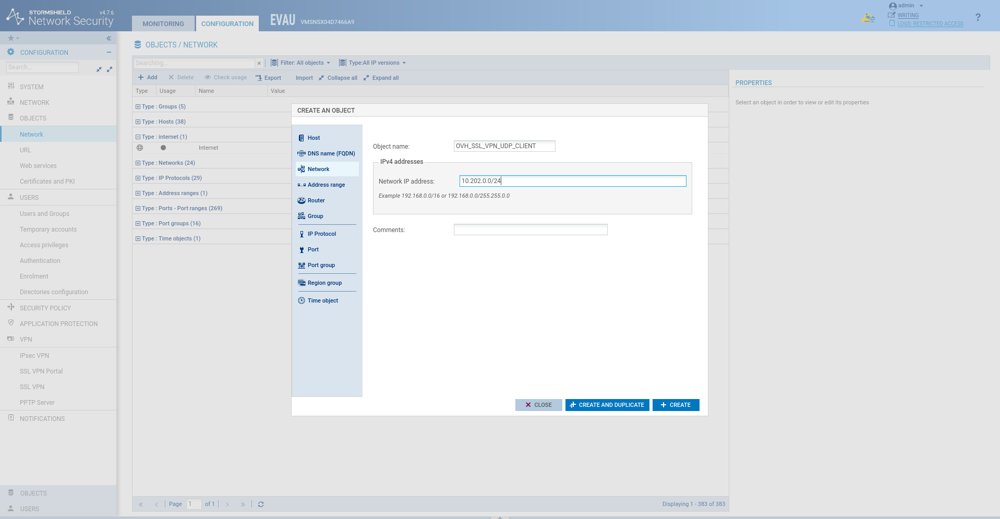

TCP client newtwork :


##### SSL VPN server configuration

* Configure the SSL VPN server :

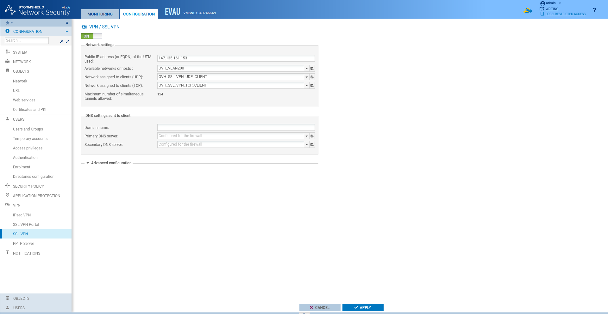

##### Managing user permissions

* Add permission to your user to use the SSL VPN server (Configuration -> Users -> Access privileges -> Detailed Access -> Add)

* Search your user :


* Allow SSL VPN :

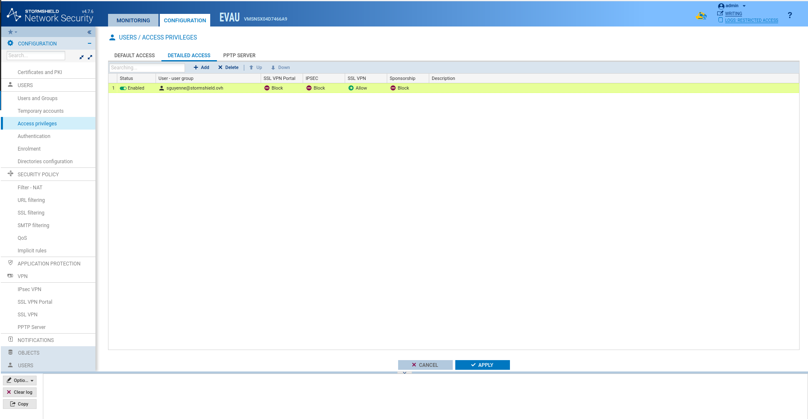

##### Configuring filter rules

* Add a filter rule like this one to let VPN client access the VLAN200 :

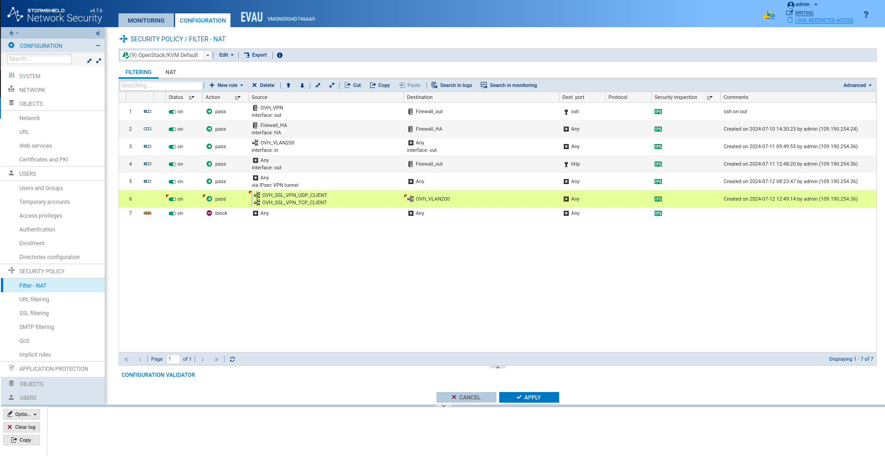

##### Synchronization of SNS instances

* Synchronize the two HA SNS instances :

```console
ssh admin@<ip_address>
hasync
```

##### Test the SSL/TLS VPN

> [!primary]
> To test SSL/TLS connectivity, you can use any device with OpenVPN installed. This example includes test of OpenVPN client on top of OpenStack instance in another region.
>

* Download the VPN configuration file (Configuration->VPN->SSL VPN->Advanced configuration->Export the configuration file).

* Create a public OpenVPN client instance in the region of your choice :

```console
openstack server create --flavor b2-7 --image "Ubuntu 22.04" --network Ext-Net --key-name sguyenne ubuntu-vpn-client
```

* Check the IP assign to the instance and copy the configuration file to it :

```console
scp ~/Download/openvpn_mobile_client.ovpn ubuntu@<ip_address>:~
```

* Connect to the instance :

```console
ssh ubuntu@<ip_address>
```

* Install the OpenVPN client :

```console
sudo apt-get update
sudo apt-get install -y openvpn
```
* Connect to the VPN :

```console
sudo openvpn --config openvpn_mobile_client.ovpn 
Enter Auth Username: address@stormshield.ovh
üîê Enter Auth Password: ******************
```

* Test to ping the webserver private instance :

```console
ssh ubuntu@<ip_address>
ping <ip_address>

PING <ip_address> (<ip_address>) 56(84) bytes of data.
64 bytes from <ip_address>: icmp_seq=1 ttl=64 time=14.1 ms
64 bytes from <ip_address>: icmp_seq=2 ttl=64 time=13.1 ms
```

## Go further