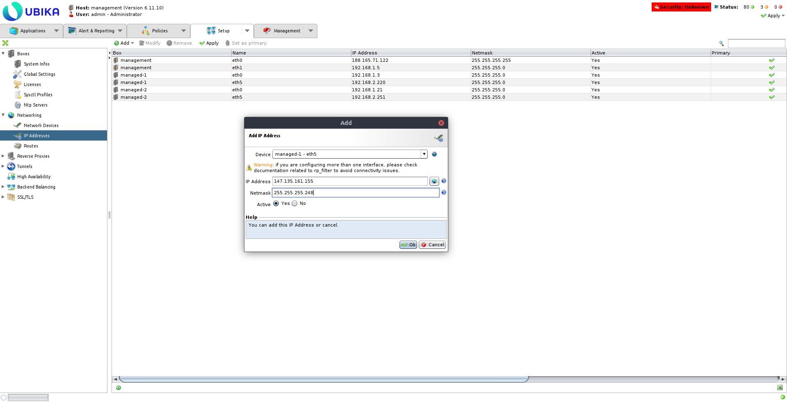
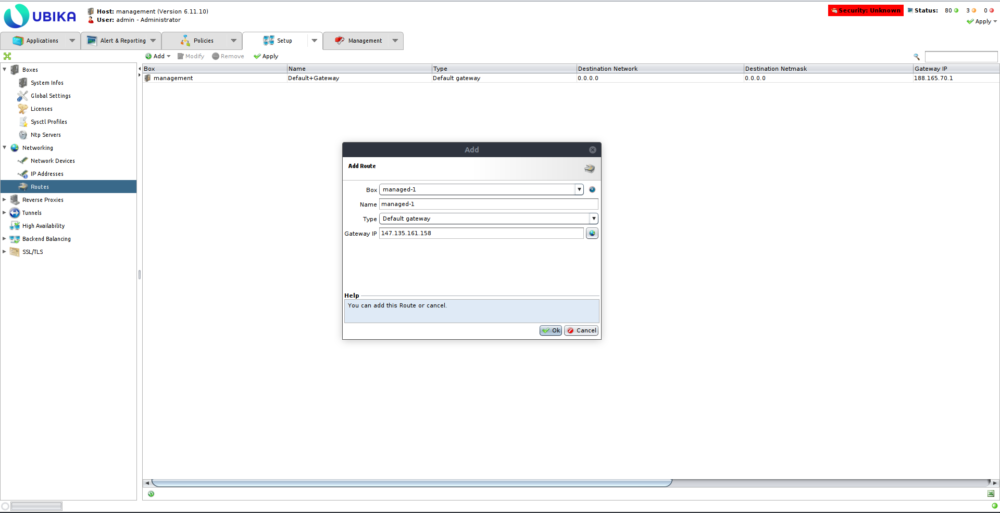

## Objective

In today’s digital age, web application security is critical for protecting cloud infrastructure from sophisticated cyber threats. As businesses increasingly adopt cloud solutions, ensuring that web applications and APIs are secure is essential for maintaining data integrity and preventing breaches.
Ubika offers advanced Web Application and API Protection (WAAP) features, including powerful tools such as web application firewalls (WAFs), API protection, bot management, and DDoS mitigation. These tools help protect your cloud environment from a wide array of application-level threats. This guide provides step-by-step instructions for deploying and configuring Ubika on the OVHcloud Public Cloud. By following this guide, you will learn how to configure private networks for management and workload, deploy Ubika instances, set up High Availability (HA) using RTvRack, and ensure a secure and reliable architecture for your cloud infrastructure.

**This guide explains how to securing your OVHcloud infrastructure with Ubika deployed on Public Cloud.**

## Requirements

- A [Public Cloud project](https://www.ovhcloud.com/en-gb/public-cloud/) in your OVHcloud account
- Access to the [OVHcloud Control Panel](https://www.ovh.com/auth/?action=gotomanager&from=https://www.ovh.co.uk/&ovhSubsidiary=GB)
- An [OpenStack user](/pages/public_cloud/compute/create_and_delete_a_user) (optional)
- Basic networking knowledge
- Ubika account on the [Ubika website](https://my.ubikasec.com/){.external}
- Ensure that an appropriate block of additional IPs is available.
- Ensure that the vRack is enabled and configured to allow secure communication between the components of the infrastructure.
- Ubika License BYOL (**B**ring **Y**our **O**wn **L**icense) : have a valid Ubika license, as you will need to provide it during the installation and configuration process.

## Instructions

In addition to the installation and configuration of Ubika, this tutorial offers a use case where you'll test Ubika by deploying and running a web application on your Public Cloud infrastructure :

- [Configure your vRack](#step1)
- [Install and configure Ubika on your Public Cloud environment](#step2)
- [Test your first web application](#step3)

### Configure your vRack <a name="step1"></a>

In this step, we are configuring the vRack, a private virtual network provided by OVHcloud. The vRack allows you to interconnect multiple instances or servers within a Public Cloud environment, ensuring network isolation while maintaining secure communication. By adding your Public Cloud project and your IP block to the same vRack, you can enable your Ubika instances to communicate securely, while keeping full control over IP address management.

**Add your public cloud project and your IP block to the same vRack**

Please refer to the guide [Configuring an IP block in a vRack](/pages/bare_metal_cloud/dedicated_servers/configuring-an-ip-block-in-a-vrack) for more information.

Below is the architecture that we are going to set-up.


### Install and configure Ubika on your Public Cloud environment <a name="step2"></a>

> [!primary]
> In this tutorial, the installation and configuration of Ubika is done primarily via the command line. Open a terminal to execute the instructions.
>
> Please note that all sections related to « High Availability » are optional. They are included to demonstrate how to set up the system with two instances in an active/passive mode for high availability. Normally, it can also function with just one instance if that is sufficient for your needs.

#### Configure Ubika management networking

> [!primary]
> In this scenario, we will use two virtual machines setup for the security appliance to achieve High Availability (HA), and an additional VM for management. This setup ensures failover protection and continuous service availability. For more examples and detailed guidance on scalability options, please refer to the [Ubika's documentation](https://www.ubikasec.com/ressources/){.external}.

* Create a private network for management

```console
openstack network create --provider-network-type vrack --provider-segment 1000 ubika-management
```

This command creates a private network for managing the Ubika instances, using the virtual private network (vRack) provided by OVHcloud. This isolated network is intended for internal communication between the Ubika components.

```console
openstack subnet create --network ubika-management --subnet-range 192.168.1.0/24 --dhcp --gateway none --dns-nameserver 213.186.33.99 ubika-management
```

Here, you configure a subnet for the management network, specifying an IP address range and a DNS server for internal communications.

#### Configure Ubika workload networking

* Create a private network for the workload

```console
openstack network create --provider-network-type vrack --provider-segment 0 --disable-port-security ubika-workload
```

This command creates a private network for the workload, designed to host applications secured by Ubika.

```console
openstack subnet create --network ubika-workload --subnet-range 192.168.2.0/24 --dhcp --dns-nameserver 213.186.33.99 ubika-workload
```

Here, you define a subnet for the workload network, enabling efficient management of network traffic.

* Create a gateway.

> [!primary]
> PCI Gateway may be required for accessing the internet from web servers, especially for tasks like software installation or remote management. However, for inbound client traffic, this component is not used.

```console
openstack router create --external-gateway Ext-Net ubika-workload
```

```console
openstack router add subnet 2481bcaf-efa2-419a-ad92-d6d27737dfd1 ubika-workload
```

#### Deploy the Ubika instances

* Upload Ubika image to OpenStack

Go to the `download` section of the [official Ubika website](https://my.ubikasec.com/){.external}. Log in to your Ubika account and follow the instructions to download the Ubika OpenStack image.

Go to the folder where you have downloaded your Ubika Openstack image and upload the Ubika OpenStack image (for this tutorial, we use the image `UBIKA_WAAP_Gateway-generic-cloud-6.11.10+51a56f6201.b56855.qcow2`) :

```console
openstack image create --disk-format raw --container-format bare --file ~/Downloads/UBIKA_WAAP_Gateway-generic-cloud-6.11.10+51a56f6201.b56855.qcow2 Ubika-WAAP-Gateway-6.11.10
```

* [Import your SSH public key](https://docs.openstack.org/python-openstackclient/pike/cli/command-objects/keypair.html){.external} :

```console
openstack keypair create --public-key ~/.ssh/id_rsa.pub <username>
```

* Create a security group for the management Ubika instance

```console
openstack security group create ubika-management
```

```console
openstack security group rule create --ingress --remote-ip 192.168.1.0/24 ubika-management
```

```console
openstack security group rule create --ingress --remote-ip 109.190.254.24/32 --dst-port 22 --protocol tcp ubika-management
```

```console
openstack security group rule create --ingress --remote-ip 109.190.254.24/32 --dst-port 3001 --protocol tcp ubika-management
```

* Create the Ubika management instance

Before executing the next OpenStack command, first create a `management.json` file and add the following content, adapting the parameters to your environment :

```console
{
    "instance_name": "management",
    "admin_user": "admin",
    "admin_password": "adminpassword"
}
```

Once the `management.json` file is created, execute the following command :

```console
openstack server create --flavor r3-64 --image Ubika-WAAP-Gateway-6.11.10 --network Ext-Net --network ubika-management ubika-management --key-name <username> --security-group ubika-management --user-data ./management.json
```

* Create the Ubika managed instances

Before executing the next OpenStack command, first create a `managed-1.json` file and add the following content, adapting the parameters to your environment :

```console
{
    "instance_role": "managed",
    "instance_name": "managed-1"
}
```

Once the `managed-1.json` file is created, execute the following command :

```console
openstack server create --flavor c3-16 --image Ubika-WAAP-Gateway-6.11.10 --network ubika-management --network ubika-workload ubika-managed-1 --key-name <username> --user-data ./managed-1.json
```

* Re-do these steps to create a second Ubika managed instance but use the `managed-2.json` file. Create and add the following content to the `managed-2.json` file :

```console
{
    "instance_role": "managed",
    "instance_name": "managed-2"
}
```

#### Configure the HA on the Ubika managed instances

* Get the management instance public IP

```console
openstack port list --server ubika-management --network Ext-Net
```

* Login to the Ubika Java GUI


* Add the two managed Ubika instances

Get the management IP of the managed instances:

```console
openstack port list --server ubika-managed-1 --network ubika-management
```

```console
openstack port list --server ubika-managed-2 --network ubika-management
```

Add the first managed Ubika instance to the Ubika management (Setup -> Boxes -> Add)


Add the second one


* Add a virtual interface to the eth1 interface of each managed Ubika instance and configure it with an IP of your IP block instead of the private IP (Setup -> Networking -> IP Addresses)

Ubika managed-1 :



Ubika managed-2 :


* Remove the default gateway and add the RTvRack gateway for each managed Ubika (Setup -> Networking -> Routes)

Ubika managed-1 :



Ubika managed-2 :


* Create a High Availability Active/Passive configuration (Setup -> High Availability -> Add)


* Add an IP of the IP block as Virtual IP


* Add the two managed Ubika instances as VRRP members using the workload interfaces (eth1)


* Apply the configuration (top right corner button)


#### Configure the licenses

Ubika offers two types of licenses depending on your deployment needs : a license for a single VM or a license for HA (High Availability) mode, where two instances are deployed in an Active-Backup configuration. Choose the appropriate license based on your setup.

To apply the licenses, you will need to provide the following information to Ubika :

- Type of Ubika deployment (single instance or HA)
- Serial number of the Ubika instance
- Number of vCPUs and the amount of RAM allocated to each instance

Once you receive the licenses from Ubika, apply them to the corresponding instances to complete the setup.

### Test your first web application <a name="step3"></a>

The test of the web application after configuration validates the correct operation of Ubika's network, security, and high availability settings. The goal is to ensure that web traffic is properly filtered and routed through the Ubika instances, providing comprehensive protection for communications with the servers.

* Create two web servers on the workload network

Before executing the next OpenStack command, first create a `webserver.cloud-init` file and add the following content, adapting the parameters to your environment :

```console
{
    #cloud-config
    users:
    - default

    package_update: true

    packages:
    - nginx

    runcmd:
    - hostname > /var/www/html/index.html
    - systemctl enable nginx
    - systemctl start nginx
}
```

Once the `webserver.cloud-init` file is created, execute the following command :

```console
openstack server create --flavor b3-8 --image "Ubuntu 22.04" --network ubika-workload ubika-test-webserver-1 --key-name <username> --user-data ./webserver.cloud-init
```

```console
openstack server create --flavor b3-8 --image "Ubuntu 22.04" --network ubika-workload ubika-test-webserver-2 --key-name <username> --user-data ./webserver.cloud-init
```

* Create an Octavia private load balancer

```console
openstack loadbalancer create --name ubika-test-webserver --vip-subnet-id ubika-workload
```

* Wait for load balancer to be active

```console
openstack loadbalancer show 367ecaef-28f6-4866-9af2-7ce519ba688f
```

* Create a HTTP listener for the load balancer

```console
openstack loadbalancer listener create --name ubika-test-webserver --protocol HTTP --protocol-port 80 29590860-2852-44c3-9514-dfb271bd9371
```

```console
openstack loadbalancer pool create --name ubika-test-webserver --listener 3e77b59f-0abb-4861-b0a5-7de442ee6d1b --protocol HTTP --lb-algorithm ROUND_ROBIN
```

* Create health check for the load balancer backends pool

```console
openstack loadbalancer healthmonitor create --type HTTP --delay 5 --timeout 5 --max-retries 3 212ff492-6935-4810-973f-83b7346e72ac
```

* Get the IP of the two web servers

```console
openstack port list --server ubika-test-webserver-1 --network ubika-workload
```

```console
openstack port list --server ubika-test-webserver-2 --network ubika-workload
```

* Add the web servers to the backends pool of the load balancer

```console
openstack loadbalancer member create --address 192.168.2.164 --protocol-port 80 212ff492-6935-4810-973f-83b7346e72ac
```

```console
openstack loadbalancer member create --address 192.168.2.237 --protocol-port 80 212ff492-6935-4810-973f-83b7346e72ac
```

* Create a Reverse Proxy (Setup -> Reverse Proxy -> Add) on one of the Ubika managed box


* Create a DNS A record for the webserver pointing to the virtual IP of the Ubika deployment


* Get the VIP of the load balancer

```console
openstack loadbalancer show 29590860-2852-44c3-9514-dfb271bd9371
```

* Create a tunnel (Setup -> Tunnels -> Add)


* Apply the configuration


* Try to access to the webserver

```console
curl http://ubika.lab-sg.architects.ovh

ubika-test-webserver-1
```