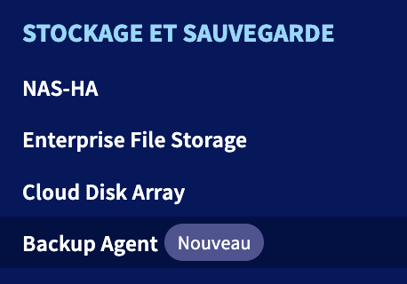
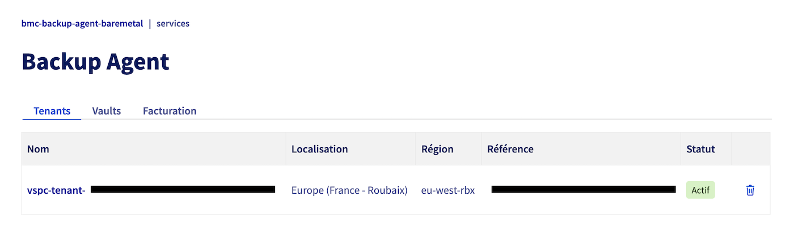
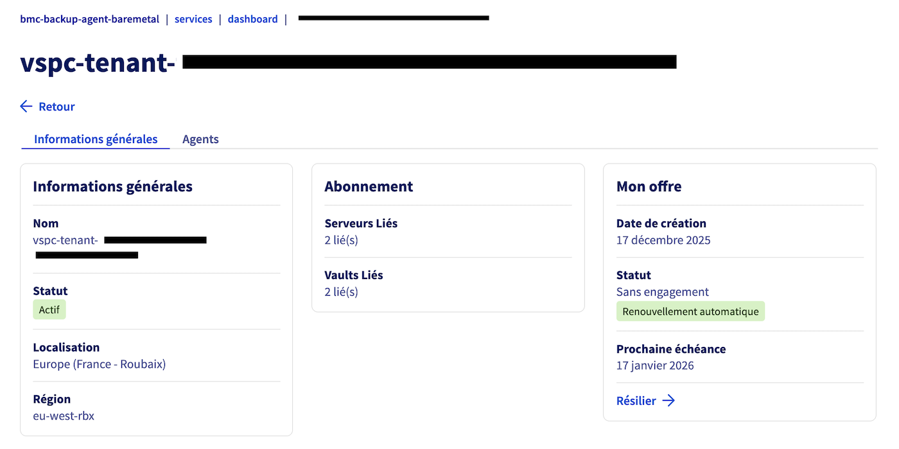
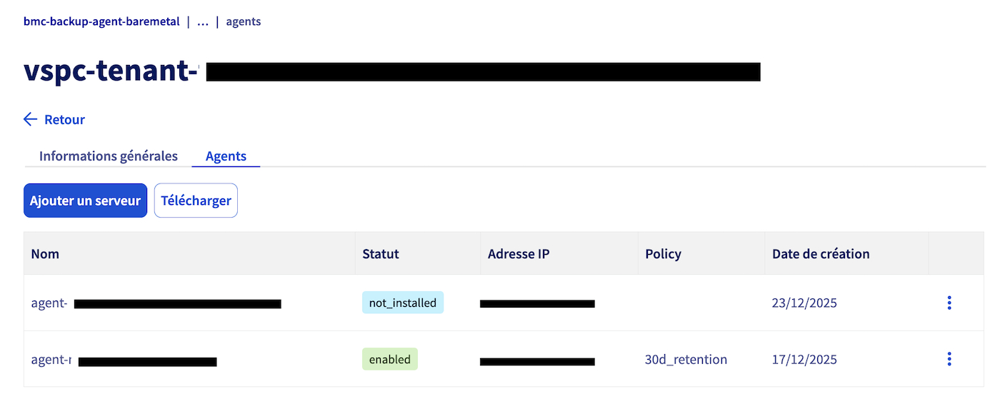
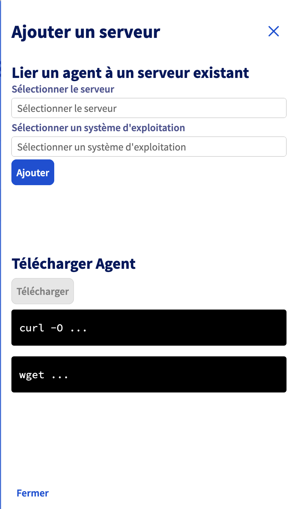
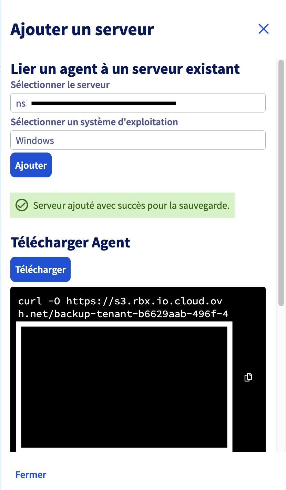

## Obiettivo

Scopri come effettuare backup e ripristinare i tuoi dati sui server Bare Metal con Backup Agent.

## Prerequisiti

- Essere connessi al [Spazio Cliente OVHcloud](/links/manager).
- Un server Bare Metal su cui è installato Backup Agent. Consulta la nostra guida "[Come configurare il tuo primo backup](/pages/storage_and_backup/backup_agent/backup_agent_first_configuration)" per ulteriori informazioni.

## Procedura

### Creare un backup per il tuo server

Questo consiste nell'aggiungere il tuo server al tuo Backup Agent, scaricare l'agente e installarlo sul tuo server.

Accedi al tuo [Spazio Cliente OVHcloud](/links/manager), vai alla sezione `Bare Metal Cloud`{.action} e seleziona `Agente di backup`{.action}. 

{.thumbnail}

Clicca sul tuo vspc-tenant, nella sezione `Servizi`{.action}.

{.thumbnail}

Vai nella sezione `Agenti`{.action}.

{.thumbnail}

Clicca sul pulsante `Aggiungere un server`{.action}.

{.thumbnail}

Seleziona il tuo server e il sistema operativo.

{.thumbnail}

{.thumbnail}

### Backup

Hai due opzioni per effettuare backup: automatico e manuale.

#### Backup automatico

Il backup automatico è integrato nella politica di backup che applichiamo al tuo Backup Agent.

Si tratta di un backup completo del tuo server, che verrà inviato al tuo punto di archiviazione remoto.

> [!warning]
> 
> Questo avrà luogo tra le 22:00 e le 6:00 (fuso orario CET per l'Europa e fuso orario EST per il Canada e l'Asia).

> [!primary]
> 
> Non è possibile modificare o disattivare questo backup automatico.

Potrai verificare il successo di questo backup tramite:

- Il rapporto quotidiano sui backup.
- Il pannello "Backup Jobs" della console Veeam Service Provider.

{.thumbnail}

{.thumbnail}

#### Backup manuale

In caso di necessità, puoi avviare un backup manuale.

Anche questo effettuerà un backup completo del tuo server, sempre inviato al tuo punto di archiviazione remoto.

Per creare un backup manuale, apri l'applicazione "Veeam Agent" sul server Bare Metal:

{.thumbnail}

Clicca sul pulsante `Backup Now`{.action} per avviare un backup:

{.thumbnail}

### Ripristino

In caso di necessità di ripristinare dati, hai due opzioni:

- tramite l'assistente di ripristino file;
- tramite l'ISO Veeam Baremetal Recovery.

#### Assistente di ripristino file

Apri l'applicazione "Veeam Agent" sul tuo server Baremetal:

{.thumbnail}

Vai nel menu e seleziona `Restore File`{.action}:

{.thumbnail}

Seleziona il punto di ripristino desiderato nell'assistente:

{.thumbnail}

Poi conferma:

{.thumbnail}

Infine, cerca il tuo file e seleziona un'opzione:

{.thumbnail}

- Restore - Overwrite: ti permette di ripristinare il file sovrascrivendo quello attualmente presente sul server.
- Restore - Keep: ti permette di ripristinare il file mantenendo quello attualmente presente sul server.
- Copy To: ti permette di copiare il file in un'ubicazione del tuo server.
- Explore: ti permette di esplorare il backup.
- Properties: ti permette di visualizzare le proprietà del file.

Avviare un ripristino ti mostrerà un'ultima finestra che visualizzerà il trasferimento:

{.thumbnail}

### ISO Veeam Baremetal Recovery

Bare Metal Recovery è una funzionalità di Veeam che consiste nel creare in anticipo un ISO personalizzato, che può essere utilizzato per avviare un sistema e ripristinarlo da un backup memorizzato su un altro server.

Consulta questa guida per ulteriori informazioni: [Ripristinare un server Bare Metal con Veeam Backup Agent](/pages/storage_and_backup/backup_and_disaster_recovery_solutions/veeam/veeam_agent_bare_metal_recovery).

Dovrai adattare il server e le credenziali a quelle che ti abbiamo fornito.

## Per saperne di più

Contatta la nostra [Community di utenti](/links/community).