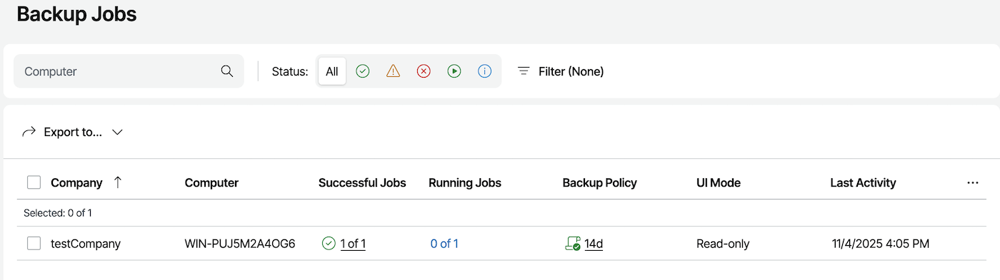
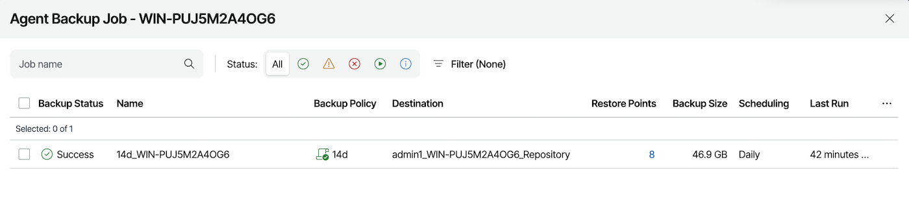
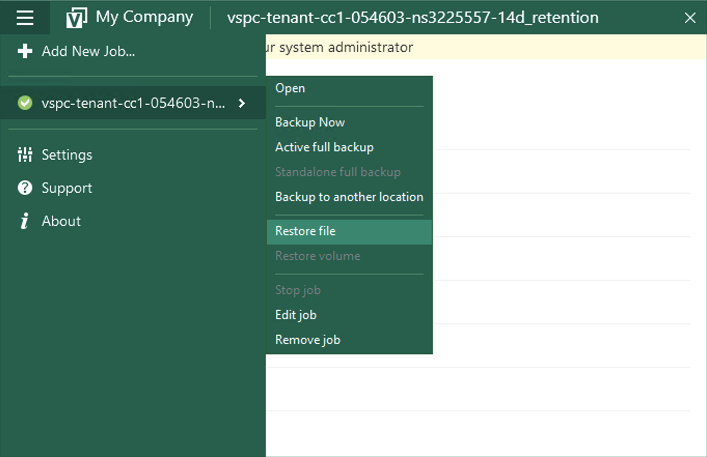
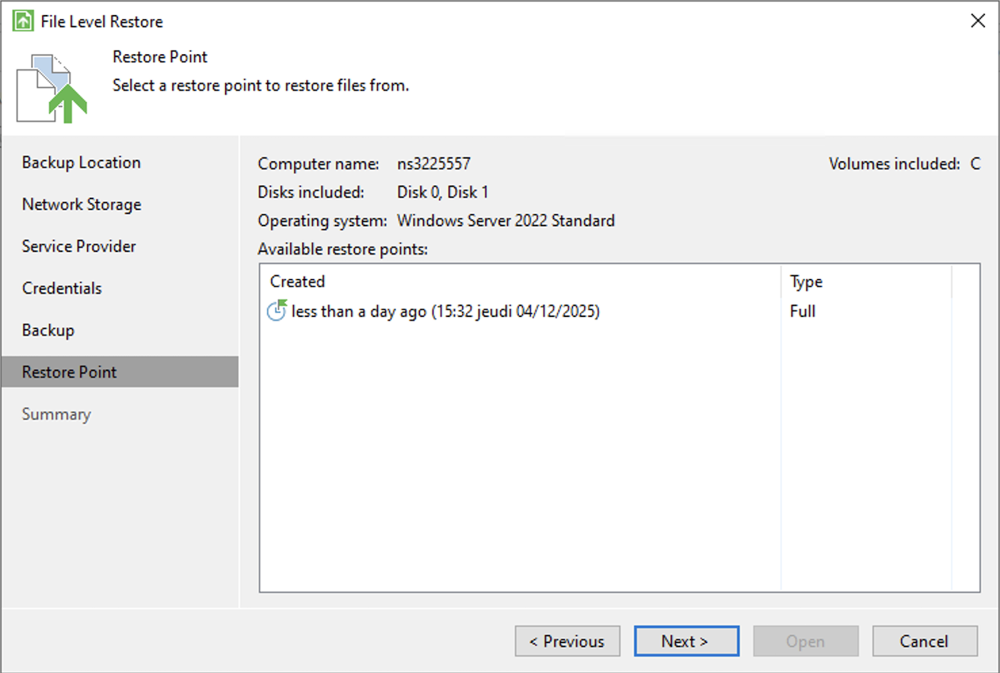
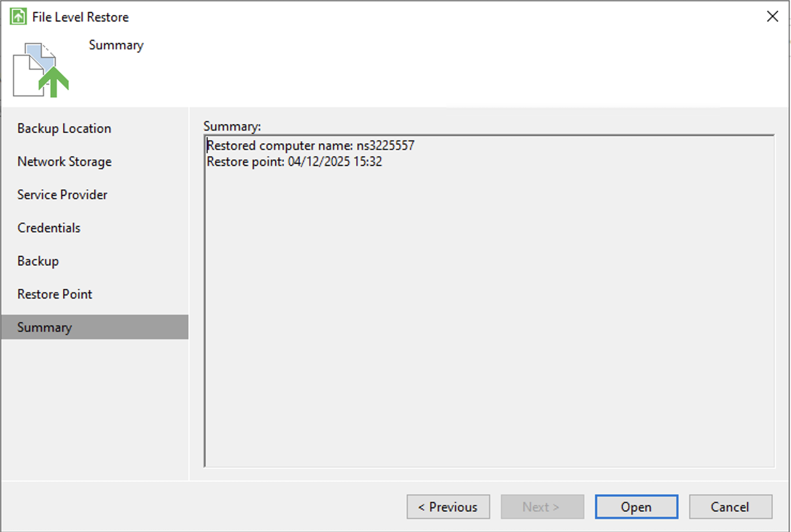
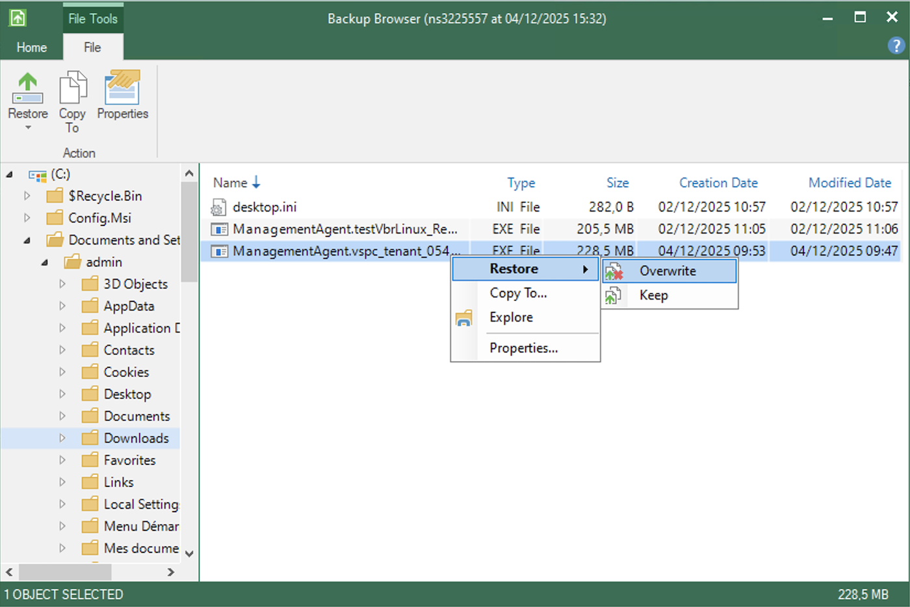
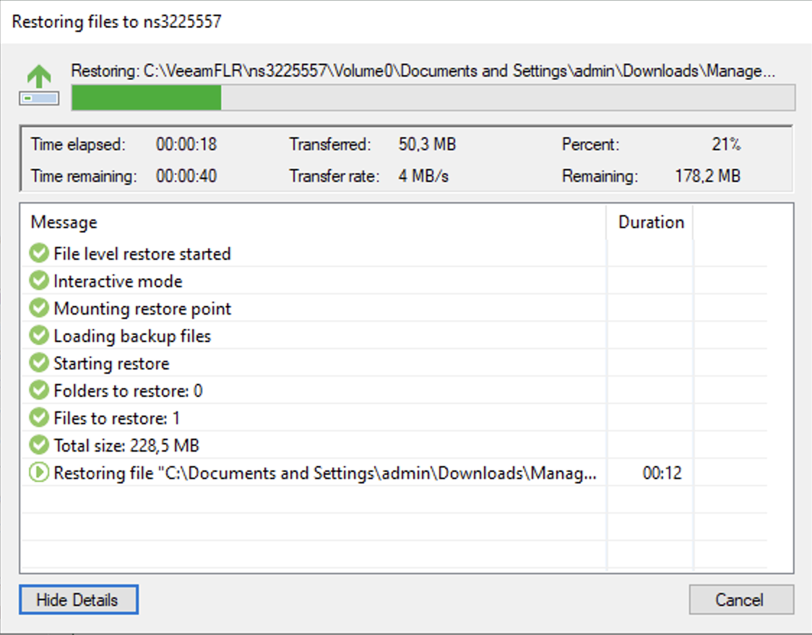

## Objetivo

Descubra como fazer cópias de segurança e restaurar os seus dados nos seus servidores Bare Metal com Backup Agent.

> [!primary]
> 
> Encontre mais informações sobre o produto Backup Agent em [esta página](/pages/storage_and_backup/backup_agent/backup_agent_product_presentation).


## Requisitos

- Um servidor Bare Metal com o Backup Agent instalado. Consulte o nosso guia "[Como configurar a sua primeira cópia de segurança](/pages/storage_and_backup/backup_agent/backup_agent_first_configuration)" para mais informações.

<!-- CP-NAV-START:baremetal-backup-agent -->
---

### Acesso à Área de Cliente OVHcloud

- **Ligação direta:** [Backup Agent](/links/control-panel/baremetal-backup-agent)
- **Caminho de navegação:** `Bare Metal Cloud`{.action} > `Backup Agent`{.action}

---
<!-- CP-NAV-END:baremetal-backup-agent -->

## Instruções

### Cópia de segurança

Tem duas possibilidades para fazer cópias de segurança: automática e manual.

#### Cópia de segurança automática

A cópia de segurança automática está integrada na política de cópia de segurança que aplicamos ao seu Backup Agent.

Trata-se de uma cópia de segurança completa do seu servidor, que será enviada para o seu ponto de armazenamento remoto.

> [!warning]
> 
> Isto vai ser desencadeado entre as 22 horas e as 6 horas (no fuso horário CET para a Europa e no fuso horário EST para o Canadá e a Ásia).

> [!primary]
> 
> Não tem possibilidade de modificar ou desativar esta cópia de segurança automática.
> Neste momento, não pode modificar a política que salvaguarda todo o seu servidor. Estamos a trabalhar para melhorar esta configuração no futuro.

Poderá ver o sucesso desta cópia de segurança através de:

- O relatório diário das cópias de segurança.
- O painel de instrumentos "Backup Jobs" da consola Veeam Service Provider.

{.thumbnail}

{.thumbnail}

#### Cópia de segurança manual

Se necessário, pode iniciar uma cópia de segurança manual.

Esta também fará uma cópia de segurança completa do seu servidor, também enviada para o seu ponto de armazenamento remoto.

Clique na aba correspondente ao seu sistema operativo:

> [!tabs]
> Windows
>>
>> Abra a aplicação "Veeam Agent" no servidor Bare Metal:
>>
>> {.thumbnail}
>>
>> Clique no botão `Backup Now`{.action} para iniciar uma cópia de segurança:
>>
>> {.thumbnail}
>
> Linux
>>
>> Para iniciar uma cópia de segurança manual no Linux, pode utilizar a linha de comandos.
>>
>> Ligue-se ao seu servidor Bare Metal via SSH e execute o seguinte comando para listar os seus trabalhos de cópia de segurança:
>>
>> ```bash
>> sudo veeamconfig job list
>> ```
>>
>> Para iniciar uma cópia de segurança manual, utilize o seguinte comando substituindo `<nome_do_job>` pelo nome do seu trabalho de cópia de segurança:
>>
>> ```bash
>> sudo veeamconfig job start <nome_do_job>
>> ```
>>
>> Se quiser iniciar todos os trabalhos de cópia de segurança, utilize:
>>
>> ```bash
>> sudo veeamconfig job start --all
>> ```
>>
>> Pode seguir o progresso da cópia de segurança consultando as sessões ativas:
>>
>> ```bash
>> sudo veeamconfig session list
>> ```
>>
>> Também pode ter uma interface para interagir com o produto introduzindo este comando:
>>
>> ```bash
>> sudo veeam
>> ```

### Restauração

Se necessitar restaurar dados, tem duas opções:

- através do assistente de restauração de ficheiros;
- através da ISO Veeam Baremetal Recovery.

#### Assistente de restauração de ficheiros

Para restaurar ficheiros e pastas, clique na aba correspondente ao seu sistema operativo:

> [!tabs]
> Windows
>>
>> Abra a aplicação "Veeam Agent" no seu servidor Baremetal:
>>
>> {.thumbnail}
>>
>> Vá ao menu e selecione `Restore File`{.action}:
>>
>> {.thumbnail}
>>
>> Selecione o ponto de restauração desejado no assistente:
>>
>> {.thumbnail}
>>
>> Em seguida, valide:
>>
>> {.thumbnail}
>>
>> Finalmente, procure o seu ficheiro e selecione uma opção:
>>
>> {.thumbnail}
>>
>> - Restore - Overwrite: permite-lhe restaurar o ficheiro substituindo o que está atualmente no servidor.
>> - Restore - Keep: permite-lhe restaurar o ficheiro mantendo o que está atualmente no servidor.
>> - Copy To: permite-lhe copiar o ficheiro para um local no seu servidor.
>> - Explore: permite-lhe explorar a cópia de segurança.
>> - Properties: permite-lhe ver as propriedades do ficheiro.
>>
>> Iniciar uma restauração permitirá-lhe ter uma última janela que mostrará a transferência:
>>
>> {.thumbnail}
>
> Linux
>>
>> Para restaurar ficheiros e pastas no Linux, tem duas opções: através da interface gráfica ou através da linha de comandos.
>>
>> #### Através da interface gráfica
>>
>> 1\. Ligue-se ao seu servidor Bare Metal via SSH.
>> 2\. Inicie a interface Veeam introduzindo o seguinte comando:
>>
>> ```bash
>> sudo veeam
>> ```
>>
>> 3\. Na interface, selecione a opção de restauração de ficheiros.
>> 4\. Selecione o Backup e o ponto de restauração desejado.
>> 5\. Navegue na cópia de segurança para encontrar os ficheiros ou pastas a restaurar.
>> 6\. Selecione os ficheiros e escolha a ação de restauração:
>>    - Restaurar para o local original
>>    - Copiar para um novo local
>>    - Explorar a cópia de segurança
>>
>> #### Através da linha de comandos
>>
>> Para restaurar ficheiros através da linha de comandos, tem primeiro de montar a cópia de segurança:
>>
>> 1\. Liste os seus backups disponíveis:
>>
>> ```bash
>> sudo veeamconfig backup list
>> ```
>>
>> 2\. Liste os pontos de restauração de um Backup:
>>
>> ```bash
>> sudo veeamconfig restore list --backup <nome_do_backup>
>> ```
>>
>> 3\. Monte um ponto de restauração:
>>
>> ```bash
>> sudo veeamconfig mount --backup <nome_do_backup> --restorepoint <nome_do_ponto>
>> ```
>>
>> 4\. Uma vez montado, pode aceder aos ficheiros através do ponto de montagem (geralmente em `/mnt/veeam/`).
>>
>> 5\. Copie os ficheiros desejados a partir do ponto de montagem para o seu destino.
>>
>> 6\. Uma vez terminada a restauração, desmonte a cópia de segurança:
>>
>> ```bash
>> sudo veeamconfig unmount --backup <nome_do_backup>
>> ```
>>
>> Para mais informações, consulte a [documentação Veeam](https://helpcenter.veeam.com/docs/agentforlinux/userguide/files_restore_gui.html?ver=13) e a [documentação sobre a restauração em linha de comandos](https://helpcenter.veeam.com/docs/agentforlinux/userguide/files_restore_cmd.html?ver=13).

### ISO Veeam Baremetal Recovery

Bare Metal Recovery é uma funcionalidade do Veeam que consiste em criar previamente um ISO personalizado, que pode depois ser utilizado para arrancar um sistema e restaurá-lo a partir de uma cópia de segurança armazenada num outro servidor.

Consulte este guia para mais informações: [Restaurar um servidor Bare Metal com Veeam Backup Agent](/pages/storage_and_backup/backup_and_disaster_recovery_solutions/veeam/veeam_agent_bare_metal_recovery).

Terá de adaptar o servidor e as credenciais com as que lhe fornecermos.

## Quer saber mais?

Fale com a nossa [comunidade de utilizadores](/links/community).