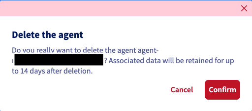
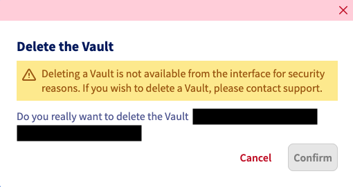
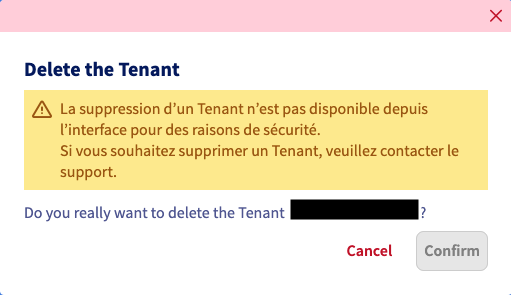

## Objectif

Ce guide vous explique comment supprimer différents éléments de votre service Backup Agent : les agents, les vaults et les tenants.

## Prérequis

- Avoir un service Backup Agent actif.

<!-- CP-NAV-START:baremetal-backup-agent -->
---

### Accès à l'espace client OVHcloud

- **Lien direct :** [Backup Agent](/links/control-panel/baremetal-backup-agent)
- **Pour accéder à vos services :** `Bare Metal Cloud`{.action} > `Backup Agent`{.action}

---
<!-- CP-NAV-END:baremetal-backup-agent -->

## En pratique

### Supprimer un agent

> [!primary]
>
> **Comportement selon l'utilisation de l'agent :**
>
> - **Si l'agent n'a pas été utilisé pour transférer des données** : Il peut être supprimé immédiatement. Il sera désactivé dans un premier temps, puis supprimé.
> - **Si des données ont été transférées** : Nous appliquons une suspension de l'agent en statut « Désactivé » durant 14 jours, le temps que les données immutables puissent être supprimées.

> [!warning]
>
> Une fois votre agent suspendu, vous ne pouvez plus créer de nouvel agent sur le même serveur, vous devez attendre que le premier agent soit supprimé.

Rendez-vous dans la section `Agents`{.action} et cliquez sur le bouton de suppression pour l'agent concerné.

Confirmez la suppression de l'agent dans la fenêtre qui s'affiche.

{.thumbnail}

### Supprimer un vault

> [!warning]
>
> Un vault ne peut pas être supprimé s'il contient des données. Si vous souhaitez supprimer un vault, vous devez [contacter le support](/links/support-contact), qui effectuera des vérifications avec vous avant de lancer la suppression.

Rendez-vous dans la section `Vaults`{.action} et cliquez sur le bouton de suppression pour le vault concerné.

Confirmez la suppression dans la fenêtre qui s'affiche..

{.thumbnail}

### Supprimer un tenant

> [!warning]
>
> Pour le moment, un tenant ne peut pas être supprimé de manière autonome. Si vous souhaitez supprimer un tenant, vous devez [contacter le support](/links/support-contact). Nous prendrons votre demande en compte.

Sélectionnez votre tenant et cliquez sur le bouton de suppression.

Confirmez la suppression dans la fenêtre qui s'affiche..

{.thumbnail}

## Aller plus loin

Échangez avec notre [communauté d'utilisateurs](/links/community).

