## Objetivo

Acaba de pedir la oferta Backup Agent para su servidor Bare Metal, descubra cómo configurar sus primeras copias de seguridad.

**Esta guía explica cómo configurar su primera copia de seguridad con Backup Agent en un servidor Bare Metal.**

> [!primary]
>
> Encuentre más información sobre el producto Backup Agent en [esta página](/pages/storage_and_backup/backup_agent/backup_agent_product_presentation).

## Requisitos

- Haber pedido un servicio Backup Agent en el momento de la compra de su servidor Bare Metal o posteriormente a través del menú `Backup Agent`{.action} de su área de cliente.
- Haber iniciado y configurado un sistema operativo en su servidor Bare Metal.

<!-- CP-NAV-START:baremetal-backup-agent -->
---

### Acceso al área de cliente de OVHcloud

- **Enlace directo:** [Backup Agent](/links/control-panel/baremetal-backup-agent)
- **Ruta de navegación:** `Bare Metal Cloud`{.action} > `Backup Agent`{.action}

---
<!-- CP-NAV-END:baremetal-backup-agent -->

> [!warning]
>
> Debe asegurarse de que su servidor pueda ser alcanzado por nuestra infraestructura Veeam.
> Recibirá la información exacta en su e-mail de entrega.
>
> Aquí está la información que debe autorizar en su servidor Bare Metal:
>
> - IP/DNS del servidor: `vspc-cgw1.prod01.eu-west-rbx.backup.ovh.net` o `vspc-cgw21.prod01.eu-west-rbx.backup.ovh.net`
> - Puerto: 6180
>
> También le recomendamos encarecidamente que permita que su servidor pueda alcanzar otras direcciones externas para poder enviar sus datos al Vault. No es necesario autorizar un flujo entrante en este contexto.

## Procedimiento

Los pasos para crear una copia de seguridad para su servidor son los siguientes:

- Añadir su servidor en su Backup Agent.
- Descargar el agente.
- Instalar el agente en su servidor.

Una vez instalado el agente, este recibirá la política de copia de seguridad y permitirá realizar las copias de seguridad.

Una vez completados estos pasos, su primera copia de seguridad se ejecutará automáticamente.

### Añadir su servidor en su Backup Agent

Haga clic en [este enlace](/links/control-panel/baremetal-backup-agent) para acceder a la sección `Backup Agent`{.action} y, a continuación, haga clic en su vspc-tenant en la sección `Servicios`{.action}.

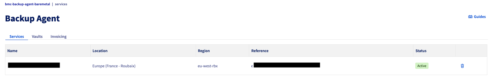{.thumbnail}

Vaya a la sección `Agents`{.action}.

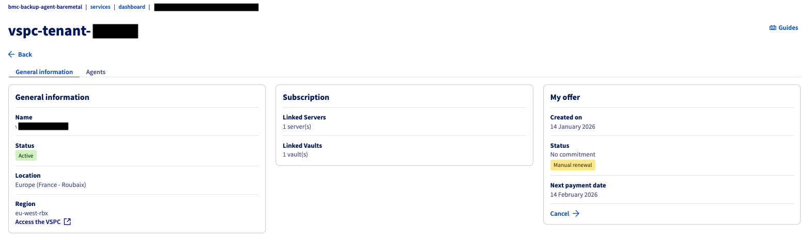{.thumbnail}

> [!primary]
>
> Debería encontrar en la tabla el servidor Bare Metal que seleccionó en su pedido, con el estado `not_installed`. Es normal en este momento, ahora debe instalar el agente en su servidor.
>

Haga clic en el botón `Descargar`{.action} en la parte superior de la tabla que enumera sus agentes.

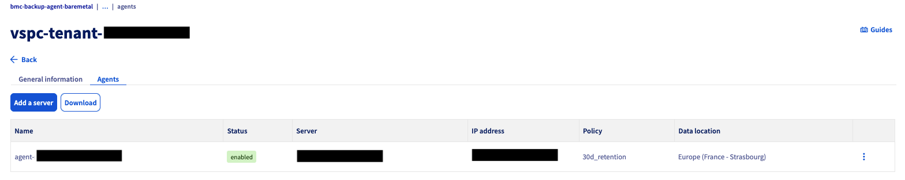{.thumbnail}

Seleccione su sistema operativo y elija si quiere descargar el archivo de instalación o usar uno de los comandos proporcionados para recuperarlo.

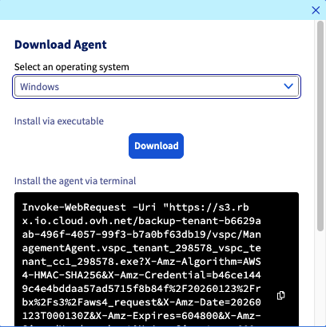{.thumbnail}

Para instalar su agente en su servidor Bare Metal, haga clic en la pestaña correspondiente a su sistema operativo:

> [!tabs]
> Windows
>>
>> Una vez que el archivo de instalación esté en su servidor Bare Metal, puede ejecutarlo y seguir el procedimiento del software:
>>
>> 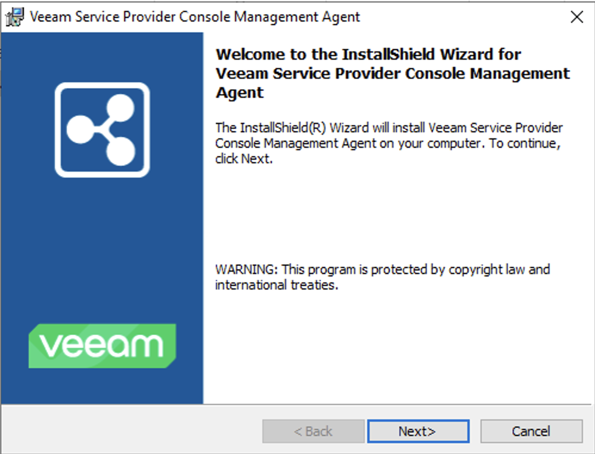{.thumbnail}
>>
>> 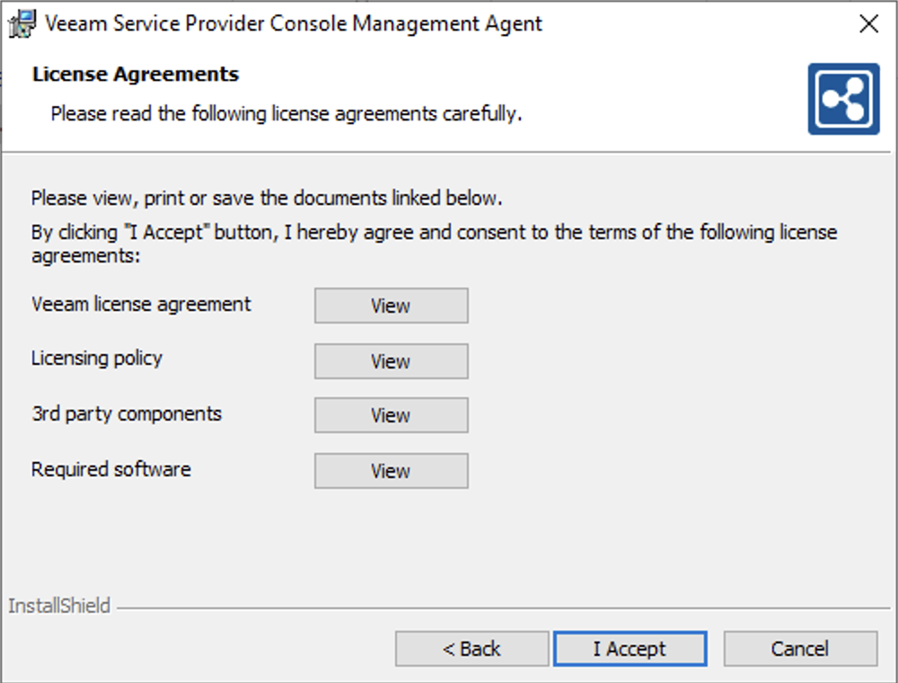{.thumbnail}
>>
>> 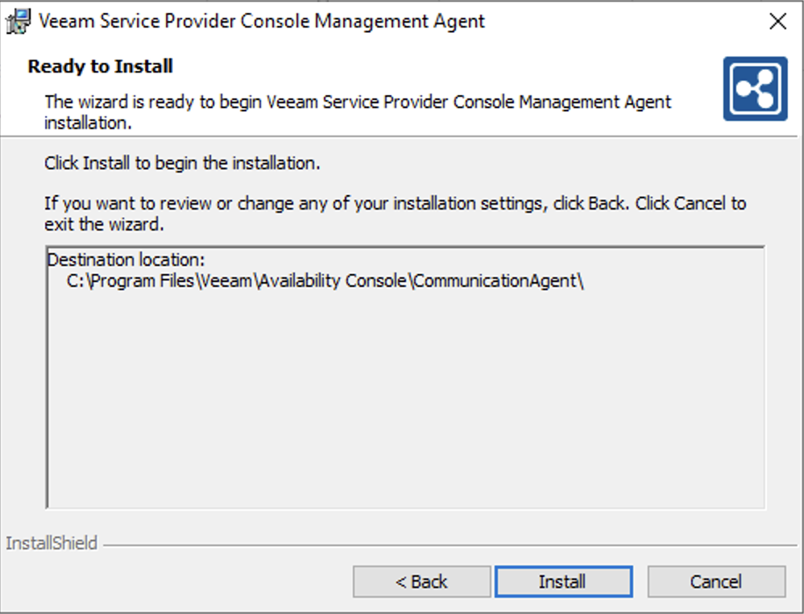{.thumbnail}
>>
>> 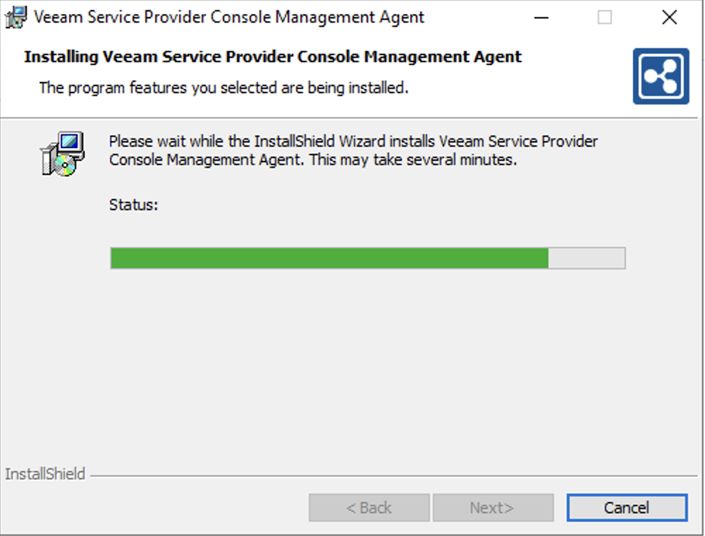{.thumbnail}
>>
>> 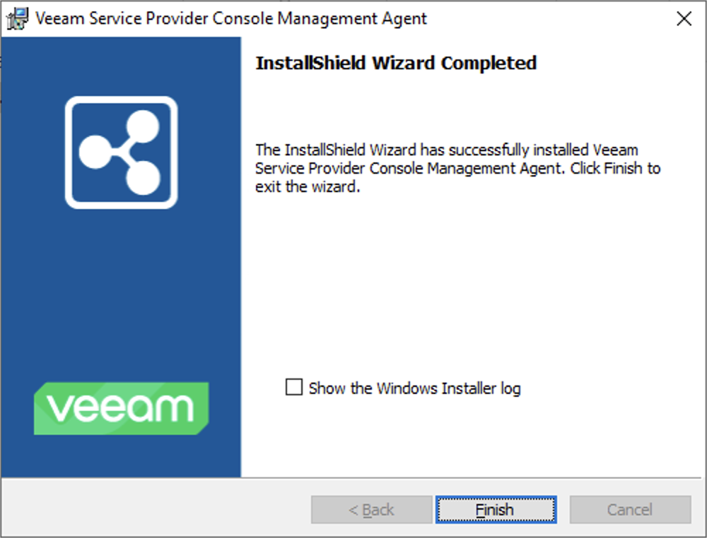{.thumbnail}
>>
>> Una vez instalado, el agente se conecta a nuestra infraestructura para recuperar su política de copia de seguridad:
>>
>> {.thumbnail}
>>
>> 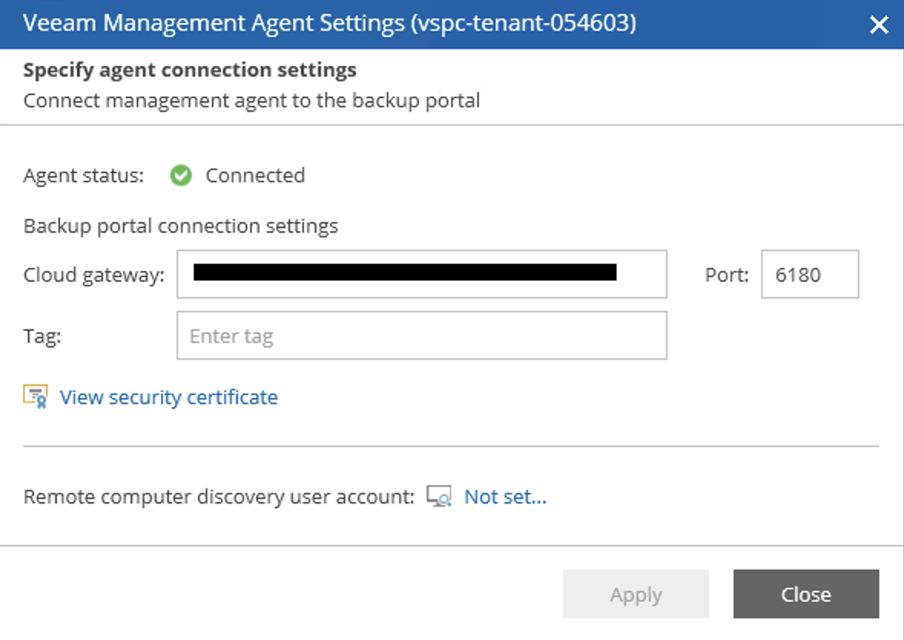{.thumbnail}
>>
>> Finalmente, una vez que la política de copia de seguridad se haya aplicado, podrá ver que su agente de copia de seguridad está configurado y presente en su servidor Bare Metal:
>>
>> 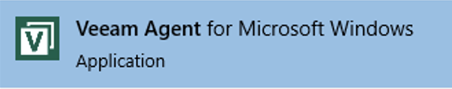{.thumbnail}
>>
>> 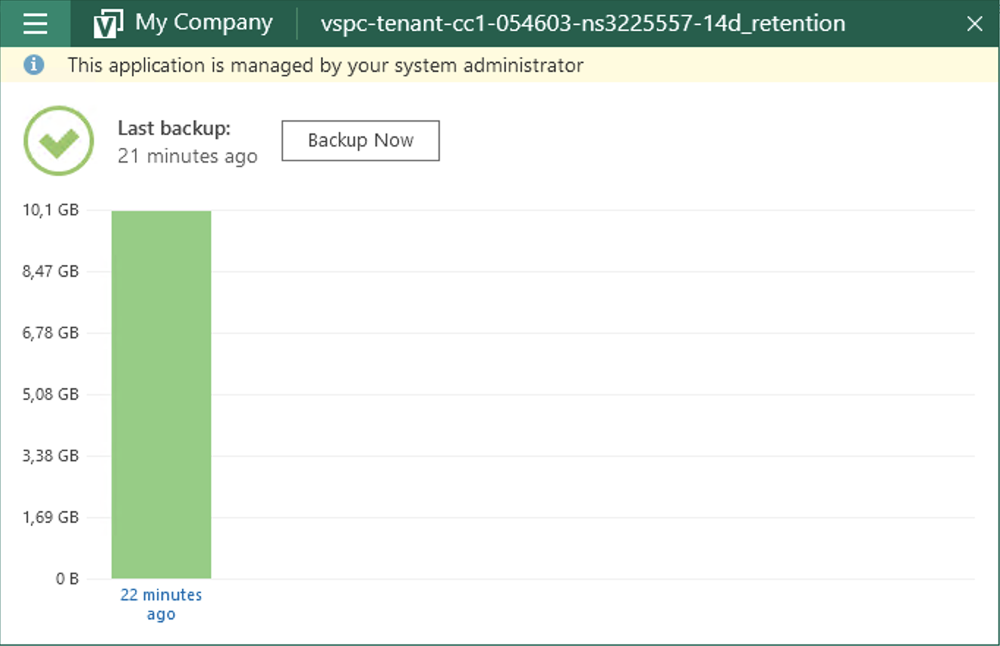{.thumbnail}
>>
> Linux
>> Seleccione su sistema operativo y elija si quiere descargar el archivo de instalación o usar uno de los comandos proporcionados para recuperarlo.
>>
>> 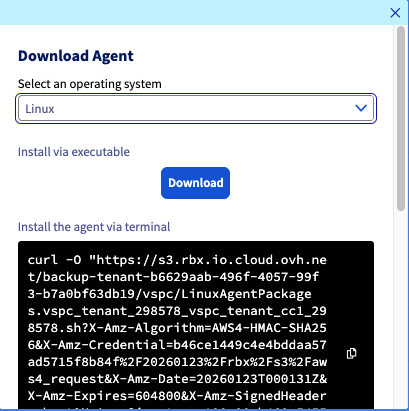{.thumbnail}
>>
>> Una vez que el archivo de instalación esté en su servidor, vaya al directorio que lo contiene y ejecute el archivo de la siguiente manera:
>>
>> ```bash
>> sudo ./LinuxAgentPackages.<YOURCOMPANYNAME>.sh
>> ```
>>
>> Una vez completada la instalación, puede verificarla con este comando:
>>
>> ```bash
>> sudo veeamconsoleconfig -s
>>
>> Management agent
>>     Connection state       : Connected
>>     Cloud gateway          : <OVHDOMAIN>:6180
>>     Connection account     : <UTILISATEUR>
>> ```
>>
>> Puede ver que un elemento aún no está instalado:
>>
>> ```bash
>> Backup agent
>>    Status                 : Not installed
>> ```
>>
>> Es normal en este momento, vamos a aplicar una configuración que permita desplegar el Backup Agent con una política de copia de seguridad.

## Más información

Interactúe con nuestra [comunidad de usuarios](/links/community).
