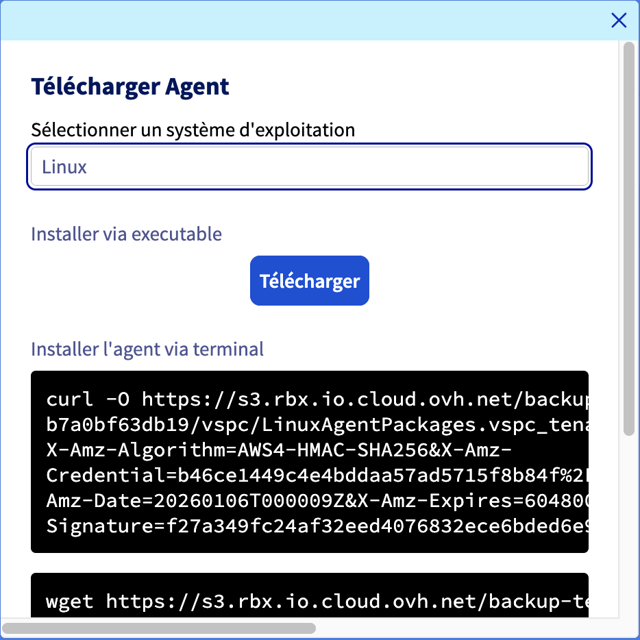

## Objectif

Vous venez de commander votre offre Backup Agent pour votre serveur Bare Metal, découvrez comment mettre en place vos premières sauvegardes.

> [!primary]
> 
> Retrouvez plus d'informations sur le produit Backup Agent sur [cette page](/pages/storage_and_backup/backup_agent/backup_agent_product_presentation).

## Prérequis

- Être connecté à l’[espace client OVHcloud](/links/manager).
- Avoir commandé  un service Backup Agent au moment de la commande de votre serveur Bare Metal ou ultérieurement via le menu `Backup Agent`{.action} de votre espace client.
- Avoir démarré et configuré un système d'exploitation sur votre serveur Bare Metal.

## En pratique

Les étapes pour créer une sauvegarde pour votre serveur sont les suivantes :

- Ajouter votre serveur dans votre Backup Agent.
- Télécharger l'agent.
- Installer l'agent sur votre serveur.

Une fois l'agent installé, celui-ci recevra la politique de sauvegarde et permettra d'opérer les sauvegardes.

Une fois que toutes ces étapes sont effectuées, votre première sauvegarde sera réalisée.

## Ajouter votre serveur dans votre Backup Agent

Connectez-vous à votre [espace client OVHcloud](/links/manager) et rendez-vous dans la partie `Backup Agent`{.action}.

{.thumbnail}

Cliquez sur votre vspc-tenant, dans la partie `Services`{.action}.

{.thumbnail}

Allez dans la partie `Agents`{.action}.

{.thumbnail}

> [!primary]
>
> Vous devriez retrouver dans le tableau le serveur Bare Metal que vous avez sélectionné dans votre commande, avec le statut `not_installed`. C'est normal à ce stade, il vous faut maintenant installer l'agent sur votre serveur.
>

Cliquez sur le bouton `Télécharger`{.action} en haut du tableau listant vos agents.

{.thumbnail}

Sélectionnez votre système d'exploitation et choisissez soit de télécharger le fichier d'installation ou d'utiliser une des commandes proposées pour le récupérer.

{.thumbnail}

Pour installer votre agent sur votre serveur Bare Metal, cliquez sur l'onglet correspondant à votre système d'exploitation :

> [!tabs]
> Windows
>>
>> Une fois le fichier d'installation sur votre serveur Bare Metal, vous pouvez l'exécuter et suivre la procédure du logiciel :
>>
>> {.thumbnail}
>>
>> {.thumbnail}
>>
>> {.thumbnail}
>>
>> {.thumbnail}
>>
>> {.thumbnail}
>>
>> Une fois installé, vous pourrez voir votre agent se connecter à notre infrastructure afin de redescendre votre politique de sauvegarde :
>>
>> {.thumbnail}
>>
>> {.thumbnail}
>>
>> Enfin, une fois la politique de sauvegarde prise en compte, vous pourrez voir votre agent de sauvegarde configuré et présent sur votre serveur Baremetal :
>>
>> {.thumbnail}
>>
>> {.thumbnail}
>>
> Linux
>> Sélectionnez votre système d'exploitation et choisissez soit de télécharger le fichier d'installation ou d'utiliser une des commandes proposées pour le récupérer.
>>
>> {.thumbnail}
>>
>> Une fois le fichier d'installation sur votre serveur, accédez au dossier le contenant et exécutez le fichier ainsi :
>>
>> ```bash
>> sudo ./LinuxAgentPackages.<YOURCOMPANYNAME>.sh
>> ```
>>
>> Une fois l'installation complétée, vous pourrez le vérifier avec cette commande :
>>
>> ```bash
>> sudo veeamconsoleconfig -s
>>
>> Management agent
>>     Connection state       : Connected
>>     Cloud gateway          : <OVHDOMAIN>:6180
>>     Connection account     : <UTILISATEUR>
>> ```
>> 
>> Vous pouvez alors constater qu'un élément n'est pas encore installé :
>>
>> ```bash
>> Backup agent
>>    Status                 : Not installed
>> ```
>>
>> C'est normal à ce stade, nous allons appliquer une configuration permettant de déployer le Backup Agent avec une politique de sauvegarde.

## Aller plus loin

Échangez avec notre [communauté d'utilisateurs](/links/community).