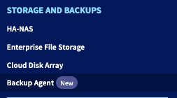

## Wprowadzenie

Zamówiłeś właśnie ofertę Backup Agent dla swojego serwera Bare Metal. Odkryj, jak skonfigurować pierwsze kopie zapasowe.

> [!primary]
> 
> Aby uzyskać więcej informacji na temat produktu Backup Agent, odwiedź [tą stronę](/pages/storage_and_backup/backup_agent/backup_agent_product_presentation).

## Wymagania początkowe

- Dostęp do [Panelu klienta OVHcloud](/links/manager). 
- Zamówiony Backup Agent jednocześnie z Twoim serwerem Bare Metal, lub później za pomocą menu `Backup Agent`{.action} w Panelu klienta OVHcloud.
- Musisz mieć uruchomiony i skonfigurowany system operacyjny na swoim serwerze Bare Metal.

> [!warning]
>
> Musisz upewnić się, że Twój serwer może być osiągnięty przez naszą infrastrukturę Veeam.
> Oto informacje, które należy zezwolić na Twoim serwerze Bare Metal:
>
> - IP/DNS serwera: `vspc-cgw1.stg01.eu-west-rbx.backup.ovh.net`
> - Port: 6180
>
> Zdecydowanie zalecamy również, aby Twój serwer mógł osiągać inne zewnętrzne adresy, aby mógł wysyłać dane do Vault. W tym kontekście nie ma potrzeby zezwalania na ruch przychodzący.


## W praktyce

Kroki tworzenia kopii zapasowej dla Twojego serwera to:

- Dodanie serwera do swojego Backup Agent.
- Pobranie agenta.
- Zainstalowanie agenta na Twoim serwerze.

Po zainstalowaniu agenta otrzyma on zasadę kopii zapasowych i będzie mógł wykonywać kopie zapasowe.

Po wykonaniu wszystkich tych kroków zostanie wykonana Twoja pierwsza kopia zapasowa.

### Dodanie serwera do swojego Backup Agent

Zaloguj się do [Panelu klienta OVHcloud](/links/manager) i przejdź do sekcji `Backup Agent`{.action}.

{.thumbnail}

Kliknij swój vspc-tenant w sekcji `Services`{.action}.

{.thumbnail}

Przejdź do sekcji `Agents`{.action}.

{.thumbnail}

> [!primary]
>
> W tabeli powinieneś zobaczyć serwer Bare Metal, który wybrałeś w swoim zamówieniu, z statusem `not_installed`. Jest to normalne na tym etapie; teraz musisz zainstalować agenta na swoim serwerze.
>

Kliknij przycisk `Download`{.action} w górnym pasku tabeli wyświetlającej listę agentów.

{.thumbnail}

Wybierz swój system operacyjny i wybierz opcję pobrania pliku instalacyjnego lub użycia jednej z dostarczonych komend, aby go pobrać.

{.thumbnail}

Aby zainstalować agenta na swoim serwerze Bare Metal, kliknij na kartę odpowiadającą Twojemu systemowi operacyjnemu:

> [!tabs]
> Windows
>>
>> Po tym, jak plik instalacyjny znajdzie się na Twoim serwerze Bare Metal, możesz go uruchomić i postępować zgodnie z procedurą oprogramowania:
>>
>> {.thumbnail}
>>
>> {.thumbnail}
>>
>> {.thumbnail}
>>
>> {.thumbnail}
>>
>> {.thumbnail}
>>
>> Po zainstalowaniu zobaczysz, że Twój agent łączy się z naszą infrastrukturą, aby pobrać zasadę kopii zapasowych:
>>
>> {.thumbnail}
>>
>> {.thumbnail}
>>
>> Na koniec, po zastosowaniu zasady kopii zapasowych, zobaczysz, że Twój agent kopii zapasowych został skonfigurowany i działa na Twoim serwerze Bare Metal:
>>
>> {.thumbnail}
>>
>> {.thumbnail}
>>
> Linux
>> Wybierz swój system operacyjny i wybierz opcję pobrania pliku instalacyjnego lub użycia jednej z dostarczonych komend, aby go pobrać.
>>
>> {.thumbnail}
>>
>> Po tym, jak plik instalacyjny znajdzie się na Twoim serwerze, przejdź do folderu, w którym się znajduje, i uruchom go w następujący sposób:
>>
>> ```bash
>> sudo ./LinuxAgentPackages.<YOURCOMPANYNAME>.sh
>> ```
>>
>> Po zakończeniu instalacji możesz sprawdzić jej stan za pomocą poniższego polecenia:
>>
>> ```bash
>> sudo veeamconsoleconfig -s
>>
>> Management agent
>>     Connection state       : Connected
>>     Cloud gateway          : <OVHDOMAIN>:6180
>>     Connection account     : <USER>
>> ```
>> 
>> Następnie zobaczysz, że jeden element nie został jeszcze zainstalowany:
>>
>> ```bash
>> Backup agent
>>    Status                 : Not installed
>> ```
>>
>> Jest to normalne na tym etapie, zastosujemy konfigurację, która pozwoli na wdrożenie Backup Agenta zgodnie z zasadą kopii zapasowych.

## Sprawdź również

Dołącz do [grona naszych użytkowników](/links/community).