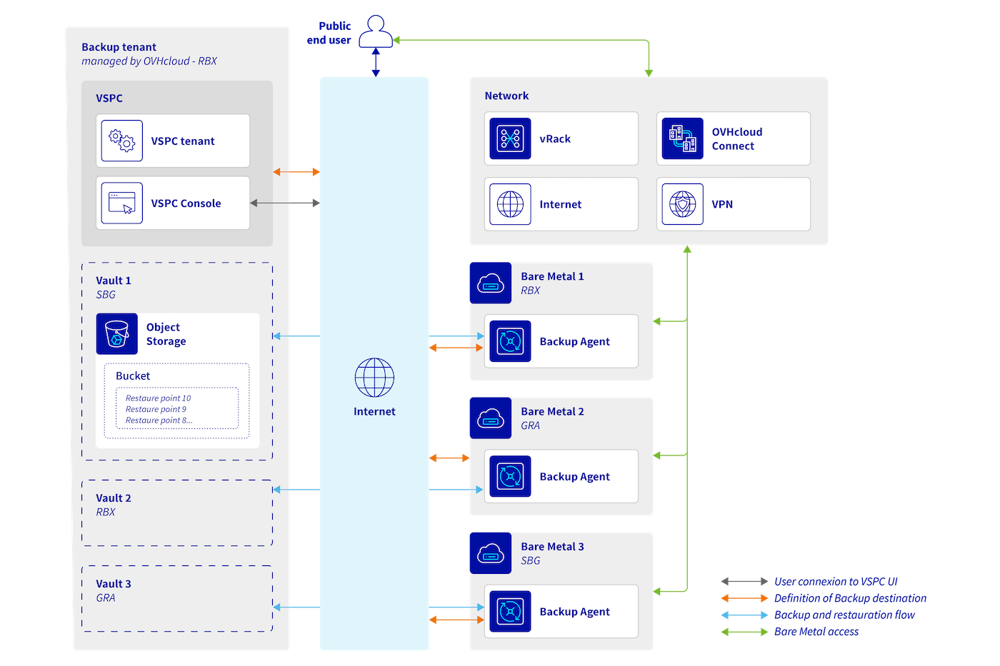

## Wprowadzenie

Zamówiłeś właśnie rozwiązanie Backup Agent dla swojego serwera Bare Metal, odkryj, jak skonfigurować pierwsze kopie zapasowe.

## Wymagania początkowe

- Dostęp do [Panelu klienta OVHcloud](/links/manager). 
- Zamówiony Backup Agent jednocześnie z Twoim serwerem Bare Metal, lub później za pomocą menu `Agent kopii zapasowej`{.action} w Panelu klienta OVHcloud.
- Musisz mieć uruchomiony i skonfigurowany system operacyjny na swoim serwerze Bare Metal.

## W praktyce

Aby skonfigurować pierwsze kopie zapasowe, musisz zainstalować agenta na swoim serwerze Bare Metal.

Funkcjonowanie wygląda następująco:

{.thumbnail} 

Po zainstalowaniu agenta otrzyma on zasadę kopii zapasowych i umożliwi wykonanie kopii zapasowych.

Aby zainstalować agenta na swoim serwerze Bare Metal, wykonaj poniższe kroki zgodnie z Twoim systemem operacyjnym:

### Windows

Zaloguj się do [Panelu klienta OVHcloud](/links/manager), przejdź do sekcji `Bare Metal Cloud`{.action} i wybierz `Agent kopii zapasowej`{.action}.

{.thumbnail}

Kliknij swój vspc-tenant w sekcji `Usługi`{.action}.

{.thumbnail}

Przejdź do sekcji `Agenci`{.action}.

{.thumbnail}

Kliknij przycisk `Pobierz`{.action} u góry tabeli wyświetlającej listę Twoich agentów.

{.thumbnail}

Wybierz swój system operacyjny i wybierz opcję pobrania pliku instalacyjnego lub jedno z poleceń, aby go pobrać.

{.thumbnail}

Po pobraniu pliku instalacyjnego na serwerze Bare Metal możesz uruchomić go i postępować zgodnie z procedurą oprogramowania:

{.thumbnail}

{.thumbnail}

{.thumbnail}

{.thumbnail}

{.thumbnail}

Po skonfigurowaniu zobaczysz, jak Twój agent łączy się z naszą infrastrukturą, aby powrócić do zasad kopii zapasowych:

{.thumbnail}

{.thumbnail}

Na koniec, po zakończeniu, zobaczysz skonfigurowanego agenta kopii zapasowych na swoim serwerze Bare Metal:

{.thumbnail}

{.thumbnail}

Domyślnie kopie zapasowe są uruchamiane między godziną 22:00 a 6:00, ale możesz ręcznie uruchomić kopię zapasową, klikając przycisk `Backup Now`{.action}.

### Linux

Zaloguj się do [Panelu klienta OVHcloud](/links/manager), przejdź do sekcji `Bare Metal Cloud`{.action} i wybierz `Agent kopii zapasowej`{.action}.

{.thumbnail}

Kliknij swój vspc-tenant w sekcji `Usługi`{.action}.

{.thumbnail}

Przejdź do sekcji `Agenci`{.action}.

{.thumbnail}

Kliknij przycisk `Pobierz`{.action} u góry tabeli wyświetlającej listę Twoich agentów.

{.thumbnail}

Wybierz swój system operacyjny i wybierz opcję pobrania pliku instalacyjnego lub jedno z poleceń, aby go pobrać.

{.thumbnail}

Po zainstalowaniu pliku na serwerze Bare Metal przejdź do jego katalogu i uruchom go w następujący sposób:

```bash
sudo ./LinuxAgentPackages.<YOURCOMPANYNAME>.sh
```

Po zakończeniu instalacji możesz sprawdzić jej stan za pomocą poniższego polecenia:

```bash
sudo veeamconsoleconfig -s

Management agent
    Connection state       : Connected
    Cloud gateway          : <OVHDOMAIN>:6180
    Connection account     : <UTILISATEUR>
```

## Sprawdź również

Dołącz do [grona naszych użytkowników](/links/community).