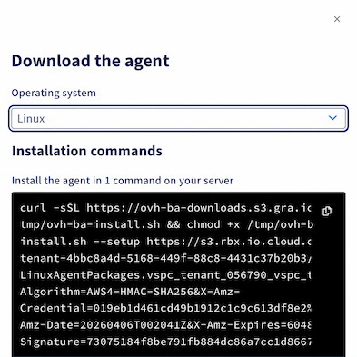

## Ziel

**Diese Anleitung erklärt, wie Sie das Skript `ovh-ba-install.sh` von OVHcloud verwenden, um den Veeam Backup Agent auf Ihrem Linux-Server zu installieren und zu verwalten.**

Sie erfahren, wie Sie die Installations-URLs abrufen, die Installation mit einem einzigen Befehl durchführen, im Menü des CLI-Assistenten navigieren und die Diagnosetools verwenden.

## Voraussetzungen

- Sie verfügen über einen aktiven Backup Agent Dienst.

<!-- CP-NAV-START:baremetal-backup-agent -->

### Zugang zum OVHcloud Kundencenter

- **Direkter Link:** [Backup Agent](/links/control-panel/baremetal-backup-agent)
- **Navigationspfad:** `Bare Metal Cloud`{.action} > `Backup Agent`{.action}

<!-- CP-NAV-END:baremetal-backup-agent -->

### Auf dem Server

| Element | Detail |
|--------|--------|
| **Betriebssystem** | Linux, **kompatibel** mit Veeam Agent for Linux (siehe [Veeam-Systemanforderungen](https://helpcenter.veeam.com/docs/agentforlinux/userguide/system_requirements.html?ver=13) und [Backup Agent Einschränkungen](/pages/storage_and_backup/backup_agent/backup_agent_restrictions)). |
| **Berechtigungen** | **Administrator**-Zugang: Installationsbefehle verwenden in der Regel **`sudo`**. |
| **Netzwerk** | Der Server muss das Skript und das Agentenpaket **herunterladen** (HTTPS) und das Backup-Gateway VSPC (Veeam Service Provider Console) gemäß den Regeln Ihres Angebots **erreichen** können. |
| **Terminal** | Eine **SSH**-Sitzung oder Serverkonsole, interaktiv für das Menü. |

### Grundlegendes Vokabular

| Befehl | Funktion |
|---------|------|
| **`curl`** | Programm, das eine Datei von einer Webadresse (`https://…`) **herunterlädt**. |
| **`sudo`** | "Als Administrator" — erforderlich, um Systemsoftware zu installieren. |
| **`bash`** | Shell, die das übergebene Skript **ausführt**. |

## In der praktischen Anwendung

### Übersicht über das Skript ovh-ba-install.sh

Das Skript **`ovh-ba-install.sh`** ist ein **Kommandozeilen-Assistent**, mit dem Sie:

- Den Veeam **Management Agent** mithilfe der Paket-URL aus Ihrem Kundencenter **installieren** können;
- Den globalen Befehl **`ovhbackupagent`** auf dem Server **installieren** können, um das Menü jederzeit aufzurufen (`sudo ovhbackupagent`);
- Ein Textmenü **anzeigen** können: Agentenstatus, Veeam-Oberfläche, Diagnose, Hilfe;
- Probleme **diagnostizieren** können (Verbindung zur Infrastruktur, Logs, Archiv für den Support);
- Veeam-Pakete und optional den Befehl **`ovhbackupagent`** **deinstallieren** können (**Deinstallationsassistent**).

> [!warning]
>
> Das Skript **vereinfacht die Installation und die tägliche Überwachung** auf dem Server; es ersetzt nicht die Konfiguration Ihrer Backups in der Veeam Agent Oberfläche. Die **Kündigung des Dienstes** erfolgt im **OVHcloud Kundencenter**, nicht über dieses Skript.
>

### Installation

#### Schritt 1 — Installations-URLs abrufen

Öffnen Sie im OVHcloud Kundencenter Ihren [Backup Agent](/links/control-panel/baremetal-backup-agent), wechseln Sie zum Tab `Agents`{.action} und klicken Sie auf die Schaltfläche `Herunterladen`{.action}. Wählen Sie im daraufhin geöffneten Fenster **Linux** aus, um den Befehl mit beiden URLs (Skript und Linux-Paket) anzuzeigen.

{.thumbnail}

> [!primary]
>
> Kopieren Sie jede URL einzeln in eine Textdatei, bevor Sie sich per SSH verbinden.
>

#### Schritt 2 — Mit dem Server verbinden

Verbinden Sie sich per SSH mit dem Server, mit einem Benutzer, der `sudo` verwenden darf.

```bash
ssh <user>@<server-ip-or-hostname>
```

#### Schritt 3 — Installation ausführen

Ersetzen Sie im folgenden Befehl `SCRIPT_URL` (an 2 Stellen) und `AGENT_PACKAGE_URL` durch Ihre URLs und führen Sie ihn aus.

```bash
curl -sSL "SCRIPT_URL" | sudo bash -s -- --setup "AGENT_PACKAGE_URL" --script-url "SCRIPT_URL"
```

Beispiel:

```bash
curl -sSL "https://ovh-ba-downloads.s3.xxx.xxx/tmp/ovh-ba-install.sh" | sudo bash -s -- --setup "https://s3.xxx.xxx.cloud.ovh.net/xxxx/LinuxAgentPackages.vspc_tenant_xxxx.sh?X-Amz-Algorithm=xxx&X-Amz-Credential=xxx&X-Amz-Date=2xxx&X-Amz-Expires=xxx&X-Amz-SignedHeaders=xxx&X-Amz-Signature=xxx" --script-url "https://ovh-ba-downloads.s3.xxx.xxx/tmp/ovh-ba-install.sh"
```

#### Schritt 4 — Willkommensbildschirm

Lesen Sie die Einführung und drücken Sie dann **Enter**, um die Installation zu starten.

```console
 ▗▄▖ ▗▖  ▗▖▗▖ ▗▖ ▗▄▄▖▗▖    ▗▄▖ ▗▖ ▗▖▗▄▄▄     ▗▖  ▗▖    ▗▖  ▗▖▗▄▄▄▖▗▄▄▄▖ ▗▄▖ ▗▖  ▗▖
▐▌ ▐▌▐▌  ▐▌▐▌ ▐▌▐▌   ▐▌   ▐▌ ▐▌▐▌ ▐▌▐▌  █     ▝▚▞▘     ▐▌  ▐▌▐▌   ▐▌   ▐▌ ▐▌▐▛▚▞▜▌
▐▌ ▐▌▐▌  ▐▌▐▛▀▜▌▐▌   ▐▌   ▐▌ ▐▌▐▌ ▐▌▐▌  █      ▐▌      ▐▌  ▐▌▐▛▀▀▘▐▛▀▀▘▐▛▀▜▌▐▌  ▐▌
▝▚▄▞▘ ▝▚▞▘ ▐▌ ▐▌▝▚▄▄▖▐▙▄▄▖▝▚▄▞▘▝▚▄▞▘▐▙▄▄▀    ▗▞▘▝▚▖     ▝▚▞▘ ▐▙▄▄▖▐▙▄▄▖▐▌ ▐▌▐▌  ▐▌


      Backup Agent — CLI Assistant
  ─────────────────────────────────────

  Backup Agent — guided first-time setup

This setup will, in order:
  1) Install the **Veeam Management Agent** from the link you were given.
  2) Install the **ovhbackupagent** command on this server (under /usr/local/bin).
     That command is your permanent shortcut to this menu — you will not need
     to download this script again for everyday use.
  3) Show an installation summary, wait 15 seconds, then open **Agent status** to follow Backup Agent deployment.

The Veeam Backup Agent itself is deployed by our infrastructure after the
Management Agent connects; that step can take a few minutes.

Press Enter to start the installation, or Ctrl+C to cancel...
```

#### Schritt 5 — Installation läuft

Warten Sie, bis die Veeam-Schritte abgeschlossen sind; das Skript installiert anschließend den Befehl **`ovhbackupagent`**.

#### Schritt 6 — Zusammenfassung und Agentenstatus

Lesen Sie die **Zusammenfassung**, die **15 Sekunden** lang angezeigt wird, und beobachten Sie dann den Bildschirm **Agent status**. Der **Backup Agent** kann nach einigen Minuten erscheinen (Bereitstellung auf Infrastrukturseite).

```console
Installation summary

[OK] The Management Agent was installed successfully.
[OK] The **ovhbackupagent** command is now available (example: sudo ovhbackupagent).

[Info] The **Backup Agent** will be deployed shortly by our infrastructure (often within a few minutes).
Next, the **Agent status** screen opens so you can follow **`veeamconsoleconfig -s`** until the Backup Agent appears.

Main menu - reminder (available again after Agent status)

**A** - Agent status: Management / Backup Agent state (this screen refreshes every few seconds).
**V** - Open the Veeam UI on the server (once the Backup Agent is installed).
**D** - Diagnostics: VSPC connectivity test, support bundle, log issue analyzer, force-stop stuck jobs.
**I** - Install or reinstall a Management Agent package from a file or URL (advanced).
**U** - Uninstall Veeam agent packages from this server (with confirmations).
**H** - Help and README.
**Q** - Exit the assistant.

[Info] Waiting 15 seconds, then opening Agent status...
```

Nach 15 Sekunden öffnet sich automatisch der Bildschirm **Agent status**:

```console
Agent status (veeamconsoleconfig -s)

[Info] Retrieving Veeam status (up to 45s right after install)...
Management agent
    Connection state       : Connected
    Cloud gateway          : vspc-cgw1.prod01.eu-west-rbx.backup.ovhcloud.com:6180
    Connection account     : vspc-tenant-604276/vspc-tenant-cc1-604276
Backup agent
    Version                : 13.0.1.404
    Driver version         : 13.0.1.404
    Status                 : Running

Your agents are running well.

Auto-refresh in 5s... Press Enter to return to menu.
```

Drücken Sie **Enter**, um das **Hauptmenü** aufzurufen.

### Assistenten erneut öffnen

Um den Assistenten später erneut zu öffnen:

```bash
sudo ovhbackupagent
```

Falls der Befehl nicht gefunden wird, versuchen Sie `sudo /usr/local/bin/ovhbackupagent` oder prüfen Sie, ob `/usr/local/bin` in Ihrem `PATH` enthalten ist.

### Hauptmenü

```console
 ▗▄▖ ▗▖  ▗▖▗▖ ▗▖ ▗▄▄▖▗▖    ▗▄▖ ▗▖ ▗▖▗▄▄▄     ▗▖  ▗▖    ▗▖  ▗▖▗▄▄▄▖▗▄▄▄▖ ▗▄▖ ▗▖  ▗▖
▐▌ ▐▌▐▌  ▐▌▐▌ ▐▌▐▌   ▐▌   ▐▌ ▐▌▐▌ ▐▌▐▌  █     ▝▚▞▘     ▐▌  ▐▌▐▌   ▐▌   ▐▌ ▐▌▐▛▚▞▜▌
▐▌ ▐▌▐▌  ▐▌▐▛▀▜▌▐▌   ▐▌   ▐▌ ▐▌▐▌ ▐▌▐▌  █      ▐▌      ▐▌  ▐▌▐▛▀▀▘▐▛▀▀▘▐▛▀▜▌▐▌  ▐▌
▝▚▄▞▘ ▝▚▞▘ ▐▌ ▐▌▝▚▄▄▖▐▙▄▄▖▝▚▄▞▘▝▚▄▞▘▐▙▄▄▀    ▗▞▘▝▚▖     ▝▚▞▘ ▐▙▄▄▖▐▙▄▄▖▐▌ ▐▌▐▌  ▐▌


      Backup Agent — CLI Assistant
  ─────────────────────────────────────

  ┌──────────────────────────────────────────────────────────────────────────┐
     Management Agent:   OK     Backup Agent:   OK     Last backup:  N/A 
  └──────────────────────────────────────────────────────────────────────────┘

  A  Agent status (veeamconsoleconfig -s)
  V  Open Veeam interface (veeam command)
  D  Diagnostic (test connection, support bundle, issue analyzer, job force stop)
  I  Install Management Agent (only if you want to reinstall it)
  U  Uninstall Wizard
  H  Help / README
  Q  Quit

  Your choice (A/V/D/I/U/H/Q):
```

Die Statuszeile oben im Menü zeigt **OK/KO** für **Management** (`veeamma`) und **Backup** (`veeam`, `veeam-libs`) Pakete sowie einen Indikator zum letzten Backup-Job an.

| Taste | Funktion |
|--------|------|
| **A** | Agentenstatus (automatische Aktualisierung). |
| **V** | Veeam-Oberfläche auf dem Server öffnen, um Ihre Backups und Wiederherstellungen zu verwalten (sobald der Backup Agent bereit ist). |
| **D** | **Diagnose**-Untermenü: VSPC-Test, Support-Archiv, Log-Analyse, erzwungener Stopp eines hängenden Backups. |
| **I** | Management Agent von einer Datei oder URL neu installieren (erweitert). |
| **U** | **Deinstallationsassistent**: Veeam-Pakete deinstallieren + optionale Entfernung von **`ovhbackupagent`**. |
| **H** | Integrierte Hilfe / README. |
| **Q** | Beenden. |

### Fehlerbehebung und Diagnose

| Tasten | Aktion |
|------|--------|
| **`D`** dann **`T`** | Konnektivitätstest zum VSPC-Gateway. |
| **`D`** dann **`B`** | **Archiv** erstellen (Logs + Systeminformationen), um es an den Support zu senden. |
| **`D`** dann **`I`** | **Analyse** bekannter Meldungen in den Logs (`agent.log`, `veeaminstaller.log` usw.). |
| **`D`** dann **`J`** | Tool zum **erzwungenen Stopp** einer Backup-Sitzung (mit Vorsicht verwenden). |

Für eine weiterführende Diagnose lesen Sie unsere [Anleitung zur Fehlerbehebung des Backup Agent](/pages/storage_and_backup/backup_agent/backup_agent_troubleshooting).

### Deinstallationsassistent (Taste **U**)

- Entfernt Ihren Agent entsprechend Ihrer Betriebssystemfamilie (**yum/dnf**, **zypper**, **apt-get**).
- Optionale Aufforderung zur Entfernung von **`/usr/local/bin/ovhbackupagent`** und der zugehörigen README.

> [!warning]
>
> Die Deinstallation der Agents **kündigt nicht** Ihr Backup Agent Abonnement. Der Dienst bleibt bei OVHcloud aktiv, bis Sie ihn im **Kundencenter** kündigen. Sie können die Agents später über Ihre Backup-Oberfläche **neu installieren**.
>

## FAQ

**Kann ich das Skript ohne `sudo` ausführen?**  
Nein: Es sind Aktionen auf Systemebene erforderlich, die Administratorrechte (`sudo`) benötigen.

**Das Menü wird nach einer Installation per Pipe sofort geschlossen — was tun?**  
Öffnen Sie es erneut mit `sudo ovhbackupagent`.

**Wo befindet sich das Skript nach der Installation als Befehl?**  
In der Regel unter **`/usr/local/bin/ovhbackupagent`**.

**Die Agents sind bereits installiert, wie installiere ich nur den Assistenten?**  
Verwenden Sie `sudo bash ovh-ba-install.sh --setup-local`.

**Ich habe das Skript erneut heruntergeladen, was passiert, wenn ich es ohne Argumente ausführe?**  
Ein kurzer Begrüßungsbildschirm prüft, ob **`ovhbackupagent`** noch vorhanden ist und ob der Backup Agent erkannt wird, und bietet anschließend an, nur die Verknüpfung neu zu installieren.

**Wie zeige ich die integrierte Hilfe an?**  
Verwenden Sie `sudo bash ovh-ba-install.sh --readme`.

## Weiterführende Informationen

Sobald Ihre Agents laufen, konfigurieren Sie Ihre Backups über die Veeam Agent Oberfläche auf dem Server (Taste **`V`** im Assistenten).

- [Erstes Backup konfigurieren](/pages/storage_and_backup/backup_agent/backup_agent_first_configuration)
- [Backups und Wiederherstellungen verwalten](/pages/storage_and_backup/backup_agent/backup_agent_backup_restore)
- [Anleitung zur Fehlerbehebung](/pages/storage_and_backup/backup_agent/backup_agent_troubleshooting)

Treten Sie unserer [User Community](/links/community) bei.
