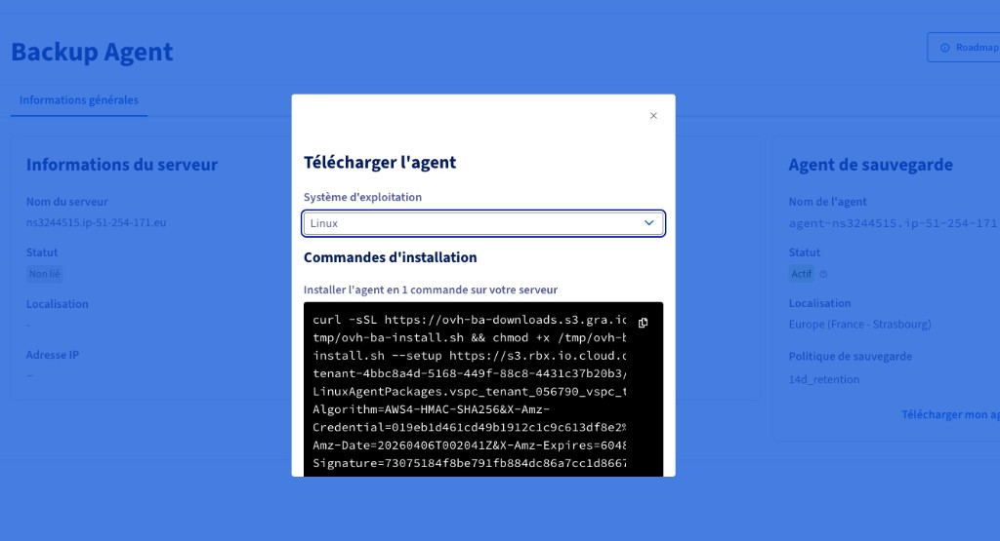

Dans l’espace client OVHcloud, ouvrez votre Backup Agent, puis la fenêtre de téléchargement de l’agent en sélectionnant **Linux** pour afficher et copier la commande d’installation fournie.

{.thumbnail}

Ce guide explique le script fourni par OVHcloud pour installer et gérer l’agent de sauvegarde Veeam sur votre serveur Linux.

---

## Objectif

Le script **`ovh-ba-install.sh`** est un **assistant en ligne de commande** qui permet de :

- **Installer** l’agent de **gestion** Veeam (Management Agent) à partir du lien de paquet fourni dans votre espace de sauvegarde ;
- **Installer** la commande globale **`ovhbackupagent`** sur le serveur, pour rouvrir le même menu à tout moment (`sudo ovhbackupagent`) ;
- **Afficher** un menu texte : statut des agents, interface Veeam, diagnostics, aide ;
- **Diagnostiquer** les problèmes (connexion à l’infrastructure, journaux, archive pour le support) ;
- **Désinstaller** les paquets Veeam et, si vous le souhaitez, le raccourci **`ovhbackupagent`** (**Uninstall Wizard**).

**À retenir** : le script **facilite l’installation et le suivi** sur la machine ; il ne remplace pas la configuration de vos sauvegardes dans l'UI Veeam Agent. La **résiliation du service** se fait dans le **Manager OVHcloud**, pas via ce script.

---

## Prérequis

### Côté serveur

| Élément | Détail |
|--------|--------|
| **Système** | Linux **compatible** avec l’agent Veeam pour Linux (voir la documentation Veeam / OVHcloud pour les distributions supportées). |
| **Droits** | Accès **administrateur** : les commandes d’installation utilisent en général **`sudo`**. |
| **Réseau** | Le serveur doit pouvoir **télécharger** le script et le paquet agent (HTTPS), et **joindre** la passerelle de sauvegarde (VSPC) selon les règles de votre offre. |
| **Terminal** | Une session **SSH** ou une console sur le serveur, en mode interactif pour le menu. |

### Ce dont vous avez besoin

1. **L’URL du script** `ovh-ba-install.sh` et **L’URL du paquet Linux** du Management Agent (fournies par OVHcloud dans le menu `Télécharger`{.action}).

> [!info]
>
> Copiez-collez ces liens dans un fichier texte avant de vous connecter au serveur : vous les recollerez sans erreur dans le terminal.
>

### Vocabulaire minimal

- **`curl`** : programme qui **télécharge** un fichier depuis une adresse web (`https://…`).
- **`sudo`** : « en tant qu’administrateur » — nécessaire pour installer des logiciels système.
- **`bash`** : interpréteur qui **exécute** le script que vous lui donnez.

---

## En pratique

**Une seule ligne pour installer votre agent et votre assistant**  

Via la ligne de commande que nous vous fournissons, vous pourrez installer le script et l'agent en même temps.

```bash
curl -sSL "URL_DU_SCRIPT" | sudo bash -s -- --setup "URL_DU_PAQUET_AGENT" --script-url "URL_DU_SCRIPT"
```

Exemple :

```bash
curl -sSL "https://s3.xxx.xxx.cloud.ovh.net/ovh-ba-install.sh" | sudo bash -s -- --setup "https://s3.xxx.xxx.cloud.ovh.net/xxxx/LinuxAgentPackages.vspc_tenant_xxxx.sh?X-Amz-Algorithm=xxx&X-Amz-Credential=xxx&X-Amz-Date=2xxx&X-Amz-Expires=xxx&X-Amz-SignedHeaders=xxx&X-Amz-Signature=xxx" --script-url "https://s3.xxx.xxx.cloud.ovh.net/ovh-ba-install.sh"
```

### Après une installation réussie

1. Un **résumé** s’affiche pendant **15 secondes** (ce qui a été fait, rôle du menu, rappel des touches).
2. L’écran **Agent status** s’ouvre pour suivre l’état Veeam (`veeamconsoleconfig -s`), avec rafraîchissement automatique.
3. **Entrée** ramène au **menu principal**.

Pour rouvrir l’assistant plus tard :

```bash
sudo ovhbackupagent
```

(Si la commande n’est pas trouvée, essayez `sudo /usr/local/bin/ovhbackupagent` ou vérifiez que `/usr/local/bin` est dans votre `PATH`.)

### Autres commandes utiles

| Besoin | Commande (exemple) |
|--------|---------------------|
| Agents déjà installés, installer **seulement** `ovhbackupagent` + menu | `sudo bash ovh-ba-install.sh --setup-local` |
| Aide / README dans le terminal | `sudo bash ovh-ba-install.sh --readme` |

### Vous avez retéléchargé le script ?

Si vous le lancez **sans argument** avec un terminal interactif (`sudo bash ovh-ba-install.sh`), un court **écran d’accueil** vérifie si **`ovhbackupagent`** est encore présent et si l’agent Veeam est détecté, puis propose au besoin de **réinstaller uniquement** le raccourci.

---

## Exemple pas à pas : première installation

**Contexte** : nouveau serveur Linux, vous avez récupéré dans votre Manager le lien pour le téléchargement du script et de l'agent.

1. Connectez-vous en SSH au serveur avec un utilisateur autorisé à utiliser `sudo`.

```bash
ssh <user>@<IPouDNSdevotreserveur>
```

2. Collez la commande et exécutez-la.

```bash
curl -sSL "https://s3.xxx.xxx.cloud.ovh.net/ovh-ba-install.sh" | sudo bash -s -- --setup "https://s3.xxx.xxx.cloud.ovh.net/xxxx/LinuxAgentPackages.vspc_tenant_xxxx.sh?X-Amz-Algorithm=xxx&X-Amz-Credential=xxx&X-Amz-Date=2xxx&X-Amz-Expires=xxx&X-Amz-SignedHeaders=xxx&X-Amz-Signature=xxx" --script-url "https://s3.xxx.xxx.cloud.ovh.net/ovh-ba-install.sh"
```

3. Lisez l’introduction, validez avec **Entrée** pour lancer l’installation.

```bash
 ▗▄▖ ▗▖  ▗▖▗▖ ▗▖ ▗▄▄▖▗▖    ▗▄▖ ▗▖ ▗▖▗▄▄▄     ▗▖  ▗▖    ▗▖  ▗▖▗▄▄▄▖▗▄▄▄▖ ▗▄▖ ▗▖  ▗▖
▐▌ ▐▌▐▌  ▐▌▐▌ ▐▌▐▌   ▐▌   ▐▌ ▐▌▐▌ ▐▌▐▌  █     ▝▚▞▘     ▐▌  ▐▌▐▌   ▐▌   ▐▌ ▐▌▐▛▚▞▜▌
▐▌ ▐▌▐▌  ▐▌▐▛▀▜▌▐▌   ▐▌   ▐▌ ▐▌▐▌ ▐▌▐▌  █      ▐▌      ▐▌  ▐▌▐▛▀▀▘▐▛▀▀▘▐▛▀▜▌▐▌  ▐▌
▝▚▄▞▘ ▝▚▞▘ ▐▌ ▐▌▝▚▄▄▖▐▙▄▄▖▝▚▄▞▘▝▚▄▞▘▐▙▄▄▀    ▗▞▘▝▚▖     ▝▚▞▘ ▐▙▄▄▖▐▙▄▄▖▐▌ ▐▌▐▌  ▐▌


      Backup Agent — CLI Assistant
  ─────────────────────────────────────

  Backup Agent — guided first-time setup

This setup will, in order:
  1) Install the **Veeam Management Agent** from the link you were given.
  2) Install the **ovhbackupagent** command on this server (under /usr/local/bin).
     That command is your permanent shortcut to this menu — you will not need
     to download this script again for everyday use.
  3) Show an installation summary, wait 15 seconds, then open **Agent status** to follow Backup Agent deployment.

The Veeam Backup Agent itself is deployed by our infrastructure after the
Management Agent connects; that step can take a few minutes.

Press Enter to start the installation, or Ctrl+C to cancel...
```

4. Attendez la fin des étapes Veeam ; le script installe ensuite **`ovhbackupagent`**.

5. Lisez le **résumé** 15 secondes, puis observez l’**Agent status** ; le **Backup Agent** peut apparaître après quelques minutes (déploiement côté infrastructure).

```bash
Installation summary

[OK] The Management Agent was installed successfully.
[OK] The **ovhbackupagent** command is now available (example: sudo ovhbackupagent).

[Info] The **Backup Agent** will be deployed shortly by our infrastructure (often within a few minutes).
Next, the **Agent status** screen opens so you can follow **`veeamconsoleconfig -s`** until the Backup Agent appears.

Main menu - reminder (available again after Agent status)

**A** - Agent status: Management / Backup Agent state (this screen refreshes every few seconds).
**V** - Open the Veeam UI on the server (once the Backup Agent is installed).
**D** - Diagnostics: VSPC connectivity test, support bundle, log issue analyzer, force-stop stuck jobs.
**I** - Install or reinstall a Management Agent package from a file or URL (advanced).
**U** - Uninstall Veeam agent packages from this server (with confirmations).
**H** - Help and README.
**Q** - Exit the assistant.

[Info] Waiting 15 seconds, then opening Agent status...
```

```bash
Agent status (veeamconsoleconfig -s)

[Info] Retrieving Veeam status (up to 45s right after install)...
Management agent
    Connection state       : Connected
    Cloud gateway          : vspc-cgw1.prod01.eu-west-rbx.backup.ovhcloud.com:6180
    Connection account     : vspc-tenant-604276/vspc-tenant-cc1-604276
Backup agent
    Version                : 13.0.1.404
    Driver version         : 13.0.1.404
    Status                 : Running

Your agents are running well.

Auto-refresh in 5s... Press Enter to return to menu.
```

6. Appuyez sur **Entrée** pour accéder au menu ; utilisez **`A`** pour revoir le statut, **`D`** pour les diagnostics si quelque chose bloque.

---

## Menu principal

```bash
 ▗▄▖ ▗▖  ▗▖▗▖ ▗▖ ▗▄▄▖▗▖    ▗▄▖ ▗▖ ▗▖▗▄▄▄     ▗▖  ▗▖    ▗▖  ▗▖▗▄▄▄▖▗▄▄▄▖ ▗▄▖ ▗▖  ▗▖
▐▌ ▐▌▐▌  ▐▌▐▌ ▐▌▐▌   ▐▌   ▐▌ ▐▌▐▌ ▐▌▐▌  █     ▝▚▞▘     ▐▌  ▐▌▐▌   ▐▌   ▐▌ ▐▌▐▛▚▞▜▌
▐▌ ▐▌▐▌  ▐▌▐▛▀▜▌▐▌   ▐▌   ▐▌ ▐▌▐▌ ▐▌▐▌  █      ▐▌      ▐▌  ▐▌▐▛▀▀▘▐▛▀▀▘▐▛▀▜▌▐▌  ▐▌
▝▚▄▞▘ ▝▚▞▘ ▐▌ ▐▌▝▚▄▄▖▐▙▄▄▖▝▚▄▞▘▝▚▄▞▘▐▙▄▄▀    ▗▞▘▝▚▖     ▝▚▞▘ ▐▙▄▄▖▐▙▄▄▖▐▌ ▐▌▐▌  ▐▌


      Backup Agent — CLI Assistant
  ─────────────────────────────────────

  ┌──────────────────────────────────────────────────────────────────────────┐
     Management Agent:   OK     Backup Agent:   OK     Last backup:  N/A 
  └──────────────────────────────────────────────────────────────────────────┘

  A  Agent status (veeamconsoleconfig -s)
  V  Open Veeam interface (veeam command)
  D  Diagnostic (test connection, support bundle, issue analyzer, job force stop)
  I  Install Management Agent (only if you want to reinstall it)
  U  Uninstall Wizard
  H  Help / README
  Q  Quit

  Your choice (A/V/D/I/U/H/Q):
```

| Touche | Rôle |
|--------|------|
| **A** | Statut des agents (rafraîchissement automatique). |
| **V** | Ouvrir l’interface Veeam sur le serveur afin de contrôler vos sauvegardes et restaurations (si l’agent backup est prêt). |
| **D** | Sous-menu **Diagnostic** : test VSPC, bundle support, analyse des journaux, arrêt forcé d’une sauvegarde bloquée. |
| **I** | Réinstaller le Management Agent à partir d’un fichier ou d’une URL (cas avancé). |
| **U** | **Uninstall Wizard** : désinstallation des paquets Veeam + option pour supprimer **`ovhbackupagent`**. |
| **H** | Aide / README intégré. |
| **Q** | Quitter. |

La ligne de statut en haut du menu indique **OK/KO** pour les paquets **Management** (`veeamma`) et **Backup** (`veeam`, `veeam-libs`), et un indicateur lié au dernier job de sauvegarde.

---

## Dépannage et diagnostics

- **`D`** puis **`T`** : test de connexion vers la passerelle VSPC.
- **`D`** puis **`B`** : génération d’une **archive** (logs + infos système) à envoyer au support.
- **`D`** puis **`I`** : **analyse** des messages connus dans les journaux (`agent.log`, `veeaminstaller.log`, etc.).
- **`D`** puis **`J`** : outil d’**arrêt forcé** d’une session de sauvegarde (à utiliser avec prudence).

Pour aller plus loin dans vos diagnostics, consultez notre [guide de diagnostic et de dépannage Backup Agent](/pages/storage_and_backup/backup_agent/backup_agent_troubleshooting).

---

## Uninstall Wizard (touche **U**)

- Suppression de votre agent, selon votre famille d’OS (**yum/dnf**, **zypper**, **apt-get**).
- Question optionnelle pour supprimer **`/usr/local/bin/ovhbackupagent`** et le README associé.

**Important** : désinstaller les agents **ne résilie pas** votre offre Backup Agent. Le service reste actif côté OVHcloud tant que vous ne l’avez pas arrêté dans le **Manager**. Vous pourrez **réinstaller** les agents plus tard depuis votre interface de sauvegarde.

---

## FAQ

**Puis-je lancer le script sans `sudo` ?**  
Non pour l’installation et le menu : des actions système sont nécessaires.

**Le menu se ferme tout de suite après l’installation en pipe**  
Vous pouvez le réouvrir avec :

```bash
sudo ovhbackupagent
```

**Où est le script une fois installé comme commande ?**  
En général : **`/usr/local/bin/ovhbackupagent`**.

## Aller plus loin

Échangez avec notre [communauté d'utilisateurs](https://community.ovhcloud.com/community/fr).
