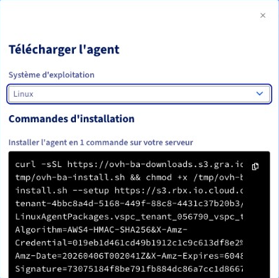

## Obiettivo

**Questa guida spiega come utilizzare lo script `ovh-ba-install.sh` fornito da OVHcloud per installare e gestire l'agente di backup Veeam sul tuo server Linux.**

Scoprirai come recuperare gli URL di installazione, avviare l'installazione con un solo comando, navigare nel menu dell'assistente CLI e utilizzare gli strumenti di diagnostica.

## Prerequisiti

- Disporre di un servizio Backup Agent attivo.

<!-- CP-NAV-START:baremetal-backup-agent -->

### Accesso allo Spazio Cliente OVHcloud

- **Link diretto:** [Backup Agent](/links/control-panel/baremetal-backup-agent)
- **Percorso di navigazione:** `Bare Metal Cloud`{.action} > `Backup Agent`{.action}

<!-- CP-NAV-END:baremetal-backup-agent -->

### Lato server

| Elemento | Dettagli |
|--------|--------|
| **Sistema** | Linux **compatibile** con l'agente Veeam per Linux (consulta i [requisiti di sistema Veeam](https://helpcenter.veeam.com/docs/agentforlinux/userguide/system_requirements.html?ver=13) e le [restrizioni Backup Agent](/pages/storage_and_backup/backup_agent/backup_agent_restrictions)). |
| **Permessi** | Accesso **amministratore**: i comandi di installazione utilizzano generalmente **`sudo`**. |
| **Rete** | Il server deve poter **scaricare** lo script e il pacchetto agente (HTTPS) e **raggiungere** il gateway di backup VSPC (Veeam Service Provider Console) secondo le regole della tua offerta. |
| **Terminale** | Una sessione **SSH** o una console sul server, in modalità interattiva per il menu. |

### Vocabolario minimo

| Comando | Ruolo |
|----------|------|
| **`curl`** | Programma che **scarica** un file da un indirizzo web (`https://…`). |
| **`sudo`** | "Come amministratore" — necessario per installare software di sistema. |
| **`bash`** | Interprete che **esegue** lo script che gli viene fornito. |

## Procedura

### Presentazione dello script ovh-ba-install.sh

Lo script **`ovh-ba-install.sh`** è un **assistente a riga di comando**. Con questo script puoi:

- **Installare** l'agente di **gestione** Veeam (Management Agent) a partire dall'URL del pacchetto disponibile nel tuo Spazio Cliente;
- **Installare** il comando globale **`ovhbackupagent`** sul server, per riaprire lo stesso menu in qualsiasi momento (`sudo ovhbackupagent`);
- **Visualizzare** un menu testuale: stato degli agenti, interfaccia Veeam, diagnostica, aiuto;
- **Diagnosticare** i problemi (connessione all'infrastruttura, log, archivio per il supporto);
- **Disinstallare** i pacchetti Veeam e, se lo desideri, il collegamento **`ovhbackupagent`** (**Uninstall Wizard**).

> [!warning]
>
> Lo script **facilita l'installazione e il monitoraggio** sulla macchina; non sostituisce la configurazione dei backup nell'interfaccia Veeam Agent. La **disdetta del servizio** si effettua nello **Spazio Cliente OVHcloud**, non tramite questo script.
>

### Installazione

#### Step 1 — Recuperare gli URL di installazione

Nello Spazio Cliente OVHcloud, apri il tuo [Backup Agent](/links/control-panel/baremetal-backup-agent), vai nella scheda `Agents`{.action}, quindi clicca sul pulsante `Scarica`{.action}. Nella finestra che si apre, seleziona **Linux** per visualizzare il comando contenente i due URL (script e pacchetto Linux).

{.thumbnail}

> [!primary]
>
> Copia e incolla ciascuno dei due URL separatamente in un file di testo prima di connetterti in SSH.
>

#### Step 2 — Connettersi al server

Connettiti in SSH al server con un utente autorizzato a utilizzare `sudo`.

```bash
ssh <user>@<IPouDNSdevotreserveur>
```

#### Step 3 — Avviare l'installazione

Sostituisci `URL_DELLO_SCRIPT` (2 volte) e `URL_DEL_PACCHETTO_AGENTE` nel comando seguente con i tuoi URL, quindi eseguilo.

```bash
curl -sSL "URL_DELLO_SCRIPT" | sudo bash -s -- --setup "URL_DEL_PACCHETTO_AGENTE" --script-url "URL_DELLO_SCRIPT"
```

Esempio:

```bash
curl -sSL "https://ovh-ba-downloads.s3.xxx.xxx/tmp/ovh-ba-install.sh" | sudo bash -s -- --setup "https://s3.xxx.xxx.cloud.ovh.net/xxxx/LinuxAgentPackages.vspc_tenant_xxxx.sh?X-Amz-Algorithm=xxx&X-Amz-Credential=xxx&X-Amz-Date=2xxx&X-Amz-Expires=xxx&X-Amz-SignedHeaders=xxx&X-Amz-Signature=xxx" --script-url "https://ovh-ba-downloads.s3.xxx.xxx/tmp/ovh-ba-install.sh"
```

#### Step 4 — Schermata di benvenuto

Leggi l'introduzione, quindi conferma con **Invio** per avviare l'installazione.

```console
 ▗▄▖ ▗▖  ▗▖▗▖ ▗▖ ▗▄▄▖▗▖    ▗▄▖ ▗▖ ▗▖▗▄▄▄     ▗▖  ▗▖    ▗▖  ▗▖▗▄▄▄▖▗▄▄▄▖ ▗▄▖ ▗▖  ▗▖
▐▌ ▐▌▐▌  ▐▌▐▌ ▐▌▐▌   ▐▌   ▐▌ ▐▌▐▌ ▐▌▐▌  █     ▝▚▞▘     ▐▌  ▐▌▐▌   ▐▌   ▐▌ ▐▌▐▛▚▞▜▌
▐▌ ▐▌▐▌  ▐▌▐▛▀▜▌▐▌   ▐▌   ▐▌ ▐▌▐▌ ▐▌▐▌  █      ▐▌      ▐▌  ▐▌▐▛▀▀▘▐▛▀▀▘▐▛▀▜▌▐▌  ▐▌
▝▚▄▞▘ ▝▚▞▘ ▐▌ ▐▌▝▚▄▄▖▐▙▄▄▖▝▚▄▞▘▝▚▄▞▘▐▙▄▄▀    ▗▞▘▝▚▖     ▝▚▞▘ ▐▙▄▄▖▐▙▄▄▖▐▌ ▐▌▐▌  ▐▌


      Backup Agent — CLI Assistant
  ─────────────────────────────────────

  Backup Agent — guided first-time setup

This setup will, in order:
  1) Install the **Veeam Management Agent** from the link you were given.
  2) Install the **ovhbackupagent** command on this server (under /usr/local/bin).
     That command is your permanent shortcut to this menu — you will not need
     to download this script again for everyday use.
  3) Show an installation summary, wait 15 seconds, then open **Agent status** to follow Backup Agent deployment.

The Veeam Backup Agent itself is deployed by our infrastructure after the
Management Agent connects; that step can take a few minutes.

Press Enter to start the installation, or Ctrl+C to cancel...
```

#### Step 5 — Installazione in corso

Attendi il completamento delle fasi Veeam; lo script installa quindi il comando **`ovhbackupagent`**.

#### Step 6 — Riepilogo e stato degli agenti

Prendi nota del **riepilogo** visualizzato per **15 secondi**, quindi osserva la schermata **Agent status**. Il **Backup Agent** può apparire dopo qualche minuto (distribuzione lato infrastruttura).

```console
Installation summary

[OK] The Management Agent was installed successfully.
[OK] The **ovhbackupagent** command is now available (example: sudo ovhbackupagent).

[Info] The **Backup Agent** will be deployed shortly by our infrastructure (often within a few minutes).
Next, the **Agent status** screen opens so you can follow **`veeamconsoleconfig -s`** until the Backup Agent appears.

Main menu - reminder (available again after Agent status)

**A** - Agent status: Management / Backup Agent state (this screen refreshes every few seconds).
**V** - Open the Veeam UI on the server (once the Backup Agent is installed).
**D** - Diagnostics: VSPC connectivity test, support bundle, log issue analyzer, force-stop stuck jobs.
**I** - Install or reinstall a Management Agent package from a file or URL (advanced).
**U** - Uninstall Veeam agent packages from this server (with confirmations).
**H** - Help and README.
**Q** - Exit the assistant.

[Info] Waiting 15 seconds, then opening Agent status...
```

Dopo i 15 secondi, la schermata **Agent status** viene visualizzata automaticamente:

```console
Agent status (veeamconsoleconfig -s)

[Info] Retrieving Veeam status (up to 45s right after install)...
Management agent
    Connection state       : Connected
    Cloud gateway          : vspc-cgw1.prod01.eu-west-rbx.backup.ovhcloud.com:6180
    Connection account     : vspc-tenant-604276/vspc-tenant-cc1-604276
Backup agent
    Version                : 13.0.1.404
    Driver version         : 13.0.1.404
    Status                 : Running

Your agents are running well.

Auto-refresh in 5s... Press Enter to return to menu.
```

Premi **Invio** per accedere al **menu principale**.

### Riaprire l'assistente

Per riaprire l'assistente in seguito:

```bash
sudo ovhbackupagent
```

Se il comando non viene trovato, prova `sudo /usr/local/bin/ovhbackupagent` o verifica che `/usr/local/bin` sia nel tuo `PATH`.

### Menu principale

```console
 ▗▄▖ ▗▖  ▗▖▗▖ ▗▖ ▗▄▄▖▗▖    ▗▄▖ ▗▖ ▗▖▗▄▄▄     ▗▖  ▗▖    ▗▖  ▗▖▗▄▄▄▖▗▄▄▄▖ ▗▄▖ ▗▖  ▗▖
▐▌ ▐▌▐▌  ▐▌▐▌ ▐▌▐▌   ▐▌   ▐▌ ▐▌▐▌ ▐▌▐▌  █     ▝▚▞▘     ▐▌  ▐▌▐▌   ▐▌   ▐▌ ▐▌▐▛▚▞▜▌
▐▌ ▐▌▐▌  ▐▌▐▛▀▜▌▐▌   ▐▌   ▐▌ ▐▌▐▌ ▐▌▐▌  █      ▐▌      ▐▌  ▐▌▐▛▀▀▘▐▛▀▀▘▐▛▀▜▌▐▌  ▐▌
▝▚▄▞▘ ▝▚▞▘ ▐▌ ▐▌▝▚▄▄▖▐▙▄▄▖▝▚▄▞▘▝▚▄▞▘▐▙▄▄▀    ▗▞▘▝▚▖     ▝▚▞▘ ▐▙▄▄▖▐▙▄▄▖▐▌ ▐▌▐▌  ▐▌


      Backup Agent — CLI Assistant
  ─────────────────────────────────────

  ┌──────────────────────────────────────────────────────────────────────────┐
     Management Agent:   OK     Backup Agent:   OK     Last backup:  N/A 
  └──────────────────────────────────────────────────────────────────────────┘

  A  Agent status (veeamconsoleconfig -s)
  V  Open Veeam interface (veeam command)
  D  Diagnostic (test connection, support bundle, issue analyzer, job force stop)
  I  Install Management Agent (only if you want to reinstall it)
  U  Uninstall Wizard
  H  Help / README
  Q  Quit

  Your choice (A/V/D/I/U/H/Q):
```

La riga di stato in cima al menu indica **OK/KO** per i pacchetti **Management** (`veeamma`) e **Backup** (`veeam`, `veeam-libs`), e un indicatore relativo all'ultimo job di backup.

| Tasto | Azione |
|--------|------|
| **A** | Stato degli agenti (aggiornamento automatico). |
| **V** | Aprire l'interfaccia Veeam sul server per controllare i backup e i ripristini (se il Backup Agent è pronto). |
| **D** | Sotto-menu **Diagnostic**: test VSPC, archivio per il supporto, analisi dei log, arresto forzato di un backup bloccato. |
| **I** | Reinstallare il Management Agent a partire da un file o da un URL (caso avanzato). |
| **U** | **Uninstall Wizard**: disinstallazione dei pacchetti Veeam + opzione per rimuovere **`ovhbackupagent`**. |
| **H** | Aiuto / README integrato. |
| **Q** | Uscire. |

### Risoluzione dei problemi e diagnostica

| Tasti | Azione |
|---------|--------|
| **`D`** poi **`T`** | Test di connessione verso il gateway VSPC. |
| **`D`** poi **`B`** | Generazione di un **archivio** (log + informazioni di sistema) da inviare al supporto. |
| **`D`** poi **`I`** | **Analisi** dei messaggi noti nei log (`agent.log`, `veeaminstaller.log`, ecc.). |
| **`D`** poi **`J`** | Strumento di **arresto forzato** di una sessione di backup (da utilizzare con cautela). |

Per approfondire la diagnostica, consulta la nostra [guida alla diagnostica e alla risoluzione dei problemi Backup Agent](/pages/storage_and_backup/backup_agent/backup_agent_troubleshooting).

### Disinstallazione — Uninstall Wizard (tasto **U**)

- Rimozione dell'agente, in base alla famiglia del tuo sistema operativo (**yum/dnf**, **zypper**, **apt-get**).
- Domanda opzionale per rimuovere **`/usr/local/bin/ovhbackupagent`** e il README associato.

> [!warning]
>
> Disinstallare gli agenti **non disdice** la tua offerta Backup Agent. Il servizio resta attivo lato OVHcloud finché non lo avrai disdetto nello **Spazio Cliente**. Potrai **reinstallare** gli agenti in seguito dalla tua interfaccia di backup.
>

## FAQ

**Posso avviare lo script senza `sudo`?**  
No: sono necessarie operazioni di sistema che richiedono permessi di amministratore (`sudo`).

**Il menu si chiude subito dopo l'installazione in pipe — cosa fare?**  
Riaprilo con `sudo ovhbackupagent`.

**Dove si trova lo script una volta installato come comando?**  
In genere: **`/usr/local/bin/ovhbackupagent`**.

**Gli agenti sono già installati, come installare solo l'assistente?**  
Utilizza `sudo bash ovh-ba-install.sh --setup-local`.

**Ho riscaricato lo script, cosa succede se lo avvio senza argomenti?**  
Una breve schermata di benvenuto verifica se **`ovhbackupagent`** è ancora presente e se il Backup Agent è rilevato, quindi propone eventualmente di reinstallare solo il collegamento.

**Come visualizzare l'aiuto integrato?**  
Utilizza `sudo bash ovh-ba-install.sh --readme`.

## Per saperne di più

Una volta che i tuoi agenti sono operativi, configura i tuoi backup tramite l'interfaccia Veeam Agent sul server (tasto **`V`** nell'assistente).

- [Configurare il primo backup](/pages/storage_and_backup/backup_agent/backup_agent_first_configuration)
- [Gestire backup e ripristini](/pages/storage_and_backup/backup_agent/backup_agent_backup_restore)
- [Diagnostica e risoluzione dei problemi](/pages/storage_and_backup/backup_agent/backup_agent_troubleshooting)

Contatta la nostra [Community di utenti](/links/community).
