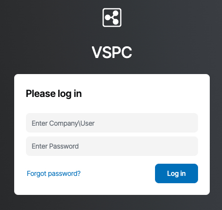
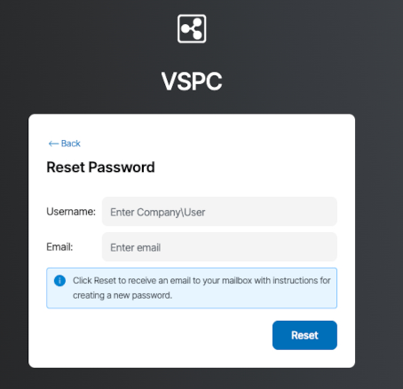

<style>
/* ---FAQ only--- */
details {
    margin: 0.1rem 1;
    border: 1px solid transparent;
    border-radius: 4px;
    background: #ffffffff;
}
details > summary {
    padding: 0.1rem 1rem;
    font-weight: 500;
    color: #268fd4ff;
    cursor: pointer;
    list-style: none;
}
details > summary::before {
    content: '\25B6';
    display: inline-block;
    margin-right: 0.5ch;
    transition: transform 0.2s;
}
details[open] > summary::before {
    content: '\25BC';
}
details:hover {
    border: 1px solid #147DE8;
    border-radius: 4px;
    transition: border-color 0.5s ease;
}
details[open] > summary {
    background: #ffffffff;
}
details > :not(summary) {
    padding: 0.25rem 0.5rem;
    box-sizing: border-box;
    list-style-position: inside;
}
.smallish-gap {
    display: block;
    margin-top: 0.25rem;
    margin-bottom: 0.25rem;
}
</style>


## Objetivo

Encontre nesta página uma lista de possíveis problemas que pode encontrar no produto Backup Agent e como resolvê-los.

## Requisitos

- Um servidor Bare Metal no qual o Backup Agent está instalado. Consulte o nosso guia "[Como configurar a sua primeira cópia de segurança](/pages/storage_and_backup/backup_agent/backup_agent_first_configuration)" para mais informações.

<!-- CP-NAV-START:baremetal-backup-agent -->
---

### Acesso à Área de Cliente OVHcloud

- **Ligação direta:** [Backup Agent](/links/control-panel/baremetal-backup-agent)
- **Caminho de navegação:** `Bare Metal Cloud`{.action} > `Backup Agent`{.action}

---
<!-- CP-NAV-END:baremetal-backup-agent -->

## Lista de possíveis problemas

/// details | O meu Backup Agent não consegue ligar-se ao seu servidor.

Verifique se o seu firewall permite a comunicação com o nosso servidor `vspc-cgw1.prod01.eu-west-rbx.Backup.ovhcloud.com` (137.74.125.230) na Europa com a porta TCP e UDP 6180.

Certifique-se de que nenhum outro serviço utiliza portas que possam entrar em conflito com o seu servidor.

Pode encontrar os registos do seu Backup Agent na pasta: `C:\ProgramData\Veeam\` ou `/var/logs`.

///

/// details | O seu servidor não consegue instalar o agente de cópia de segurança no meu servidor.

O Backup Agent suporta distribuições Windows e kernels Linux nativos. Se fez alterações ao seu kernel, deve assegurar-se de que tem os pacotes corretos para permitir a instalação do agente. Encontrará a lista dos parâmetros necessários aqui: <https://helpcenter.veeam.com/docs/agentforlinux/userguide/system_requirements.html?ver=13>.

///

/// details | O meu Backup Agent não consegue fazer cópias de segurança, obtenho o erro: "Failed to perform Backup. Neither blksnap nor veeamsnap module was found."

O Backup Agent suporta as distribuições Windows e os kernels Linux nativos. Se fez alterações ao seu kernel, deve assegurar-se de que tem os pacotes corretos para permitir a instalação do agente. Encontrará a lista dos parâmetros necessários aqui: <https://helpcenter.veeam.com/docs/agentforlinux/userguide/system_requirements.html?ver=13>.

Precisa, em primeiro lugar, dos headers do kernel Linux e, em seguida, pode tentar instalar ou reconfigurar o seu pacote veeamsnap ou veeamblksnap ou blksnap, consoante o sistema operativo.

///

/// details | O meu agente não consegue fazer cópias de segurança, obtenho o erro: `POSIX: Failed to create or open file [/.veeamsnapstorage/veeamsnapstore`

Para fazer cópias de segurança, o Veeam efetua snapshots, além de conservar os dados que serão escritos na cópia de segurança, este snapshot chama-se "veeamsnapstorage".

Para resolver este problema, aumente o tamanho do snapshot através do ficheiro `/etc/veeam/veeam.ini`:

```bash
[blksnap]
 
# The minimum allowable size of the difference Storage in sectors
diffStorageMinimum = 2097152
```

Substitua o valor pelo número de setores desejado convertendo primeiro o tamanho desejado de gigabytes para bytes e depois dividindo esse número de bytes por 512.<br>
Por exemplo, para um tamanho de 3 GB (3.221.225.472 bytes), o valor a especificar é 6.291.456 (3.221.225.472 / 512).

Por fim, reinicie o serviço veeamservice.

///

/// details | Não consigo iniciar uma cópia de segurança manual.

[Contacte o suporte OVHcloud](/links/support-contact) que poderá investigar. Certifique-se de nos fornecer registos e capturas de ecrã.

///

/// details | A minha cópia de segurança está em erro, como posso ver o problema?

Se a sua cópia de segurança está em erro, pode diagnosticar o problema diretamente a partir do agente. Clique no separador correspondente ao seu sistema operativo:

> [!tabs]
> Windows
>>
>> Para ver os detalhes de um erro de cópia de segurança no Windows:
>>
>> 1. Abra a aplicação "Veeam Agent" no seu servidor Bare Metal.
>> 2. Na interface principal, verá o estado das suas cópias de segurança.
>> 3. Clique na cópia de segurança em erro para ver os detalhes do erro.
>> 4. Consulte a secção **History** ou **Last Session** para ver as mensagens de erro detalhadas.
>>
>> A interface mostrar-lhe-á informações precisas sobre a causa do erro, permitindo-lhe identificar rapidamente o problema.
>
> Linux
>>
>> Para ver os detalhes de um erro de cópia de segurança no Linux, pode utilizar a interface de utilizador:
>>
>> 1\. Ligue-se ao seu servidor Bare Metal por SSH.
>> 2\. Lance a interface Veeam escrevendo o seguinte comando:
>>
>> ```bash
>> sudo veeam
>> ```
>>
>> 3\. Na interface, navegue para a secção das cópias de segurança para ver o estado dos seus trabalhos.
>> 4\. Selecione a cópia de segurança em erro para consultar os detalhes do erro.
>>
>> Também pode consultar os registos diretamente através da linha de comandos:
>>
>> ```bash
>> sudo veeamconfig session list
>> ```
>>
>> Este comando mostrar-lhe-á a lista das sessões de cópia de segurança com o seu estado e os detalhes dos erros eventuais.

///

/// details | A minha utilização do armazenamento não atualizou-se após a eliminação de um agente.

Conservamos os seus dados durante 14 dias após a eliminação de um agente, a utilização do armazenamento atualizar-se-á após os 14 dias e a eliminação dos dados.

///

/// details | Quero alterar a senha de acesso à Veeam Service Provider Console (VSPC).

A alteração da senha é feita por meio do link "Esqueceu a palavra-passe?" disponível na console VSPC.

{.thumbnail}

{.thumbnail}

///

/// details | Reinstalei o meu servidor, como reinstalo o Backup Agent?

Tem de transferir o agente a partir do seu [área de cliente OVHcloud](/links/manager) e instalá-lo no seu novo sistema operativo.

///

## Encontrar e exportar os registos

Para resolver problemas com o Backup Agent, é frequentemente necessário consultar e exportar os registos do produto. Clique no separador correspondente ao seu sistema operativo:

> [!tabs]
> Windows
>>
>> **Localizar os registos**
>>
>> Os registos do Veeam Agent para Windows são armazenados no seguinte diretório:
>>
>> ```
>> C:\ProgramData\Veeam\Endpoint\Logs
>> ```
>>
>> **Exportar os registos**
>>
>> Para exportar os registos no Windows, pode utilizar a interface gráfica do Veeam Agent:
>>
>> 1. Abra a aplicação "Veeam Agent" no seu servidor.
>> 2. Vá ao menu `Help`{.action} > `Export Logs`{.action}.
>> 3. Selecione o diretório de destino para o arquivo de registos.
>> 4. Clique em `Export`{.action} para gerar o arquivo.
>>
>> O arquivo será criado no formato `.zip` e conterá todos os registos e ficheiros de configuração necessários para o diagnóstico.
>>
>> Para mais informações, consulte o artigo [Veeam KB2404](https://www.veeam.com/kb2404).
>
> Linux
>>
>> **Localizar os registos**
>>
>> Os registos do Veeam Agent para Linux são armazenados no seguinte diretório:
>>
>> ```bash
>> /var/log/veeam/
>> ```
>>
>> Também pode consultar os registos do serviço Veeam:
>>
>> ```bash
>> /var/log/veeam/veeamservice.log
>> ```
>>
>> **Exportar os registos**
>>
>> Para exportar os registos no Linux, tem duas opções:
>>
>> 1\. Via linha de comandos
>>
>> Utilize o seguinte comando para exportar os registos. O arquivo será guardado no diretório de trabalho atual:
>>
>> ```bash
>> sudo veeamconfig grabLogs
>> ```
>>
>> 2\. Via painel de controlo
>>
>> Se tiver acesso a uma interface gráfica, pode exportar os registos via painel de controlo do Veeam Agent especificando o diretório de destino.
>>
>> O arquivo será criado no formato `.tar.gz` e conterá todos os registos e ficheiros de configuração necessários para o diagnóstico.
>>
>> Para mais informações, consulte a [documentação Veeam](https://helpcenter.veeam.com/docs/agentforlinux/userguide/logs_export.html?ver=13).

## Quer saber mais?

Fale com a nossa [comunidade de utilizadores](/links/community).