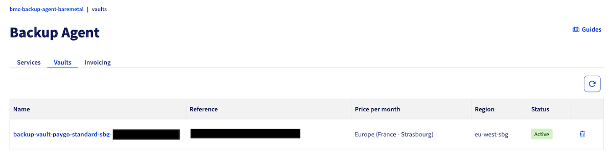
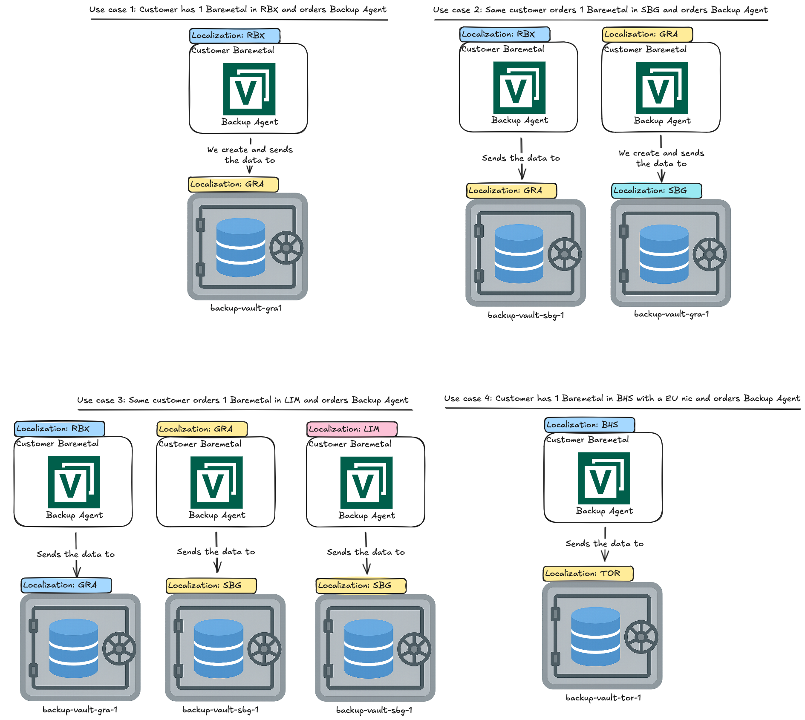

## Objectif

Ce guide vous explique comment fonctionne le système de Vault dans le produit Backup Agent et comment vos données sont localisées et stockées selon l'emplacement de vos serveurs Bare Metal.

## Prérequis

- Avoir commandé un service Backup Agent au moment de la commande de votre serveur Bare Metal ou ultérieurement via le menu `Backup Agent`{.action} de votre espace client.

<!-- CP-NAV-START:baremetal-backup-agent -->
---

### Accès à l'espace client OVHcloud

- **Lien direct :** [Backup Agent](/links/control-panel/baremetal-backup-agent)
- **Pour accéder à vos services :** `Bare Metal Cloud`{.action} > `Backup Agent`{.action}

---
<!-- CP-NAV-END:baremetal-backup-agent -->

## En pratique

### Présentation du Vault

Un Vault est votre espace de stockage où vos données de sauvegarde sont envoyées à chaque sauvegarde. Les Vaults sont créés automatiquement par OVHcloud pour garantir que vos données ne soient pas hébergées dans le même datacenter que votre serveur Bare Metal.

Cela se base sur nos buckets Object Storage, que vous pouvez retrouver sur [ce lien](/links/public-cloud/object-storage).

Pour retrouver vos Vaults, cliquez sur [ce lien](/links/control-panel/baremetal-backup-agent) pour accéder à la section `Backup Agent`{.action}, puis cliquez sur l'onglet `Vaults`{.action}.

{.thumbnail}

### Principe de localisation

**Règle importante :** Les données de sauvegarde sont toujours envoyées vers un Vault situé dans un datacenter différent de celui où se trouve votre serveur Bare Metal. Cela garantit la résilience et la sécurité de vos données.

### Cas d'usage

Voici différents scénarios illustrant le fonctionnement du système de Vault :

{.thumbnail}

### Cas d'usage 1 : Un serveur Bare Metal à RBX

Si vous avez un serveur Bare Metal localisé à **Roubaix (RBX)** et que vous commandez le Backup Agent :

- Votre serveur Bare Metal avec le Backup Agent installé se trouve à **RBX**.
- Vos données de sauvegarde sont automatiquement envoyées vers un Vault créé à **Gravelines (GRA)**, nommé **backup-vault-gra1**.
- Cela garantit que vos données sont stockées dans un datacenter différent de celui de votre serveur.

### Cas d'usage 2 : Deux serveurs Bare Metal à RBX et GRA

Si vous avez deux serveurs Bare Metal, l'un à **Roubaix (RBX)** et l'autre à **Gravelines (GRA)** :

- Le serveur Bare Metal à **RBX** envoie ses données vers **backup-vault-sbg-1** à **Gravelines**.
- Le serveur Bare Metal à **GRA** envoie ses données vers **backup-vault-gra-1** à **Strasbourg (SBG)**.
- Chaque serveur utilise un Vault dans un datacenter différent du sien.

### Cas d'usage 3 : Trois serveurs Bare Metal à RBX, GRA et LIM

Si vous avez trois serveurs Bare Metal dans différents datacenters :

- Le serveur à **RBX** envoie ses données vers **backup-vault-gra-1** à **GRA**.
- Le serveur à **GRA** envoie ses données vers **backup-vault-sbg-1** à **SBG**.
- Le serveur à **Limburg (LIM)** envoie ses données vers **backup-vault-sbg-1** à **SBG**.
- Chaque serveur garantit que ses données sont stockées dans un datacenter distant.

### Cas d'usage 4 : Serveur Bare Metal à BHS avec NIC EU

Si vous avez un serveur Bare Metal à **Beauharnois (BHS)** avec une interface réseau européenne :

- Votre serveur Bare Metal se trouve à **BHS**.
- Vos données de sauvegarde sont envoyées vers **backup-vault-tor-1** à **Toronto (TOR)**.
- La localisation du Vault est déterminée en fonction de la configuration réseau de votre serveur.

## Points importants

- Les Vaults sont créés automatiquement par OVHcloud, vous ne pouvez pas les créer manuellement.
- Vous ne pouvez pas changer de Vault pour un agent une fois qu'il est configuré.
- La localisation du Vault est toujours différente de celle de votre serveur Bare Metal pour garantir la résilience.
- Le nom du Vault suit généralement la convention : `backup-vault-<localisation>-<numéro>`.

## Aller plus loin

Échangez avec notre [communauté d'utilisateurs](/links/community).

