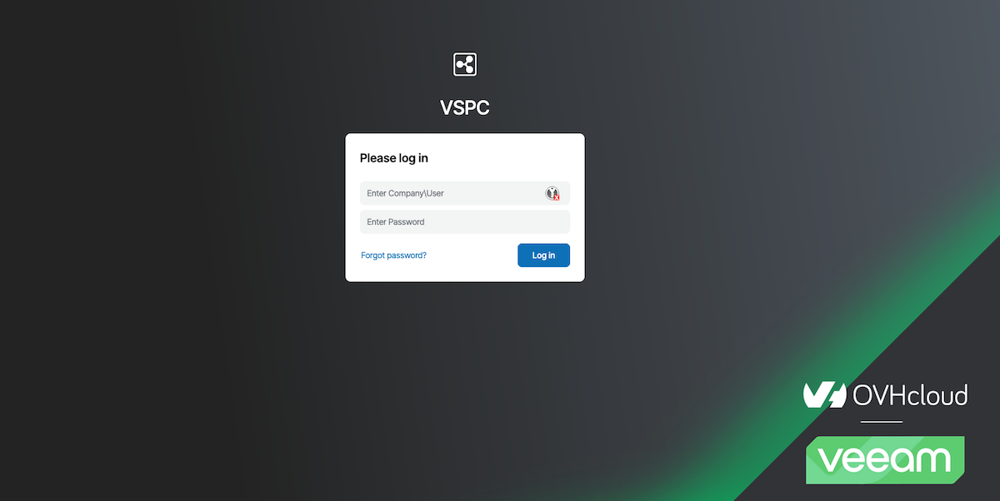
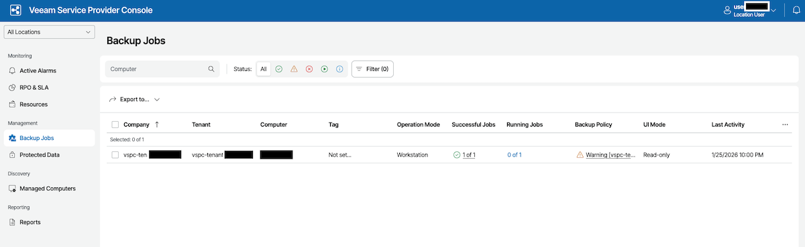
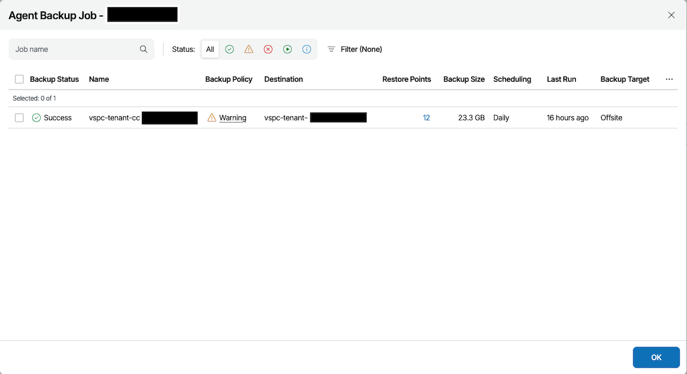
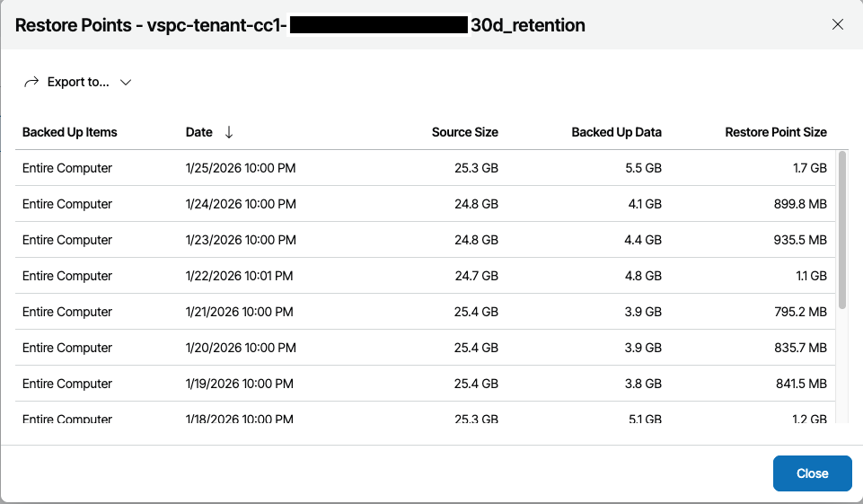
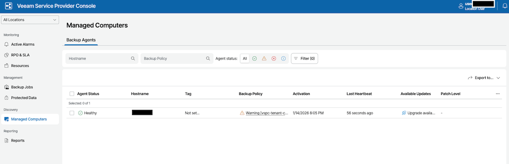
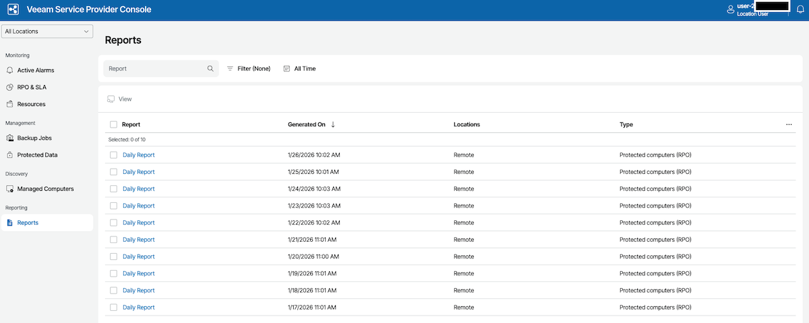
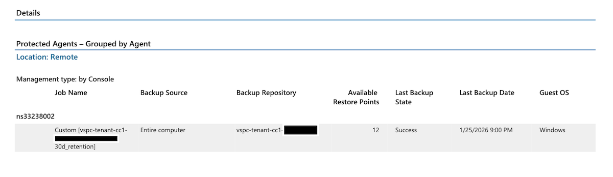
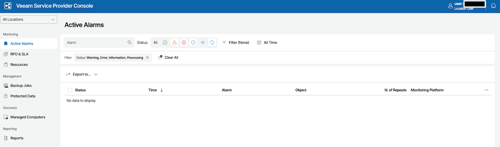

## Ziel

Diese Anleitung erklärt, wie Sie sich bei der Veeam Service Provider Console (VSPC) anmelden, um Ihre Sicherungen, Agents und Ihre Sicherungsauftragsberichte anzuzeigen.

## Voraussetzungen

- Sie haben die Anmeldedaten für die VSPC per E-Mail erhalten, nachdem Sie den Backup Agent Dienst bestellt haben.
- Sie haben einen kompatiblen Webbrowser.

## In der praktischen Anwendung

### Zugriff auf VSPC

Rufen Sie die VSPC-URL auf: `https://vspc.prod01.eu-west-rbx.backup.ovhcloud.com`

{.thumbnail}

### Anmeldung

Melden Sie sich mit den Anmeldeinformationen an, die Ihnen per E-Mail übermittelt wurden. Das Anmeldeformat ist in der Regel `vspc-tenant-XXXXXX\user-XXXXXX`.

> [!primary]
>
> Falls Sie Ihre Anmeldeinformationen nicht mehr haben, können Sie diese durch [Kontakt mit dem Support](/links/support-contact) erneut generieren.

{.thumbnail}

> [!primary]
>
> Dieser Account ist schreibgeschützt und ermöglicht Ihnen den Zugriff auf Visualisierungen Ihrer Sicherungen und Agents.

### Sicherungsaufträge anzeigen

Nachdem Sie sich angemeldet haben, klicken Sie auf `Backup Jobs`{.action} im linken Menü.

{.thumbnail}

### Erfolgreiche Aufträge anzeigen

Klicken Sie auf `Successful Jobs`{.action} für Ihren Tenant.

{.thumbnail}

### Wiederherstellungspunkte anzeigen

Sie können die verfügbaren Wiederherstellungspunkte für Ihre Sicherungen einsehen.

{.thumbnail}

### Verwaltete Agents anzeigen

Um die Liste Ihrer installierten Agents anzuzeigen, gehen Sie zu `Managed Computers`{.action}.

{.thumbnail}

### Berichte anzeigen

Gehen Sie in den Bereich `Reports`{.action}, um Ihre Sicherungsberichte anzuzeigen.

{.thumbnail}

### Letzten Bericht öffnen

Öffnen Sie den letzten verfügbaren Bericht, um die Details Ihrer neuesten Sicherungen anzuzeigen.

{.thumbnail}

### Letzte Alarms ansehen

Sie können die neuesten Alarms zu Ihren Agents und Sicherungen im Bereich `Alarm Management`{.action} einsehen.

{.thumbnail}

## Weiterführende Informationen

Treten Sie unserer [User Community](/links/community) bei.