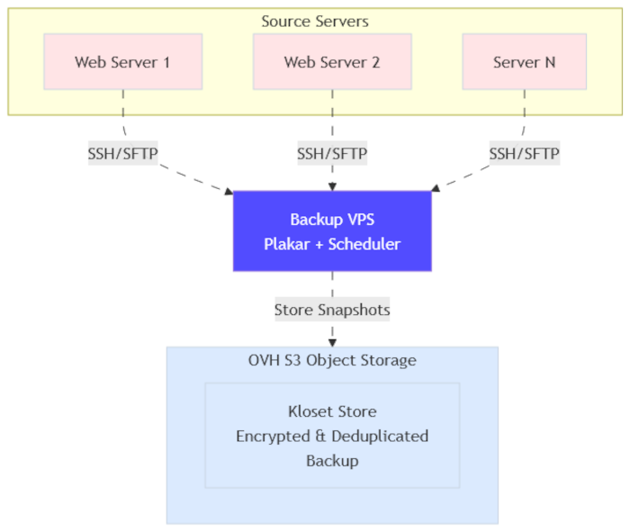
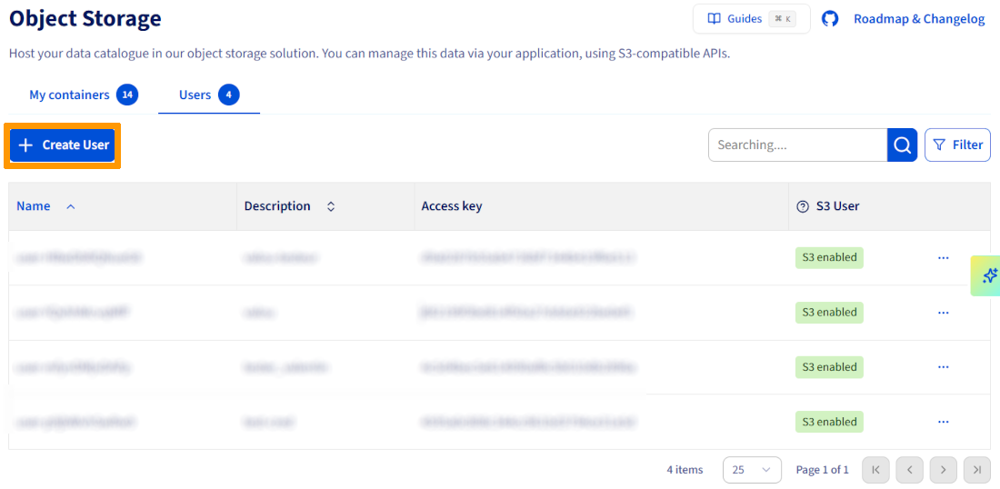
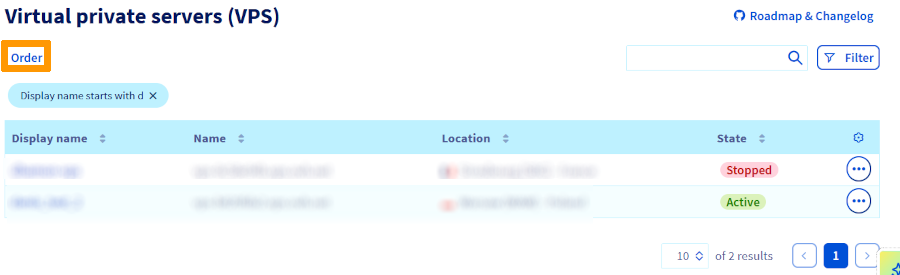

<style>
details>summary {
    color:rgb(33, 153, 232) !important;
    cursor: pointer;
}
details>summary::before {
    content:'\25B6';
    padding-right:1ch;
}
details[open]>summary::before {
    content:'\25BC';
}
</style>

## Objectif

Ce guide a pour objectif de vous montrer comment :

- Mettre en place un serveur dédié de backup capable de protéger vos serveurs automatiquement.
- Configurer Plakar pour gérer vos backups de manière sécurisée, chiffrée et dédupliquée.
- Planifier des backups automatiques et suivre leur état via une interface web intuitive.
- Centraliser vos données dans un stockage objet résilient, garantissant leur disponibilité en cas de panne.

À la fin, vous disposerez d’un système de backup fiable et entièrement automatisé, prêt pour une infrastructure professionnelle.

## Prérequis

- Un serveur [VPS](/links/bare-metal/vps) ou un [serveur dédié](/links/bare-metal/bare-metal).
- Disposer d'un accès administrateur (sudo) via SSH à votre serveur.
- [Plakar](https://www.plakar.io/) installé sur le serveur de backup (ou la possibilité de l’installer).
- Un stockage objet compatible S3<sup>1</sup> pour héberger vos backups.
- Avoir une compréhension basique de l'administration GNU/Linux.

<!-- CP-NAV-START:publiccloud-projects -->
---

### Accès à l'espace client OVHcloud

- **Lien direct :** [Projets Public Cloud](/links/control-panel/publiccloud-projects)
- **Pour accéder à vos services :** `Public Cloud`{.action} > Sélectionnez votre projet

---
<!-- CP-NAV-END:publiccloud-projects -->

## Aperçu de l'architecture

Le système de backup automatisé repose sur trois composants principaux.

1. **Serveur de backup (VPS dédié) :**

    - Exécute Plakar, qui gère la planification, la déduplication et le chiffrement des backups.
    - Supervise toutes les opérations via une interface web intuitive.

2. **Serveurs Sources :**

    - Les serveurs dont les données doivent être sauvegardées.
    - Connectés au serveur de backup via SSH/SFTP sécurisé, permettant des backups automatisés sans intervention manuelle.

3. **Stockage Objet (compatible S3) :**

    - Reçoit et stocke les backups de manière résiliente et sécurisée.
    - Permet de conserver des snapshots chiffrés et dédupliqués, garantissant la disponibilité des données en cas de panne.

{.thumbnail}

## En pratique

### Étape 1 : Configurer l'Object Storage

Avant d’exécuter le moindre backup, vous devez disposer d’un Object Storage compatible S3 pour stocker vos données de manière sécurisée et indépendante du serveur de backup.

L’utilisation d’Object Storage garantit que vos backups restent disponibles même en cas de perte ou de panne du serveur de backup.

**Accéder à Object Storage**

Dans le menu de gauche, allez dans `Object Storage`{.action}.

**Créer un utilisateur Object Storage**

1. Ouvrez l'onglet `Utilisateurs`{.action}.
2. Cliquez sur `Créer un utilisateur`{.action}.

    {.thumbnail}

3. Donnez une description à l'utilisateur (ex. plakar-backup).
4. Téléchargez et conservez les identifiants S3 :
    - Access Key
    - Secret Key

> [!primary]
>
> **Note :** Ces identifiants seront utilisés par Plakar pour accéder à Object Storage.
>

**Créer le bucket Object Storage**

1. Cliquez sur `Créer un conteneur d'objets`{.action}.
2. Configurez le container :
    - **Name :** plakar-backups (ou équivalent)
    - **Container API :** S3-compatible
    - **Container type :** Choisissez en fonction de vos besoins (3-AZ pour une haute disponibilité, 1-AZ pour une rentabilité optimale)
    - **Region :** choisissez la région la plus proche de vos serveurs
    - **User selection :** sélectionnez l’utilisateur créé
3. Validez la création.

> [!primary]
>
> Pour plus de détails sur la création et la gestion d’un bucket Object Storage, vous pouvez suivre notre guide [Object Storage – Premiers pas avec Object Storage](/pages/storage_and_backup/object_storage/s3_getting_started_with_object_storage).
>

### Étape 2 : Provisionner le serveur de backup

Pour exécuter Plakar et automatiser vos backups, vous devez disposer d’un serveur VPS dédié.

**Créer un VPS**

1. Rendez-vous dans `Bare Metal Cloud`{.action} > `VPS`{.action}.
2. Cliquez sur `Commander`{.action} puis `Configurer votre VPS`{.action}.

    {.thumbnail}

3. Choisissez la configuration adaptée à vos besoins :
    - **Modèle :** general-purpose (ex. VPS-1, 2 vCores, 8 Go RAM, 75 Go stockage)
    - **Région :** proche de votre Object Storage pour des backups rapides
    - **Image :** Ubuntu 25.04 (ou toute autre distribution supportée)
4. Commandez le VPS.

**Accéder au VPS**

Les informations de connexion (IP, nom d’utilisateur temporaire, mot de passe) sont envoyées par e-mail sécurisé.

Connectez-vous pour la première fois via SSH :

```bash
ssh ubuntu@<VPS_IP>
```

Remplacez `ubuntu` par votre nom d'utilisateur réel et `<VPS_IP>` par l'adresse IP indiquée dans votre e-mail de livraison.

À la première connexion, vous serez invité à modifier le mot de passe temporaire. Après l'avoir modifié, la session se fermera automatiquement. Reconnectez-vous avec votre nouveau mot de passe.

Pour plus d'informations sur la configuration initiale et la sécurité des VPS, consultez notre guide [Premiers pas avec un VPS](/pages/bare_metal_cloud/virtual_private_servers/starting_with_a_vps).

### Étape 3 : Installer Plakar

Maintenant que votre VPS est prêt, il est temps d’installer Plakar, qui gérera les backups, le chiffrement et la déduplication.

**Se connecter au VPS**

Depuis votre machine locale ou directement sur le VPS, connectez-vous en SSH :

```bash
ssh ubuntu@<VPS_IP>
```

Remplacez `ubuntu` par votre nom d'utilisateur réel et `<VPS_IP>` par l’adresse de votre serveur.

**Installer Plakar**

Suivez le [guide d’installation officiel de Plakar](https://www.plakar.io/docs/main/quickstart/installation/) selon votre distribution.

Vérifiez que Plakar est installé :

```bash
plakar version
```

### Étape 4 : Configurer Object Storage dans Plakar

Dans cette étape, vous allez connecter Plakar à votre Object Storage S3 et l’initialiser comme Kloset Store, pour permettre le stockage sécurisé et chiffré de vos backups.

**Installer l’intégration S3 dans Plakar**

Tout d'abord, connectez-vous à Plakar afin de pouvoir installer les intégrations :

```bash
plakar login -email you@example.com
# OU
plakar login -github
```

Connectez-vous sur votre VPS et installez le package S3 :

```bash
plakar pkg add s3
```

**Ajouter Object Storage comme storage connector**

Les storage connectors dans Plakar définissent où vos backups sont stockés. En configurant un connector une seule fois, vous pourrez l’utiliser dans toutes les commandes de backup futures via un simple alias.

Ajoutez votre Object Storage OVHcloud comme storage connector en utilisant l’endpoint S3 et les identifiants que vous avez générés à l’étape 1 :

```bash
plakar store add ovh-s3-backups \
  location=s3://<S3_ENDPOINT>/<BUCKET_NAME> \
  access_key=<YOUR_ACCESS_KEY_ID> \
  secret_access_key=<YOUR_SECRET_ACCESS_KEY> \
  use_tls=true \
  passphrase='<YOUR_SECURE_PASSPHRASE>'
```

Remplacez :

- <S3_ENDPOINT> : votre endpoint S3 OVHcloud (ex. s3.eu-west-par.io.cloud.ovh.net)
- <BUCKET_NAME> : nom du container créé (ex. plakar-backups)
- <YOUR_ACCESS_KEY_ID> et <YOUR_SECRET_ACCESS_KEY> : identifiants générés à l’étape 1
- <YOUR_SECURE_PASSPHRASE> : phrase secrète pour chiffrer vos backups (utilisez des guillemets simples si elle contient des caractères spéciaux)

> [!success]
>
> En configurant la passphrase dans le storage connector, les backups automatisés pourront s’exécuter sans demander les identifiants à chaque fois.
>

**Initialiser le Kloset Store**

Enfin, initialisez le bucket Object Storage comme Kloset Store :

```bash
plakar at "ovh-s3-backups" create
```

Comme la passphrase a déjà été configurée lors de l’ajout du storage connector, Plakar l’utilisera automatiquement pour chiffrer toutes les données avant de les envoyer dans Object Storage.

Une fois cette étape terminée, votre serveur de backup est totalement connecté à Object Storage et prêt à recevoir des snapshots chiffrés et dédupliqués.

### Étape 5 : Configurer l’accès SSH aux serveurs sources

Pour que Plakar puisse sauvegarder vos serveurs, il doit pouvoir accéder à leurs fichiers via SSH. L’authentification par clé SSH est recommandée car elle est plus sécurisée qu’un mot de passe et permet des backups automatisés sans intervention.

**Installer l’intégration SFTP**

Sur le serveur de backup, installez l’intégration SFTP :

```bash
plakar pkg add sftp
```

**Générer des clés SSH**

Générez une paire de clés SSH sur le serveur de backup :

```bash
ssh-keygen -t ed25519 -f ~/.ssh/id_ed25519_plakar -C "plakar@backup"
```

Appuyez sur `Entrée` pour ne pas utiliser de passphrase (recommandé pour les backups automatisés).

**Copier la clé publique sur les serveurs sources**

Copiez la clé publique sur chaque serveur que vous souhaitez sauvegarder :

```bash
ssh-copy-id -i ~/.ssh/id_ed25519_plakar.pub user@source-server-1
ssh-copy-id -i ~/.ssh/id_ed25519_plakar.pub user@source-server-2
```

Remplacez `user` par le nom d’utilisateur ayant accès aux fichiers à sauvegarder.

**Tester l’accès SSH**

Vérifiez que le serveur de backup peut se connecter sans mot de passe :

```bash
ssh -i ~/.ssh/id_ed25519_plakar user@source-server-1 'echo "Connection successful"'
```

**Créer des alias d'hôte SSH (recommandé)**

Les alias d'hôte SSH simplifient les commandes et centralisent la configuration de connexion. Au lieu de taper à chaque fois le nom complet du serveur, le port et le chemin de la clé, vous pouvez utiliser un alias court.

Cela rend les commandes Plakar plus propres et réduit le risque d’erreurs.

Ajoutez un alias d'hôte dans `~/.ssh/config` :

```bash
cat >> ~/.ssh/config << 'EOF'
Host source-1
    HostName source-server-1.example.com
    User backupuser
    Port 22
    IdentityFile ~/.ssh/id_ed25519_plakar

Host source-2
    HostName source-server-2.example.com
    User backupuser
    Port 22
    IdentityFile ~/.ssh/id_ed25519_plakar
EOF
```

Vérifiez que l’alias fonctionne :

```bash
ssh source-1 'echo "Alias fonctionne"'
```

Si le message `Alias fonctionne` s'affiche, vos alias SSH sont correctement configurés. Vous pouvez maintenant utiliser ces alias dans toutes les commandes Plakar, simplifiant la gestion de vos backups.

### Étape 6 : Configurer les sources de backup

Dans Plakar, les source connectors définissent quels serveurs et quels répertoires doivent être sauvegardés. Une fois configurées, ces sources peuvent être réutilisées dans plusieurs commandes de backup, ce qui simplifie la gestion et réduit les risques d’erreurs.

**Ajouter des source connectors**

Pour chaque serveur que vous souhaitez sauvegarder, ajoutez un source connector :

```bash
# Ajouter le premier serveur source
plakar source add web-server-1 sftp://source-1:/var/www

# Ajouter le second serveur source
plakar source add web-server-2 sftp://source-2:/var/www
```

- Remplacez `source-1` et `source-2` par les alias SSH créés précédemment.
- `/var/www` correspond au répertoire à sauvegarder sur chaque serveur.
- Vous pouvez ajouter plusieurs sources, même sur le même serveur ou sur différents serveurs.

**Vérifier la configuration des sources**

Pour s’assurer que toutes les sources sont correctement configurées :

```bash
plakar source show
```

La commande liste tous les source connectors configurés avec leur chemin d’accès. Cela permet de vérifier rapidement que tous les serveurs et répertoires à sauvegarder sont bien définis.

### Étape 7 : Lancer le premier backup

Avant de configurer les backups automatiques, il est important de tester la configuration manuellement.

Cela permet de vérifier que les connexions SSH fonctionnent, que les identifiants Object Storage sont corrects, et que Plakar peut sauvegarder vos données.

**Sauvegarder une source unique**

Pour tester un backup sur une seule source :

```bash
plakar at "@ovh-s3-backups" backup "@web-server-1"
```

- Plakar va se connecter au serveur source via SSH/SFTP, lire les fichiers, les dédupliquer, les chiffrer, puis les envoyer dans Object Storage.
- Surveillez la progression pour vérifier que le backup se déroule correctement.

**Sauvegarder plusieurs sources**

Pour sauvegarder plusieurs serveurs en même temps :

```bash
plakar at "@ovh-s3-backups" backup "@web-server-1" "@web-server-2"
```

- Les sources définies à l'étape 6 seront sauvegardées dans le même Kloset Store.
- Cette commande est pratique pour tester une sauvegarde globale avant de passer à l’automatisation.

**Vérifier les sauvegardes**

Pour vérifier que les backups ont bien été créés, listez les snapshots dans votre Kloset Store :

```bash
plakar at "@ovh-s3-backups" ls
```

- Cette commande liste les snapshots présents dans le Kloset Store, avec leur horodatage et leur ID de snapshot.
- Confirmez que les snapshots correspondent aux sources que vous venez de sauvegarder.

### Étape 8 : Programmer les backups automatiques

Les backups manuels fonctionnent pour les tests, mais en production il est essentiel d’exécuter les sauvegardes automatiquement. Plakar inclut un scheduler intégré pour gérer la planification et vérifier les backups après leur création.

**Créer le fichier de configuration du scheduler**

Créez un fichier `scheduler.yaml` dans votre répertoire personnel :

```bash
cat > ~/scheduler.yaml << 'EOF'
agent:
  tasks:
    - name: Backup web-server-1
      repository: "@ovh-s3-backups"
      backup:
        path: "@web-server-1"
        interval: 24h
        check: true

    - name: Backup web-server-2
      repository: "@ovh-s3-backups"
      backup:
        path: "@web-server-2"
        interval: 24h
        check: true
EOF
```

Cette configuration :

- Définit deux tâches de sauvegarde (une pour chaque source)
- Exécute chaque sauvegarde toutes les 24 heures (intervalle : 24 h)
- Vérifie chaque sauvegarde après sa création (vérification : true)

**Démarrer le scheduler**

Pour lancer le scheduler Plakar avec votre configuration :

```bash
plakar scheduler start -tasks ~/scheduler.yaml
```

- Le scheduler s’exécute en arrière-plan et effectue les backups selon l’intervalle défini.
- Plakar s’assure que chaque tâche est vérifiée et réussie après exécution.

> [!primary]
>
> Pour plus d'informations sur la configuration du scheduler, rendez-vous sur la [documentation officielle du Scheduler Plakar](https://www.plakar.io/docs/main/guides/setup-scheduler-daily-backups/).
>

### Étape 9 : Configurer les services systemd pour Plakar

Actuellement, le scheduler et l’UI Plakar s’exécutent seulement dans votre session SSH. Si le VPS redémarre, ces processus s’arrêteront.

Pour assurer un fonctionnement continu, configurez-les comme services `systemd`, qui démarrent automatiquement au boot et redémarrent en cas de plantage.

**Créer le service systemd pour le scheduler**

La création d'un service systemd garantit son démarrage automatique au lancement de votre VPS et son redémarrage en cas de plantage.

Créez un service systemd `/etc/systemd/system/plakar-scheduler.service` :

```bash
cat << 'EOF' | sudo tee /etc/systemd/system/plakar-scheduler.service > /dev/null
[Unit]
Description=Plakar Scheduler
After=network.target

[Service]
Type=forking
ExecStart=/usr/bin/plakar scheduler start -tasks /home/ubuntu/scheduler.yaml
ExecStop=/usr/bin/plakar scheduler stop
Restart=on-failure
User=ubuntu
WorkingDirectory=/home/ubuntu

[Install]
WantedBy=multi-user.target
EOF
```

Remplacez `ubuntu` par votre nom d’utilisateur si nécessaire.

**Créer le service systemd pour l’UI**

L'interface utilisateur Web doit également fonctionner en continu afin que vous puissiez surveiller vos sauvegardes à tout moment, et pas seulement lorsque vous êtes connecté en SSH.

Créez un service systemd pour l'interface utilisateur Web Plakar `/etc/systemd/system/plakar-ui.service` :

```bash
cat << 'EOF' | sudo tee /etc/systemd/system/plakar-ui.service > /dev/null
[Unit]
Description=Plakar Web UI
After=network.target

[Service]
Type=simple
ExecStart=/usr/bin/plakar at "@ovh-s3-backups" ui -listen :8080
Restart=always
User=ubuntu
WorkingDirectory=/home/ubuntu

[Install]
WantedBy=multi-user.target
EOF
```

Remplacez `ubuntu` par votre nom d’utilisateur si nécessaire.

> [!primary]
>
> Si Plakar est installé à un autre emplacement, mettez à jour le chemin d'accès en conséquence. Utilisez la commande `which plakar` pour trouver le chemin d'accès correct.
>

**Activer et démarrer les services**

Rechargez systemd et activez les services :

```bash
sudo systemctl daemon-reload
sudo systemctl enable plakar-scheduler
sudo systemctl enable plakar-ui
sudo systemctl start plakar-scheduler
sudo systemctl start plakar-ui
```

Vérifiez que les services fonctionnent :

```bash
sudo systemctl status plakar-scheduler
sudo systemctl status plakar-ui
```

**Accéder à l’UI Plakar**

L’interface Web Plakar nécessite un token d’accès pour des raisons de sécurité. Vous pouvez soit définir un token personnalisé, soit utiliser le token généré automatiquement par Plakar.

/// details | Définir un token personnalisé (recommandé)

Définissez la variable d'environnement `PLAKAR_UI_TOKEN` avant de démarrer le service UI. Mettez à jour votre fichier de service systemd :

```bash
cat << 'EOF' | sudo tee /etc/systemd/system/plakar-ui.service > /dev/null
[Unit]
Description=Plakar Web UI
After=network.target

[Service]
Type=simple
Environment="PLAKAR_UI_TOKEN=your-secure-token-here"
ExecStart=/usr/bin/plakar at "@ovh-s3-backups" ui -listen :8080
Restart=always
User=ubuntu
WorkingDirectory=/home/ubuntu

[Install]
WantedBy=multi-user.target
EOF
```

Remplacez `your-secure-token-here` par un token fort de votre choix (par exemple un UUID ou une chaîne aléatoire).

Rechargez systemd et redémarrez le service :

```bash
sudo systemctl daemon-reload
sudo systemctl restart plakar-ui
```

Ouvrez votre navigateur et accédez à l’UI : `http://<IP_DU_VPS>:8080?plakar_token=mon-token-securise`

///

/// details | Utiliser un token généré automatiquement

Si vous ne définissez pas `PLAKAR_UI_TOKEN`, Plakar génère un token aléatoire.

Pour le récupérer :

```bash
sudo journalctl -u plakar-ui -n 100 --no-pager | grep -i token
```

Cherchez une ligne similaire à :

```console
launching webUI at http://:8080?plakar_token=d9fccdbd-77a3-41a0-8657-24d77a6d00ac
```

Copiez le token depuis l’URL et ouvrez l’UI : `http://<IP_DE_VOTRE_VPS>:8080`. S'il est demandé, collez le token pour accéder à l’interface.

> [!warning]
>
> Pour une utilisation en production, configurez un pare-feu afin de restreindre l'accès au port 8080 à vos adresses IP uniquement, ou configurez un proxy inverse avec SSL.
>

///

## Dépannage

1. **Erreur d’authentification :** Vérifiez vos clés SSH et droits de lecture sur les serveurs sources.
2. **Impossible de se connecter à Object Storage :** Vérifiez identifiants S3, endpoint et passphrase (commande `plakar store show ovh-s3-backups`).
3. **Permission refusée sur les sources :** Assurez-vous que l’utilisateur SSH peut lire les répertoires à sauvegarder.
4. **Services ne démarrent pas après reboot :** Vérifiez le statut et les logs (`systemctl status` / `journalctl -u`).

Vous pouvez également exécuter l'interface utilisateur localement sur votre propre ordinateur en installant Plakar et en configurant le même magasin avec vos identifiants OVHcloud S3. Cela vous permet d'accéder aux sauvegardes sans vous connecter au VPS.

## Aller plus loin

Échangez avec notre [communauté d'utilisateurs](/links/community).

<sup>1</sup> : S3 est une marque déposée appartenant à Amazon Technologies, Inc. Les services de OVHcloud ne sont pas sponsorisés, approuvés, ou affiliés de quelque manière que ce soit.
